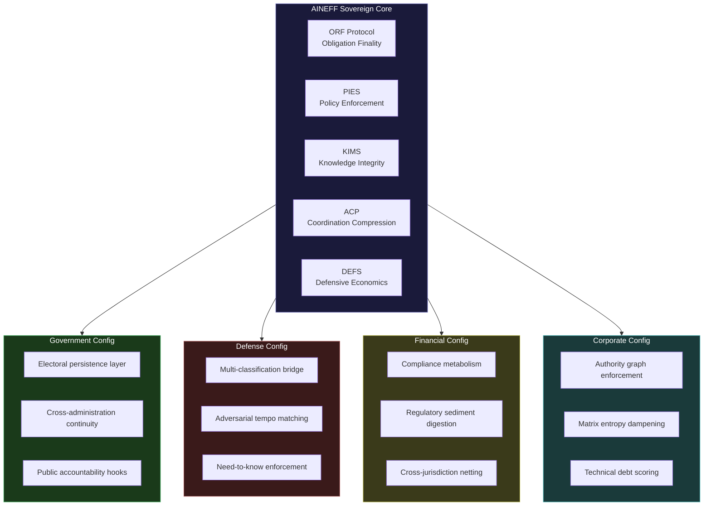
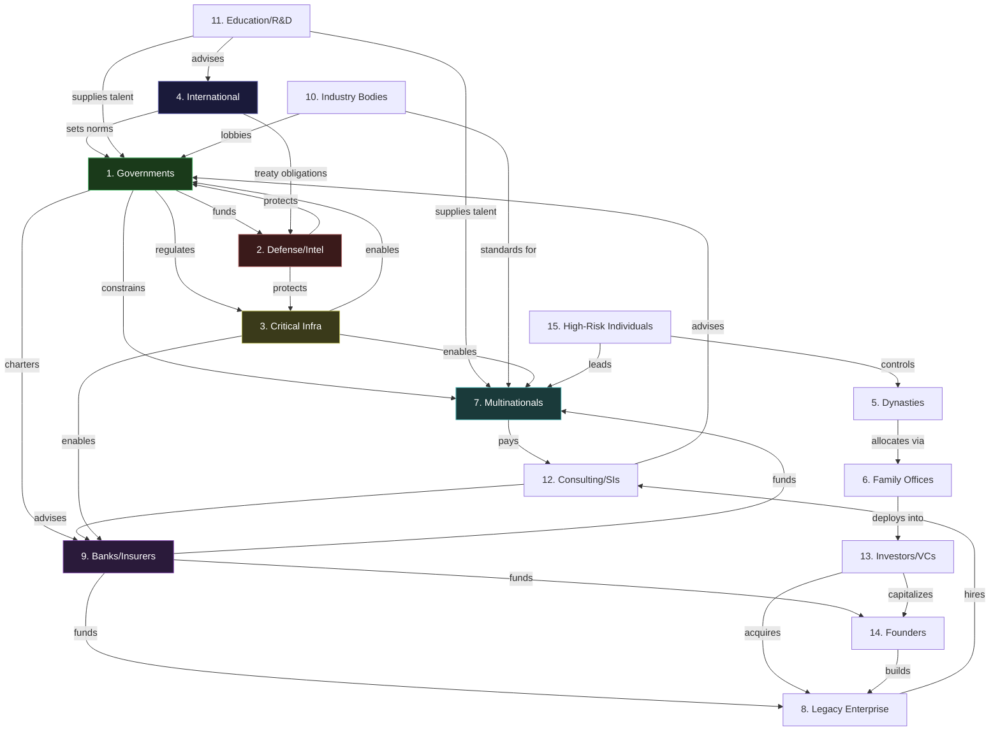

---

sidebar_position: 18
title: "Cross-Audience Stabilization Strategy"
description: "Systemic analysis of shared entropy patterns across 15 sovereign power classes, interdependency risk mapping, shock propagation modeling, and the unified AINEFF stabilization layer that prevents cross-audience cascade failure."
tags: [sovereign, cross-audience, stabilization, entropy]
custom_status: active
custom_owner: Andrew Leo
custom_last_review: 2026-03-01
custom_next_review: 2026-06-01
---

# Cross-Audience Stabilization Strategy

The 15 sovereign power classes are not isolated markets. They are structurally coupled systems whose entropy patterns interact, amplify, and cascade. A government regulatory failure destabilizes critical infrastructure operators. A banking liquidity contraction starves corporate empires. A dynasty succession crisis triggers family office capital flight that reprices investor portfolios.

AINEFF does not treat these audiences as separate customer segments. It treats them as **nodes in a coupled thermodynamic system** where entropy in one node propagates to others through structural channels. The stabilization strategy is not audience-by-audience sales. It is **systemic dampening architecture** -- the design of intervention points that absorb entropy before it cascades.

---

## Shared Entropy Patterns Across All 15 Power Classes

Every power class, regardless of domain, suffers from five universal decay vectors. These are not metaphors. They are measurable, observable, and structurally inevitable in any complex institution operating without explicit anti-entropy mechanisms.

| Universal Decay Vector | Mechanism | Measurement Proxy | Untreated Trajectory |
|---|---|---|---|
| **Decision Latency Growth** | Each new stakeholder, regulation, or precedent adds approval nodes. Decision time grows logarithmically with institutional age. | Mean time from problem detection to authorized action | Asymptotic paralysis within 15-25 years |
| **Information Integrity Decay** | Knowledge fragments across silos, formats, and human memories. Ground truth becomes contested. | Percentage of decisions made on verified-current data | Below 40% accuracy within 10 years of scaling |
| **Accountability Diffusion** | Responsibility distributes across committees, vendors, and "shared ownership" structures until no single human bears liability. | Number of decisions with a single identifiable liability bearer | Approaches zero in organizations above 500 people |
| **Coordination Cost Escalation** | Internal coordination consumes increasing share of institutional energy. Output-per-unit-of-coordination declines. | Ratio of coordination labor to productive labor | Coordination exceeds production at ~2000 employees |
| **Adversarial Adaptation Gap** | External threats evolve faster than internal defenses. The gap between threat sophistication and response capability widens. | Time between threat emergence and deployed countermeasure | Gap doubles every 3-5 years without active measurement |

:::danger Critical Observation
These five vectors are not independent. Decision latency growth accelerates information integrity decay (stale data accumulates while decisions wait). Accountability diffusion amplifies coordination cost (nobody owns the coordination problem). The adversarial adaptation gap exploits all four other vectors simultaneously. This is why partial solutions fail -- addressing one vector without the others merely redirects entropy.
:::

### Entropy Severity by Audience Class

| # | Audience | Decision Latency | Info Integrity | Accountability | Coordination Cost | Adversarial Gap | Composite Risk |
|---|---|---|---|---|---|---|---|
| 1 | Governments & Ministries | Critical | Critical | Critical | Critical | High | **5.0** |
| 2 | Defense/Security/Intelligence | High | Critical | High | High | Critical | **4.6** |
| 3 | National Critical Infrastructure | Critical | High | High | High | Critical | **4.6** |
| 4 | International Institutions | Critical | Critical | Critical | Critical | High | **5.0** |
| 5 | Dynasties & Royal Houses | High | High | Critical | Medium | High | **4.0** |
| 6 | Family Offices | Medium | High | Critical | Medium | High | **3.8** |
| 7 | Multinational Corporate Empires | High | High | High | Critical | High | **4.4** |
| 8 | Legacy Enterprises | Critical | Critical | High | High | High | **4.6** |
| 9 | Banks/Insurers/Financial Foundations | High | High | High | Critical | Critical | **4.6** |
| 10 | National Industry Bodies | Critical | High | Critical | High | Medium | **4.2** |
| 11 | Education/R&D/Think Tanks | High | Critical | High | Medium | Medium | **3.6** |
| 12 | Consulting Firms & SIs | Medium | High | Medium | High | Critical | **3.8** |
| 13 | Investors/VCs/Syndicates | Medium | Critical | High | Medium | High | **3.8** |
| 14 | High-Power Founders & Operators | Low | Medium | Critical | Low | High | **3.0** |
| 15 | High-Risk Individuals | Low | High | Critical | Low | Critical | **3.4** |

*Composite Risk = weighted average (1-5 scale). Decision Latency and Accountability weighted 1.5x due to cascade amplification.*

---

## Unique Sovereign Risk Patterns Per Audience Class

Beyond the universal vectors, each audience carries domain-specific entropy signatures that require tailored stabilization.

| Audience | Unique Sovereign Risk | Why Generic Solutions Fail |
|---|---|---|
| **Governments** | Electoral cycle resets -- institutional memory and reform momentum destroyed every 4-8 years | Consulting engagements end with the administration. No structural persistence layer. |
| **Defense/Intelligence** | Classification entropy -- knowledge fragments across clearance levels, creating blind spots at the seams | Commercial tools cannot operate across classification boundaries. Air-gapped silos remain uncoordinated. |
| **Critical Infrastructure** | Cyber-physical convergence -- IT governance models cannot handle 40-year-old OT systems with no patch path | Security vendors address IT or OT, never the governance layer bridging both. |
| **International Institutions** | Multi-sovereign deadlock -- decisions require consensus across parties with fundamentally opposed interests | No technology solves political deadlock. AINEFF provides obligation-netting (ORF) that bypasses consensus requirements. |
| **Dynasties** | Generational competence decay -- each generation is further from the founding capability that created the wealth | Advisory firms optimize tax, not capability transfer. No governance-as-infrastructure for succession. |
| **Family Offices** | Opaque governance -- decisions made in private with no audit trail, creating principal-agent drift across decades | Wealth managers are the agents. They do not voluntarily create transparency tools. |
| **Multinational Corporates** | Matrix entropy -- reporting lines cross geographies, business units, and functional hierarchies until authority is indeterminate | ERP systems model structure, not authority. No system enforces "who actually decides." |
| **Legacy Enterprises** | Technical debt compounding -- each failed transformation attempt adds layers of half-migrated systems | System integrators profit from complexity. Incentive alignment is structurally broken. |
| **Banks/Insurers** | Compliance spiral -- each new regulation adds cost without removing old requirements, creating regulatory sediment | RegTech addresses individual regulations. No system metabolizes the cumulative compliance burden. |
| **Industry Bodies** | Relevance decay -- member value proposition erodes as direct-to-member services bypass the association | Industry bodies cannot adopt AI without appearing to compete with members. Governance positioning is the only viable path. |
| **Education/R&D** | Funding dependency -- research agendas follow grant cycles, not knowledge gaps. Institutional autonomy is nominal. | EdTech sells to the institution. Nobody sells the institution its own sovereignty. |
| **Consulting/SIs** | Billable hour misalignment -- AI destroys the pricing model. Every efficiency gain reduces revenue. | Consulting firms cannot self-cannibalize. External infrastructure must absorb the transition. |
| **Investors/VCs** | Signal-to-noise degradation -- deal flow volume increases while diligence capacity stays flat. Governance gaps in portfolio companies compound. | Analytics tools increase signal volume. No tool improves governance quality of portfolio companies. |
| **Founders/Operators** | Founder dependency -- the organization cannot function without the founder's judgment. Scaling requires distributing judgment, not just tasks. | Executive coaching addresses symptoms. No system externalizes judgment into auditable governance infrastructure. |
| **High-Risk Individuals** | Personal security entropy -- threat surface expands with profile while personal governance capacity stays constant | Security firms sell protection. Nobody sells the individual a personal governance stack. |

---

## Unified AINEFF Sovereign Layer Design

The stabilization layer is not a product bundle. It is an **architectural intervention** that deploys the same structural primitives across all 15 audiences, configured to each audience's unique entropy signature.

### Core Stabilization Primitives

| Primitive | System | Function | Universal Application |
|---|---|---|---|
| **Obligation Finality** | ORF Protocol | Every commitment, decision, and authorization resolves to a single human liability bearer with tamper-evident audit trail | Eliminates accountability diffusion across all audiences |
| **Policy Enforcement** | PIES (Policy Enforcement System) | Sub-10ms policy check on every action, preventing unauthorized or ungoverned operations | Eliminates decision latency caused by manual approval chains |
| **Knowledge Integrity** | KIMS (Knowledge Integrity Management) | Hash-chained, version-controlled knowledge base ensuring every decision references verified-current data | Eliminates information integrity decay |
| **Coordination Compression** | ACP (Agent Control Plane) | AI agents handle coordination overhead, compressing the ratio of coordination-to-production labor | Reverses coordination cost escalation |
| **Adversarial Adaptation** | DEFS (Defensive Economics System) | Continuous monitoring of threat landscape with automated countermeasure deployment | Closes adversarial adaptation gap |

### Audience-Specific Configuration Matrix

---

## Interdependency Risk Map

The 15 audiences are coupled through six structural channels. Entropy propagates through these channels regardless of whether the audiences know each other, trade with each other, or share any direct relationship.

### Coupling Channels

| Channel | Mechanism | Example |
|---|---|---|
| **Regulatory** | Government policy changes alter operating constraints for all other audiences | New AI governance law simultaneously affects defense procurement, bank compliance, corporate operations, and consulting revenue models |
| **Capital** | Financial institutions control capital allocation that funds or starves all other audiences | Bank liquidity contraction reduces corporate investment, dynasty asset values, founder funding, and infrastructure maintenance budgets |
| **Talent** | Education/R&D pipeline quality determines capability ceiling for all institutional audiences | Research funding cuts degrade the talent pipeline that governments, defense, and corporates all draw from |
| **Legitimacy** | International institutions set norms that constrain the operating space of all sovereign actors | International AI governance framework restricts what governments can permit, what defense can deploy, what corporates can sell |
| **Infrastructure** | Critical infrastructure reliability is a dependency for every other audience's operations | Energy grid instability affects government services, bank data centers, corporate supply chains, and individual security |
| **Information** | Consulting firms, think tanks, and media shape the decision environment for all institutional audiences | A flawed consulting framework adopted across industries propagates the same structural error to dozens of organizations |

### Interdependency Web

---

## Systemic Shock Simulation

Each scenario models entropy propagation across the interdependency web. The question is not whether AINEFF prevents the shock -- it cannot. The question is whether AINEFF-instrumented audiences **absorb or amplify** the cascade.

### Scenario 1: Global Liquidity Contraction

**Trigger:** Central banks simultaneously tighten monetary policy. Credit markets freeze for 6-18 months.

| Propagation Step | Affected Audiences | Entropy Effect | Without AINEFF | With AINEFF |
|---|---|---|---|---|
| T+0: Credit freeze | Banks/Insurers (9) | Capital allocation halts | Loan book panic, margin calls cascade | ORF obligation-netting reduces gross exposure. PIES enforces pre-authorized drawdown limits. |
| T+30d: Funding drought | Founders (14), Investors (13) | Startup funding collapses | 60% of portfolio companies miss runway | DEFS pre-positioned capital reserves trigger. Governance-scored companies get priority allocation. |
| T+60d: Capex cuts | Multinationals (7), Legacy (8) | IT and transformation budgets frozen | Consulting contracts cancelled. Technical debt accelerates. | ACP maintains critical coordination at reduced capacity. KIMS preserves institutional knowledge during hiring freeze. |
| T+90d: Infrastructure decay | Critical Infra (3) | Maintenance budgets deferred | Cyber-physical vulnerabilities multiply | PIES enforces minimum maintenance thresholds regardless of budget pressure. Automated risk scoring escalates to regulators. |
| T+180d: Government revenue decline | Governments (1) | Tax receipts fall, spending pressured | Electoral panic. Short-term decisions destroy long-term programs. | ORF obligation continuity prevents program cancellation. Decision audit trails constrain political capture. |

:::warning Amplification Risk
AINEFF creates **dependency** on its infrastructure. If AINEFF itself faces liquidity constraints during a contraction, audiences that have shifted coordination to AINEFF systems experience a double shock: the external liquidity crisis plus AINEFF service degradation. Mitigation: AINEFF must maintain 24-month operational reserves and pre-negotiate credit facilities before any sovereign deployment.
:::

### Scenario 2: AI Governance Restriction

**Trigger:** Major jurisdiction (EU, US, or China) enacts strict AI deployment limits -- mandatory human review for all AI-generated decisions, prohibition on autonomous action in regulated industries.

| Propagation Step | Affected Audiences | Entropy Effect | Without AINEFF | With AINEFF |
|---|---|---|---|---|
| T+0: Regulatory shock | All audiences in jurisdiction | AI deployments suspended pending compliance review | Mass rollback of AI systems. Productivity drops 15-30%. | ORF human-liability-bearer architecture is **already compliant** -- every action has a bound human. PIES audit trails demonstrate compliance. |
| T+30d: Competitive arbitrage | Multinationals (7) | Operations shift to less regulated jurisdictions | Regulatory arbitrage creates governance gaps | JAL (Jurisdiction Adapter Layer) reconfigures per-jurisdiction policy enforcement. No arbitrage needed. |
| T+60d: Consulting boom | Consulting/SIs (12) | Compliance advisory demand spikes | Short-term revenue gain, but the regulation kills their own AI adoption | AINEFF-partnered consultants deliver ORF-compliant implementations. Structural advantage over generic advisory. |
| T+90d: Defense exception | Defense/Intel (2) | National security exemptions carved out, creating dual-track AI governance | Classification complexity doubles | PIES already handles multi-policy-regime enforcement. Defense config activates exemption protocols automatically. |

:::tip AINEFF Structural Advantage
AI governance restriction is the one scenario where AINEFF **gains** rather than loses. The ORF kernel -- "no system may execute an irreversible action unless a single, identifiable human liability bearer is bound to that action at execution time" -- is precisely what regulators want to mandate. AINEFF is pre-compliant with restrictions that destroy competitors.
:::

### Scenario 3: Political Regime Change

**Trigger:** Unexpected government change in a primary deployment jurisdiction. New administration hostile to institutional AI, foreign technology providers, or private governance infrastructure.

| Propagation Step | Affected Audiences | Entropy Effect | Without AINEFF | With AINEFF |
|---|---|---|---|---|
| T+0: Political transition | Governments (1) | New leadership reviews all institutional contracts | Vendor contracts suspended or cancelled | ORF forkability provisions activate. Client retains full operational sovereignty over their deployment. |
| T+30d: Regulatory review | All domestic audiences | New compliance requirements issued without transition periods | Organizations scramble to reinterpret requirements | JAL jurisdiction adapter reconfigures policy enforcement within 72 hours. PIES audit trail proves continuous compliance. |
| T+60d: Capital flight | Family Offices (6), Investors (13) | Uncertainty drives capital to other jurisdictions | Asset values decline, liquidity dries up | ORF obligation-netting provides cross-border settlement continuity. DEFS pre-positioned exit protocols. |
| T+90d: Infrastructure review | Critical Infra (3) | New government may nationalize or restructure critical systems | Operational continuity threatened | KIMS knowledge integrity ensures institutional memory survives leadership turnover. Governance continuity is structural, not personnel-dependent. |

### Scenario 4: Cross-Border Sanctions

**Trigger:** Major sanctions regime imposed between two economic blocs. AINEFF operates in both.

| Propagation Step | Affected Audiences | Entropy Effect | AINEFF Response |
|---|---|---|---|
| T+0: Sanctions imposed | International (4), Multinationals (7) | Cross-border operations disrupted | ORF obligation-netting isolates sanctioned flows. Per-jurisdiction PIES policies enforce sanctions compliance automatically. |
| T+30d: Supply chain fracture | Critical Infra (3), Legacy (8) | Component sourcing disrupted | ACP coordination reroutes supply chains through compliant paths. KIMS maintains supplier qualification data. |
| T+60d: Financial isolation | Banks (9), Family Offices (6) | Correspondent banking severed | ORF protocol provides alternative obligation settlement paths that comply with sanctions while maintaining economic function. |
| T+90d: Talent migration | Education (11), Founders (14) | Brain drain from sanctioned jurisdiction | LevelUpMax pipeline operates independently per jurisdiction. WGE maintains operator capability regardless of geography. |

:::danger AINEFF Dual-Use Risk
Operating in both sides of a sanctions divide creates existential legal risk. AINEFF must maintain **complete operational and data isolation** between sanctioned jurisdictions. This means separate infrastructure, separate teams, separate legal entities. The cost of dual deployment may exceed the revenue from the smaller jurisdiction. Kill criterion: if legal counsel cannot certify complete isolation, withdraw from one side within 90 days.
:::

### Scenario 5: Regulatory Crackdown on AINEFF Specifically

**Trigger:** Antitrust regulators determine AINEFF's cross-audience governance infrastructure constitutes monopolistic control over institutional decision-making.

| Response Requirement | AINEFF Defensive Posture |
|---|---|
| Data portability | KIMS hash-chained knowledge bases are client-owned. Full export within 72 hours. |
| Operational independence | ORF forkability guarantee -- any client can operate independently without AINEFF connection within 30 days. |
| No lock-in demonstration | ACTS (Audit & Compliance Trace System) provides complete audit trail showing clients retain authority over all decisions. |
| Structural unbundling | AINEFF's entity hierarchy (AINEFF/AINEF/AINEG/AINE) enables legal separation without operational disruption. |

---

## How AINEFF Absorbs or Amplifies Instability

### Absorption Mechanisms

| Mechanism | How It Works | Applicable Scenarios |
|---|---|---|
| **Obligation continuity** | ORF maintains settlement paths when bilateral relationships break down | Liquidity contraction, sanctions, regime change |
| **Policy adaptation** | JAL + PIES reconfigure governance constraints per-jurisdiction in near-real-time | AI restriction, regime change, regulatory crackdown |
| **Knowledge persistence** | KIMS ensures institutional memory survives personnel turnover, organizational restructuring, and political capture | Regime change, liquidity contraction (hiring freezes), sanctions |
| **Coordination compression** | ACP reduces coordination overhead, maintaining institutional function at reduced resource levels | Liquidity contraction (budget cuts), sanctions (team fragmentation) |
| **Forkability** | Any deployment can operate independently if AINEFF connection is severed | Regulatory crackdown, sanctions, regime change |

### Amplification Risks

:::danger Red-Team Critique: AINEFF as Systemic Risk
AINEFF's cross-audience deployment creates the same systemic risk as any infrastructure monopoly. If AINEFF becomes the governance substrate for governments, banks, corporates, and infrastructure operators simultaneously, then AINEFF failure is **civilization-scale failure**. This is not hypothetical -- it is the stated goal.

**Specific amplification vectors:**
1. **Single point of governance failure** -- a bug in PIES policy enforcement simultaneously affects all 15 audience classes
2. **Correlated decision-making** -- if all audiences use the same KIMS knowledge base, they make correlated errors. Diversity of judgment is a resilience property that AINEFF may destroy.
3. **Regulatory monoculture** -- JAL jurisdiction adapter creates a single interpretation of regulatory requirements. If that interpretation is wrong, every client is simultaneously non-compliant.
4. **Adversarial target concentration** -- instead of attacking 15 separate governance systems, an adversary only needs to compromise one.
5. **Incentive corruption** -- AINEFF's economic model (Burger/Fries/Kitchen) means AINEFF profits from governance complexity. Does AINEFF have an incentive to increase the complexity it claims to solve?

**Required mitigations (non-negotiable):**
- Independent third-party audit of PIES policy engine quarterly
- Client-owned KIMS instances with no AINEFF read access
- Multiple independent JAL interpretation engines, not a single canonical one
- Penetration testing by adversarial red teams with nation-state-equivalent resources
- Structural separation between Frankmax commercial operations and AINEFF governance infrastructure
- Published kill criteria that force AINEFF to withdraw from a deployment if governance quality degrades
:::

---

## Cross-Audience Stabilization Doctrine

The stabilization strategy operates on three principles:

1. **Entropy is thermodynamic, not moral.** Institutions decay because of structural forces, not incompetence. Blaming leadership for entropy is like blaming a building for gravity. The intervention must be structural.

2. **Coupling is a feature, not a bug -- if governed.** The interdependencies between audiences create both cascade risk and coordination leverage. AINEFF's value is making these couplings explicit, auditable, and dampened rather than hidden, opaque, and amplifying.

3. **The stabilizer must survive its own failure modes.** AINEFF is not exempt from entropy. Every system described in this document must be applied to AINEFF itself, including the red-team critique, the kill criteria, and the forkability guarantees. An AINEFF that claims to solve institutional entropy while accumulating its own is a fraud.

| Doctrine Rule | Implementation | Verification |
|---|---|---|
| No audience deployment without cross-audience impact assessment | Pre-deployment simulation of entropy propagation to connected audiences | CRMS (Cross-Registry Monitoring) validates quarterly |
| Forkability guarantee in every contract | Client can operate independently within 30 days of AINEFF withdrawal | Annual forkability drill -- actual disconnection test |
| Kill criteria published per deployment | Measurable conditions that trigger automatic AINEFF withdrawal | Independent auditor reviews kill criteria annually |
| Cross-audience data isolation by default | No data flows between audience deployments without explicit, audited authorization | PIES enforces isolation. ACTS logs every cross-audience data access. |
| AINEFF entropy self-monitoring | Same five universal decay vectors measured internally, published in transparency report | External advisory board reviews quarterly |
