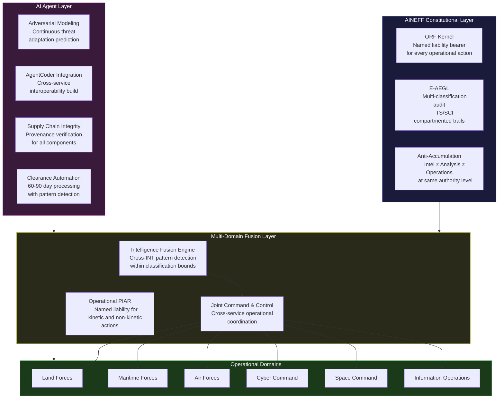
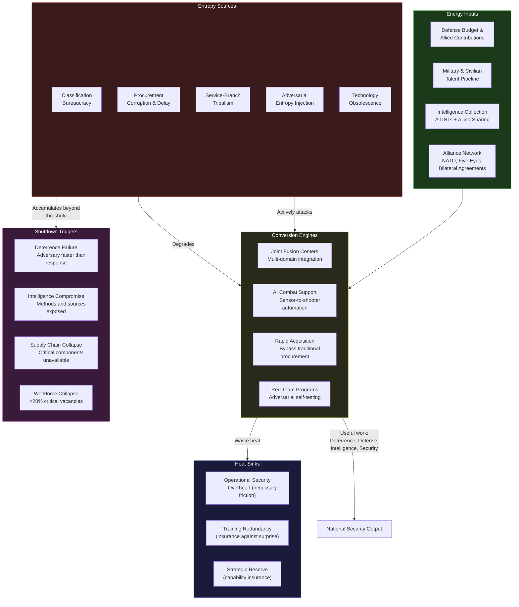

---

sidebar_position: 4
title: "Defense / Security / Intelligence"
description: "AINEFF sovereign deployment architecture for defense ministries, security agencies, and intelligence communities — addressing classification entropy, multi-domain warfare complexity, intelligence fragmentation, procurement corruption, technology obsolescence, and adversarial adaptation speed."
tags: [sovereign, defense, security, intelligence, entropy]
custom_status: active
custom_owner: Andrew Leo
custom_last_review: 2026-03-01
custom_next_review: 2026-06-01

---

# Defense / Security / Intelligence — Sovereign Deployment Architecture

Defense and intelligence organizations face a unique entropy problem: they operate under adversarial pressure from opponents who are actively trying to increase their entropy. Unlike civilian government, where entropy accumulates through neglect and misalignment, defense entropy is **weaponized by adversaries**. Every classification decision, every procurement delay, every intelligence silo is a vulnerability that a competent adversary will exploit.

The core paradox of defense governance: the secrecy required for operational security creates the information silos that degrade operational effectiveness. Classification is simultaneously the most important governance mechanism and the most potent entropy source in the defense ecosystem.

---

## 1. Entropy Vector Map

| Vector | Manifestation | Concrete Example | Severity |
|---|---|---|---|
| **Strategy** | Multi-domain warfare (land, sea, air, cyber, space, information) requires strategic coherence across domains that have historically operated as independent services with competing doctrines and budget priorities. | The Army's ground-based air defense system cannot share targeting data with the Air Force's airborne early warning system because they were procured under different programs with incompatible data standards. | Critical |
| **Operations** | Classification creates operational compartments that prevent the lateral information flow required for combined operations. The need-to-know principle, designed to protect secrets, also prevents coordination. | An intelligence analyst has SIGINT indicating an imminent threat to a deployed unit. The analyst's compartment classification prevents sharing with the unit's tactical operations center. The warning arrives 6 hours late through approved channels. | Critical |
| **Incentives** | Defense procurement incentivizes cost-plus contracts that reward complexity and delay. Contractors profit from programs that overrun budgets and timelines. Procurement officers who cancel failing programs are punished for "wasting" sunk costs. | A major weapons platform is 8 years behind schedule and 300% over budget. Cancellation would require writing off $15B. Continuation costs $3B/year with no delivery date. The program continues because cancellation is politically costlier than indefinite funding. | Critical |
| **Information** | Intelligence fragmentation across agencies (signals, human, geospatial, open-source, cyber) creates parallel assessments that may contradict each other. Fusion happens too late in the decision cycle to affect operations. | Three intelligence agencies produce contradictory assessments of the same adversary capability. The National Intelligence Estimate reconciles them into a compromise document that satisfies nobody and informs no specific operational decision. | Critical |
| **Culture** | Service-branch tribalism creates cultural barriers to joint operations. Each service has its own promotion culture, operational doctrine, and institutional identity that resists integration. | A joint task force commander requests a capability from another service. The request is processed through 4 layers of service-specific bureaucracy, taking 3 weeks. The operational window was 72 hours. | High |
| **Capital** | Defense budgets are allocated by service branch and program, not by capability or threat. Budget fights between services consume more senior leadership bandwidth than strategic planning. | The Navy and Air Force both develop separate programs for the same long-range strike mission. Combined cost: $80B. A joint program would cost $45B. Neither service will cede the mission to the other. | Critical |
| **Governance** | Oversight is fragmented across multiple committees (armed services, intelligence, appropriations) in the legislature, plus inspector general offices, defense audit agencies, and executive oversight. The oversight structure itself creates coordination entropy. | A defense program is simultaneously investigated by 3 oversight bodies with overlapping but non-identical mandates. The program manager spends 40% of their time responding to oversight requests, with 60% of the information requested by one body already provided to another. | High |

---

## 2. Early Entropy Signals

1. **Classification volume growth rate**: The number of newly classified documents per year grows faster than 5% annually while declassification rates remain flat. This indicates classification is being used for bureaucratic convenience, not security.

2. **Joint exercise failure rates**: The percentage of joint/combined exercises that reveal critical interoperability failures increases year-over-year. Each failure represents an entropy gap that would be lethal in combat.

3. **OODA loop degradation**: The observable time from intelligence collection to operational decision (Observe-Orient-Decide-Act) increases. If OODA cycle time grows \>10% per year, adversaries are gaining decision-speed advantage.

4. **Procurement timeline extension**: Average time from requirement definition to initial operating capability exceeds 12 years and is increasing. Technology generations are 3-5 years. Systems are obsolete before deployment.

5. **Intelligence dissemination latency**: Average time from raw intelligence collection to delivery to the operational consumer who needs it. If this exceeds 24 hours for tactical intelligence, the intelligence enterprise is not supporting operations.

6. **Cybersecurity incident recurrence**: The same class of vulnerability is exploited across multiple defense networks within 12 months. Recurrence indicates systemic inability to propagate defensive measures across organizational boundaries.

7. **Workforce clearance processing time**: Average time to process a security clearance exceeds 12 months. This creates a talent pipeline bottleneck that degrades institutional capability faster than hiring can compensate.

---

## 3. 3-5 Year Decay Model

:::danger[Defense Entropy Is Adversary Advantage]
Every unit of entropy accumulated by a defense establishment translates directly into exploitable advantage for adversaries. Unlike civilian governance entropy, defense entropy is measured in lives lost and conflicts failed.
:::

### Financial Cost of Entropy

- **Procurement waste**: 30-50% of major defense acquisition program budgets are consumed by coordination overhead, requirement changes, and interoperability rework. For a $700B annual defense budget, this represents $50B-$100B annually.
- **Duplicate capability development**: Service-branch competition produces 2-3 parallel programs for the same mission area. Estimated waste: $15B-$30B annually across a major military.
- **Classification overhead**: Managing the classification enterprise (clearance processing, secure facilities, compartmented IT systems, declassification review) consumes 8-12% of the intelligence community budget without producing intelligence.
- **5-year cumulative waste**: $300B-$600B for a NATO-scale defense establishment from coordination entropy alone.

### Institutional Trust Erosion

- Public confidence in military effectiveness erodes when procurement failures become visible (delayed programs, cost overruns, capability gaps).
- Inter-service trust degradation: when joint operations fail due to interoperability gaps, services retreat further into independent capability development, accelerating the entropy cycle.
- Allied trust erosion: coalition partners reduce intelligence sharing when they observe poor information security or slow dissemination. This creates a negative feedback loop — less sharing leads to less capability leads to less trust.

### Competitive Vulnerability

- Adversaries with integrated command structures (no service-branch separation of intelligence, cyber, and kinetic operations) achieve 3-10x faster decision cycles.
- Technology-pacing adversaries field AI-enabled systems while procurement entropy keeps defenders on previous-generation technology.
- 3-5 year trajectory: adversary decision-speed advantage grows from 2x to 5-10x, creating exploitable windows in every domain.

### Security Fragility

- Intelligence blind spots from agency fragmentation create gaps that adversaries probe systematically.
- Cyber-physical convergence means that IT system vulnerabilities translate directly into weapons system vulnerabilities.
- Supply chain compromise potential increases as defense industrial base consolidates around fewer vendors with longer, less-auditable supply chains.

---

## 4. AINEFF Deployment Architecture

### Structural Constraints Imposed by AINEFF

- **ORF kernel at the operational level**: Every operational order, intelligence dissemination, and procurement decision has a single named human liability bearer. "Chain of command" is not accountability — ORF requires a specific individual who is bound to each specific action.
- **Classification governance under E-AEGL**: Classification decisions are themselves auditable actions with named liability bearers. A document classified to prevent embarrassment rather than protect sources can be traced to the individual who made the classification decision.
- **Anti-accumulation across domains**: No single command or agency may simultaneously control intelligence collection, intelligence analysis, and operational execution for the same mission. This prevents intelligence-operations fusion from creating ungovernable authority concentrations.

### Governance Hardening Mechanisms

- **E-AEGL for operational audit**: Sub-10ms policy enforcement across all command-and-control networks. Every operational order, intelligence product, and procurement action is hash-chained into an append-only audit trail. This operates at classification levels from UNCLASSIFIED through TS/SCI with compartmented audit partitions.
- **Cross-domain PIAR**: Before any irreversible operational action (kinetic strike, intelligence operation, major procurement commitment), a named liability bearer is recorded in the audit trail at the appropriate classification level. The record is immutable and persists regardless of subsequent reassignment or retirement.
- **Procurement integrity layer**: Every procurement decision point (requirement approval, vendor selection, milestone acceptance, payment authorization) has a named liability bearer. Cost-plus contract modifications require PIAR re-authorization with updated liability binding.

### AI-Native Coordination Layers

- **Multi-domain fusion engine**: AI-mediated intelligence fusion across SIGINT, HUMINT, GEOINT, OSINT, and CYBINT that respects classification boundaries while enabling cross-source pattern detection. The AI operates within each compartment and produces fused assessments at the appropriate classification level.
- **AgentCoder for defense systems integration**: Autonomous AI teams build and maintain interoperability layers between service-specific systems. Quality gates enforce interoperability standards before any integration is deployed to operational networks.
- **Adversarial modeling agents**: AI agents that continuously model adversary adaptation to friendly capabilities, identifying windows of vulnerability before they are exploited. These agents are constitutionally required to be pessimistic — they assume adversary competence.
- **Clearance pipeline automation**: AI-driven processing of security clearance applications that reduces clearance timelines from 12+ months to 60-90 days while maintaining investigation quality through pattern detection.

### Incentive Alignment Redesign

- **Outcome-bound procurement**: Contractor compensation tied to delivered capability, not hours worked or cost incurred. Fixed-price incentive contracts replace cost-plus as the default.
- **Joint outcome metrics**: Service-branch budget allocation includes components tied to joint interoperability scores, not just service-specific readiness metrics.
- **Classification audit incentives**: Officials who appropriately declassify information (enabling faster dissemination) are rewarded. Officials whose classification decisions are subsequently found to lack security justification face accountability review.

### Information Integrity Systems

- **Multi-level secure canonical data layer**: A unified intelligence data architecture that maintains classification boundaries while enabling authorized cross-compartment queries. Information exists once and is accessed at the appropriate level, rather than being duplicated across compartments.
- **Kill chain integrity monitoring**: Continuous verification that the entire kill chain (sensor to shooter) maintains data integrity, with tamper-evident logging at every handoff point.
- **Supply chain provenance tracking**: Every component in a weapons system has a cryptographically verified provenance chain from raw material to final assembly. Compromised components trigger automatic isolation.

### Deployment Architecture Diagram

---

## 5. Accountability Design

### Single-Point Accountability Roles

| Role | Accountability Scope | Cannot Also Hold |
|---|---|---|
| **Operational Liability Officer** | Named individual for every kinetic and non-kinetic operational action. Recorded at execution time, not after. | Intelligence authority or procurement authority for the same operation |
| **Intelligence Dissemination Governor** | Accountable for timeliness and appropriateness of intelligence delivery to operational consumers. Measured against dissemination SLAs. | Collection authority or analytical authority for the same intelligence |
| **Procurement Integrity Officer** | Accountable for cost, schedule, and performance of acquisition programs. Named at program inception, persists through completion. | Operational requirement authority or vendor relationship management |
| **Classification Accountability Officer** | Accountable for classification decisions. Every classification must have a named individual who can justify the security rationale under review. | Operational authority that benefits from the classification decision |
| **Interoperability Governor** | Accountable for cross-service data exchange and system compatibility. Measured against joint exercise interoperability scores. | Authority within any single service branch |

### Decision Rights Clarity

- **Lethal action**: Requires named PIAR liability bearer at the operational level + legal review confirmation + E-AEGL hash-chain recording. No "rules of engagement authorize" without a specific human bound to the specific action.
- **Intelligence dissemination**: Originator plus dissemination governor must both authorize. Dissemination delay beyond SLA requires named justification that enters the audit trail.
- **Procurement milestone**: Named program integrity officer must certify that milestone criteria are met before payment authorization. "Good enough" is not a certifiable status.

### Escalation Protocols

1. **Level 1 — Tactical**: Operational anomaly detected by AI monitoring or human observation. Immediate response by duty officer. 15-minute acknowledgment window.
2. **Level 2 — Operational**: Unresolved tactical escalation or cross-domain coordination failure. Operational commander response. 2-hour resolution window.
3. **Level 3 — Strategic**: Pattern of operational failures or procurement integrity breach. Service chief or agency director response. 24-hour resolution window.
4. **Level 4 — National Command**: Strategic failure pattern or security compromise affecting national defense posture. Defense minister / national security advisor response with full audit trail presentation.

### Ratification Layers

- Operational ratification occurs in real-time through the E-AEGL layer — no additional latency.
- Procurement ratification occurs at defined milestone gates — not continuous, but non-bypassable.
- Intelligence ratification occurs at collection, analysis, and dissemination — three distinct accountability points for the same intelligence product.

---

## 6. Entropy-Reduction Metrics

| KPI | Current Baseline (Typical NATO Ally) | 12-Month Target | 36-Month Target |
|---|---|---|---|
| **OODA cycle time** (intelligence to operational decision) | 24-72 hours for tactical intelligence | 4-8 hours | 30 minutes - 2 hours |
| **Joint interoperability score** (% of cross-service data exchanges successful in exercises) | 40-60% | 70-80% | 90-95% |
| **Procurement timeline** (requirement to initial operating capability) | 10-18 years | 7-10 years | 3-5 years |
| **Classification audit rate** (% of classification decisions reviewed for appropriateness) | \<1% | 10-15% | 30-50% |
| **Intelligence dissemination latency** (collection to operational consumer) | 12-48 hours average | 2-6 hours | 15-60 minutes |
| **Clearance processing time** | 12-18 months | 4-6 months | 60-90 days |
| **Procurement cost overrun** (average % over original estimate) | 50-150% | 20-40% | 5-15% |
| **Supply chain provenance coverage** (% of components with verified provenance) | \<10% | 40-60% | 85-95% |

---

## 7. Thermodynamic System Model

### Model Description

A defense establishment is a thermodynamic system under constant adversarial pressure. Unlike civilian systems where entropy accumulates passively, defense entropy is actively injected by adversaries through deception, electronic warfare, cyber operations, and strategic surprise. The system must not only manage internal entropy but also process adversary-injected entropy faster than it arrives.

**Energy Inputs:**
- **Capital**: Defense budget, supplemental war funding, allied contributions
- **Talent**: Military recruitment, civilian defense workforce, contractor expertise, allied personnel exchanges
- **Legitimacy**: Public support for defense spending, allied confidence, deterrence credibility
- **Information**: Intelligence collection (all INTs), open-source data, allied sharing, commercial imagery
- **Political trust**: Congressional/parliamentary defense committee confidence, executive branch support
- **Network power**: Alliance relationships (NATO, Five Eyes, bilateral defense agreements), defense industrial partnerships

**Entropy Sources:**
- **Classification bureaucracy**: Security classification that protects secrets also prevents the information flow required for coordination. Volume of classified material grows 5-10% annually; declassification capacity remains flat.
- **Procurement corruption**: Cost-plus incentives, revolving door between defense officials and contractors, lobby-driven requirements inflation.
- **Service-branch tribalism**: Institutional identities that resist joint integration. Each service optimizes for its own survival, not joint warfighting effectiveness.
- **Adversarial injection**: Adversaries deliberately increase entropy through deception, electronic warfare, cyber attacks on logistics systems, and disinformation targeting the defense decision cycle.
- **Technology obsolescence**: Procurement timelines exceed technology generations. Systems are fielded with 10-year-old technology against adversaries using current-generation systems.
- **Cognitive overload**: Commanders face sensor and intelligence data volumes that exceed human processing. Information saturation degrades decision quality.

**Conversion Engines:**
- **Joint fusion centers**: Multi-domain operations centers that combine intelligence, operations, and logistics across service boundaries.
- **AI combat support**: AI systems that reduce sensor-to-shooter timelines, automate logistics optimization, and enable predictive maintenance.
- **Rapid acquisition pathways**: Procurement mechanisms that bypass traditional acquisition bureaucracy for urgent operational needs.
- **Cross-alliance integration**: Standardized data formats and communication protocols that enable coalition operations.
- **Red team programs**: Institutionalized adversarial testing that identifies vulnerabilities before adversaries exploit them.

**Heat Sinks (Acceptable Inefficiency Zones):**
- **Operational security overhead**: The cost of secure communications, classified networks, and physical security. This friction is accepted because compromise is catastrophic. Budget: 10-15% of operating costs.
- **Training redundancy**: Training for scenarios that may never occur is insurance against strategic surprise. Budget: 15-20% of personnel costs.
- **Strategic reserve capacity**: Maintaining capability that is not needed today but may be critical tomorrow. Budget: 10-20% of force structure.
- **Alliance coordination friction**: Coalition decision-making is slower than unilateral action, but alliances multiply effective capability. Latency cost: 2-4x unilateral decision speed.

**Shutdown Triggers:**
- **Deterrence failure**: Adversary assesses that they can achieve objectives faster than the defense establishment can respond. This is the ultimate entropy failure — the system is too slow to fulfill its purpose.
- **Intelligence compromise**: A counterintelligence failure exposes collection methods, analytical capabilities, or operational plans at a scale that requires rebuilding the intelligence enterprise.
- **Supply chain collapse**: Critical weapons system components cannot be sourced due to supply chain compromise, sanctions, or industrial base degradation.
- **Workforce collapse**: Clearance processing backlogs, compensation gaps, and cultural factors create \>20% unfilled positions in critical technical roles for \>24 months.
- **Alliance fracture**: Key allies withdraw from intelligence sharing or operational coordination due to trust failures, policy divergence, or compromise of shared systems.

### Thermodynamic Model Diagram

---

## 8. Adversarial Red-Team Critique

:::warning[Adversarial Assessment — How AINEFF Could Fail in Defense Deployment]
Defense is the highest-stakes deployment environment for AINEFF. Failure modes here are measured in lives lost, wars failed, and national sovereignty compromised. These critiques are existential, not theoretical.
:::

### Attack Vector 1: Accountability as Operational Friction

**The threat**: In combat, decisions must be made in seconds. The ORF requirement for a named liability bearer for every irreversible action could introduce decision latency that gets people killed. A commander who hesitates because they are thinking about their PIAR record instead of the tactical situation is a commander who has been degraded by their own governance system.

**Failure mode**: AINEFF's accountability layer adds 30-60 seconds to operational decision cycles. In a peer-conflict scenario, this latency is exploitable. Adversaries who do not operate under accountability constraints make faster decisions.

**Mitigation**: PIAR at the operational level must be pre-authorized for classes of action within rules of engagement. The named liability bearer for a kinetic strike within approved ROE is established at the start of the operation, not at the moment of execution. E-AEGL recording happens in real-time (sub-10ms) and does not introduce human decision latency. The accountability is captured, not created, at execution time.

### Attack Vector 2: Classification of the Audit Trail Itself

**The threat**: The AINEFF audit trail contains a record of every operational decision, intelligence dissemination, and procurement action. This audit trail is itself a high-value intelligence target. If compromised, it reveals not just what decisions were made, but the decision-making patterns, capability gaps, and strategic priorities of the defense establishment.

**Failure mode**: An adversary compromises the E-AEGL audit system and gains access to the complete operational decision history. This is worse than compromising any single intelligence product — it reveals the institutional decision architecture itself.

**Mitigation**: The audit trail must be protected at the highest classification level of any action it records. Compartmented audit partitions prevent any single compromise from exposing the entire trail. The audit trail infrastructure must be air-gapped from operational networks and accessible only through dedicated audit terminals with physical access controls.

### Attack Vector 3: AI Agent Compromise

**The threat**: AINEFF deploys AI agents for intelligence fusion, adversarial modeling, and interoperability integration. These agents have access to classified data across compartments. A compromised AI agent is a cross-compartment intelligence breach — it bypasses the classification architecture that AINEFF itself is designed to govern.

**Failure mode**: An adversary introduces poisoned training data or exploits a vulnerability in an AI agent that has cross-compartment access. The agent begins producing subtly biased intelligence assessments that favor adversary objectives, or exfiltrates cross-compartment data through covert channels.

**Mitigation**: AI agents operate under the Anti-ASI clause — no single agent may have simultaneous access to all compartments. Cross-compartment pattern detection operates through secure multi-party computation, where each compartment's data remains within its boundaries. All AI agent outputs are subject to human review before operational use. Agent behavior is continuously monitored by adversarial watchdog agents that are architecturally independent.

### Attack Vector 4: Vendor Dependency in Classified Environments

**The threat**: AINEFF requires sophisticated technical infrastructure (E-AEGL, ORF kernel, AI agent frameworks). The vendors capable of deploying this infrastructure in classified environments are a very small pool. This creates a vendor dependency that is harder to mitigate in defense than in civilian government, because classified systems cannot be easily re-competed.

**Failure mode**: A single vendor controls the classified AINEFF deployment. That vendor is acquired by a foreign entity, compromised by an adversary, or simply becomes a single point of failure for the defense governance infrastructure.

**Mitigation**: AINEFF's classified deployment must be built on open standards that at least 2 cleared defense contractors can independently implement. The core ORF kernel and E-AEGL specifications must be government-owned intellectual property. The defense establishment must maintain in-house capability to operate the system without vendor support for a minimum of 12 months.

### Attack Vector 5: AINEFF as a Target for Adversary Information Operations

**The threat**: An adversary could attack AINEFF's legitimacy rather than its technical infrastructure. By publicizing real or fabricated failures of the AINEFF system (e.g., accountability records that embarrass political leaders, audit trails that reveal unpopular decisions), an adversary could turn AINEFF's transparency mechanism into a political weapon that forces its removal.

**Failure mode**: An adversary leaks selectively edited AINEFF audit records that create domestic political pressure to dismantle the system. The transparency that makes AINEFF valuable for accountability becomes a vulnerability when adversaries control the narrative.

**Mitigation**: AINEFF audit records in defense environments must be protected against selective disclosure. The system must be designed so that partial audit trail releases are detectable — cryptographic integrity mechanisms that make selective editing visible. Public-facing accountability reporting must be aggregated and anonymized to provide oversight without creating exploitable transparency.

---

## Related Documents

This page is part of the Sovereign Deployment Architecture series:

- [Governments & Ministries](./governments) — Multi-ministry coordination failure and bureaucratic entropy
- [National Critical Infrastructure](./infrastructure) — Aging systems and cyber-physical convergence risk
- [International Institutions](./international-institutions) — Multi-sovereign coordination deadlock
- [Dynasties & Royal Houses](./dynasties) — Generational wealth decay and succession planning
