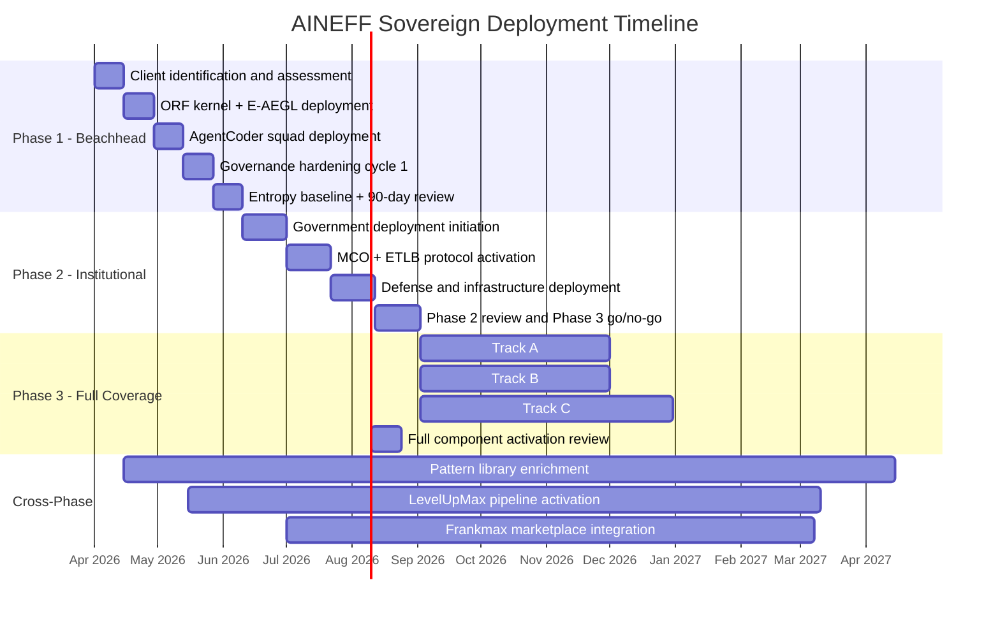

---

sidebar_position: 19
title: "AINEFF Deployment Blueprint"
description: "Phased sovereign deployment architecture for AINEFF across 15 audience classes — sequencing, dependencies, governance constraints, authority boundaries, kill switches, and resource requirements for converting the framework from specification to operational infrastructure."
tags: [sovereign, deployment, architecture]
custom_status: Active
custom_owner: Frankmax
custom_last_review: 2026-03-03
custom_next_review: 2026-06-03

---

# AINEFF Deployment Blueprint

AINEFF is 85 components, 43 core systems, 7 platforms, and 3 protocols. It does not deploy all at once. Attempting simultaneous deployment across 15 sovereign audience classes would produce the same governance entropy the framework is designed to eliminate — a transformation program that becomes its own source of institutional disorder.

This blueprint specifies the deployment sequence, phase dependencies, hard constraints, authority boundaries, and kill switches that govern how AINEFF moves from architecture to operational reality. Every decision in this document is reversible until it is not, and every irreversible deployment step is bound to a single human liability bearer per the ORF kernel.

---

## 1. Deployment Sequencing Rationale

The sequencing is not alphabetical, not by revenue potential, and not by ease of implementation. It follows three structural principles:

1. **Regulatory forcing function first.** Deploy to audiences whose adoption creates compliance pressure on adjacent audiences. Banks and insurers, once governed by AINEFF, will require governance evidence from counterparties — pulling corporate clients, family offices, and investors into the framework without Frankmax needing to sell them directly.
2. **Evidence chain value.** Deploy to audiences whose operations generate the richest entropy pattern data. This data feeds the Kitchen layer — the proprietary pattern library that makes each subsequent deployment faster and more accurate.
3. **Credibility before complexity.** Deploy to audiences where AINEFF can demonstrate measurable entropy reduction within 90 days before attempting audiences where deployment timelines exceed 12 months and political complexity is extreme.

:::info[The Beachhead Principle]
Phase 1 is not the most important audience. It is the audience most likely to produce undeniable, measurable results within 90 days. Those results become the evidence base for Phase 2. Phase 2's results become the evidence base for Phase 3. Without Phase 1 success, nothing else matters.
:::

---

## 2. Phase 1: Beachhead (Days 0-90)

### Target Audiences

- **Banks, Insurers, and Financial Foundations** — Highest willingness to pay, clearest governance needs, most acute regulatory pressure, and their adoption creates forcing functions for 6+ other audience classes.
- **Family Offices** — Fastest time-to-value (small team, concentrated decision authority, immediate pain points around succession and advisor coordination), and they overlap with dynastic and high-risk individual audiences.

### Why These Two First

Banks and family offices represent opposite ends of the institutional complexity spectrum. Banks are heavily regulated, process-driven, and committee-governed. Family offices are lightly regulated, relationship-driven, and principal-governed. If AINEFF can metabolize entropy in both contexts simultaneously, it validates the framework's structural flexibility — not just its applicability to a single institutional type.

Banks also create the regulatory forcing function. Once a bank's governance evidence chain runs through AINEFF, every counterparty, vendor, and correspondent bank faces implicit pressure to demonstrate compatible governance. This is not a sales strategy — it is a structural consequence of how regulated financial institutions operate.

### AINEFF Components Deployed

| Component | Function in Phase 1 | Deployment Priority |
|---|---|---|
| **ORF Kernel** | Bind single liability bearers to every irreversible financial decision (trade execution, loan approval, policy issuance) and every irreversible family office action (capital commitment, distribution, trust modification) | Day 1 — non-negotiable |
| **E-AEGL** | Sub-10ms policy enforcement on all financial transactions and information access events. SHA-256 hash-chained audit trails activated from first deployment day. | Day 1 — non-negotiable |
| **AgentCoder Teams** | Initial deployment: 1 squad per client for portfolio analytics (family offices) and compliance monitoring (banks). Quality gates enforced from first output. | Week 2 |
| **WGE** | Advisor performance tracking (family offices) and executive compliance tracking (banks). Baseline measurement established. | Week 3 |
| **Append-Only Governance Log** | Activated at deployment. Every decision, authorization, and access event recorded. No retroactive editing. This log becomes the client's evidence chain. | Day 1 — non-negotiable |
| **PIAR Protocol** | Mandatory for all irreversible actions exceeding defined thresholds ($50M for banks, 2% of NAV for family offices). | Week 2 |

### Governance Layers Activated

1. **Constitutional layer** — ORF kernel and E-AEGL operational from Day 1. No exceptions, no "soft launch" period.
2. **Detection layer** — AgentCoder threat monitoring and compliance scanning by Week 3.
3. **Enforcement layer** — PIAR mandatory for material decisions by Week 4.
4. **Adaptation layer** — First governance hardening cycle at Week 8. Baseline entropy measurement at Week 4, delta measurement at Week 8.

### Integration Points

- **Banking core systems:** E-AEGL integrates with existing transaction authorization systems. Does not replace them — wraps them with an additional policy enforcement layer.
- **Family office custodians:** Data feeds from custodians, administrators, and GPs aggregated through AgentCoder analytics layer. Read-only integration — AINEFF observes but does not modify operational systems.
- **Regulatory reporting:** AINEFF governance log data formatted for regulatory reporting requirements. Reduces manual compliance burden by providing auditable evidence natively.

### Phase 1 Success Criteria

| Metric | Target | Measurement |
|---|---|---|
| ORF kernel coverage | 100% of irreversible actions bound | Governance log analysis |
| E-AEGL uptime | \> 99.9% | System monitoring |
| Decision latency reduction | \> 30% reduction from baseline | Pre/post timestamp comparison |
| Governance log completeness | 100% of material decisions recorded | Log audit vs. operational records |
| Client NPS (decision-grade, not satisfaction) | Clients can identify specific decisions improved by AINEFF evidence | Structured interview at Day 60 |

---

## 3. Phase 2: Institutional Expansion (Days 90-180)

### Target Audiences

- **Governments and Ministries** — Requires Phase 1 credibility with financial regulators. Government adoption is the single largest forcing function in the system.
- **Defense, Security, and Intelligence** — Requires government-level relationship established in Phase 2 government deployment. Classification-compatible governance is a prerequisite.
- **National Critical Infrastructure** — Requires both government mandate (Phase 2) and financial institution evidence chains (Phase 1) because infrastructure operators are typically regulated by both.

### Dependencies on Phase 1

Phase 2 cannot begin without:

1. At least 2 bank/insurer deployments with documented entropy reduction metrics.
2. At least 1 family office deployment with documented governance hardening evidence.
3. E-AEGL audit trail data covering \> 90 days of continuous operation.
4. Zero governance log integrity incidents in Phase 1.

:::warning[Hard Gate]
Phase 2 deployment is a go/no-go decision at Day 90. If Phase 1 success criteria are not met, Phase 2 does not begin. There is no "partial success" pathway. The evidence base must be unambiguous.
:::

### Additional AINEFF Components Deployed

| Component | Function in Phase 2 | Deployment Priority |
|---|---|---|
| **MCO Protocol** | Multi-party coordination for cross-ministry and cross-agency decisions. Required for government deployments where decisions span multiple departments. | Week 1 of Phase 2 |
| **ETLB Protocol** | Economic trust ledger for infrastructure operators where financial obligations span multiple entities and jurisdictions. | Week 2 of Phase 2 |
| **ACTS (Causal Trace System)** | Required for defense and intelligence contexts where the causal chain of decisions must be reconstructable under classification constraints. | Week 3 of Phase 2 |
| **PAME (Power Asymmetry Detection)** | Activated for government contexts where factional capture of governance infrastructure is a primary threat. | Week 2 of Phase 2 |
| **Contagion Firewall** | Prevents entropy in one government department from propagating to others through shared AINEFF infrastructure. | Week 1 of Phase 2 |

### Governance Layer Expansion

- **Classification-compatible audit trails:** Government and defense deployments require audit trails that maintain integrity under classification constraints. SHA-256 hash chains operate identically whether the content is classified or unclassified — the hash proves integrity without revealing content.
- **Multi-sovereign coordination:** Government deployments introduce the problem of multiple sovereign entities (ministries, agencies, departments) sharing governance infrastructure without any single entity having override authority over others. MCO protocol governs cross-entity decisions.
- **Infrastructure interdependency mapping:** Critical infrastructure deployments require modeling cascade failure paths — how entropy in one operator propagates to others through physical or digital interconnections.

### Phase 2 Success Criteria

| Metric | Target | Measurement |
|---|---|---|
| Government deployment | \> 1 ministry with ORF kernel operational | Governance log verification |
| Cross-entity coordination | MCO protocol handling \> 10 cross-entity decisions per month | Protocol activity log |
| Infrastructure cascade mapping | \> 80% of critical interdependencies identified and monitored | Infrastructure dependency audit |
| Phase 1 client retention | 100% of Phase 1 clients renewing | Contract status |
| Pattern library growth | \> 200 entropy pattern entries from Phase 1 + 2 combined | Kitchen layer database |

---

## 4. Phase 3: Full Sovereign Coverage (Days 180-365)

### Target Audiences

All remaining audience classes:

- Multinational Corporate Empires
- Legacy Enterprises
- Dynasties and Royal Houses
- National Industry Bodies
- Education, R&D, and Think Tanks
- Consulting Firms and System Integrators
- Investors, VCs, and Syndicates
- High-Power Founders and Operators
- High-Risk Individuals

### Dependencies on Phase 2

Phase 3 cannot begin without:

1. Government deployment operational with documented MCO protocol functionality.
2. Defense/intelligence deployment demonstrating classification-compatible audit trails.
3. Critical infrastructure deployment with cascade mapping validated.
4. Phase 1 clients demonstrating \> 6 months of continuous governance log integrity.
5. Pattern library containing \> 200 validated entropy patterns.

### Deployment Strategy: Parallel Tracks

Phase 3 deploys multiple audiences in parallel, organized by shared infrastructure requirements:

**Track A — Enterprise (Months 6-9):** Multinationals, Legacy Enterprises, Industry Bodies. These share similar governance structures (matrix organizations, board oversight, regulatory compliance) and deploy on the same AINEFF stack configuration established for banks in Phase 1.

**Track B — Capital and Dynasty (Months 7-10):** Dynasties, Investors, Consulting Firms. These share similar principal-agent dynamics and deploy on the same AINEFF stack configuration established for family offices in Phase 1.

**Track C — Individual and Human-Centric (Months 8-12):** High-Power Founders, High-Risk Individuals, Education/R&D. These require the most customized deployment because the "institution" is often a single person or a small team.

### Full Component Activation

By Month 12, all 85 AINEFF components are operational across at least one client in each audience class. The full stack includes:

- All 3 protocols (ORF, ETLB, MCO) operational
- All 43 core systems active
- All 7 platforms deployed
- AgentCoder teams scaled to 1 squad per 3 clients (shared expertise model)
- LevelUpMax pipeline feeding operators from all audience classes
- Frankmax marketplace integration: governance-compatible AI solutions available to all deployed clients

---

## 5. Hard Constraints Across All Deployments

:::danger[Non-Negotiable Constraints]
These constraints apply to every deployment across every phase and every audience class. They are not guidelines. They are constitutional requirements. Violation of any constraint triggers automatic escalation.
:::

### ORF Kernel — Universal

Every irreversible action across every deployment requires a single, identifiable human liability bearer bound at execution time. No committee authorizations. No "the team decided." No delegation of irreversible authority to AI systems. The human who is accountable must be named, must have accepted accountability, and must be reachable within 4 hours of any incident arising from their authorized action.

### E-AEGL Audit Trails — Universal

Sub-10ms policy enforcement on every transaction, decision, and access event. SHA-256 hash-chained audit trails from Day 1 of every deployment. No retroactive modification. No deletion. No "archive and purge" cycles. The audit trail is append-only and permanent.

### Human Override — Universal

Every AI-generated recommendation, every automated policy enforcement action, and every AgentCoder output can be overridden by an authorized human. The override is logged, the overriding human is bound as the liability bearer for the overridden action, and the override itself becomes part of the audit trail. AI assists. Humans decide. The system enforces this distinction at the constitutional level.

### PIAR — Universal

Pre-Incident Accountability Reviews are mandatory before any irreversible action exceeding audience-specific thresholds. The review must document: the action to be taken, the liability bearer, the expected outcome, the failure scenarios considered, and the rollback plan (if the action is partially reversible).

---

## 6. Authority Boundaries: Frankmax and Client Sovereignty

### What Frankmax Controls

- **Framework integrity:** Frankmax maintains the AINEFF codebase, protocol specifications, and constitutional constraints. No client can modify the ORF kernel, E-AEGL enforcement logic, or PIAR protocol requirements.
- **Pattern library:** Frankmax owns the Kitchen layer — the cross-institutional entropy pattern library. Client data is anonymized before entry. No client can access another client's raw data.
- **Quality gates:** AgentCoder team quality standards (Jarvis orchestration, Coder execution, Reviewer validation, Tester stress-testing) are set by Frankmax and non-negotiable.

### What the Client Controls

- **Threshold calibration:** The specific dollar amounts, time periods, and risk levels that trigger PIAR, escalation, and governance review are set by the client within Frankmax-defined ranges.
- **Role assignment:** The client determines which humans fill which accountability roles. Frankmax validates that the role structure meets constitutional requirements but does not select individuals.
- **Operational integration:** The client determines how AINEFF integrates with their existing operational systems, subject to minimum integration requirements for audit trail completeness.
- **Data sovereignty:** All client data remains under client control. Frankmax has read access to anonymized governance metrics for pattern library enrichment. No other access without explicit client authorization.

### What Neither Controls

- **The audit trail:** Once a governance event is logged, neither Frankmax nor the client can modify or delete it. The SHA-256 hash chain is structurally immutable. This is the system's integrity guarantee.
- **Constitutional constraints:** The ORF kernel, E-AEGL enforcement, and PIAR requirements cannot be suspended, weakened, or overridden by any party. They can be amended through a formal constitutional amendment process that requires supermajority ratification across all affected stakeholders.

---

## 7. Kill Switches and Automatic Escalation Triggers

### Kill Switch Architecture

Every AINEFF deployment includes three classes of kill switches:

| Kill Switch Class | Trigger | Effect | Authority |
|---|---|---|---|
| **Client Emergency Halt** | Client-authorized human activates | All AI-generated actions suspended. Human-only governance mode. Audit trail continues. | Client's designated emergency authority |
| **Frankmax Integrity Halt** | AINEFF detects governance log tampering, hash chain inconsistency, or unauthorized framework modification | Affected deployment isolated from pattern library. All cross-client data flows suspended. | Automatic — no human authorization required |
| **Constitutional Breach Halt** | ORF kernel violation detected — irreversible action executed without bound liability bearer | Action flagged, liability bearer identification demanded within 4 hours, all subsequent irreversible actions suspended pending resolution | Automatic escalation to Frankmax governance authority and client's constitutional review board |

### Automatic Escalation Triggers

| Trigger Condition | Escalation Path | Timeline |
|---|---|---|
| PIAR bypassed for a qualifying action | Flag to client governance director + Frankmax deployment lead | Immediate |
| E-AEGL enforcement latency exceeds 100ms for \> 5 minutes | Flag to Frankmax engineering + client IT | Immediate |
| Governance log gap detected (\> 1 hour without entries during operational hours) | Flag to client governance director | Within 30 minutes |
| AI override rate exceeds 40% in any 7-day period | Flag to client governance director + Frankmax deployment lead for review | Within 24 hours |
| Cross-entity coordination deadlock (\> 14 days without resolution) | Escalation to next governance tier | At Day 14 |
| Pattern library anomaly (client's entropy patterns diverge significantly from baseline) | Frankmax advisory alert to client governance director | Within 48 hours |

---

## 8. Ratification Rules for Cross-Audience Decisions

When a single decision affects multiple audience classes (e.g., a bank's policy change that impacts its family office clients, or a government regulatory action that cascades to critical infrastructure operators), the following ratification rules apply:

### Single-Audience Decisions

Standard governance applies. The audience-specific accountability structure handles the decision within its own ratification layers.

### Two-Audience Decisions

Both audience governance structures must ratify. MCO protocol mediates. Resolution timeline: 14 days. If unresolved, escalation to Frankmax cross-audience coordination authority.

### Three-or-More-Audience Decisions

MCO protocol convenes all affected audience governance structures. Resolution timeline: 30 days. Supermajority (67% of affected audiences) required for ratification. Dissenting audiences may invoke a constitutional challenge, adjudicated by Frankmax governance authority within 60 days.

### Emergency Cross-Audience Decisions

When delay creates irreversible harm, the Frankmax emergency coordination authority may authorize provisional action with a 72-hour ratification requirement. If ratification fails within 72 hours, the provisional action is reversed (if reversible) or the liability bearer is bound to the consequences (if irreversible).

---

## 9. Deployment Timeline

---

## 10. Resource Requirements Per Phase

### Phase 1 (Days 0-90)

| Resource | Requirement | Justification |
|---|---|---|
| **Deployment engineers** | 4-6 per client | E-AEGL integration, ORF kernel configuration, data pipeline setup |
| **AgentCoder squads** | 1 per client | Portfolio analytics (family offices), compliance monitoring (banks) |
| **Governance architects** | 2 shared across Phase 1 | Constitutional framework mapping, accountability structure design |
| **Client-side liaison** | 1 per client (client-funded) | Daily coordination, access facilitation, internal change management |
| **Frankmax deployment lead** | 1 for all Phase 1 | Single accountability for Phase 1 success. Named. Bound. |
| **Capital requirement** | $2M-$5M total Phase 1 | Infrastructure, personnel, client integration costs |

### Phase 2 (Days 90-180)

| Resource | Requirement | Justification |
|---|---|---|
| **Deployment engineers** | 8-12 across Phase 2 clients | Government and infrastructure integration is higher-complexity |
| **AgentCoder squads** | 2-3 new squads | Government compliance, infrastructure monitoring, defense analytics |
| **Protocol specialists** | 2 for MCO, 1 for ETLB | Protocol deployment requires specialized expertise |
| **Security clearance personnel** | 2-4 for defense deployments | Classification-compatible operations require cleared staff |
| **Governance architects** | 3 shared across Phase 2 | Multi-sovereign coordination architecture |
| **Frankmax deployment lead** | 1 for Phase 2 (may be same as Phase 1) | Single accountability for Phase 2 success |
| **Capital requirement** | $5M-$12M total Phase 2 | Higher complexity, security requirements, protocol deployment |

### Phase 3 (Days 180-365)

| Resource | Requirement | Justification |
|---|---|---|
| **Deployment engineers** | 15-25 across all tracks | Parallel deployment across 9 audience classes |
| **AgentCoder squads** | 5-8 new squads | One per 2-3 clients across all tracks |
| **LevelUpMax operators** | 3-5 pipeline managers | Converting graduates to operators across audience classes |
| **Governance architects** | 5 across all tracks | Audience-specific constitutional framework customization |
| **Cross-audience coordination** | 2 dedicated coordinators | Managing interdependencies and MCO protocol across all active deployments |
| **Frankmax deployment leads** | 3 (one per track) | Single accountability per parallel track |
| **Capital requirement** | $10M-$25M total Phase 3 | Scale deployment, LevelUpMax investment, marketplace integration |

### Cumulative Year 1

| Category | Total |
|---|---|
| **Deployment engineers (peak)** | 25-30 |
| **AgentCoder squads (cumulative)** | 8-12 |
| **Governance architects** | 5-8 |
| **Capital requirement** | $17M-$42M |
| **Revenue target (Fries margin)** | \> $10M ARR by Month 12 from Phase 1 clients |
| **Break-even target** | Month 18-24 (Phase 1 + 2 Fries revenue exceeds ongoing costs) |

---

## 11. Failure Modes and Rollback

### Phase 1 Failure

If Phase 1 does not meet success criteria at Day 90:

- **Root cause analysis** within 14 days. Was the failure in AINEFF's technology, in client implementation capacity, or in the wrong beachhead client selection?
- **Rollback option:** Phase 1 deployments continue in maintenance mode. No Phase 2. Frankmax reallocates resources to diagnose and remediate.
- **Restart option:** New beachhead clients identified within 30 days. Phase 1 restarts with lessons incorporated. Phase 2 timeline shifts by the delay.

### Phase 2 Failure

If Phase 2 does not meet success criteria at Day 180:

- Phase 1 clients continue receiving service. Evidence chains are operational and producing value.
- Phase 2 deployments that are partially operational continue with reduced scope.
- Phase 3 is delayed until Phase 2 issues are resolved. No parallel deployment until government and infrastructure deployments are stable.

### Systemic Failure

If the fundamental assumptions of the deployment model prove wrong — AINEFF's governance overhead exceeds client tolerance, the evidence chain does not create the expected lock-in, or the pattern library does not compound as projected:

- All existing deployments maintain current service levels.
- New deployments suspended.
- Frankmax conducts full architectural review within 60 days.
- Constitutional amendment process invoked if the ORF kernel or E-AEGL specifications require modification.

:::danger[The Uncomfortable Truth]
The most likely failure mode is not technical. It is political. Institutions will resist AINEFF not because it does not work but because it works too well — it makes accountability visible, it makes performance measurable, and it makes governance failures attributable to named individuals. The people who benefit from accountability diffusion will fight the system that eliminates it. This is not a bug in the deployment model. It is the primary obstacle that every phase must overcome.
:::

---

## Related Documents

- [90-Day Deployment Roadmap](./90-day-roadmap) — Week-by-week execution plan for Phase 1
- [3-Year Structural Sovereignty Architecture](./3-year-architecture) — Long-term architecture beyond Year 1
- [Cross-Audience Stabilization Strategy](./cross-audience-analysis) — Interdependency mapping between audience classes
- [Sovereign Anti-Entropy Deployment Architecture](./) — Master framework for all sovereign deployments
- [AINEFF Constitutional Law Layer](/docs/entities/aineff) — The constitutional framework underlying all deployments
