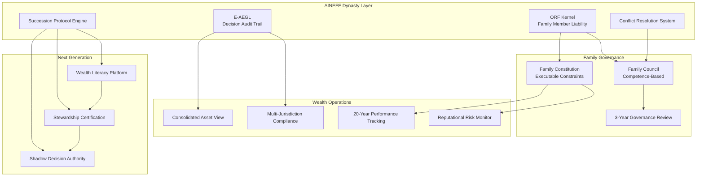
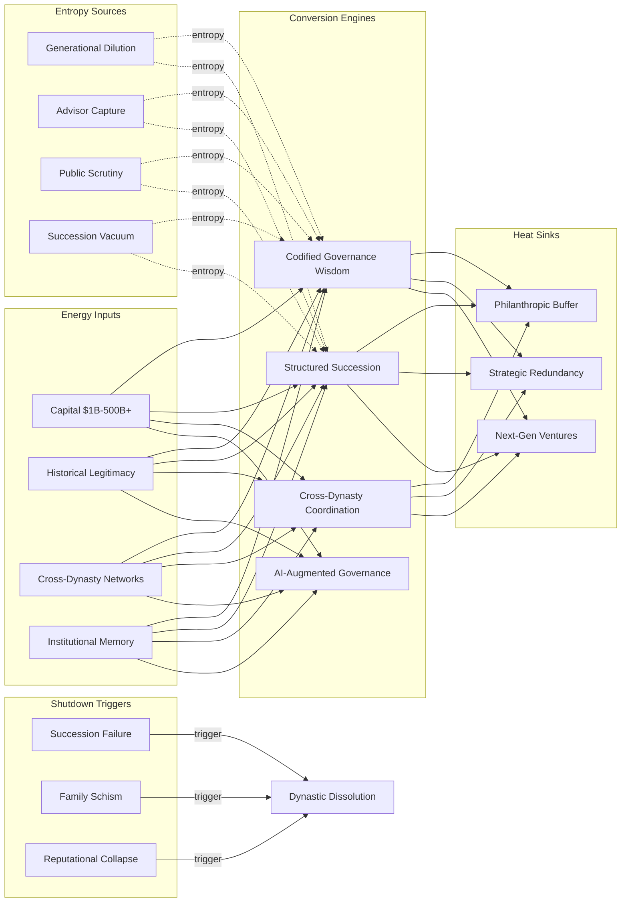

# Dynasties & Royal Houses

90% of family wealth is lost by the third generation. Not because heirs are incompetent — because governance structures that worked for the founder cannot survive the transition to collective stewardship. Dynasties and royal houses face a unique entropy profile: wealth concentration creates both extraordinary capability and extraordinary fragility. A single succession failure, family conflict, or governance breakdown can destroy centuries of accumulated capital, legitimacy, and institutional knowledge. AINEFF treats dynastic structures as multi-generational coordination systems where the primary entropy vector is the gap between founding-era governance and current-era complexity.

:::danger Structural Reality
The average lifespan of a dynastic fortune is 70 years. The average lifespan of a constitutional monarchy's political relevance is declining at 3-5% per decade. Neither wealth nor title survives institutional decay — only governance does.
:::

---

## 1. Entropy Vector Map

| Vector | Manifestation | Severity |
|--------|--------------|----------|
| **Strategy** | Founder's strategic vision becomes mythology rather than operational doctrine. Third-generation heirs inherit wealth without the contextual knowledge that created it. Strategic drift from productive capital to preservation capital — portfolios optimized for tax efficiency rather than value creation. | **Critical** |
| **Operations** | Family office operations managed by trusted advisors rather than institutional processes. Key operations dependent on 2-3 individuals whose departure would create immediate capability gaps. Operational complexity grows linearly with wealth while operational capacity grows logarithmically. | **High** |
| **Incentives** | Heirs incentivized by consumption rather than stewardship. Advisor compensation tied to AUM, not to inter-generational wealth preservation. Trust structures create distance between economic ownership and decision authority, breeding disengagement. | **Critical** |
| **Information** | Complete wealth picture known only to patriarch/matriarch and trusted advisor. Cross-jurisdiction asset information fragmented across 10-30 legal entities. Next generation typically learns true financial position only at succession — by which time critical decisions have already been made for them. | **Critical** |
| **Culture** | Modernization vs tradition tension: embracing contemporary governance risks alienating traditional power base. Younger generations culturally distant from founding values. Public scrutiny of dynastic wealth creates defensive insularity that prevents institutional learning. | **High** |
| **Capital** | Asset concentration in illiquid holdings (real estate, operating businesses, sovereign investments). Diversification entropy — spreading across too many asset classes without the governance capacity to manage any of them well. Tax optimization creating structural rigidity. | **High** |
| **Governance** | Family governance documents (constitutions, shareholder agreements) written for 5-10 family members applied to 50-100+ in third/fourth generation. No formal conflict resolution mechanism. Power concentrated in eldest/most senior rather than most capable. Advisory boards lack independence. | **Critical** |

---

## 2. Early Entropy Signals

1. **Family meeting attendance** dropping below 70% — disengagement from collective governance indicates fragmentation
2. **Advisor tenure** exceeding 15 years without rotation — captured advisory relationship, single point of failure
3. **Next-generation wealth literacy** below functional threshold — heirs unable to explain family investment thesis or governance structure
4. **Cross-generational conflict frequency** increasing — disputes over spending, strategy, or governance indicate structural misalignment
5. **Entity proliferation** exceeding operational capacity — more trusts/SPVs/foundations than governance bandwidth can oversee
6. **Succession planning documents** older than 5 years without review — governance ossification while family dynamics evolve
7. **Public controversies per annum** increasing — reputational entropy materializing faster than reputation management capacity

---

## 3. 3–5 Year Decay Model

| Dimension | Projection |
|-----------|-----------|
| **Financial cost of entropy** | Dynastic families lose 20-30% of real wealth per generation through poor governance (not poor investment returns). A $10B family fortune erodes to $7B in generation 2 and $3-4B in generation 3 — not from market losses but from coordination costs, family conflicts, advisor capture, and tax inefficiency. Estate litigation costs $50-200M per contested succession. |
| **Institutional trust erosion** | For royal houses, public approval is existential. Constitutional monarchies with approval below 50% face abolition movements (Greece 1973, Nepal 2008). Each scandal — financial, personal, political — erodes legitimacy that took centuries to build. Recovery time per scandal: 5-15 years. |
| **Competitive vulnerability** | Dynastic wealth that fails to modernize loses relative position to institutional capital (sovereign wealth funds, private equity) with superior governance. Family offices managing \<$5B are increasingly unable to access best-in-class deal flow, talent, and co-investment opportunities. |
| **Political fragility** | Wealth concentration visibility increasing through transparency regulations, leaked documents (Panama Papers, Pandora Papers). Political risk of punitive taxation, asset seizure, or forced divestiture rises 5-10% annually in populist political environments. For royal houses, political legitimacy depends on perceived public benefit — which requires measurable demonstration. |

---

## 4. AINEFF Deployment Architecture

### Structural Constraints

- **ORF Kernel**: Every investment decision, trust modification, and governance change must have a named family member (not advisor) as liability bearer. Advisors execute; family members are accountable
- **Succession Binding**: No irrevocable asset transfer without documented succession governance that covers the next two generations
- **Conflict Resolution Protocol**: Family disputes escalated through structured mediation before any legal action — with E-AEGL recording all positions and decisions
- **Wealth Visibility Mandate**: Complete consolidated wealth view accessible to all family members above age of majority — ending information asymmetry as a power tool

### Governance Hardening

- Family constitution codified as executable constraints in AINEFF, not aspirational documents
- Advisor performance measured against inter-generational preservation metrics (20-year rolling), not annual returns
- Decision authority formally separated from wealth ownership — competence-based governance, not primogeniture
- Mandatory governance review every 3 years with independent assessment

### AI-Native Coordination

- Consolidated multi-jurisdiction asset monitoring through AINEFF coordination layer
- Automated compliance across all jurisdictions where family holds assets
- Predictive conflict modeling — identifying family tension vectors before they escalate
- Next-generation education platforms tracking wealth literacy development

### Incentive Alignment

- Heir access to capital tied to demonstrated stewardship capability (not age or birth order)
- Advisor compensation restructured: 70% base, 30% tied to 10-year inter-generational metrics
- Philanthropic activities measured for impact, not visibility — preventing reputation laundering

### Information Integrity

- Single source of truth for all family assets across jurisdictions, entities, and structures
- E-AEGL audit trail for every governance decision — preventing retrospective narrative disputes
- Transparent reporting to all family stakeholders with appropriate access levels

---

## 5. Accountability Design

| Role | Accountability |
|------|---------------|
| **Family Patriarch/Matriarch** | Transitional accountability — accountable for governance transition to competence-based council within defined timeline. Not perpetual authority. |
| **Family Council Chair** | Accountable for governance process integrity, conflict resolution activation, and succession planning currency. Rotates every 3-5 years. |
| **Chief Steward** | Professional (non-family) role accountable for operational execution of family strategy. Reports to council, not to any individual family member. Performance measured on 10-year rolling metrics. |
| **Next-Gen Representative** | Accountable for representing emerging generation's interests and demonstrating governance readiness. Must pass stewardship certification before assuming council voting rights. |

**Decision Rights:**
- Operating investments under $10M: Chief Steward (autonomous within policy envelope)
- Strategic allocation changes above $10M: Family Council majority vote with AINEFF economic model validation
- Governance structure changes: Supermajority (75%) of eligible family members
- Irrevocable decisions (trust dissolution, dynasty-level commitments): Unanimous council vote with mandatory 90-day cooling period

---

## 6. Entropy-Reduction Metrics

| KPI | Current Baseline | Target (Year 1) | Target (Year 3) |
|-----|-----------------|-----------------|-----------------|
| **Capital Efficiency** | 3-5% real returns (below institutional benchmarks) | 5-7% real returns | 7-9% (institutional parity) |
| **Decision Latency** | 6-18 months for major family decisions | 3 months | 1 month |
| **Complexity-to-Value** | 30+ entities, 15% consolidated visibility | 30 entities, 60% visibility | 20 entities (consolidated), 95% visibility |
| **Information Distortion** | 40%+ wealth picture unknown to next generation | 20% unknown | 5% unknown |
| **Incentive Coherence** | 20% alignment between heir behavior and stewardship objectives | 50% | 80% |
| **Succession Readiness** | 15% of next-gen meeting stewardship certification threshold | 40% | 70% |

---

## 7. Thermodynamic System Model

### Energy Inputs
- **Capital**: Concentrated dynastic wealth ($1B-$500B+ per family/house)
- **Talent**: Family members, trusted advisors, professional managers, household staff
- **Legitimacy**: Historical legacy, cultural authority, philanthropic reputation, political relationships
- **Information**: Multi-generational business knowledge, relationship networks, institutional memory
- **Political Trust**: Public perception of dynastic value to society (constitutional role, philanthropy, employment)
- **Network Power**: Cross-dynastic relationships, sovereign relationships, institutional access

### Entropy Sources
- **Generational Dilution**: Each generation multiplies stakeholders while dividing individual ownership stakes
- **Advisor Capture**: Long-tenured advisors optimizing for relationship preservation, not family outcomes
- **Incentive Drift**: Distance between wealth creation (founder) and wealth consumption (heirs) growing each generation
- **Cognitive Overload**: Family complexity (members, entities, jurisdictions, relationships) exceeding any single person's management capacity
- **Public Scrutiny**: Transparency regimes making dynastic wealth structures increasingly visible and politically targetable
- **Succession Vacuum**: Period between generations where governance authority is contested or unclear

### Conversion Engines
- **Institutional Learning**: Codified family history and governance wisdom transferable across generations
- **Structured Succession**: AINEFF-enabled transition protocols that reduce succession entropy from 5-10 year disruption to 6-12 month structured handover
- **Cross-Dynasty Coordination**: Shared investment vehicles, governance best practices, and mutual support networks among dynastic families
- **AI-Augmented Governance**: AINEFF providing consolidated wealth visibility and automated compliance that no individual advisor can deliver

### Heat Sinks
- **Philanthropic Capital**: Endowments that serve social purpose while providing reputational buffer and tax efficiency
- **Strategic Redundancy**: Multiple operating businesses reducing concentration risk
- **Controlled Experimentation**: Next-generation ventures with limited capital allocation to develop capability without existential risk
- **Diplomatic Relationships**: Maintained even during internal governance transitions

### Shutdown Triggers
- **Succession Failure**: No qualified successor identified within 5 years of anticipated transition
- **Family Schism**: Irreconcilable conflict between branches resulting in partition demands
- **Reputational Collapse**: Scandal severe enough to trigger political/legal action against dynastic assets
- **Advisor Defection**: Key advisor departing with critical knowledge and/or joining competing family
- **Wealth Concentration Breach**: Single asset class exceeding 50% of total wealth without governance approval

---

## 8. Adversarial Red-Team Critique

**How AINEFF fails for dynasties and royal houses:**

1. **Intimacy vs Structure Tension**: Dynastic governance is fundamentally personal. Family members will resist codifying relationships as "structural constraints." A grandmother does not want to interact with her grandchildren through a governance framework. AINEFF's structural approach may be perceived as dehumanizing the very relationships it aims to preserve.

2. **Advisor Resistance**: Existing advisors (lawyers, wealth managers, family office heads) will view AINEFF as a threat to their gatekeeper position. They control information asymmetry — AINEFF eliminates it. Expect active sabotage from the professional infrastructure that currently surrounds dynastic wealth.

3. **Privacy vs Transparency Paradox**: AINEFF's information integrity systems create comprehensive wealth visibility. For families that have maintained privacy across generations, this transparency is existential — not just inconvenient. If family wealth data is consolidated in AINEFF, it becomes a high-value target for adversaries, regulators, and disgruntled family members.

4. **Cultural Legitimacy Gap**: AINEFF is a technology framework. Dynasties operate on tradition, honor, and familial obligation. A tech platform telling a royal house how to govern itself will be rejected on cultural grounds, regardless of its technical merit.

5. **Succession Override Risk**: If AINEFF's stewardship certification prevents the "wrong" heir from assuming leadership, the family may reject the framework rather than accept its judgment. Governance tools that override familial expectations create political crises within the family.

:::danger Critical Question
Can AINEFF earn trust from institutions whose identity is defined by multi-century tradition? Technology frameworks are ephemeral by dynastic standards. A family that has survived 500 years will not restructure governance around a platform that has existed for 5 years.
:::
