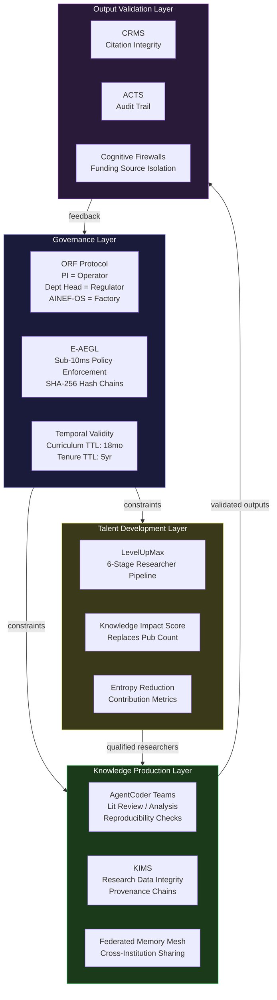

---

sidebar_position: 13
title: "Education / R&D / Think Tanks"
description: "Sovereign deployment architecture for universities, research institutions, and policy think tanks — addressing knowledge production-to-application gaps, funding cycle dependency, and institutional conservatism through AINEFF thermodynamic governance."
tags: [sovereign, education, research, think-tanks, entropy]
custom_status: active
custom_owner: Andrew Leo
custom_last_review: 2026-03-01
custom_next_review: 2026-06-01
---

# Education / R&D / Think Tanks

Universities, research institutions, and think tanks are **knowledge factories** — they convert capital, talent, and legitimacy into ideas, graduates, and policy influence. But these institutions are among the most entropy-laden structures in modern civilization. Their governance models predate electrification. Their incentive structures reward publication volume over application value. Their funding cycles create artificial urgency that distorts research direction. And their institutional conservatism — tenure systems, departmental silos, peer review gatekeeping — systematically suppresses the frontier research they claim to champion.

AINEFF does not propose reforming academia. It proposes **building a parallel knowledge production infrastructure** that these institutions can plug into — one where every research output has a traceable liability chain, every funding allocation is governed by measurable impact metrics, and every knowledge transfer has a bound accountability bearer.

---

## 1. Entropy Vector Map

| Entropy Vector | Manifestation | Concrete Examples | Severity |
|---|---|---|---|
| **Strategy** | Mission drift from knowledge production to credential manufacturing and ranking optimization | Universities optimizing for US News rankings rather than research impact; think tanks aligning reports with donor preferences rather than evidence | **Critical** |
| **Operations** | Administrative bloat consuming resources that should flow to research | Administrative staff-to-faculty ratios exceeding 2:1; grant compliance overhead consuming 30-42% of PI time; IRB approval cycles extending 6-18 months for low-risk studies | **High** |
| **Incentives** | Publication-count metrics decoupled from knowledge utility | Researchers splitting single findings into minimum-publishable-units; citation rings inflating impact factors; negative results suppressed because journals reject them | **Critical** |
| **Information** | Knowledge locked in paywalled journals, siloed departments, and individual researcher notebooks | Reproducibility crisis (60%+ failure rate in psychology, 50%+ in biomedical); duplicate research wasting $28B/year globally; institutional knowledge lost when faculty retire or depart | **Critical** |
| **Culture** | Institutional conservatism disguised as rigor; academic freedom weaponized to protect underperformance | Tenure protecting researchers who stopped producing a decade ago; interdisciplinary work punished by departmental promotion committees; adjunct exploitation subsidizing administrative overhead | **High** |
| **Capital** | Funding cycle dependency creating boom-bust research timelines | 3-5 year grant cycles misaligned with 7-15 year research horizons; overhead rates (50-65% at top universities) taxing research budgets; endowment returns captured by institutional operations rather than research | **High** |
| **Governance** | Shared governance structures that diffuse accountability to the point of paralysis | Faculty senates blocking curriculum updates for years; provost offices unable to reallocate resources across departments; board fiduciary duty conflicting with academic mission | **Medium** |

---

## 2. Early Entropy Signals

These leading indicators predict systemic decay 12-36 months before visible institutional failure:

1. **Grant renewal rate decline \> 15% year-over-year** — Signals loss of competitive research positioning and PI productivity erosion. Track rolling 8-quarter averages against peer institutions.

2. **Time-to-publication increasing beyond field median by \> 40%** — Indicates bureaucratic overhead, collaboration friction, or methodological confusion slowing knowledge output.

3. **Faculty departure rate in top-2-quintile researchers exceeding 8% annually** — The best researchers leave first. When high-performers exit above baseline, the institution is losing its knowledge production capacity.

4. **Administrative cost per research dollar exceeding $0.55** — When more than 55 cents of every research dollar goes to administration, the institution has become a bureaucracy that incidentally produces research.

5. **Student-to-postdoc ratio inverting** — Healthy research institutions maintain pyramidal structures. When postdocs outnumber supported graduate students, the institution is producing cheap labor rather than training researchers.

6. **Industry partnership revenue declining while total revenue grows** — Signals that the institution's research is becoming less relevant to applied problems, even as tuition and endowment returns mask the decline.

7. **Interdisciplinary grant applications as percentage of total falling below 15%** — Indicates hardening of departmental silos and failure to address complex problems that require cross-domain synthesis.

---

## 3. 3-5 Year Decay Model

### Financial Cost of Entropy

| Decay Driver | Year 1-2 Impact | Year 3-5 Impact |
|---|---|---|
| Reproducibility failures and duplicate research | $2-5M per mid-size institution in wasted effort | $8-15M cumulative; reputational damage begins affecting enrollment |
| Administrative bloat growth (4-6% annually) | $3-7M in diverted research funding | $12-25M; new administrative layers become self-perpetuating |
| Faculty brain drain to industry AI labs | Loss of 2-4 top researchers ($500K-2M replacement cost each) | Loss of entire research groups; $10-30M in forfeited grant pipelines |
| Curriculum obsolescence in AI-adjacent fields | 10-20% enrollment decline in affected programs | 30-50% decline; programs face closure or restructuring |
| Grant overhead rate increases | 2-3% annual increase reducing effective research spending | Effective research spend per grant dollar drops below $0.35 |

### Institutional Trust Erosion

- Public trust in academic research: declining 3-5% annually (Gallup/Pew tracking)
- Industry willingness to fund academic partnerships: declining 7-12% annually as corporate R&D internalizes AI capabilities
- Government confidence in think tank policy recommendations: eroding as AI-generated analysis becomes cheaper and faster than traditional policy research

### Competitive Vulnerability

- Corporate AI labs (DeepMind, FAIR, Anthropic) now produce 40-60% of frontier ML research — up from \<10% a decade ago
- Think tanks face existential competition from AI-powered policy analysis platforms that can produce equivalent analysis in hours rather than months
- Online education platforms commoditizing the credential function, stranding institutions that failed to differentiate on research

### Political/Security Fragility

- Foreign talent dependency (international students comprising 60-80% of STEM graduate programs) creates national security vulnerability
- Research data exfiltration risk through visiting scholars and collaborative programs
- Politicization of funding decisions creating unpredictable resource allocation

---

## 4. AINEFF Deployment Architecture

### Structural Constraints Imposed by AINEFF

1. **Every research output must have a bound liability bearer** — No paper, dataset, or policy recommendation is published without a named human who accepts accountability for its integrity. This is not authorship — it is liability.

2. **Funding allocation decisions are auditable and hash-chained** — E-AEGL enforces append-only audit trails on every grant allocation, resource redistribution, and overhead calculation. No invisible cross-subsidies.

3. **Knowledge outputs carry provenance metadata** — Every dataset, model, finding, and recommendation carries a cryptographic provenance chain: who produced it, from what data, using what methods, reviewed by whom.

4. **Curriculum updates are governed by temporal validity** — No curriculum component persists beyond its TTL without re-ratification. Default TTL for technical curricula: 18 months. For foundational courses: 5 years.

### Governance Hardening Mechanisms

- **ORF Protocol for Research Governance**: Principal Investigators operate as Operators with explicit scope constraints. Department heads serve as Regulators with compliance oversight. AINEF-OS provides the Factory infrastructure for knowledge manufacturing.
- **Anti-ASI Constraints on AI Research Tools**: Research AI systems cannot self-modify their own evaluation criteria. Automated literature review tools cannot suppress results that contradict the using researcher's hypotheses.
- **Temporal Validity on Tenure**: Tenure bindings carry a 5-year TTL requiring re-ratification through demonstrable research output. Not publication count — measured impact on the institution's declared research mission.

### AI-Native Coordination Layers

- **AgentCoder research teams**: Autonomous AI agents handling systematic literature reviews, data preprocessing, statistical analysis, and reproducibility verification — with human PI as bound liability bearer for all outputs.
- **Cross-institutional knowledge mesh**: Federated memory architecture enabling controlled sharing of pre-publication research across partner institutions without centralized data custody.
- **LevelUpMax for graduate students**: 6-stage pipeline converting incoming graduate students to independent researchers with measurable competency gates at each stage.

### Incentive Alignment Redesign

- Replace publication count with **Knowledge Impact Score** — a composite metric measuring citation quality (not quantity), industry adoption, policy influence, and reproducibility rate.
- Funding allocation weighted by **Entropy Reduction Contribution** — how much a research program reduces uncertainty in its declared domain, not how many papers it produces.
- Think tank recommendations carry **Prediction Market Scores** — historical accuracy of the institution's policy predictions, tracked and published transparently.

### Information Integrity Systems

- **KIMS (Knowledge Integrity Management System)** for research data — tamper-evident storage with full provenance chains for every dataset.
- **CRMS (Cross-Reference Management System)** for citation integrity — automated detection of citation manipulation, citation rings, and selective citation.
- **Cognitive Firewalls** between industry-funded and independent research — structural information barriers preventing donor influence on research direction.

### Architecture Diagram

---

## 5. Accountability Design

### Single-Point Accountability Roles

| Role | Accountability Scope | Cannot Delegate |
|---|---|---|
| **Principal Investigator** | Research integrity for all outputs from their lab/group | Data provenance verification, methodology sign-off |
| **Department Chair** | Resource allocation transparency within department | Overhead rate justification, faculty performance review |
| **Provost/VP Research** | Institutional research strategy alignment with mission | Cross-department resource rebalancing, strategic priority decisions |
| **Think Tank Director** | Analytical integrity of all published recommendations | Donor influence firewall maintenance, prediction accuracy accountability |
| **IRB/Ethics Chair** | Research ethics compliance for human subjects and AI systems | Ethics review completion within SLA, conflict-of-interest adjudication |

### Decision Rights Clarity

| Decision | Who Decides | Who Must Be Consulted | Who Must Ratify |
|---|---|---|---|
| Research direction within funded scope | PI | Lab members | None (within approved scope) |
| New hire into research group | PI | Department Chair | Dean (budget approval) |
| Curriculum modification | Program Director | Faculty committee | Provost (for degree-level changes) |
| Cross-department resource transfer | Provost | Both Department Chairs | Board (if \> 5% of operating budget) |
| Publication retraction | PI + Department Chair | Legal, Ethics Board | VP Research |
| Think tank report release | Director | Research team, External reviewers | Board (for flagship publications) |

### Escalation Protocols

1. **Research integrity concern** — Reported to Department Chair within 24 hours. If Chair is conflicted, escalates to VP Research. Investigation initiated within 72 hours. Resolution within 30 days.
2. **Funding misallocation** — Flagged by E-AEGL automated monitoring. Escalated to CFO and VP Research simultaneously. Freeze on affected accounts until resolution.
3. **Curriculum obsolescence trigger** — Temporal Validity expiration generates automatic alert to Program Director. If not addressed within 60 days, escalates to Provost with recommendation to suspend enrollment.

### Ratification Layers

- **Level 1 — PI Self-Ratification**: Routine research decisions within approved scope and budget.
- **Level 2 — Peer Ratification**: Methodological changes, new collaborations, data sharing agreements. Requires sign-off from at least one qualified peer.
- **Level 3 — Institutional Ratification**: Strategic pivots, large equipment purchases, new program creation. Requires governance committee approval.
- **Level 4 — External Ratification**: Results with policy implications, findings affecting public health/safety, or claims of breakthrough significance. Requires independent external review before publication.

---

## 6. Entropy-Reduction Metrics

| Metric | Current Baseline (Typical) | AINEFF Target (Year 1) | AINEFF Target (Year 3) |
|---|---|---|---|
| **Capital Efficiency** — Research output per dollar spent (normalized) | $0.35-0.45 per research dollar after overhead | $0.55 per research dollar | $0.70 per research dollar |
| **Decision Latency** — Time from grant approval to research initiation | 4-8 months (compliance, hiring, procurement) | 6-10 weeks | 2-4 weeks |
| **Complexity-to-Value Ratio** — Administrative steps per research milestone | 15-25 administrative touchpoints per milestone | 8-12 touchpoints | 4-6 touchpoints |
| **Information Distortion** — Reproducibility rate of published findings | 40-60% (field-dependent) | 70% | 85%+ |
| **Incentive Coherence** — Correlation between reward metrics and institutional mission | 0.2-0.4 (pub count correlates weakly with mission) | 0.6 (Knowledge Impact Score adoption) | 0.8+ (full incentive realignment) |
| **Knowledge Transfer Velocity** — Time from finding to applied use | 7-15 years (Valley of Death) | 3-5 years | 1-3 years |
| **Talent Retention** — Top-quintile faculty retention rate | 85-90% (with significant variation) | 93% | 96%+ |

---

## 7. Thermodynamic System Model

### Energy Inputs

| Input | Form | Current Efficiency |
|---|---|---|
| **Capital** | Government grants, endowment returns, tuition, industry partnerships | 35-45% reaches research (rest consumed by overhead) |
| **Talent** | Graduate students, postdocs, visiting scholars, tenured faculty | 60% of researcher time on research (rest on admin, teaching load imbalance, compliance) |
| **Legitimacy** | Institutional reputation, accreditation, peer review standing | Eroding 3-5% annually due to reproducibility crisis and political polarization |
| **Information** | Published literature, datasets, experimental results, policy data | Severely fragmented — 70%+ of institutional knowledge is tacit and leaves when people leave |
| **Political Trust** | Government confidence in research recommendations, public trust in expertise | Declining — "trust in experts" at historic lows in multiple democracies |
| **Network Power** | Alumni networks, institutional partnerships, conference ecosystems | Strong but increasingly bypassed by direct industry-to-researcher recruitment |

### Entropy Sources

| Source | Mechanism | Annual Entropy Generation |
|---|---|---|
| **Bureaucracy** | Administrative layers added but never removed; compliance requirements compound annually | 4-6% annual increase in administrative cost per research dollar |
| **Incentive Drift** | Publication metrics decoupling from knowledge utility; ranking optimization replacing mission focus | Measurable: 15-20% of publications are "minimum publishable units" with near-zero marginal knowledge contribution |
| **Cognitive Overload** | Faculty managing teaching, research, admin, grant writing, committee service simultaneously | Estimated 30-40% cognitive capacity lost to context-switching |
| **Regulatory Capture** | Accreditation bodies enforcing process compliance over outcome quality | Compliance costs growing 8-12% annually independent of research output |
| **Fragmented Data** | Research data locked in individual labs, incompatible formats, no institutional memory | Estimated $28B/year globally in duplicate research; 60-80% of experimental data never shared |
| **Institutional Inertia** | Tenure protecting non-productive faculty; departmental structures resisting reorganization | 15-25% of tenured positions occupied by researchers with \<1 publication in 5 years at some institutions |

### Conversion Engines

| Engine | Function | AINEFF Enhancement |
|---|---|---|
| **Innovation Loops** | Converting raw research into applicable knowledge | AgentCoder teams accelerate literature synthesis and reproducibility verification 10-50x |
| **Automation Layers** | Reducing administrative overhead through process automation | E-AEGL automates compliance verification; WGE automates workforce scheduling |
| **Institutional Learning** | Capturing and reusing organizational knowledge | KIMS creates persistent institutional memory independent of individual researchers |
| **AI Augmentation** | Amplifying researcher cognitive capacity | AI-assisted hypothesis generation, experimental design optimization, and statistical analysis |
| **Cross-Entity Coordination** | Enabling multi-institutional research without governance gaps | Federated Memory Mesh + ORF Protocol enables governed cross-boundary collaboration |

### Heat Sinks (Acceptable Inefficiency Zones)

| Heat Sink | Purpose | Constraint |
|---|---|---|
| **Pure curiosity research** | 15-20% of research budget allocated to undirected exploration with no required outcome | Must still comply with provenance and integrity requirements |
| **Teaching overhead** | Faculty teaching load as knowledge dissemination, not just research distraction | Teaching quality metrics tracked; teaching-research balance governed by role definition |
| **Peer review time** | Time spent reviewing others' work as community service | Review quality tracked; review load balanced across faculty |
| **Sabbatical cycles** | Planned downtime for intellectual renewal | Sabbatical outputs tracked but not penalized for unconventional directions |
| **Failed experiments** | Negative results as legitimate knowledge production | Negative result publication incentivized; failure data preserved in institutional memory |

### Shutdown Triggers

| Trigger | Threshold | Action |
|---|---|---|
| **Governance Breach** | Research integrity violation by liability bearer | Immediate lab suspension; 72-hour investigation initiation |
| **Financial Instability** | Research revenue declining \> 25% over 2 years without strategic explanation | Board-level review; mandatory restructuring plan within 90 days |
| **Security Compromise** | Research data exfiltration or unauthorized access to controlled datasets | Immediate access revocation; forensic audit; federal notification if applicable |
| **Leadership Corruption** | Evidence of conflicts of interest affecting research direction or hiring | Leadership suspension; external investigation; governance authority transfers to board |
| **Decision Latency Breach** | Strategic decisions (program creation/closure, major hires) delayed \> 12 months | Escalation to board with authority to override shared governance for specific decision |

### Thermodynamic Diagram

```mermaid
flowchart LR
    subgraph INPUTS["Energy Inputs"]
        C["Capital<br/>Grants + Endowment<br/>+ Tuition"]
        T["Talent<br/>Faculty + Students<br/>+ Postdocs"]
        L["Legitimacy<br/>Reputation +<br/>Accreditation"]
        I["Information<br/>Literature +<br/>Data + Policy"]
    end

    subgraph ENTROPY["Entropy Sources"]
        B["Bureaucracy<br/>+4-6%/yr"]
        ID["Incentive Drift<br/>Pub Metrics ≠ Value"]
        CO["Cognitive Overload<br/>30-40% Capacity Loss"]
        FD["Fragmented Data<br/>$28B/yr Waste"]
    end

    subgraph ENGINES["Conversion Engines"]
        IL["Innovation Loops<br/>+ AgentCoder"]
        AL["Automation<br/>+ E-AEGL"]
        IK["Institutional Learning<br/>+ KIMS"]
        AA["AI Augmentation<br/>+ LevelUpMax"]
    end

    subgraph SINKS["Heat Sinks"]
        CR["Curiosity Research<br/>15-20% Budget"]
        TO["Teaching Overhead<br/>Governed"]
        FE["Failed Experiments<br/>Preserved"]
    end

    subgraph OUTPUTS["Useful Work"]
        KN["Knowledge<br/>Outputs"]
        GR["Trained<br/>Researchers"]
        PI["Policy<br/>Influence"]
    end

    INPUTS --> ENGINES
    ENTROPY -.->|"degrades"| ENGINES
    ENGINES --> OUTPUTS
    ENGINES -.->|"dissipates"| SINKS

    style INPUTS fill:#1a3a1a,stroke:#4aba6a,color:#fff
    style ENTROPY fill:#3a1a1a,stroke:#ba4a4a,color:#fff
    style ENGINES fill:#1a1a3a,stroke:#6a6aba,color:#fff
    style SINKS fill:#3a3a1a,stroke:#baba4a,color:#fff
    style OUTPUTS fill:#1a3a3a,stroke:#4ababa,color:#fff
```

---

## 8. Adversarial Red-Team Critique

### How AINEFF Could Fail for This Audience

:::danger Critical Failure Modes

**1. Academic Freedom Resistance**
Faculty will frame AINEFF governance constraints as an attack on academic freedom. Tenure exists precisely to insulate researchers from external accountability. Imposing liability-bearing requirements on knowledge production will face organized resistance from faculty unions, academic senates, and professional associations. The risk is not that AINEFF is wrong — it is that adoption is blocked before benefits can be demonstrated.

**Mitigation**: Deploy initially in industry-partnered research units where accountability expectations already exist. Demonstrate value before attempting to govern core academic research.

**2. Measurement Gaming**
Any Knowledge Impact Score will be gamed. Researchers are optimization machines — if you change the metric, they will optimize for the new metric rather than the underlying goal. Citation manipulation will be replaced by impact-score manipulation.

**Mitigation**: Multi-dimensional scoring with adversarial auditing. No single metric determines outcomes. Regular recalibration of scoring algorithms. AI-driven anomaly detection on metric patterns.

**3. Governance Overhead Paradox**
AINEFF risks adding a new governance layer on top of existing bureaucracy rather than replacing it. If ORF Protocol requirements compound with IRB, accreditation, and federal compliance requirements, the net effect is more overhead, not less.

**Mitigation**: AINEFF deployment must include explicit decommissioning of redundant governance layers. ORF Protocol should subsume, not supplement, existing compliance functions. This requires institutional buy-in at the board level.

**4. Talent Arbitrage Against the System**
Top researchers will simply leave for institutions that do not impose AINEFF constraints. If AINEFF governance is perceived as friction, the best talent — the people the system exists to support — will opt out.

**Mitigation**: AINEFF must deliver tangible benefits to researchers (reduced admin burden, faster publication cycles, better funding access) that outweigh governance costs. If it fails to do this, it deserves to fail.

**5. Think Tank Capture**
Think tanks are already captured by donor interests. AINEFF's Cognitive Firewall between funding sources and research direction is structurally sound but politically fragile. Donors who cannot influence research will simply defund the institution.

**Mitigation**: Diversified funding models that reduce any single donor's leverage below the capture threshold (\<15% of total revenue from any single source). Prediction Market Scores create public accountability that protects institutional credibility independent of any donor.

:::

### Attack Vectors Against AINEFF Itself

| Attack Vector | Method | Impact |
|---|---|---|
| **Regulatory co-option** | Accreditation bodies mandate specific governance structures that conflict with AINEFF | Forces AINEFF into compliance-with-compliance rather than genuine governance improvement |
| **Data poisoning** | Adversary corrupts research datasets that KIMS has certified as provenance-complete | Undermines trust in the integrity system; requires cryptographic verification at data generation point, not just storage |
| **Social engineering** | Targeted recruitment of liability bearers to create governance gaps through departure | Succession planning must be structural, not dependent on individual goodwill |
| **Metric manipulation** | Coordinated effort to inflate Knowledge Impact Scores across allied institutions | Requires cross-institutional anomaly detection and independent external validation |
| **Jurisdictional arbitrage** | Researchers route sensitive work through international collaborators in jurisdictions where AINEFF governance does not apply | Federated Memory Mesh must enforce governance at the data level, not the institutional level |

:::warning Unresolved Tension
The fundamental tension between academic freedom (the right to pursue knowledge without external constraint) and AINEFF accountability (every output must have a bound liability bearer) is not fully resolvable. AINEFF can reduce friction and demonstrate value, but it cannot eliminate the philosophical conflict. Institutions that adopt AINEFF governance for research must make an explicit, public commitment that accountability and freedom are complementary, not opposed — and they must mean it.
:::
