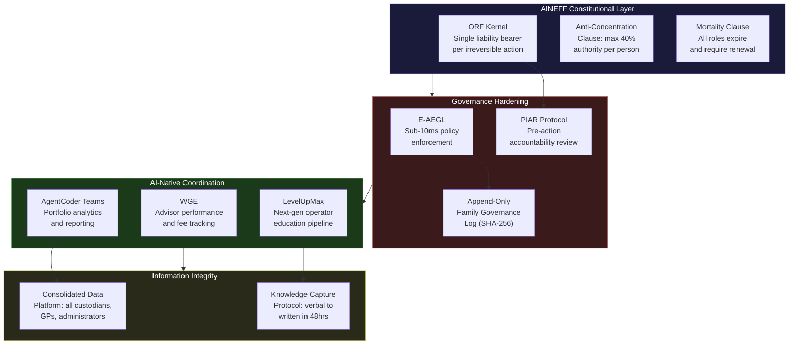
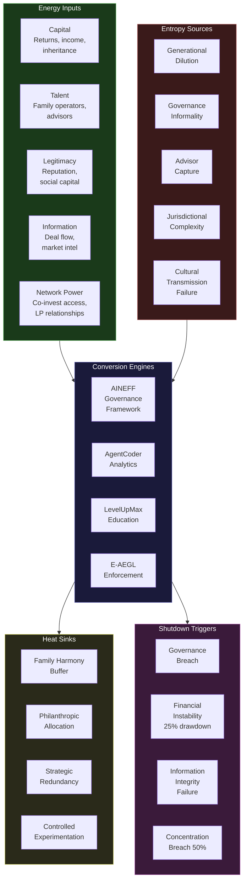

---

sidebar_position: 8
title: "Family Offices"
description: "Sovereign deployment architecture for multi-generational family offices — modeling wealth decay as entropy, binding governance to dynastic survival, and deploying AINEFF as constitutional infrastructure against the shirtsleeves-to-shirtsleeves cycle."
tags: [sovereign, family-offices, wealth, entropy]
custom_status: active
custom_owner: Andrew Leo
custom_last_review: 2026-03-01
custom_next_review: 2026-06-01

---

# Family Offices — Sovereign Deployment Architecture

Family offices manage an estimated $6-7 trillion globally, yet 70% of generational wealth transfers fail by the second generation and 90% by the third. This is not a failure of investment strategy. It is an entropy problem: governance structures decay, family alignment fragments, key-person dependencies create single points of failure, and the complexity of multi-jurisdictional trust structures exceeds the cognitive capacity of any individual to oversee.

AINEFF treats the family office not as a financial entity but as a **thermodynamic system** — one that must metabolize entropy across generations or face inevitable dissolution.

---

## 1. Entropy Vector Map

| Vector | Manifestation | Concrete Example | Severity |
|---|---|---|---|
| **Strategy** | Investment thesis drift across generations. Founder's concentrated conviction replaced by committee-driven diversification that dilutes returns below inflation-adjusted benchmarks. | G2 replaces founder's 80/20 private equity allocation with a 40-fund diversified portfolio returning 4% net of fees — below the 5.5% needed to sustain family spending. | Critical |
| **Operations** | Shadow IT and fragmented reporting. Portfolio data scattered across custodians, GPs, administrators, and spreadsheets with no single source of truth. | Family discovers $12M in unreported capital calls across three PE funds because the tracking spreadsheet was maintained by a departed analyst. | High |
| **Incentives** | Misalignment between family members who work in the office, those who receive distributions, and external advisors compensated on AUM. | Investment advisor recommends liquid strategies (higher AUM fees) over direct investments (lower AUM, higher returns). Family members employed by the office vote for conservative strategies that protect their salaries. | Critical |
| **Information** | Asymmetric knowledge between the patriarch/matriarch and other family members. Critical decisions made on private information never formalized. | Patriarch dies holding verbal side agreements with three co-investors. Family discovers $8M in contingent liabilities during probate. | Critical |
| **Culture** | Entitlement drift — later generations view wealth as identity rather than responsibility. Spending norms inflate faster than portfolio returns. | G3 family member's annual draw increases 15% year-over-year while portfolio grows 7%. Breakeven crossed within 8 years. | High |
| **Capital** | Concentration risk in illiquid assets combined with liquidity demands from expanding family. Forced sales at distressed valuations to fund distributions. | Family forced to sell commercial real estate portfolio at 30% discount to meet divorce settlement and three simultaneous distribution requests. | High |
| **Governance** | No formal decision rights. Decisions made through informal consensus that fragments as family grows. No mechanism for resolving disputes short of litigation. | Siblings deadlocked on whether to sell the family business. No governance document addresses the scenario. Litigation costs $4M over 3 years and destroys the relationship. | Critical |

---

## 2. Early Entropy Signals

:::warning[Leading Indicators of Dynastic Wealth Decay]
These signals predict systemic failure 3-7 years before visible crisis. Each is measurable through existing data if the family office instruments its operations correctly.
:::

1. **Distribution-to-return ratio exceeding 0.7** — Family draws are consuming more than 70% of net portfolio returns, leaving insufficient capital for compounding. Track quarterly.
2. **Key-person information concentration index** — More than 60% of material relationship and deal knowledge resides with a single individual. Measure by auditing who holds counterparty contact authority and deal documentation.
3. **Governance meeting attendance decay** — Family council or board meeting attendance drops below 60% of eligible members for two consecutive quarters. This precedes formal governance breakdown by 18-36 months.
4. **Advisor tenure without competitive review** — Any advisor (investment, legal, tax, trustee) serving more than 7 years without a formal competitive review. Indicates relationship capture.
5. **Unreported asset discovery rate** — If annual audits consistently discover previously unreported positions, commitments, or liabilities, the information architecture is failing. Threshold: more than 2% of NAV discovered as unreported per audit cycle.
6. **Next-generation engagement score** — Percentage of G2/G3 family members who can articulate the family's investment thesis and governance structure. Below 40% indicates cultural transmission failure.
7. **Jurisdictional complexity growth rate** — Number of legal entities, trust structures, and jurisdictions growing faster than 10% annually without proportional governance capacity growth.

---

## 3. 3-5 Year Decay Model

:::danger[Quantified Decay Trajectory Without Intervention]
These projections are based on observed failure rates across multi-generational wealth transfers and compounding entropy effects.
:::

### Financial Cost of Entropy

- **Fee leakage from uncoordinated advisor relationships:** 0.3-0.8% of AUM annually. On a $500M family office, this is $1.5M-$4M per year in redundant, uncoordinated advisory fees.
- **Opportunity cost of decision latency:** Families without clear governance take 6-18 months longer to execute on investment decisions. In private markets, this translates to 200-400 bps of missed returns per vintage year.
- **Litigation and dispute resolution:** Families entering governance disputes spend 1-3% of total family wealth on legal resolution. For a $500M family, this is $5M-$15M that is purely destructive.
- **Forced liquidation discounts:** Illiquid assets sold under time pressure to fund distributions or settlements trade at 20-40% discounts to fair value.

### Institutional Trust Erosion

- Intra-family trust decays at approximately 8-12% per year once governance disputes begin. Recovery requires 3-5x the time the erosion took.
- External counterparty trust (co-investors, deal sources, bankers) collapses within 6 months of visible family conflict. Deal flow drops 40-60%.

### Competitive Vulnerability

- Family offices without AI-augmented operations will lose co-investment access as institutional LPs demand real-time reporting and governance transparency that manual processes cannot provide.
- By 2028, top-quartile PE and VC managers will require digital governance compliance from co-investment partners. Non-compliant family offices will be excluded from the best deal flow.

### Succession Fragility

- Probability of successful leadership transition without formal governance: 25-30%.
- Average cost of failed leadership transition: 15-25% of total family wealth through combination of poor decisions, advisor churn, and family litigation.

---

## 4. AINEFF Deployment Architecture

### Structural Constraints Imposed by AINEFF

- **ORF kernel enforcement:** Every irreversible financial decision (capital commitment, distribution approval, trust modification, asset sale) requires a single identifiable human liability bearer bound at execution time. No committee can authorize irreversible action — a named individual must sign.
- **Anti-concentration clause:** No single family member, advisor, or trustee may accumulate decision authority over more than 40% of total family capital without triggering a mandatory governance review.
- **Mortality clause:** Every governance role, advisory mandate, and trust structure has a defined expiry and renewal requirement. No appointment is permanent.

### Governance Hardening Mechanisms

- **E-AEGL policy enforcement** applied to all financial transactions: sub-10ms validation of authorization rules before any capital movement executes. SHA-256 hash-chained audit trails for every decision.
- **Append-only family governance log:** Every decision, vote, authorization, and delegation recorded in a tamper-evident log. No entries can be modified or deleted. This becomes the family's institutional memory.
- **Mandatory PIAR (Pre-Incident Accountability Review)** before any irreversible action exceeding 2% of NAV.

### AI-Native Coordination Layers

- **AgentCoder teams** deployed for portfolio analytics, consolidated reporting, and scenario modeling. Autonomous AI teams generate quarterly family dashboard with quality gates — Jarvis orchestrates, Coder builds, Reviewer validates, Tester stress-tests.
- **WGE (Workforce Governance Engine)** manages advisor performance tracking, fee benchmarking, and competitive review scheduling.
- **LevelUpMax pipeline** for next-generation education: structured 6-stage program converting family heirs from passive beneficiaries to qualified governance operators.

### Incentive Alignment Redesign

- Advisory compensation restructured: base fee capped at 50th percentile, with performance component tied to family-defined metrics (not AUM growth).
- Family member roles compensated at market rate with mandatory external benchmarking every 3 years.
- Distribution policy encoded as constitutional rule: maximum draw rate linked to 5-year rolling portfolio return with automatic reduction triggers.

### Information Integrity Systems

- Single consolidated data architecture across all custodians, administrators, and GPs.
- Real-time position aggregation with automated reconciliation against custodian statements.
- Knowledge capture protocol: every material conversation, deal term, and verbal agreement transcribed and stored in the append-only governance log within 48 hours.

---

## 5. Accountability Design

### Single-Point Accountability Roles

| Role | Accountability | Authority Ceiling |
|---|---|---|
| **Family Governance Chair** | Constitutional compliance of all family decisions. Liable for governance log completeness. | Cannot authorize investments. Cannot set distribution policy. Governance process only. |
| **Chief Investment Officer** | Investment performance against family-defined benchmarks. Liable for portfolio construction decisions. | Cannot modify governance rules. Cannot approve distributions above policy limits. |
| **Distribution Controller** | Compliance of all distributions with constitutional distribution policy. | Cannot modify the distribution policy. Can only execute within defined parameters. |
| **Trust Compliance Officer** | Legal and regulatory compliance across all jurisdictions and trust structures. | Cannot make investment decisions. Cannot authorize distributions. Compliance verification only. |
| **Next-Generation Steward** | Education and readiness assessment of G2/G3 family members. Liable for LevelUpMax pipeline outcomes. | Cannot grant governance authority. Can only certify readiness for governance roles. |

### Decision Rights Clarity

- **Investments \< 2% NAV:** CIO authority, logged in governance record.
- **Investments 2-5% NAV:** CIO recommends, Family Governance Chair ratifies, PIAR required.
- **Investments \> 5% NAV:** CIO recommends, Chair ratifies, full family council vote (supermajority 67%), PIAR required, independent advisor validation.
- **Distribution changes:** Require constitutional amendment process — not ad hoc approval.
- **Advisor termination/appointment:** Chair authority with mandatory competitive review documentation.

### Escalation Protocols

1. **Operational disagreement** — CIO and Chair resolve within 14 days, documented.
2. **Governance dispute** — Independent family advisor mediates within 30 days.
3. **Constitutional challenge** — External governance review board (defined in family constitution) adjudicates within 60 days.
4. **Deadlock** — Pre-defined tie-breaking mechanism (not litigation). Options: rotating casting vote, external arbitrator, or mandatory buyout trigger.

### Ratification Layers

- **Tier 1 (Routine):** Single authorized role executes, E-AEGL validates, logged.
- **Tier 2 (Material):** Authorized role + Chair ratification + PIAR. Minimum 72-hour cooling period.
- **Tier 3 (Irreversible/Structural):** Full council + independent validation + PIAR + 30-day cooling period.

---

## 6. Entropy-Reduction Metrics

| Metric | Current State (Typical) | AINEFF Target | Measurement Method |
|---|---|---|---|
| **Capital efficiency** (net return after all fees, taxes, distributions) | 2.5-4.0% real | 5.5-7.0% real | Annual audited return net of all costs, inflation-adjusted |
| **Decision latency** (time from opportunity identification to capital deployment) | 4-18 months | 2-6 weeks | Timestamp from deal intake to capital wire |
| **Complexity-to-value ratio** (number of legal entities per $100M NAV) | 8-15 entities | 3-5 entities | Annual entity census vs. NAV |
| **Information distortion reduction** (unreported asset discovery rate) | 2-5% of NAV per audit | \< 0.1% of NAV per audit | Variance between pre-audit and post-audit NAV |
| **Incentive coherence** (advisor compensation alignment with family objectives) | 30-40% aligned | \> 85% aligned | Annual compensation audit against family-defined outcome metrics |
| **Governance participation rate** | 45-60% | \> 85% | Meeting attendance + decision participation tracking |
| **Next-gen readiness index** | 15-25% of G2/G3 governance-qualified | \> 60% governance-qualified | LevelUpMax stage completion tracking |
| **Key-person dependency** | 60-80% information concentration | \< 25% concentration | Knowledge audit: who holds what information exclusively |

---

## 7. Thermodynamic System Model

### Energy Inputs

- **Capital:** Investment returns, business income, inheritance inflows, trust distributions
- **Talent:** Family members with operational capability, external advisors, investment professionals
- **Legitimacy:** Family reputation, social capital, philanthropic standing, community relationships
- **Information:** Deal flow, market intelligence, advisor networks, counterparty relationships
- **Network power:** Co-investment relationships, LP access, board positions, philanthropic networks

### Entropy Sources

- **Generational dilution:** Each generation multiplies the number of stakeholders while capital grows linearly at best
- **Governance informality:** Decisions made through implicit authority that does not scale beyond the founder
- **Advisor capture:** Long-tenured advisors optimize for relationship preservation over performance
- **Jurisdictional complexity:** Trust structures span multiple legal regimes with conflicting requirements
- **Cultural transmission failure:** Values, work ethic, and financial discipline not systematically transferred
- **Cognitive overload:** Family patriarch/matriarch cannot hold the full complexity of the family's affairs

### Conversion Engines

- **AINEFF governance framework:** Converts informal family norms into constitutional rules with enforcement
- **AgentCoder analytics:** Converts fragmented portfolio data into consolidated decision-grade intelligence
- **LevelUpMax education:** Converts passive beneficiaries into qualified governance operators
- **E-AEGL enforcement:** Converts governance rules into automatically enforced constraints
- **ORF protocol:** Converts complex multi-jurisdictional obligations into auditable settlement flows

### Heat Sinks (Acceptable Inefficiency Zones)

- **Family harmony buffer:** Some economically suboptimal decisions are acceptable if they preserve family cohesion (e.g., employing a family member at above-market compensation if it keeps them engaged in governance)
- **Philanthropic allocation:** 3-8% of annual returns directed to family philanthropy as a values transmission mechanism and social capital maintenance
- **Strategic redundancy:** Maintaining backup advisors and secondary banking relationships even when primary relationships are performing well
- **Controlled experimentation:** Allocating 2-5% of portfolio to next-generation-led investments as a learning mechanism, with expected loss rates

### Shutdown Triggers

- **Governance breach:** Any family member or advisor executing an irreversible action without proper authorization triggers immediate freeze and investigation
- **Financial instability:** Portfolio drawdown exceeding 25% from peak without a pre-approved plan triggers mandatory external review
- **Information integrity failure:** Discovery of undisclosed material positions or liabilities triggers full audit and potential advisor termination
- **Concentration breach:** Any individual accumulating authority over \> 50% of family capital triggers mandatory restructuring
- **Decision latency breach:** Material decisions pending \> 6 months without resolution triggers escalation to external governance review

---

## 8. Adversarial Red-Team Critique

:::danger[How AINEFF Could Fail for Family Offices]
The following attack vectors represent ways the framework itself could be defeated, captured, or rendered irrelevant in a family office context.
:::

### Attack Vector 1: Patriarch/Matriarch Override

**Threat:** The founder views AINEFF governance as advisory rather than constitutional. They comply when convenient and override when it conflicts with their instinct. Since the founder often controls the capital that funds the governance infrastructure, they can defund enforcement.

**Mitigation gap:** AINEFF has no mechanism to prevent the person who funds the system from shutting it down. Constitutional governance requires the governed to consent to being governed — and founders may withdraw consent precisely when governance matters most (during crises).

### Attack Vector 2: Complexity Theater

**Threat:** The family office adopts AINEFF terminology and structures but implements them as checkbox compliance rather than operational governance. Governance logs are maintained but never reviewed. PIAR is conducted but approves everything. The system produces the appearance of governance without the substance.

**Mitigation gap:** AINEFF's audit mechanisms can verify that processes were followed but cannot easily verify that they were followed with genuine deliberation rather than rubber-stamping.

### Attack Vector 3: Advisor Ecosystem Resistance

**Threat:** Existing advisors (lawyers, wealth managers, trustees, tax advisors) perceive AINEFF as a threat to their relationship-based business model. They actively discourage adoption, introduce FUD (fear, uncertainty, doubt), and leverage their trusted advisor status to undermine implementation.

**Mitigation gap:** AINEFF does not account for the political economy of advisory relationships. Advisors who have invested decades in building trusted relationships will fight to preserve them, and families often trust their advisors more than any framework.

### Attack Vector 4: Next-Generation Rejection

**Threat:** G2/G3 family members view AINEFF governance as paternalistic control by the previous generation. They reject the framework not on its merits but as an act of generational autonomy. The more the framework constrains them, the more they resist it.

**Mitigation gap:** AINEFF's governance structures are designed for institutional contexts where participants are professionals. Family dynamics introduce emotional and identity dimensions that institutional governance frameworks do not address.

### Attack Vector 5: Jurisdictional Arbitrage Against the Framework

**Threat:** A family member or advisor moves assets to a jurisdiction where AINEFF governance constraints are unenforceable. Since family offices operate across multiple legal regimes, there is always a jurisdiction with weaker governance enforcement.

**Mitigation gap:** AINEFF governance depends on the legal enforceability of its constraints. In jurisdictions with weak trust law, opaque beneficial ownership rules, or limited fiduciary standards, the framework may be legally unenforceable.

### Attack Vector 6: Governance Fatigue

**Threat:** The administrative burden of AINEFF compliance (logging, PIAR reviews, accountability binding, audit trails) exceeds the family's tolerance. Family members stop participating not because they disagree with governance but because they find it exhausting. Governance attrition is the most common failure mode.

**Mitigation gap:** AINEFF was designed for organizations with professional staff. Family offices may lack the operational capacity to sustain the framework's administrative requirements without external support — which reintroduces advisor dependency.

---

## Related Documents

- [AINEFF Constitutional Law Layer](/docs/entities/aineff) — The constitutional framework that constrains all AINEFF deployments
- [ORF Protocol](/docs/entities/orf-protocol) — The obligation settlement protocol used for cross-jurisdictional family office operations
- [AINEG Federation Layer](/docs/entities/aineg) — The coordination layer for multi-entity family structures
