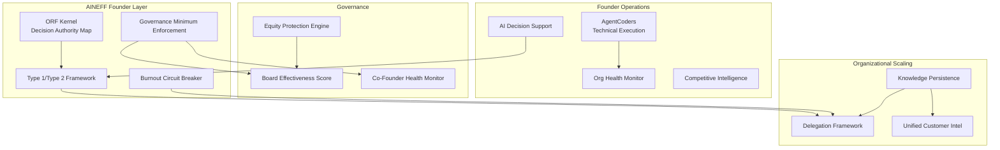
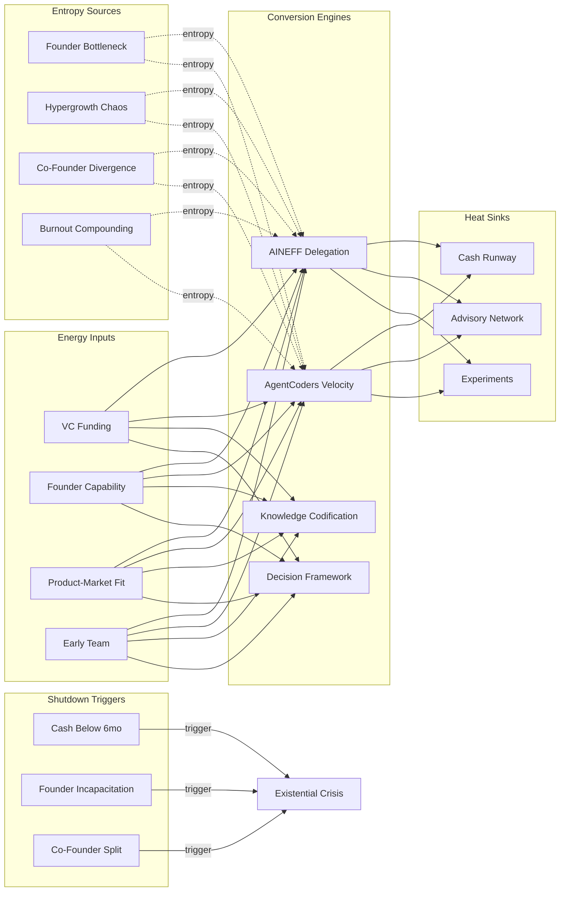

# High-Power Founders & Operators

The founder is the single point of failure. What works at 10 people breaks at 100. Decision fatigue averages 35,000 decisions per day. Burnout rate among startup founders is 72%. Equity dilution creates a trajectory where the person who built the company owns 5-15% of it by Series C. AINEFF treats founder-led organizations as high-energy, low-governance systems where the primary entropy vector is the widening gap between the founder's cognitive bandwidth and the organization's coordination demands.

:::danger Structural Reality
The average VC-backed startup CEO is replaced by a "professional manager" within 3 years of Series B. This is not because founders are bad operators — it is because the governance structures around them fail to scale. The founder is blamed for the system's failure. AINEFF aims to make the system scale with the founder, not replace the founder when the system fails.
:::

---

## 1. Entropy Vector Map

| Vector | Manifestation | Severity |
|--------|--------------|----------|
| **Strategy** | Founder vision clear but not codified. Strategy communicated through charisma, not documentation. Every new hire receives a different version of the company direction. Pivot decisions made on founder intuition with insufficient data — sometimes brilliant, sometimes catastrophic. | **High** |
| **Operations** | Founder as bottleneck for all decisions above trivial threshold. Operational processes created ad hoc, never reviewed. Hypergrowth (doubling headcount every 6-12 months) creating coordination chaos. Systems duct-taped together that "work for now" but cannot scale. | **Critical** |
| **Incentives** | Equity dilution trajectory misaligning founder economic interest with long-term company value. Employee equity grants creating entitlement without understanding. Early employees with outsized equity becoming blockers to organizational evolution. Board dynamics creating principal-agent conflicts. | **High** |
| **Information** | Founder holds 80%+ of critical context in their head. Key decisions made in Slack DMs, not in systems of record. Customer intelligence fragmented across sales, support, and product without synthesis. Competitive intelligence based on founder's personal network, not systematic gathering. | **Critical** |
| **Culture** | Founder personality as company culture — unsustainable past 50 employees. "Move fast" culture preventing governance maturation. Hiring for cultural fit creating homogeneity that reduces adaptive capacity. Burnout normalized as commitment. | **High** |
| **Capital** | Fundraising cycles consuming 3-6 months of founder attention per round. Burn rate optimization creating existential pressure that distorts decision-making. Cash runway anxiety preventing long-term investment. Venture debt adding complexity without governance. | **High** |
| **Governance** | Board composition determined by fundraising, not governance needs. Board meetings as reporting theater, not governance events. Co-founder conflicts unresolved until they become existential. No formal decision-making framework beyond "the founder decides." | **Critical** |

---

## 2. Early Entropy Signals

1. **Founder decision queue depth** exceeding 48 hours — organizational dependency on founder creating operational backlog
2. **Employee NPS** declining 5+ points quarter-over-quarter — cultural entropy accelerating during scaling
3. **Key hire attrition** within first 6 months exceeding 25% — hiring process or onboarding failing to integrate talent
4. **Customer churn increasing** while sales growing — growth masking product/service deterioration
5. **Engineering velocity** (story points or deploys per week) declining during headcount growth — coordination overhead exceeding contribution
6. **Co-founder communication frequency** declining — relationship entropy that will eventually surface as crisis
7. **Fundraising cycle length** increasing round-over-round — market signaling confidence erosion

---

## 3. 3-5 Year Decay Model

| Dimension | Projection |
|-----------|-----------|
| **Financial cost of entropy** | \$5-50M per company annually in mis-hires (avg cost of wrong executive hire: \$1-5M), duplicated systems, rework from unclear direction, and missed market timing from decision bottlenecks. Failed scaling attempts cost \$10-100M in burned capital and 12-24 months of lost momentum. |
| **Institutional trust erosion** | Investor confidence declines 20-30% per missed milestone. Employee trust erodes 5-10% per organizational whiplash (reorg, pivot, executive departure). Customer trust built over years can be destroyed in weeks if scaling degrades service quality. |
| **Competitive vulnerability** | Scaling-stage companies that lose 12-18 months to organizational entropy are overtaken by fast followers with cleaner operational structures. Market window compression means that governance-driven delays are not recoverable — the opportunity moves on. |
| **Founder fragility** | 72% founder burnout rate. Each burnout episode costs 3-6 months of diminished capacity. Founder health is company health at this stage — no governance structure survives founder incapacitation. Board-imposed CEO replacement destroys 40-60% of organizational knowledge and culture. |

---

## 4. AINEFF Deployment Architecture

### Structural Constraints

- **ORF Kernel**: Decision authority explicitly mapped — founder retains authority over product vision, fundraising, and key hires; delegates operational decisions with named accountability to functional leaders. No ambiguous "the founder decides everything" default
- **Decision Framework**: Decisions categorized into Type 1 (irreversible, founder-only) and Type 2 (reversible, delegated). Type 2 decisions proceeding without founder input after 24-hour window
- **Governance Minimum**: Monthly board governance sessions (not just updates) with documented decisions. Co-founder agreements reviewed and updated annually
- **Burnout Circuit Breaker**: AINEFF monitoring founder decision load, calendar density, and response latency. When metrics exceed sustainable thresholds, automatic delegation triggers activate

### Governance Hardening

- Board effectiveness scored on governance actions, not meeting attendance
- Investor board members' conflicting interests documented and managed
- Co-founder relationship health formally monitored with structured mediation triggers
- Key executive relationships with investors governed to prevent board end-runs

### AI-Native Coordination

- AgentCoders squads handling technical execution — reducing founder's engineering management burden
- AI-powered decision support synthesizing data for Type 1 decisions
- Automated organizational health monitoring (engagement, velocity, attrition patterns)
- Real-time competitive intelligence replacing founder's ad hoc network-based gathering

### Incentive Alignment

- Founder equity protection mechanisms: anti-dilution governance, voting rights preservation, acceleration clauses tied to performance
- Executive compensation tied to organizational health metrics, not just revenue targets
- Employee equity education ensuring team understands and values their stake

### Information Integrity

- Strategic context documented in AINEFF knowledge layer — not trapped in founder's head
- All key decisions logged with rationale and expected outcomes — creating institutional memory
- Customer intelligence unified across sales, support, and product

---

## 5. Accountability Design

| Role | Accountability |
|------|---------------|
| **Founder/CEO** | Accountable for Type 1 decisions (irreversible, strategic). AINEFF makes explicit what the founder is and is not responsible for — ending the implicit "everything" default. |
| **Chief of Staff** | Accountable for decision flow management, information synthesis, and founder bandwidth protection. When the founder is drowning in Type 2 decisions, this role has failed. |
| **Functional Leaders** | Named accountability for their domain with explicit decision authority. Cannot escalate Type 2 decisions to founder without documented justification. |
| **Board Governance Lead** | Independent board member accountable for governance process quality. |

**Decision Rights:**
- Type 2 (reversible): Functional leader (auto-approved after 24-hour founder window)
- Type 1 (irreversible, under \$5M): Founder + one board member
- Type 1 (irreversible, above \$5M): Full board ratification
- Emergency (existential threat): Founder unilateral with mandatory 48-hour board review

---

## 6. Entropy-Reduction Metrics

| KPI | Current Baseline | Target (Year 1) | Target (Year 3) |
|-----|-----------------|-----------------|-----------------|
| **Decision Latency** | 48-72 hour founder bottleneck for Type 2 | 24 hours | 4 hours (fully delegated) |
| **Founder Decision Load** | 200+ decisions per week | 50 Type 1 decisions | 20 Type 1 decisions |
| **Knowledge Capture** | 20% of key context documented | 60% | 90% |
| **Engineering Velocity/Capita** | Declining during growth | Flat (scales with headcount) | Increasing |
| **Key Hire Retention at 12 Months** | 60-70% | 80% | 90% |
| **Founder Burnout Risk Score** | Unmeasured | Below 70% threshold | Below 50% |

---

## 7. Thermodynamic System Model

### Energy Inputs
- **Capital**: Venture funding (\$1-500M+ per round), revenue (growing but typically pre-profitable)
- **Talent**: Founder capability, early team loyalty, new hire expertise, advisor networks
- **Legitimacy**: Product-market fit signal, customer traction, investor endorsement
- **Information**: Customer feedback, market signal, technical knowledge, competitive intelligence
- **Political Trust**: Investor confidence, employee belief in mission
- **Network Power**: Founder's personal network, VC network access, customer references

### Entropy Sources
- **Founder Bottleneck**: All decisions routing through one person creates exponentially growing queue
- **Hypergrowth Chaos**: Doubling headcount every 6-12 months faster than culture can absorb
- **Co-founder Divergence**: Founding team alignment degrading under scaling pressure
- **Technical Debt Sprint**: Building for speed, deferring architecture
- **Board Complexity**: Each funding round adds a board member with different interests
- **Burnout Compounding**: 80-100 hour weeks degrading decision quality 10-15% per quarter

### Conversion Engines
- **AINEFF Delegation**: Converting founder-dependent decisions into distributed accountability
- **AgentCoders Velocity**: AI development teams maintaining engineering velocity during scaling
- **Knowledge Codification**: Converting founder's tacit knowledge into institutional systems
- **Decision Framework**: Converting ad hoc decisions into structured Type 1/Type 2 process

### Heat Sinks
- **Cash Runway**: Financial buffer allowing course correction (12-18 months minimum)
- **Advisory Network**: External advisors absorbing founder uncertainty
- **Controlled Experimentation**: A/B testing reducing the cost of being wrong
- **Team Redundancy**: Key functions staffed at N+1 to survive departures

### Shutdown Triggers
- **Cash Below 6 Months**: Runway crisis triggering desperate fundraising that destroys governance
- **Founder Incapacitation**: Health crisis or burnout collapse without succession plan
- **Co-Founder Split**: Irreconcilable conflict triggering organizational paralysis
- **Key Customer Loss**: Losing the anchor customer that validates product-market fit
- **Board Deadlock**: Board unable to agree on strategic direction

---

## 8. Adversarial Red-Team Critique

**How AINEFF fails for founders and operators:**

1. **Founder Identity Resistance**: Building a company is deeply personal. AINEFF's decision framework and burnout monitoring may be perceived as replacing the founder's judgment with a system's judgment. Founders who define themselves by their ability to "do everything" will reject governance as weakness.

2. **Speed vs Governance Tradeoff**: Early-stage companies survive on speed. AINEFF's governance structures add friction that may slow the very decision-making that creates competitive advantage. The framework must prove governance creates speed, not reduces it.

3. **Investor Misalignment**: VCs may not want AINEFF's governance transparency. Board effectiveness scoring exposes when investors fail to provide value-add. Investors may pressure founders to reject AINEFF.

4. **Stage Inappropriateness**: Pre-PMF companies need maximum experimentation with minimum governance. AINEFF must have a "light mode" that scales governance with organizational maturity.

5. **Co-Founder Mediation Limits**: AINEFF can monitor co-founder health but cannot resolve fundamental disagreements. If co-founders disagree on whether to adopt AINEFF, the framework has failed its first test.

:::danger Critical Question
Can AINEFF make founders more effective without making them feel less autonomous? If the governance infrastructure feels like adult supervision, founders will reject it. If it feels like a superpower, they will adopt it. The framing determines the outcome.
:::
