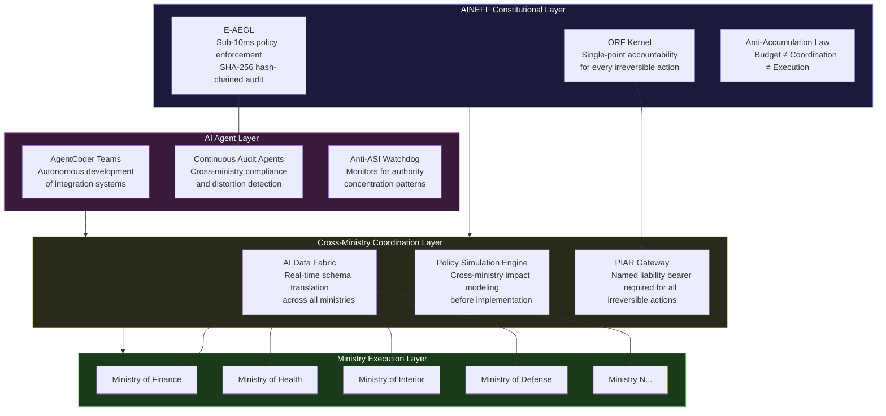
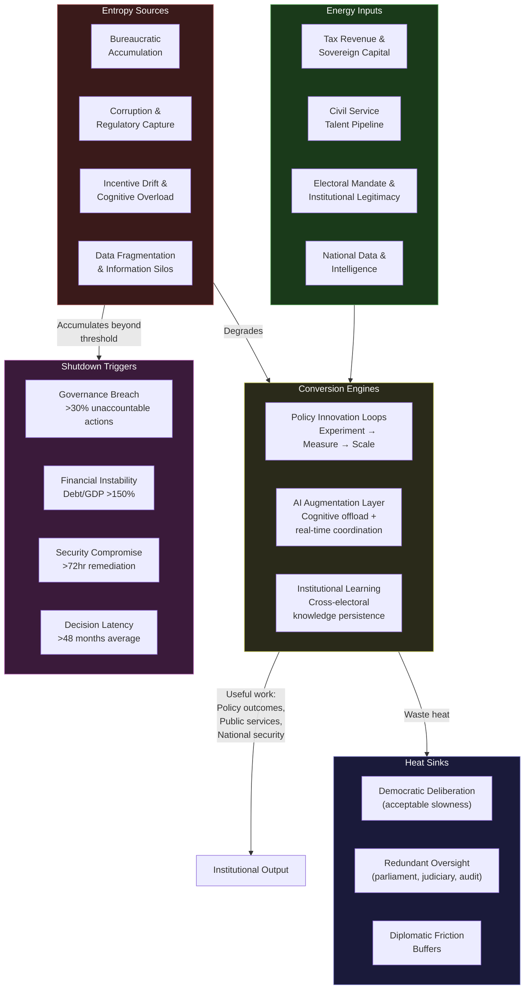

---

sidebar_position: 3
title: "Governments & Ministries"
description: "AINEFF sovereign deployment architecture for national governments and ministries — addressing multi-ministry coordination failure, electoral cycle disruption, bureaucratic entropy, regulatory capture, inter-agency information silos, and political appointment instability."
tags: [sovereign, governance, government, entropy]
custom_status: active
custom_owner: Andrew Leo
custom_last_review: 2026-03-01
custom_next_review: 2026-06-01

---

# Governments & Ministries — Sovereign Deployment Architecture

National governments are the largest coordination machines ever built. They are also among the most entropy-prone. A government with 20+ ministries, hundreds of agencies, millions of civil servants, and electoral cycles that reset leadership every 4-6 years is a system structurally designed to accumulate disorder faster than it can correct it.

AINEFF treats a national government as a **thermodynamic system**: energy enters as capital, talent, legitimacy, and political mandate. Entropy enters as bureaucratic friction, regulatory capture, inter-agency fragmentation, and electoral discontinuity. The question is not whether entropy accumulates — it always does. The question is whether the system's conversion engines can outpace entropy growth.

---

## 1. Entropy Vector Map

| Vector | Manifestation | Concrete Example | Severity |
|---|---|---|---|
| **Strategy** | Electoral cycles reset strategic direction every 4-6 years. Long-term infrastructure, defense, and industrial policy cannot execute within a single mandate. | A national AI strategy launched in year 1 of a government is defunded or redirected by year 5 under a new administration. | Critical |
| **Operations** | Ministries operate as independent fiefdoms with incompatible IT systems, procurement processes, and reporting standards. | The health ministry cannot share patient data with the social services ministry due to incompatible data schemas and conflicting privacy interpretations. | Critical |
| **Incentives** | Civil servants are incentivized for compliance, not outcomes. Political appointees are incentivized for visibility, not institutional improvement. | A deputy minister launches a high-visibility "digital transformation" program that produces press releases but no interoperable systems. | High |
| **Information** | Inter-agency information silos create parallel realities. Each ministry maintains its own version of truth about the same citizens, businesses, and assets. | The tax authority, business registry, and customs agency maintain three separate databases for the same corporate entities, with a 15-30% mismatch rate. | Critical |
| **Culture** | Risk aversion is institutionalized. The cost of a failed initiative is career-ending; the cost of inaction is invisible. | A procurement officer selects a legacy vendor at 3x the cost of an innovative alternative because "nobody gets fired for choosing IBM." | High |
| **Capital** | Budget allocation follows historical precedent, not strategic priority. Once a ministry receives a budget line, it persists regardless of output. | A ministry that has not produced measurable policy outcomes in 8 years continues to receive $2B annually because its budget line is politically protected. | High |
| **Governance** | Accountability is diffused across so many layers that no single person is liable for any specific outcome. Committees decide; nobody is responsible. | A national cybersecurity breach affects 40 million citizens. The post-mortem identifies 14 agencies with "shared responsibility." Nobody is held accountable. | Critical |

---

## 2. Early Entropy Signals

These are leading indicators that predict systemic governance decay **before** visible institutional failure:

1. **Decision latency drift**: Average time from policy proposal to implementation exceeds 18 months and is increasing quarter-over-quarter. Measured by tracking policy pipeline timestamps.

2. **Inter-ministry request backlog growth**: The queue of cross-ministry data requests, coordination approvals, and joint-action items grows faster than 10% per quarter.

3. **Duplicate system proliferation**: More than 3 agencies maintain independent systems for the same functional domain (identity, payments, case management). Each new procurement adds another.

4. **Political appointee churn rate**: Average tenure of deputy ministers and agency heads drops below 18 months. Institutional memory is lost faster than it is created.

5. **Audit finding recurrence**: The same audit findings appear in successive annual reports without remediation. Recurrence rate above 40% indicates systemic inability to self-correct.

6. **Budget-to-outcome ratio degradation**: Per-citizen cost of government services increases while satisfaction scores and outcome metrics stagnate or decline. A ratio shift of \>15% over 3 years signals structural waste accumulation.

7. **Regulatory output vs. enforcement ratio**: The number of new regulations enacted per year increases while enforcement actions per regulation decrease. This signals regulatory theatre — governance for appearance, not effect.

---

## 3. 3-5 Year Decay Model

:::danger[Projected Decay Without Structural Intervention]
These projections are based on entropy accumulation rates observed in OECD governments. They represent the baseline trajectory absent deliberate entropy-reduction architecture.
:::

### Financial Cost of Entropy

- **Duplicate IT systems**: $500M-$5B annually in redundant infrastructure, depending on government size. A G7 nation typically operates 200-500 redundant systems across agencies.
- **Procurement inefficiency**: 15-30% cost premium from fragmented procurement that cannot aggregate demand across ministries.
- **Policy restart costs**: Each electoral transition wastes $1B-$10B in abandoned initiatives, renegotiated contracts, and strategic redirection overhead.
- **5-year cumulative waste**: $20B-$80B for a G7-scale government from coordination entropy alone.

### Institutional Trust Erosion

- Citizen trust in government declines 2-5 percentage points per year when service delivery fails to improve despite rising costs.
- After 5 years of visible dysfunction, trust recovery requires 10-15 years of sustained improvement — a timeline that exceeds multiple electoral cycles.

### Competitive Vulnerability

- Nations that cannot coordinate industrial policy across ministries lose 5-10 years to competitors with integrated governance architectures (e.g., Singapore, Estonia, UAE).
- AI-native nations will execute policy cycles in months while entropy-laden governments require years. The strategic gap compounds annually.

### Political Fragility

- Governance entropy feeds populist narratives. "The system is broken" becomes empirically verifiable. Electoral volatility increases. Institutional continuity erodes further.
- 3-5 year trajectory: 20-40% increase in anti-institutional voting patterns correlated with measurable service delivery degradation.

---

## 4. AINEFF Deployment Architecture

### Structural Constraints Imposed by AINEFF

- **ORF kernel enforcement**: No ministry may execute an irreversible action (policy implementation, large procurement, regulatory enforcement) unless a single, identifiable human liability bearer is bound to that action at execution time. This eliminates "committee decided" as an accountability shield.
- **Anti-accumulation law**: No single ministry or agency may accumulate coordination authority, budget control, and operational execution in the same unit. These functions are constitutionally separated.
- **Mortality clause**: Every government program has a defined lifecycle with explicit death conditions. Programs that fail to meet outcome thresholds within defined time windows are automatically escalated for termination review.

### Governance Hardening Mechanisms

- **E-AEGL deployment**: Sub-10ms policy enforcement layer across all inter-ministry transactions. Every data exchange, budget transfer, and coordination request is hash-chained into an append-only audit trail with SHA-256 integrity.
- **PIAR (Pre-Incident Accountability Review)**: Before any irreversible action, a named individual must be recorded as the liability bearer. This is not a sign-off — it is a binding commitment that persists through the audit trail regardless of subsequent role changes.
- **Governance firewall**: Budget authority and coordination authority are structurally separated. The entity that decides resource allocation cannot also control how those resources are operationally deployed.

### AI-Native Coordination Layers

- **AgentCoder deployment for e-government**: Autonomous AI development teams (Jarvis/Coder/Reviewer/Tester architecture) build and maintain inter-ministry integration layers. Quality gates prevent deployment of systems that fail interoperability standards.
- **Cross-ministry data fabric**: AI-mediated data exchange layer that translates between ministry-specific schemas in real-time, eliminating the need for centralized data warehouses that become political targets.
- **Policy simulation engine**: Before policy implementation, AI agents model the cross-ministry impact, identifying coordination failures, resource conflicts, and unintended consequences.

### Incentive Alignment Redesign

- **Outcome-bound compensation**: Senior civil servants and political appointees have compensation components tied to measurable institutional outcomes that persist beyond their tenure.
- **Anti-silo incentives**: Ministry budgets include a component that is allocated based on cross-ministry coordination metrics, not internal performance alone.
- **Whistleblower protection layer**: ORF-secured channels for reporting governance failures with tamper-evident evidence chains that cannot be suppressed by political pressure.

### Information Integrity Systems

- **Canonical data registry**: A single, AINEFF-governed registry that defines what constitutes the authoritative source for each class of government data (citizen identity, business registration, land ownership, etc.).
- **Distortion detection**: AI-native systems continuously compare ministry-level data against canonical sources, flagging divergence that indicates either error or manipulation.
- **Append-only policy record**: Every policy decision, its rationale, its predicted impact, and its actual outcomes are recorded in a tamper-evident log that survives electoral transitions.

### Deployment Architecture Diagram

---

## 5. Accountability Design

### Single-Point Accountability Roles

| Role | Accountability Scope | Cannot Also Hold |
|---|---|---|
| **Ministry Liability Officer** | Named individual accountable for every irreversible action within a ministry. Persists in audit trail regardless of job change. | Budget authority or procurement authority |
| **Cross-Ministry Coordination Governor** | Accountable for inter-ministry data integrity and coordination SLA compliance. | Operational authority within any single ministry |
| **Budget Integrity Officer** | Accountable for budget-to-outcome ratio within defined thresholds. | Policy-making authority or coordination authority |
| **Electoral Transition Steward** | Accountable for institutional continuity during government transitions. Cannot be replaced by incoming administration for 12 months. | Political appointment or party affiliation |

### Decision Rights Clarity

- **Irreversible decisions** (policy implementation, large procurement \>$10M, regulatory enforcement): Require named PIAR liability bearer + E-AEGL hash-chain recording.
- **Reversible decisions** (pilot programs, internal reorganization, budget reallocation \<$10M): Require ministry-level approval with audit trail but no PIAR escalation.
- **Cross-ministry decisions**: Require coordination governor sign-off plus liability bearers from each affected ministry. No "joint committee" decisions without named individuals.

### Escalation Protocols

1. **Level 1 — Automated**: E-AEGL detects policy violation or data integrity breach. Automated alert to relevant liability officers. 60-minute response window.
2. **Level 2 — Governance Review**: Unresolved Level 1 escalated to Cross-Ministry Coordination Governor. 24-hour resolution window.
3. **Level 3 — Constitutional**: Pattern of unresolved Level 2 escalations triggers AINEFF constitutional review. Potential ministry mortality clause activation.
4. **Level 4 — Sovereign**: Constitutional breach that affects national security or citizen rights. Direct escalation to head of government with full audit trail.

### Ratification Layers

- All irreversible actions require **pre-execution ratification** (not post-hoc approval).
- Ratification records are immutable once created — cannot be modified, backdated, or deleted.
- Each ratification layer adds accountability without adding decision latency (parallel verification, not sequential approval chains).

---

## 6. Entropy-Reduction Metrics

| KPI | Current Baseline (Typical G7) | 12-Month Target | 36-Month Target |
|---|---|---|---|
| **Capital efficiency** (outcome per $1B spent) | 40-55% of allocated budget produces measurable outcomes | 60-70% | 75-85% |
| **Decision latency** (policy proposal to implementation) | 18-36 months | 8-14 months | 3-6 months |
| **Complexity-to-value ratio** (inter-agency coordination cost per transaction) | $150-$400 per inter-agency transaction | $50-$100 | $10-$30 |
| **Information distortion** (cross-ministry data mismatch rate) | 15-30% entity mismatch across agencies | 5-10% | \<2% |
| **Incentive coherence** (% of senior officials with outcome-bound compensation) | \<5% | 30-40% | 70-80% |
| **Audit trail completeness** (% of irreversible actions with named liability bearer) | \<10% | 60-70% | 95-100% |
| **System redundancy** (duplicate systems per functional domain) | 3-8 systems per domain | 2-3 | 1 canonical + 1 backup |
| **Electoral transition cost** (waste from administration change) | $1B-$10B per transition | $500M-$2B | $100M-$500M |

---

## 7. Thermodynamic System Model

### Model Description

A national government as a thermodynamic system operates far from equilibrium. It must continuously import energy (capital, legitimacy, talent) to maintain institutional order against the relentless accumulation of bureaucratic entropy. When energy inputs decline or entropy sources accelerate, the system approaches critical instability.

**Energy Inputs:**
- **Capital**: Tax revenue, sovereign borrowing, international aid
- **Talent**: Civil service recruitment, political leadership quality, technical expertise
- **Legitimacy**: Electoral mandate, institutional trust, international standing
- **Information**: Census data, economic indicators, intelligence, citizen feedback
- **Political trust**: Inter-party cooperation capacity, public confidence in institutions
- **Network power**: Diplomatic relationships, trade agreements, alliance memberships

**Entropy Sources:**
- **Bureaucracy**: Process accumulation without process retirement. Every new regulation adds friction; none are removed.
- **Corruption**: Resource diversion from public purpose to private benefit. Ranges from petty bribery to systemic regulatory capture.
- **Incentive drift**: Civil servant incentives decouple from institutional mission over time. Compliance replaces competence as the optimization target.
- **Cognitive overload**: Decision-makers face information volumes that exceed human processing capacity. Quality of decisions degrades.
- **Regulatory capture**: Industries co-opt the agencies designed to regulate them. Regulation becomes protection for incumbents.
- **Fragmented data**: Each ministry maintains its own version of reality. Cross-ministry coordination requires manual reconciliation.

**Conversion Engines:**
- **Policy innovation loops**: Structured experimentation with new approaches, measured against outcome metrics, scaled if successful.
- **AI augmentation**: AI-native systems that reduce cognitive overload, automate compliance monitoring, and enable real-time cross-ministry coordination.
- **Institutional learning**: Systematic capture of lessons from policy successes and failures, persisted across electoral transitions.
- **Cross-entity coordination**: AINEFF-governed coordination protocols that reduce inter-ministry friction without centralizing authority.

**Heat Sinks (Acceptable Inefficiency Zones):**
- **Democratic deliberation**: The inherent slowness of democratic process is a feature, not a bug — it provides legitimacy. Budget: 10-15% of decision latency.
- **Redundant oversight**: Multiple oversight bodies (parliament, auditor general, judiciary) create redundancy that catches failures. Cost: 5-10% of governance budget.
- **Diplomatic friction buffers**: International coordination is inherently slower than domestic action. Buffer: 2-5x domestic decision latency for international matters.
- **Controlled experimentation**: Pilot programs that may fail are necessary for institutional learning. Budget: 3-5% of discretionary spending.

**Shutdown Triggers:**
- **Governance breach**: \>30% of irreversible actions lack a named liability bearer for \>90 consecutive days.
- **Financial instability**: Debt-to-GDP ratio exceeds 150% with \<2% GDP growth for 3 consecutive years.
- **Security compromise**: Critical infrastructure control systems compromised with \>72-hour remediation timeline.
- **Leadership corruption**: \>3 cabinet-level officials under criminal investigation simultaneously.
- **Decision latency breach**: Average policy implementation time exceeds 48 months for \>2 consecutive years.

### Thermodynamic Model Diagram

---

## 8. Adversarial Red-Team Critique

:::warning[Adversarial Assessment — How AINEFF Could Fail in Government Deployment]
The following attack vectors represent genuine failure modes. They are documented here because an architecture that cannot survive its own red-team critique is not deployment-grade.
:::

### Attack Vector 1: Political Resistance to Accountability

**The threat**: Politicians and senior officials resist AINEFF deployment precisely because it works. Named accountability for irreversible actions means blame can be traced. The entire political incentive structure rewards blame diffusion. AINEFF's value proposition — clear accountability — is also its primary adoption barrier.

**Failure mode**: Government adopts AINEFF architecture formally but hollows out the accountability mechanisms. PIAR becomes a checkbox exercise. Liability bearers are junior officials without actual decision authority. The audit trail exists but is never referenced.

**Mitigation**: AINEFF must be deployed with constitutional-grade legal authority, not administrative policy. Accountability mechanisms must be embedded in law, not regulation. The audit trail must be accessible to independent oversight bodies (parliament, judiciary, auditor general) without executive branch gatekeeping.

### Attack Vector 2: Electoral Cycle Disruption

**The threat**: A new government views AINEFF as the previous administration's project and defunds or redirects it. The 4-6 year electoral cycle is shorter than the 5-10 year deployment timeline for full entropy reduction.

**Failure mode**: AINEFF deployment reaches 40-60% completion. New government redirects funding. Partially deployed architecture creates more complexity (old + new systems) than the pre-AINEFF baseline.

**Mitigation**: AINEFF must deliver measurable value within a single electoral cycle (18-24 months from deployment). The "Burger" model applies — initial deployment must be a loss-leader that creates visible improvement fast enough to survive political transitions. Long-term governance hardening (the "Fries" and "Kitchen") layer in behind the visible improvements.

### Attack Vector 3: Regulatory Capture of AINEFF Itself

**The threat**: The vendors and consultancies that deploy AINEFF become a new form of regulatory capture. They control the infrastructure, the audit mechanisms, and the institutional knowledge. The government becomes dependent on a private entity for its own governance architecture.

**Failure mode**: AINEFF deployment creates a vendor lock-in that is worse than the entropy it was designed to address. The governance infrastructure is controlled by an entity whose incentives may diverge from the public interest.

**Mitigation**: AINEFF's optionality protection framework explicitly prohibits architectural decisions that create irreversible vendor dependency. All governance systems must be deployable by at least 2 independent vendors. The canonical audit trail must be readable without vendor-specific tools. The Anti-ASI clause applies to AINEFF's own deployment — no single vendor may accumulate sufficient control to constitute ungovernable infrastructure dependency.

### Attack Vector 4: Complexity Exceeding Comprehension

**The threat**: AINEFF is itself a complex system. Deploying a complex system to solve the problem of complex systems risks creating a meta-complexity layer that nobody fully understands. The governance architecture becomes a new information silo.

**Failure mode**: The government's own governance team cannot explain how AINEFF works. When failures occur, the architecture is too opaque for the oversight bodies to investigate. The system designed to prevent accountability failures becomes itself unaccountable.

**Mitigation**: AINEFF deploys with a mandatory comprehension test: every oversight body must be able to audit the architecture without AINEFF-specific expertise. The audit trail must be human-readable, not just machine-readable. Architecture documentation must be maintained at civilian-comprehensible level, not just technical specification level.

### Attack Vector 5: Data Sovereignty Violation

**The threat**: AINEFF's cross-ministry data fabric and AI agent layer process sensitive government data. If any component of the AINEFF stack is hosted, maintained, or accessible by foreign entities, the government has outsourced its sovereignty to a private actor operating under a different jurisdiction's laws.

**Failure mode**: Government deploys AINEFF using cloud infrastructure controlled by a foreign corporation. A foreign government issues a legal demand for access to the governance data. The government discovers its own accountability architecture is subject to another nation's surveillance laws.

**Mitigation**: Sovereign deployment requires sovereign infrastructure. All AINEFF components must run on government-controlled infrastructure within national borders. The ORF protocol must support air-gapped deployment for classified governance layers. No telemetry may leave the sovereign boundary without explicit, auditable authorization.

---

## Related Documents

This page is part of the Sovereign Deployment Architecture series:

- [Defense / Security / Intelligence](./defense) — Classification entropy and multi-domain warfare complexity
- [National Critical Infrastructure](./infrastructure) — Aging systems and cyber-physical convergence risk
- [International Institutions](./international-institutions) — Multi-sovereign coordination deadlock
- [Dynasties & Royal Houses](./dynasties) — Generational wealth decay and succession planning
