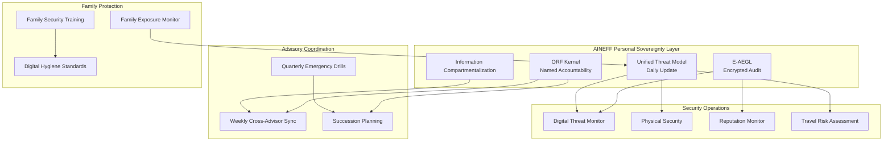
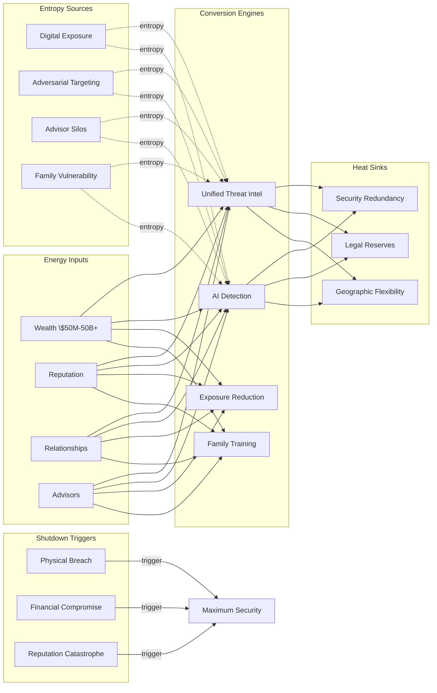

# High-Risk Individuals

One viral incident can destroy $100M+ in personal value in 48 hours. Spear phishing success rate against high-net-worth individuals is 30%+. Legal exposure spans 10-30 jurisdictions with contradictory requirements. 60% of ultra-high-net-worth individuals have no functional succession plan. Family members are the primary attack surface — not the individual themselves. AINEFF treats high-risk individuals as sovereign-scale entities operating without sovereign-scale governance infrastructure.

:::danger Structural Reality
The failure modes for high-risk individuals are not gradual decay — they are catastrophic, often irreversible, and frequently invisible until the moment of crisis. The individual who needs protection most is the individual who believes they are already protected.
:::

---

## 1. Entropy Vector Map

| Vector | Manifestation | Severity |
|--------|--------------|----------|
| **Strategy** | Personal strategy driven by short-term opportunity, not long-term security architecture. Wealth, political, and security strategies managed by separate advisors who do not coordinate. No unified threat model. | **High** |
| **Operations** | Personal security dependent on 2-3 trusted individuals with no succession plan. Digital footprint expanding uncontrollably. Travel security managed ad hoc. Staff loyalty assumed, never verified. | **Critical** |
| **Incentives** | Advisors incentivized by AUM/fees, not threat reduction. Security firms incentivized to find threats (justifying contracts), not reduce threat surface. Legal advisors incentivized by billable hours during crisis, not prevention. | **High** |
| **Information** | Complete exposure profile known only to the individual (often not even to them). Digital exhaust creating targetable patterns. Information held by 50-200+ third parties without unified security governance. | **Critical** |
| **Culture** | Perception of invulnerability: "It won't happen to me." Social pressure to maintain visibility conflicting with security. Family members unwilling to accept security constraints. | **High** |
| **Capital** | Wealth structure complexity creating opacity the individual cannot fully understand. Tax optimization creating multi-jurisdictional exposure. Philanthropic activities increasing targeting visibility. | **High** |
| **Governance** | No unified governance across personal, financial, legal, and security domains. Advisor silos — wealth manager does not talk to security advisor. No escalation protocol for multi-domain threats. | **Critical** |

---

## 2. Early Entropy Signals

1. **Phishing attempt frequency** increasing above baseline — targeting intensity escalating
2. **Media mention sentiment** shifting negative — reputational attack surface expanding
3. **Advisor information requests** from unfamiliar parties — social engineering probes
4. **Digital footprint expansion** — new data broker listings, leaked credentials on dark web
5. **Physical security incidents** — attempted access, surveillance detection, unusual approach to family members
6. **Legal action frequency** increasing across jurisdictions — adversarial legal strategy
7. **Staff turnover** in sensitive positions — potential information leakage per departure

---

## 3. 3-5 Year Decay Model

| Dimension | Projection |
|-----------|-----------|
| **Financial cost of entropy** | \$10-100M+ per year in legal defense, security costs, reputation management. A single major crisis costs \$50-500M in direct and indirect damages. Insurance coverage gaps expose uninsurable reputational and personal risks. |
| **Personal trust erosion** | Each security incident degrades the relationship network. Business partners, political allies, and social connections distance from perceived toxicity. Trust rebuilding requires 3-7 years per incident. |
| **Vulnerability exposure** | Digital attack surface expanding 20-30% annually. Physical attack surface expanding through travel and real estate. Legal exposure expanding through regulatory proliferation. Each new exposure point is permanent. |
| **Family fragility** | Family members without security training create vulnerability multipliers. Children's social media creating location data. Spouse's connections creating social engineering vectors. Extended family targeted for information extraction. |

---

## 4. AINEFF Deployment Architecture

### Structural Constraints

- **ORF Kernel**: Every security decision must have a named security officer as liability bearer. Every financial transaction must have a named advisor as accountability point
- **Unified Threat Model**: All domains (financial, legal, security, reputation, digital) integrated into single threat assessment updated daily
- **Family Security Mandate**: All family members above age 13 receive security awareness training with annual certification
- **Information Compartmentalization**: Need-to-know enforced across advisory network. No single advisor sees the complete picture except the individual and their chief of staff

### Governance Hardening

- Advisor performance reviewed quarterly against threat reduction metrics
- Cross-advisor coordination meetings weekly (encrypted, E-AEGL recorded)
- Succession plan for every critical role reviewed annually
- Emergency protocols tested quarterly through tabletop exercises

### AI-Native Coordination

- Continuous digital threat monitoring — dark web scanning, credential leak detection, social engineering detection
- AI-powered reputation monitoring with sentiment analysis and early warning
- Travel risk assessment integrating real-time geopolitical, criminal, and health intelligence
- Financial anomaly detection across all accounts and entities in real-time

### Incentive Alignment

- Security firm compensation: 60% retainer, 40% tied to measurable threat surface reduction
- Legal advisor fees capped for crisis response, incentivizing prevention
- Staff compensation benchmarked against information access level

### Information Integrity

- All advisor communications encrypted and E-AEGL logged
- Personal information audit quarterly — identifying all third-party data holders
- Digital footprint management — systematic reduction of unnecessary data exposure
- Secure destruction protocols with audit trail

---

## 5. Accountability Design

| Role | Accountability |
|------|---------------|
| **Chief of Staff** | Single-point cross-domain coordination. Only person besides the individual with full visibility. When domains are not coordinating, this role is liable. |
| **Security Director** | Accountable for physical and digital threat surface management. Must demonstrate reasonable precautions were in place for any incident. |
| **Principal Legal Counsel** | Accountable for legal exposure management across all jurisdictions. Must explain gaps in exposure mapping for any new legal threat. |
| **Wealth Steward** | Accountable for financial structure integrity, compliance, and fraud prevention. |

**Escalation Protocol:**
1. Single-domain threat → Domain advisor activates (0-4 hours)
2. Multi-domain or high severity → Chief of Staff cross-advisor coordination (4-12 hours)
3. Imminent physical or financial threat → Emergency protocol activation (immediate)
4. Crisis event → Predetermined crisis team with documented decision authority

---

## 6. Entropy-Reduction Metrics

| KPI | Current Baseline | Target (Year 1) | Target (Year 3) |
|-----|-----------------|-----------------|-----------------|
| **Threat Surface** | Unmapped (~500+ exposure points) | Mapped, 30% reduced | 60% reduced |
| **Decision Latency (Security)** | 24-48 hours cross-advisor | 4 hours | 1 hour |
| **Digital Footprint** | 200+ data holders, unmanaged | 200 holders, 50% audited | 120 holders, 90% audited |
| **Family Security Compliance** | 0% trained | 70% certified | 95% certified |
| **Advisor Coordination** | Ad hoc, siloed | Weekly structured | Real-time integrated |
| **Crisis Response Time** | Hours to days | 30 minutes to activation | 10 minutes to full protocol |

---

## 7. Thermodynamic System Model

### Energy Inputs
- **Capital**: Personal wealth (\$50M-\$50B+), income streams, investment returns
- **Talent**: Advisory network, security team, household staff
- **Legitimacy**: Public reputation, social capital, professional credibility
- **Information**: Personal intelligence, advisor intelligence, media monitoring
- **Political Trust**: Government relationships, diplomatic access
- **Network Power**: Business, social, philanthropic, and family networks

### Entropy Sources
- **Digital Exposure**: Every device, account, and transaction creating permanent targetable data
- **Adversarial Targeting**: State actors, competitors, media, litigants, criminals with different methods
- **Advisor Silos**: Security, legal, financial, reputation advisors not sharing information
- **Family Vulnerability**: Each family member multiplying attack surface
- **Public Visibility**: Professional success requiring presence that increases targeting
- **Jurisdictional Complexity**: 10-30 jurisdictions with different legal frameworks

### Conversion Engines
- **Unified Threat Intelligence**: AINEFF integrating all advisory inputs into single threat model
- **AI Threat Detection**: Automated monitoring of digital, physical, financial, reputational indicators
- **Proactive Exposure Reduction**: Systematic elimination of unnecessary data exposure
- **Family Security Training**: Converting family from vulnerability multipliers into security-aware participants

### Heat Sinks
- **Security Redundancy**: Multiple layers of physical and digital defense in depth
- **Legal Reserves**: Pre-positioned legal teams in key jurisdictions
- **Reputation Buffer**: Philanthropic and community relationships providing resilience
- **Geographic Flexibility**: Multiple residences enabling rapid relocation

### Shutdown Triggers
- **Physical Security Breach**: Confirmed threat triggers immediate relocation and maximum security
- **Financial Compromise**: Unauthorized access triggers asset freeze and forensic investigation
- **Reputational Catastrophe**: 50%+ reputation damage triggers crisis protocol
- **Advisor Compromise**: Trusted advisor compromised triggers immediate access revocation
- **Legal Existential Threat**: Criminal prosecution or asset seizure triggers full mobilization

---

## 8. Adversarial Red-Team Critique

**How AINEFF fails for high-risk individuals:**

1. **Trust Concentration**: AINEFF becomes the single system that knows everything about the individual. If compromised, the adversary gains a complete intelligence profile. The system designed to reduce vulnerability creates the ultimate vulnerability.

2. **Privacy Paradox**: The unified threat model requires sharing more personal information with more systems. For individuals who survive by strict compartmentalization, AINEFF's integration requirement is counterintuitive and potentially dangerous.

3. **Human Element**: The highest-risk threats are personal — intimate partner, trusted advisor, family member. AINEFF monitors systems but cannot monitor relationships. The most catastrophic betrayals occur within the trust perimeter.

4. **Extra-Legal Threats**: AINEFF operates within legal frameworks. Adversaries often operate outside them. The framework protects within rule-of-law environments but is structurally blind to extra-legal threats.

5. **False Security**: AINEFF creating a feeling of comprehensive protection that reduces the individual's own vigilance is the most dangerous outcome. No system detects everything.

:::danger Critical Question
Can AINEFF protect an individual without becoming the single most valuable target an adversary could compromise? The architecture must assume AINEFF itself will be attacked and ensure that compromise of the platform does not constitute compromise of the individual.
:::
