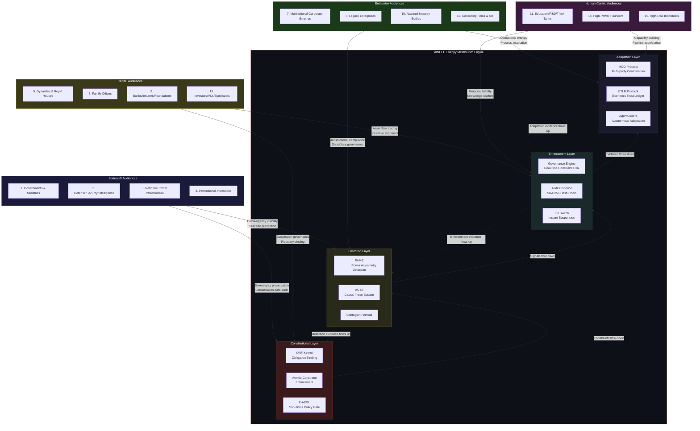

---

sidebar_position: 1
title: "Sovereign Anti-Entropy Deployment Architecture"
description: "AINEFF as an entropy metabolism system for sovereign-grade institutions — deployment architecture across 15 power audiences, from governments and dynasties to critical infrastructure and high-risk individuals."
tags: [sovereign, governance, entropy, thermodynamics]
custom_status: active
custom_owner: Andrew Leo
custom_last_review: 2026-03-01
custom_next_review: 2026-06-01
---

# Sovereign Anti-Entropy Deployment Architecture

Every institution is dying. The question is whether it knows, and whether it has the structural machinery to metabolize its own decay before that decay becomes irreversible.

This is not metaphor. It is thermodynamics applied to institutional reality.

---

## The Thesis: AINEFF as Entropy Metabolism

:::danger[Core Thesis -- Not a Product Pitch]
AINEFF is not a governance product. It is an entropy metabolism system. Institutions that cannot metabolize their own entropy do not reform -- they collapse. The difference between a living institution and a dead one is not resources, talent, or intent. It is the rate at which internal disorder is detected, processed, and converted into structural adaptation.
:::

Every complex institution generates entropy across seven dimensions simultaneously:

| Entropy Dimension | What It Means Operationally | What Happens When Unmetabolized |
|---|---|---|
| **Strategy Entropy** | Strategic intent degrades as it passes through organizational layers | Leadership believes the strategy is being executed; the ground does something else entirely |
| **Operational Entropy** | Processes accumulate friction, workarounds, and undocumented exceptions | The gap between documented procedure and actual behavior widens until the documentation is fiction |
| **Incentive Entropy** | Reward structures diverge from institutional goals over time | Rational actors optimize for metrics that actively harm the institution |
| **Information Entropy** | Signal-to-noise ratio degrades as institutional scale increases | Decision-makers operate on stale, filtered, or politically curated information |
| **Cultural Entropy** | Shared assumptions, norms, and behavioral expectations fragment | Subcultures emerge that are functionally hostile to the institution's stated mission |
| **Capital Entropy** | Resources flow toward legacy commitments rather than current priorities | The institution funds yesterday's strategy while starving tomorrow's survival |
| **Governance Entropy** | Decision authority becomes ambiguous, duplicated, or captured by factions | Nobody knows who can actually authorize action, so nothing of consequence gets authorized |

Standard consulting engagements diagnose symptoms. AINEFF metabolizes the underlying thermodynamic condition.

---

## Why Sovereign-Grade

The word "sovereign" is not decorative. It specifies a precise engineering constraint: the system must function under conditions that would destroy any commercial governance product.

Sovereign-grade means the system must:

1. **Survive leadership turnover** -- A change of minister, CEO, monarch, or regime cannot render the governance layer inoperable. Institutional memory cannot live in human heads alone.
2. **Resist political capture** -- Factions within the institution cannot co-opt the governance layer to serve their interests against the institution's survival. The system must be structurally incorruptible, not merely staffed by trustworthy people.
3. **Prevent incentive corruption** -- When the system measures and enforces, the measurements themselves become targets for gaming. Sovereign-grade systems must detect and neutralize Goodhart's Law in real time.
4. **Reduce decision latency without reducing decision quality** -- Institutions under stress default to one of two failure modes: paralysis (no decisions) or recklessness (uninformed decisions). The system must compress the gap between information availability and authorized action.
5. **Maintain information integrity under stress** -- During crises, information flow degrades precisely when it matters most. The system must guarantee that the decision-maker's picture of reality tracks actual reality, even when intermediaries have incentives to distort.

:::warning[The Survivability Test]
If the entire senior leadership of the institution is replaced overnight, does the governance layer still function? If a hostile faction gains control of one department, can it compromise the evidence chain? If the institution is under simultaneous regulatory investigation and media attack, does the audit trail hold? These are not edge cases. For sovereign-scale institutions, these are Tuesday.
:::

---

## The 15 Power Audiences

Frankmax deploys AINEFF across 15 sovereign-scale audiences. Each audience faces a distinct entropy profile -- a specific combination of thermodynamic pressures that, left unmetabolized, produces institutional failure patterns unique to that audience type.

| # | Audience | Core Entropy Challenge |
|---|---|---|
| 1 | **Governments and Ministries** | Policy intent evaporates between cabinet decision and ground execution; institutional memory resets with each election cycle |
| 2 | **Defense, Security, and Intelligence** | Classification systems create information silos that prevent the left hand from knowing what the right hand is doing; accountability is structurally impossible when operations are invisible |
| 3 | **National Critical Infrastructure** | Interdependency cascades mean a single-point failure can propagate across energy, water, transport, and communications; governance fragmentation across operators prevents unified risk visibility |
| 4 | **International Institutions (UN/EU/AU/GCC/ASEAN)** | Consensus-based governance produces lowest-common-denominator decisions; member states game reporting to protect sovereignty while undermining collective action |
| 5 | **Dynasties and Royal Houses** | Succession planning is existential but culturally undiscussable; family wealth becomes a coordination problem when the number of beneficiaries exceeds the patriarch's span of control |
| 6 | **Family Offices** | Principal-agent problems intensify when the principal lacks financial literacy and the agent has every incentive to maintain information asymmetry; generational wealth transfer is a governance crisis disguised as a tax problem |
| 7 | **Multinational Corporate Empires** | Jurisdictional complexity creates governance arbitrage opportunities; subsidiary management optimizes locally at the expense of the whole; transfer pricing becomes a shadow governance system |
| 8 | **Legacy Enterprises** | Technical debt is actually governance debt -- accumulated decisions that were locally rational but collectively pathological; digital transformation fails because the organization's immune system rejects it |
| 9 | **Banks, Insurers, and Financial Foundations** | Regulatory compliance becomes the primary activity, consuming resources that should fund adaptation; risk models are backward-looking but threats are forward-moving |
| 10 | **National Industry Bodies** | Member interests diverge over time until the body represents nobody's actual priorities; captured by the largest members who use it as a barrier to competition |
| 11 | **Education, R&D, and Think Tanks** | Research funding incentives produce publishable incrementalism rather than useful knowledge; institutional prestige becomes decoupled from institutional output |
| 12 | **Consulting Firms and System Integrators** | Revenue model requires perpetuating client dependency rather than building client capability; partner incentive structures reward origination over delivery |
| 13 | **Investors, VCs, and Syndicates** | Information asymmetry between GPs and LPs is structural and growing; portfolio monitoring at scale produces false confidence based on curated reporting |
| 14 | **High-Power Founders and Operators** | Single-point-of-failure risk on the founder; organizational capability is borrowed from the founder's cognition rather than embedded in institutional structure |
| 15 | **High-Risk Individuals** | Personal security, financial exposure, and reputational vulnerability create an attack surface that scales with visibility; no integrated governance across the personal-professional-public boundary |

---

## The Mandatory Analysis Framework

Each audience deployment page applies a consistent analytical framework. This is not a template for the sake of consistency -- it is an operational requirement. Deploying AINEFF without completing this analysis produces governance theater rather than entropy metabolism.

### What Each Audience Page Covers

| Section | Purpose | Output |
|---|---|---|
| **Entropy Profile** | Map the specific entropy generation patterns unique to this audience | Quantified entropy rates across all seven dimensions |
| **Failure Mode Catalog** | Enumerate the predictable failure modes that unmetabolized entropy produces | Prioritized failure scenarios with estimated time-to-manifestation |
| **Institutional Immune Response** | Identify the ways this audience type's existing structures will resist AINEFF deployment | Antibody map -- which internal factions will fight the deployment and why |
| **AINEFF Stack Mapping** | Map specific AINEFF components to specific entropy sources | Component-to-entropy binding table |
| **Economic Case** | Quantify the cost of unmetabolized entropy vs. the cost of AINEFF deployment | Decision-grade financial model with IRR, payback period, and catastrophic-loss avoidance valuation |
| **Deployment Sequence** | Define the order of component activation that minimizes institutional disruption while maximizing early entropy capture | Phased rollout plan with dependency graph |
| **ORF Integration** | Specify how the Atomic Constraint applies to this audience's irreversible actions | Obligation binding specifications for the audience's highest-stakes decisions |
| **Evidence Architecture** | Define the audit trail requirements specific to this audience's regulatory and legal environment | SHA-256 hash-chained evidence specifications with jurisdictional compliance mapping |
| **Governance Survivability** | Stress-test the deployment against leadership turnover, factional capture, and crisis conditions | Survivability score with identified single points of failure |

:::info[Decision-Grade, Not Decorative]
Every section produces an artifact that a senior decision-maker can act on. If a section cannot produce a decision-enabling artifact for a specific audience, that section is flagged as requiring field research before deployment can proceed.
:::

---

## Stabilization Architecture

The following diagram maps how AINEFF's core stabilization layers interact with the 15 audience categories. The audiences are grouped by their primary institutional failure mode, and each group connects to the AINEFF subsystems specifically designed to metabolize that failure pattern.

---

## The Burger/Fries/Kitchen Model at Sovereign Scale

The economic architecture of sovereign deployment follows the same structural logic as the broader Frankmax model, but the unit economics shift dramatically at institutional scale.

| Layer | Consumer SaaS Equivalent | Sovereign Deployment Equivalent | Margin Profile |
|---|---|---|---|
| **Burger** (loss-leader) | Free AI access, basic tools | Initial entropy diagnostic, governance gap analysis, first 90-day deployment | Break-even to slight loss -- the purpose is to embed the evidence chain |
| **Fries** (margin engine) | Governance dashboards, compliance layers | Ongoing entropy metabolism: real-time policy enforcement, obligation binding, audit trail maintenance | 70-95% gross margins -- the client cannot disconnect without losing their evidence chain |
| **Kitchen** (proprietary moat) | Telemetry, behavioral data, pattern library | Cross-institutional entropy pattern library, anonymized failure mode database, predictive governance models | Not sold -- this is the compounding asset that makes each subsequent deployment faster and more accurate |

:::tip[The Lock-In Is the Evidence Chain]
Sovereign clients do not stay because of features. They stay because their audit trail, their obligation bindings, and their governance evidence are cryptographically embedded in the AINEFF substrate. Leaving means reconstructing years of evidence from scratch -- which no regulator, insurer, or board of directors will tolerate.
:::

---

## Deployment Sequencing Logic

Not all 15 audiences deploy simultaneously. The sequencing follows three principles:

1. **Entropy severity** -- Audiences facing the highest entropy generation rates deploy first, because delay compounds the damage
2. **Evidence chain value** -- Audiences whose evidence chains create the strongest lock-in and the most valuable pattern library entries deploy first
3. **Cross-audience contagion** -- Audiences whose deployment creates forcing functions for adjacent audiences deploy first

**Wave 1 rationale:** Banks and insurers generate the regulatory forcing function (they require governance evidence from counterparties). Critical infrastructure generates the national security forcing function. High-power founders generate the early revenue and pattern library data at minimal organizational complexity.

**Wave 2 rationale:** Governments adopt because their banks and infrastructure operators are already generating evidence through AINEFF. Multinationals adopt because their banking partners require it. Dynasties adopt because their family offices (Wave 3) will need the governance substrate.

**Wave 3 rationale:** Defense and security adopt because the government layer is already live. Family offices adopt because the dynasty-level governance creates a mandate. Investors adopt because their portfolio companies are already generating AINEFF evidence.

**Wave 4 rationale:** The remaining audiences adopt because the network density makes non-participation more expensive than participation. International institutions adopt because member states are already on the protocol. Industry bodies adopt because their members are already governed. Consulting firms adopt because their clients demand AINEFF-compatible deliverables.

---

## Audience Deep Dives

Each audience has a dedicated deployment architecture page. These are not summaries -- they are operational specifications.

| # | Audience | Page |
|---|---|---|
| 1 | Governments and Ministries | [Sovereign Deployment: Governments](./governments) |
| 2 | Defense, Security, and Intelligence | [Sovereign Deployment: Defense](./defense) |
| 3 | National Critical Infrastructure | [Sovereign Deployment: Critical Infrastructure](./infrastructure) |
| 4 | International Institutions | [Sovereign Deployment: International Institutions](./international-institutions) |
| 5 | Dynasties and Royal Houses | [Sovereign Deployment: Dynasties](./dynasties) |
| 6 | Family Offices | [Sovereign Deployment: Family Offices](./family-offices) |
| 7 | Multinational Corporate Empires | [Sovereign Deployment: Multinationals](./corporate-empires) |
| 8 | Legacy Enterprises | [Sovereign Deployment: Legacy Enterprises](./legacy-enterprises) |
| 9 | Banks, Insurers, and Financial Foundations | [Sovereign Deployment: Financial Institutions](./banks-insurers) |
| 10 | National Industry Bodies | [Sovereign Deployment: Industry Bodies](./industry-bodies) |
| 11 | Education, R&D, and Think Tanks | [Sovereign Deployment: Education and Research](./education-rd) |
| 12 | Consulting Firms and System Integrators | [Sovereign Deployment: Consulting and SI](./consulting-firms) |
| 13 | Investors, VCs, and Syndicates | [Sovereign Deployment: Investors](./investors-vcs) |
| 14 | High-Power Founders and Operators | [Sovereign Deployment: Founders](./founders-operators) |
| 15 | High-Risk Individuals | [Sovereign Deployment: High-Risk Individuals](./high-risk-individuals) |

---

## Related Documents

| Topic | Page |
|---|---|
| Executive Entropy Risk Scorecard | [Sovereign Entropy Risk Scorecard](./scorecard) |
| The Atomic Constraint | [The ORF Kernel](/docs/vision/atomic-constraint) |
| Frankmax Governance System | [Frankmax Entity](/docs/entities/frankmax) |
| ORF Protocol | [Obligation & Responsibility Finality](/docs/entities/orf-protocol) |
| Governance Enforcement Architecture | [Enforcement Systems](/docs/architecture/governance-enforcement) |
| 15 Systems of Frankmax | [Frankmax Systems](/docs/systems/frankmax-15-systems) |
| The Centi-Trillion Thesis | [GDP-Scale Infrastructure](/docs/vision/centi-trillion-thesis) |
