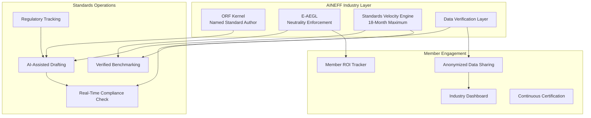
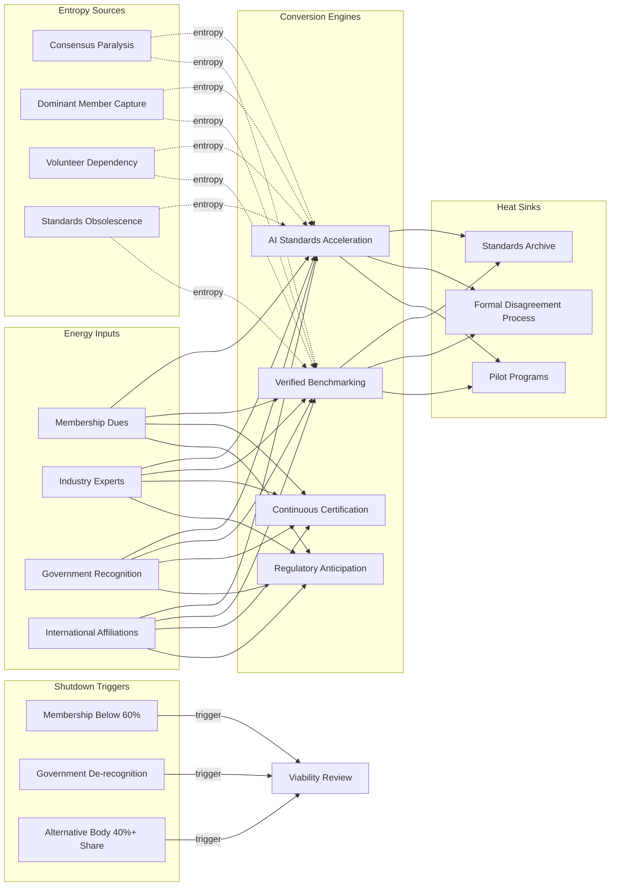

# National Industry Bodies

Standards-setting cycles of 3-5 years in an industry where technology cycles are 6-12 months. Member value propositions written for an era when industry knowledge was scarce — now it is commoditized. Lobbying effectiveness declining as political polarization reduces receptivity to industry consensus positions. AINEFF treats industry bodies as coordination infrastructure whose entropy profile is defined by the widening gap between the speed at which industries change and the speed at which industry governance adapts.

:::warning Structural Reality
ISO publishes approximately 1,500 standards per year. The average standard takes 3-5 years to develop. By the time an AI governance standard reaches publication, the technology it governs has advanced through 3-4 generations. Industry bodies that cannot close this gap become museums of obsolete best practices.
:::

---

## 1. Entropy Vector Map

| Vector | Manifestation | Severity |
|--------|--------------|----------|
| **Strategy** | Strategic plans reflecting member consensus from 3 years ago applied to today's market. Strategy development by committee produces lowest-common-denominator positions that satisfy no one. Inability to take positions that disadvantage any member — producing strategic paralysis on contentious issues. | **High** |
| **Operations** | Event-driven revenue model (conferences, certifications) disrupted by virtual alternatives. Member engagement platforms lagging consumer-grade digital experiences. Data collection from members fragmented and voluntary — no single view of industry state. | **High** |
| **Incentives** | Membership fees flat or declining while operational costs rise. Staff incentivized by member retention, not industry advancement. Certification programs generating revenue but potentially commoditizing the knowledge they certify. Dominant members contributing most resources and expecting most influence — crowding out smaller members. | **High** |
| **Information** | Industry data self-reported by members with no verification. Benchmarking data 12-18 months stale by publication. Market intelligence competing with freely available analyst reports and AI-generated insights. Standards documents behind paywalls while open-source alternatives proliferate. | **Critical** |
| **Culture** | Consensus culture preventing decisive action. Annual cycle rhythm disconnected from continuous market evolution. "Volunteer-driven" model meaning critical work depends on member capacity rather than institutional capability. Legacy prestige substituting for current relevance. | **High** |
| **Capital** | Membership revenue declining 2-5% annually in consolidating industries. Conference revenue volatility post-pandemic. Certification revenue threatened by micro-credentialing alternatives. Operating reserves sufficient for 6-12 months — no strategic investment capacity. | **Medium** |
| **Governance** | Board composition reflecting membership dues hierarchy, not industry expertise. Term limits creating knowledge discontinuity. Committee structures replicating organizational silos of the 1990s. Governance processes designed for 4 meetings per year applied to issues requiring weekly attention. | **High** |

---

## 2. Early Entropy Signals

1. **Membership renewal rate** declining below 85% — value proposition erosion becoming actionable
2. **Standards adoption rate** below 40% among target audience — relevance gap widening
3. **Conference attendance** declining 10%+ year-over-year — physical convening value diminishing
4. **Time-to-standard** exceeding 4 years — process speed incompatible with industry pace
5. **Member engagement score** declining — passive membership replacing active participation
6. **Alternative body formation** — when members create parallel organizations for specific issues, the incumbent body's coordination monopoly is fracturing
7. **Government bypassing** industry body for direct stakeholder consultation — perceived relevance to policymakers declining

---

## 3. 3–5 Year Decay Model

| Dimension | Projection |
|-----------|-----------|
| **Financial cost of entropy** | $10-50M annually per major industry body in inefficient standard-setting processes, duplicated member engagement, and underutilized data assets. Members collectively waste $500M-2B annually on compliance with standards that do not reflect current operational reality. |
| **Institutional trust erosion** | Member perception of value declining 5-8% annually. Government trust in industry body positions eroding as political polarization makes consensus positions seem inadequate. Public trust in industry self-regulation declining post-scandal (Boeing/FAA, banking/financial crisis). |
| **Competitive vulnerability** | Technology companies creating de facto standards through market dominance (Google's web standards, Apple's privacy standards). Open-source communities producing standards faster and with broader adoption. Consulting firms offering industry benchmarking that competes directly with industry body data. |
| **Political fragility** | Industry lobbying effectiveness declining as political actors increasingly bypass industry consensus. Regulatory capture accusations reducing industry body credibility with policymakers. Rising demand for "public interest" representation on industry governance bodies. |

---

## 4. AINEFF Deployment Architecture

### Structural Constraints

- **ORF Kernel**: Every standard, certification, and policy position must have a named author accountable for technical accuracy — not "the committee"
- **Standards Velocity Mandate**: No standard may take more than 18 months from initiation to publication. If consensus is not achieved in 18 months, the standard is published as draft with dissenting positions documented
- **Data Verification**: Member-submitted industry data cross-validated through AINEFF's information integrity layer — ending self-reported benchmarking
- **Neutrality Enforcement**: AINEFF governance prevents any single member from exceeding 15% influence on standards direction, regardless of dues contribution

### Governance Hardening

- Board composition algorithm ensuring representation by company size, geography, and sub-sector — not just by dues level
- Committee work managed through AINEFF coordination protocols with defined deliverables, timelines, and accountability
- Member voting weighted by active participation, not financial contribution alone

### AI-Native Coordination

- Real-time industry data aggregation from member operations (opt-in, anonymized)
- AI-assisted standards drafting — initial drafts generated from industry practice analysis, refined by committee expertise
- Automated compliance monitoring — members can assess standards conformance in real-time
- Predictive regulatory tracking — identifying upcoming regulatory changes that require industry response before formal consultation

### Incentive Alignment

- Membership value measured and reported quarterly — transparent ROI for membership investment
- Staff performance tied to standards adoption rates and member engagement metrics, not retention alone
- Certification programs restructured for continuous learning, not periodic examination

### Information Integrity

- Industry benchmarking data verified against operational telemetry, not self-reported surveys
- Standards documents freely accessible (revenue model shifted from paywall to implementation services)
- Real-time industry dashboard replacing annual industry reports

---

## 5. Accountability Design

| Role | Accountability |
|------|---------------|
| **Standards Program Director** | Accountable for standards pipeline velocity and adoption rates. When standards exceed 18-month development timeline, this role must justify continuation or trigger draft publication. |
| **Member Value Officer** | Accountable for measurable member ROI. Quarterly reporting on engagement metrics, value delivered, and member satisfaction. When renewal rates decline, this role triggers value proposition review. |
| **Data Integrity Manager** | Accountable for accuracy of industry benchmarking data. When verified data diverges from self-reported data by more than 10%, this role escalates for investigation. |
| **Policy Liaison** | Accountable for government engagement effectiveness. When industry body positions are not reflected in regulatory outcomes, this role conducts root cause analysis. |

---

## 6. Entropy-Reduction Metrics

| KPI | Current Baseline | Target (Year 1) | Target (Year 3) |
|-----|-----------------|-----------------|-----------------|
| **Capital Efficiency** | $0.30 member value per $1 dues | $0.50 | $0.75 |
| **Decision Latency** | 3-5 years per standard | 18 months maximum | 12 months for priority standards |
| **Standards Adoption** | 30-40% of target audience | 55% | 75% |
| **Information Accuracy** | Self-reported (est. 25-35% variance) | 15% variance (verified) | 5% variance |
| **Member Engagement** | 35% active participation | 55% | 75% |
| **Regulatory Influence** | 40% of positions reflected in regulation | 55% | 70% |

---

## 7. Thermodynamic System Model

### Energy Inputs
- **Capital**: Membership dues, certification fees, event revenue, government grants ($10-500M per major body)
- **Talent**: Industry experts volunteering committee time, professional staff, academic advisors
- **Legitimacy**: Historical authority, government recognition, international affiliations
- **Information**: Member-reported data, market intelligence, regulatory tracking
- **Political Trust**: Government reliance on industry body expertise for policy development
- **Network Power**: Cross-industry relationships, international standards body affiliations, academic partnerships

### Entropy Sources
- **Consensus Paralysis**: Unanimous consent requirements preventing timely decisions on contentious issues
- **Dominant Member Capture**: Largest members steering agenda toward their competitive interests
- **Volunteer Dependency**: Critical work quality determined by member volunteer capacity, not institutional capability
- **Revenue Model Rigidity**: Dues-based model providing flat/declining revenue against growing operational needs
- **Digital Disruption**: Virtual alternatives to physical convening reducing primary revenue streams
- **Standards Obsolescence**: Published standards becoming outdated before widespread adoption

### Conversion Engines
- **AI-Accelerated Standards**: Reducing development cycles from years to months through automated drafting and analysis
- **Verified Benchmarking**: Converting self-reported data into verified industry intelligence — dramatically increasing value
- **Continuous Certification**: Converting periodic examination into ongoing competency validation
- **Regulatory Anticipation**: Converting reactive policy response into proactive regulatory shaping

### Heat Sinks
- **Standards Archive**: Maintained historical standards serving as reference even when superseded
- **Consensus Buffer**: Formal disagreement processes absorbing member conflicts without organizational fracture
- **Pilot Programs**: Testing new member services with volunteer cohorts before full deployment

### Shutdown Triggers
- **Membership Decline**: Below 60% of peak membership triggers viability review
- **Government De-recognition**: Loss of official advisory status triggers legitimacy crisis
- **Alternative Body Capture**: Competing body achieving 40%+ market share triggers strategic pivot or merger discussion
- **Financial Insolvency**: Operating reserves below 3 months triggers emergency governance intervention

---

## 8. Adversarial Red-Team Critique

**How AINEFF fails for industry bodies:**

1. **Consensus Culture Rejection**: Industry bodies exist because members agree to cooperate. AINEFF's structural constraints (18-month velocity mandate, neutrality enforcement, data verification) override the consensus process that gives industry bodies legitimacy. Members may reject AINEFF as authoritarian infrastructure incompatible with voluntary coordination.

2. **Dominant Member Backlash**: AINEFF's neutrality enforcement caps influence at 15% regardless of contribution. Members contributing 40%+ of revenue will view this as expropriation of their investment. They will withdraw funding, creating financial crisis that undermines AINEFF deployment.

3. **Revenue Model Disruption**: Making standards freely accessible eliminates paywall revenue. The shift to implementation services revenue requires capabilities that most industry bodies do not have. AINEFF may solve the relevance problem while creating a financial sustainability crisis.

4. **Volunteer Resistance**: AINEFF's AI-assisted drafting reduces the need for volunteer expert time on standards development. Volunteers participate for professional visibility and influence. If AI does the work, volunteers lose motivation — and the industry body loses its primary source of technical expertise.

5. **Small Body Viability**: AINEFF's deployment cost may exceed the entire annual budget of smaller industry bodies. The framework is designed for institutional scale — it may be structurally inaccessible to the organizations that need it most.

:::danger Critical Question
Can AINEFF preserve the voluntary, consensus-driven nature of industry coordination while imposing structural constraints on velocity and neutrality? If the answer is "no," then AINEFF transforms industry bodies into something they are not — and members will leave rather than accept the transformation.
:::
