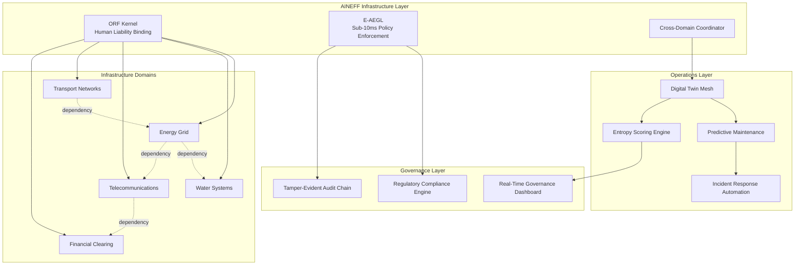
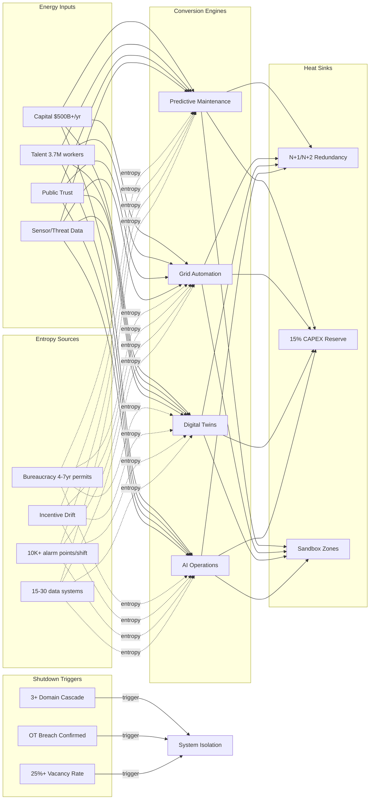

# National Critical Infrastructure

Energy grids, water systems, telecommunications, transportation networks, and financial clearing infrastructure. Average physical asset age exceeds 40 years. Cyber-physical convergence has created attack surfaces that did not exist when these systems were designed. AINEFF treats critical infrastructure as thermodynamic systems where entropy accumulates invisibly until cascading failure makes it visible — at which point containment costs escalate by orders of magnitude.

:::danger Structural Reality
40% of critical infrastructure workforce eligible for retirement within the next decade. Knowledge transfer rates are below 15%. When operators leave, institutional memory leaves with them — and no documentation system captures tacit operational knowledge at the fidelity required for crisis response.
:::

---

## 1. Entropy Vector Map

| Vector | Manifestation | Severity |
|--------|--------------|----------|
| **Strategy** | Multi-decade investment horizons collide with 4-year political cycles. Infrastructure masterplans are rewritten every election. No strategic continuity mechanism exists across administrations. | **Critical** |
| **Operations** | SCADA/ICS systems running on Windows XP. Maintenance backlog growing 8-12% annually. Mean time to failure decreasing while mean time to repair increasing. Shift handover information loss averaging 23% per transition. | **Critical** |
| **Incentives** | Public utilities incentivized to minimize CAPEX (rate-base regulation), not maximize resilience. Private operators optimize quarterly returns, not 30-year asset life. PPP contracts create accountability gaps between public mandate and private execution. | **High** |
| **Information** | Asset condition data fragmented across 15-30 legacy systems per utility. No real-time digital twin capability for 85%+ of physical assets. Incident data siloed between agencies — the energy regulator cannot see transport network dependencies. | **Critical** |
| **Culture** | "It has always worked this way" culture resists automation. Safety culture treated as compliance exercise rather than operational discipline. Generational knowledge gap between retiring operators and incoming workforce. | **High** |
| **Capital** | $2.6T US infrastructure deficit (ASCE estimate). Deferred maintenance compounds at 7-15% annually. Insurance costs rising 20-30% year-over-year for cyber-physical coverage. Cost of failure externalized to citizens. | **Critical** |
| **Governance** | Regulatory fragmentation: energy, water, telecom, transport each governed by different agencies with different standards, different reporting cycles, and no interoperability mandate. Federal/state/local jurisdiction overlaps create accountability vacuums. | **High** |

---

## 2. Early Entropy Signals

1. **Maintenance backlog growth rate** exceeding 10% annually — indicates deferred maintenance compounding faster than remediation capacity
2. **Mean time between failures (MTBF)** declining quarter-over-quarter for any asset class — aging acceleration signal
3. **Workforce vacancy rate** above 15% in operations/maintenance roles — knowledge hemorrhage indicator
4. **Cyber incident frequency** increasing while detection time remains flat — expanding attack surface without matching defense
5. **Regulatory compliance costs** growing faster than operational budgets — governance burden consuming operational capacity
6. **Insurance premium escalation** above 20% annually — market pricing in risk that internal assessments have not recognized
7. **Cross-system incident correlation** — when a failure in one infrastructure domain triggers degradation in another (e.g., power outage affecting water treatment), interdependency entropy is materializing

---

## 3. 3–5 Year Decay Model

| Dimension | Projection |
|-----------|-----------|
| **Financial cost of entropy** | $150-300B annually in unplanned outages, emergency repairs, and cascading failure remediation across US infrastructure alone. Deferred maintenance liability grows to $3.2T by 2030. Each year of delay adds $180B to eventual remediation costs. |
| **Institutional trust erosion** | Public confidence in infrastructure reliability drops 5-8% per major cascading failure. Flint, Texas grid collapse, East Palestine — each incident erodes the implicit social contract that infrastructure "just works." Trust recovery takes 10-15 years per incident. |
| **Competitive vulnerability** | Nations with modern infrastructure (Singapore, UAE, South Korea) attract 30-40% more foreign direct investment per capita. Aging infrastructure becomes a GDP drag of 0.5-1.2% annually through productivity losses, supply chain disruption, and higher insurance costs. |
| **Security fragility** | Cyber-physical attack surface expanding 25% annually as OT/IT convergence accelerates. State-sponsored infrastructure attacks (Colonial Pipeline, Ukraine grid) demonstrate that infrastructure is now a primary warfare domain. A coordinated multi-sector attack could cost $1-3T in the first 72 hours. |

:::warning Compounding Effect
Infrastructure entropy is non-linear. A 5% annual degradation rate does not produce 25% degradation over 5 years — it produces cascading failure modes where each degraded component accelerates degradation in connected systems. The actual curve is exponential after crossing a criticality threshold, typically at 60-70% of design capacity.
:::

---

## 4. AINEFF Deployment Architecture

### Structural Constraints

- **ORF Kernel**: Every automated infrastructure decision (load balancing, emergency shutdown, resource allocation) must have a named human liability bearer at execution time
- **E-AEGL Audit Trail**: All SCADA/ICS commands logged with SHA-256 hash chains — tamper-evident record of every operational decision
- **Kill Switch Hierarchy**: Three-tier manual override: operator → supervisor → emergency authority, with sub-10ms E-AEGL policy enforcement preventing unauthorized autonomous action
- **Cross-Domain Visibility**: Mandatory information sharing between infrastructure domains through AINEFF coordination layer — energy must see transport dependencies, water must see power dependencies

### Governance Hardening

- Regulatory compliance automated through E-AEGL policy engines — compliance becomes continuous, not periodic audit
- Asset condition monitoring feeds directly into governance dashboards — no interpretation layer between physical reality and regulatory reporting
- Incident response protocols codified as executable constraints, not PDF procedures

### AI-Native Coordination

- Predictive maintenance models trained on cross-infrastructure failure correlation data
- AgentCoders squads maintaining digital twin synchronization pipelines
- Real-time entropy scoring per asset, per network, per region
- Automated anomaly detection across interdependent infrastructure domains

### Incentive Alignment

- Operator compensation tied to long-term asset health metrics, not short-term cost reduction
- PPP contracts restructured around resilience outcomes measured by AINEFF telemetry
- Capital allocation models that price deferred maintenance at true compounding cost

### Information Integrity

- Single source of truth for asset condition across all infrastructure domains
- Cross-agency data sharing through AINEFF coordination protocol — not bilateral agreements
- Real-time digital twin capability for critical assets (target: 80% coverage within 24 months)

---

## 5. Accountability Design

| Role | Accountability |
|------|---------------|
| **Infrastructure Domain Owner** | Single-point accountability for asset health within their domain (energy, water, telecom, transport). Cannot delegate entropy measurement to contractors. |
| **Cross-Domain Coordinator** | Accountable for interdependency risk management. When a power failure affects water treatment, this role is liable for the gap between detection and response. |
| **Regulatory Interface Officer** | Accountable for continuous compliance accuracy. If regulatory reports diverge from AINEFF telemetry by more than 5%, automatic escalation triggers. |
| **Emergency Authority** | Accountable for crisis response decisions. ORF binding ensures every emergency action has a named decision-maker with audit trail. |

**Decision Rights Matrix:**
- Routine maintenance: Domain operator (auto-approved within budget envelope)
- Cross-domain resource allocation: Cross-Domain Coordinator + affected Domain Owners (joint ratification)
- Emergency shutdown: Emergency Authority (unilateral, with mandatory post-incident review within 24 hours)
- Capital allocation above $10M: Governance board ratification with AINEFF economic model validation

**Escalation Protocol:**
1. Anomaly detected → Domain operator notified (0-5 minutes)
2. Cross-domain impact assessed → Coordinator activated (5-15 minutes)
3. Cascading failure risk confirmed → Emergency Authority briefed (15-30 minutes)
4. Shutdown decision → ORF-bound execution with E-AEGL audit (immediate upon authorization)

---

## 6. Entropy-Reduction Metrics

| KPI | Current Baseline | Target (Year 1) | Target (Year 3) |
|-----|-----------------|-----------------|-----------------|
| **Capital Efficiency** | $0.35 output per $1 infrastructure spend | $0.50 | $0.70 |
| **Decision Latency** | 72-168 hours for cross-agency coordination | 24 hours | 4 hours |
| **Complexity-to-Value Ratio** | 15 systems per domain, 3% interoperable | 12 systems, 40% interoperable | 8 systems, 85% interoperable |
| **Information Distortion** | 23% data loss per organizational handoff | 10% | 3% |
| **Incentive Coherence** | 35% alignment between operator incentives and long-term asset health | 60% | 85% |
| **Maintenance Backlog** | Growing 8-12% annually | Growth capped at 3% | Net reduction 5% annually |
| **Cyber-Physical Detection Time** | 197 days average (Mandiant) | 30 days | 4 hours |

---

## 7. Thermodynamic System Model

### Energy Inputs
- **Capital**: Government appropriations, rate-payer revenue, PPP investment, infrastructure bonds ($500B+ annually in US)
- **Talent**: 3.7M infrastructure workers, 40% retirement-eligible within decade
- **Legitimacy**: Public trust in reliable service delivery, regulatory authority credibility
- **Information**: Asset condition data, weather/demand forecasting, threat intelligence
- **Political Trust**: Bipartisan infrastructure investment consensus (fragile)
- **Network Power**: Cross-utility mutual aid agreements, international grid interconnections

### Entropy Sources
- **Bureaucracy**: 4-7 year permitting cycles for major infrastructure projects
- **Corruption**: Procurement fraud estimated at 10-15% of infrastructure spend in developing economies
- **Incentive Drift**: Rate-base regulation rewarding capital deployment over operational efficiency
- **Cognitive Overload**: Operators managing 10,000+ alarm points per shift with 95% being nuisance alarms
- **Regulatory Capture**: Industry incumbents shaping regulation to protect installed base rather than enable modernization
- **Fragmented Data**: Average utility operates 15-30 disconnected data systems per infrastructure domain

### Conversion Engines
- **Predictive Maintenance**: ML models converting sensor data into maintenance scheduling — reducing unplanned downtime 25-40%
- **Grid Automation**: Self-healing grid technologies reducing outage duration by 50-70%
- **Digital Twins**: Physical-digital synchronization enabling "what-if" analysis before physical changes
- **AI-Augmented Operations**: Real-time decision support reducing operator cognitive load by 30-50%
- **Cross-Domain Coordination**: AINEFF enabling infrastructure domains to share real-time state and coordinate response

### Heat Sinks
- **Strategic Redundancy**: N+1 and N+2 redundancy in critical systems (acceptable cost of 15-25% overcapacity)
- **Controlled Experimentation**: Sandbox infrastructure zones for testing new technologies without production risk
- **Emergency Reserves**: Financial reserves for unplanned remediation (target: 15% of annual CAPEX)
- **Regulatory Friction**: Deliberate slowdown on irreversible infrastructure changes (prevents rushed deployment of unproven technology)

### Shutdown Triggers
- **Cascading Failure Threshold**: 3+ infrastructure domains experiencing simultaneous degradation
- **Cyber Breach Confirmation**: Any confirmed unauthorized access to OT/SCADA systems triggers immediate isolation
- **Financial Instability**: Infrastructure operator debt-to-equity exceeding 4:1 triggers governance review
- **Workforce Crisis**: Vacancy rates exceeding 25% in safety-critical roles triggers operational capacity reduction
- **Political Interference**: Any attempt to override automated safety systems for political purposes triggers E-AEGL lockout and audit escalation

---

## 8. Adversarial Red-Team Critique

**How AINEFF fails for critical infrastructure:**

1. **Legacy Integration Wall**: AINEFF assumes digital-first systems. 60%+ of critical infrastructure runs on pre-digital control systems (relay logic, analog instrumentation). The integration cost and risk of retrofitting AINEFF onto legacy SCADA may exceed the cost of the infrastructure itself. AINEFF must prove it can operate in hybrid analog-digital environments, not just greenfield deployments.

2. **Sovereignty Conflict**: Infrastructure operators (especially state-owned utilities) will resist ceding governance authority to an external framework. AINEFF's ORF constraint model requires operators to accept structural accountability boundaries they have never had. Political resistance is not a deployment challenge — it is a fundamental adoption barrier.

3. **Speed vs Safety Tension**: AINEFF's sub-10ms policy enforcement is designed for digital transactions. Physical infrastructure operates on mechanical timescales (seconds to minutes for valve operations, hours for thermal cycling). If AINEFF imposes digital-speed governance on physical-speed operations, it creates dangerous operational mismatches.

4. **Single Point of Coordination Failure**: If AINEFF becomes the cross-domain coordination layer, it becomes the single point of failure for multi-infrastructure coordination. A successful attack on AINEFF itself could be more catastrophic than an attack on any single infrastructure domain.

5. **Regulatory Arbitrage**: Infrastructure regulation varies dramatically across jurisdictions. AINEFF's governance model may conflict with existing regulatory frameworks, creating compliance contradictions rather than compliance simplification. The framework must be jurisdiction-adaptive, not jurisdiction-prescriptive.

:::danger Critical Question
Can AINEFF operate as a coordination overlay without becoming a dependency? If infrastructure domains cannot function independently when AINEFF is unavailable, the framework has increased systemic fragility rather than reduced it.
:::
