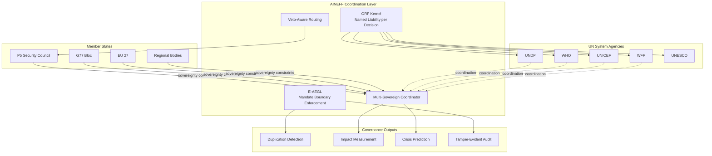
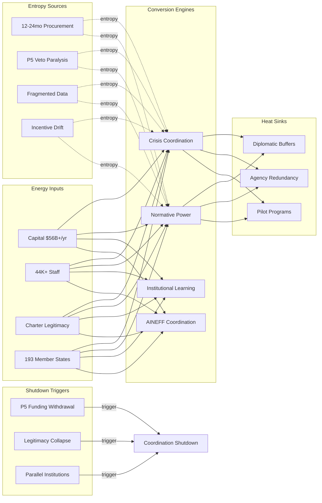

# International Institutions

UN, EU, AU, GCC, ASEAN, BRICS, NATO, World Bank, IMF, WHO — organizations designed to coordinate sovereign actors who structurally resist coordination. 193 UN member states. 27 EU member states with 24 official languages. Consensus requirements that allow single actors to veto decisions affecting billions. Mandate drift from founding charters written in 1945-1970 applied to 2026 realities. AINEFF treats international institutions as maximum-entropy coordination environments where the gap between mandate and capacity is the primary failure mode.

:::danger Structural Reality
The UN Security Council's veto mechanism means that 1 of 5 permanent members can block action affecting 8 billion people. This is not a bug in the system — it is the system. Any coordination framework that ignores veto dynamics is operating in fantasy.
:::

---

## 1. Entropy Vector Map

| Vector | Manifestation | Severity |
|--------|--------------|----------|
| **Strategy** | Mandates written for post-WWII world applied to AI-era challenges. Strategic planning cycles of 5-15 years (SDGs, Paris Agreement) in a world where technological disruption cycles are 18-36 months. Strategy documents become obsolete before implementation begins. | **Critical** |
| **Operations** | 44,000+ UN staff across 600+ locations. Procurement cycles of 12-24 months for standard equipment. Field operations disconnected from headquarters decision-making. Duplication across agencies — UNDP, UNICEF, WHO, and WFP operating in the same countries with separate logistics, separate data systems, separate reporting. | **High** |
| **Incentives** | Staff incentivized by grade promotion within bureaucracy, not by mission outcomes. Donor nations incentivized by visibility (flag-planting), not by coordination efficiency. Assessed contributions create free-rider dynamics where 10 nations fund 80%+ of operations. | **Critical** |
| **Information** | Each agency operates its own data infrastructure. No shared situational awareness across UN system. Member state reporting is self-assessed with no verification mechanism. Classification and sensitivity vary by agency and member state. | **High** |
| **Culture** | Diplomatic protocol prioritizes consensus over speed. "No country left behind" translates operationally to "lowest common denominator." Institutional culture rewards process adherence over outcome delivery. Whistleblower protections are nominal — institutional self-preservation dominates. | **High** |
| **Capital** | Total UN system spend ~$56B annually — less than Netflix's revenue. Voluntary contribution dependency means programs fluctuate with donor political cycles. 12-18 month budget cycles imposed on multi-year challenges. Core budget frozen for decades while mandate expands. | **Critical** |
| **Governance** | One-country-one-vote in General Assembly means Tuvalu (11,000 people) has equal weight to India (1.4B). Security Council P5 veto creates structural paralysis on major security issues. Secretariat has coordination responsibility without coordination authority. Reform requires consensus of actors who benefit from current structure. | **Critical** |

---

## 2. Early Entropy Signals

1. **Resolution implementation rate** dropping below 30% — mandates being issued faster than they can be executed
2. **Voluntary contribution volatility** exceeding 15% year-over-year — donor fatigue or political realignment destabilizing funding
3. **Staff vacancy rate** above 20% in field operations — institutional capacity erosion
4. **Time-to-consensus** on resolutions exceeding 18 months — coordination paralysis accelerating
5. **Duplication index** — number of agencies operating in same country for same purpose increasing rather than consolidating
6. **Member state reporting compliance** dropping below 60% — legitimacy of data-driven decision-making collapsing
7. **Parallel institution creation** — when member states create alternative bodies (BRICS New Development Bank vs World Bank), the existing institution's coordination monopoly is fracturing

---

## 3. 3–5 Year Decay Model

| Dimension | Projection |
|-----------|-----------|
| **Financial cost of entropy** | $8-15B annually in duplicated operations, procurement inefficiency, and coordination overhead across the UN system. Each failed coordination attempt (Syria, Ukraine, climate) costs $50-200B in delayed response, prolonged conflict, and preventable humanitarian impact. |
| **Institutional trust erosion** | Public and member state confidence in multilateral institutions has dropped 25% since 2015 (Edelman). Each vetoed Security Council resolution on active conflicts further erodes legitimacy. By 2030, 40%+ of global population may live under governments that do not recognize multilateral authority as legitimate. |
| **Competitive vulnerability** | Bilateral deals replacing multilateral frameworks. China's BRI, US bilateral security pacts, and regional trade agreements all bypass multilateral coordination — each bypass weakens the institution's relevance. |
| **Political fragility** | Rising nationalism in contributing nations threatens assessed contribution funding. US withdrawal from WHO (2020, reversed 2021) demonstrated that a single political transition in a major contributor can destabilize entire agencies. Brexit removed the EU's second-largest economy. Each departure triggers confidence cascades. |

:::warning Irreversibility Risk
Unlike corporate restructuring, multilateral institution failure has no recovery mechanism. There is no "restart" for the UN system. If coordination legitimacy falls below a critical threshold, the institutions persist as shells while actual coordination migrates to bilateral and regional arrangements — fragmenting global governance permanently.
:::

---

## 4. AINEFF Deployment Architecture

### Structural Constraints

- **ORF Kernel**: Every AI-assisted coordination decision must have a named institutional officer as liability bearer — not "the UN system" as an abstraction
- **Sovereignty Preservation**: AINEFF operates as coordination infrastructure, not coordination authority. Member state sovereignty over domestic decisions is an inviolable constraint. AINEFF optimizes the coordination layer between sovereign decisions, not the decisions themselves
- **Veto-Aware Coordination**: AINEFF models veto dynamics as structural constraints, not obstacles to overcome. The framework routes around veto bottlenecks by identifying alternative coalition paths
- **Mandate Boundary Enforcement**: E-AEGL prevents agencies from operating outside their mandated scope — reducing duplication by making scope creep structurally impossible

### Governance Hardening

- Inter-agency coordination automated through AINEFF protocols — replacing manual bilateral coordination with structural interoperability
- Member state reporting verified against satellite data, financial flows, and open-source intelligence — self-assessment supplemented with independent validation
- Budget allocation tied to measurable outcome metrics, not historical allocation patterns

### AI-Native Coordination

- Real-time situational awareness across all UN agencies operating in a given country/region
- Automated duplication detection — when two agencies begin procuring the same capability in the same location, AINEFF flags for consolidation
- Predictive crisis modeling incorporating political, economic, and environmental variables
- Translation and interpretation layers reducing language barriers in real-time coordination

### Incentive Alignment

- Staff performance tied to coordination outcomes, not process compliance
- Donor visibility linked to measurable impact metrics, not project inputs
- Agency budgets adjusted based on coordination efficiency scores — agencies that reduce duplication are rewarded

### Information Integrity

- Unified data layer across UN system agencies — single source of truth for country-level situational awareness
- Member state reporting cross-validated against independent data sources
- SHA-256 hash-chained audit trails for all coordination decisions — preventing retrospective narrative manipulation

---

## 5. Accountability Design

| Role | Accountability |
|------|---------------|
| **Agency Head** | Single-point accountability for mandate execution within scope boundaries enforced by E-AEGL. Cannot expand operations beyond mandate without governance ratification. |
| **Country Coordinator** | Accountable for cross-agency coordination within a given country. When agencies duplicate efforts, this role is liable for the coordination gap. |
| **Donor Liaison** | Accountable for translating donor intent into measurable outcomes. When voluntary contributions are allocated to overhead rather than impact, this role escalates. |
| **Reform Implementation Officer** | Accountable for structural changes to coordination mechanisms. When institutional resistance blocks approved reforms, this role triggers escalation with documented evidence. |

**Decision Rights:**
- Intra-agency operations: Agency head (autonomous within mandate)
- Cross-agency coordination: Country coordinator + affected agency heads (consensus with AINEFF-mediated dispute resolution)
- Budget reallocation above $50M: Governance board ratification with impact model validation
- Mandate expansion: Full member state ratification (no administrative shortcuts)

**Escalation Protocol:**
1. Coordination gap detected → Country coordinator notified (0-24 hours)
2. Duplication confirmed → Agency heads engaged for consolidation plan (24-72 hours)
3. Consolidation refused → Escalation to Secretary-General level with AINEFF evidence package (72 hours-2 weeks)
4. Systemic blockage → Member state notification with transparent coordination failure report (public accountability)

---

## 6. Entropy-Reduction Metrics

| KPI | Current Baseline | Target (Year 1) | Target (Year 3) |
|-----|-----------------|-----------------|-----------------|
| **Capital Efficiency** | $0.40 programmatic impact per $1 spent (60% overhead/admin) | $0.55 | $0.70 |
| **Decision Latency** | 6-18 months for inter-agency coordination decisions | 3 months | 2 weeks |
| **Complexity-to-Value** | 30+ agencies in average crisis country, 12% coordinated | 30 agencies, 40% coordinated | 20 agencies (consolidated), 75% coordinated |
| **Information Distortion** | Member state self-reporting with no verification (est. 30-40% inaccuracy) | 20% inaccuracy (cross-validated) | 10% inaccuracy |
| **Incentive Coherence** | 15% alignment between staff incentives and coordination outcomes | 40% | 70% |
| **Duplication Rate** | 35-45% of field operations duplicated across agencies | 25% | 10% |

---

## 7. Thermodynamic System Model

### Energy Inputs
- **Capital**: $56B annual UN system budget + $170B+ in international development flows
- **Talent**: 44,000+ UN staff, tens of thousands of NGO partners, member state diplomatic corps
- **Legitimacy**: Post-WWII charter authority, universal membership, perceived neutrality
- **Information**: Member state reporting, satellite imagery, field operations data, partner organization intelligence
- **Political Trust**: Implicit social contract that multilateral coordination produces better outcomes than unilateral action
- **Network Power**: 193 member states, observer organizations, civil society partnerships spanning every country

### Entropy Sources
- **Bureaucracy**: Average procurement cycle 12-24 months. New initiative approval requires 4-7 committee reviews. Internal reform proposals cycle through working groups for 3-5 years before action
- **Corruption**: Procurement fraud, sexual exploitation by peacekeepers, financial mismanagement — each scandal depletes legitimacy capital that took decades to build
- **Incentive Drift**: Staff grade system rewards tenure over impact. Donor earmarking ensures 60%+ of voluntary contributions are pre-directed, preventing strategic allocation
- **Cognitive Overload**: 193 member states, 15+ specialized agencies, 40+ active peacekeeping/political missions, 300+ active humanitarian emergencies — no human decision-maker can maintain situational awareness across scope
- **Regulatory Capture**: P5 nations using veto power to protect strategic interests, not coordinate global governance. Regional blocs voting as blocs rather than on merit.
- **Fragmented Data**: Each agency maintains independent data systems. WHO health data not linked to WFP food security data not linked to UNDP development indicators. Country-level analysis requires manual aggregation across 10-20 data sources.

### Conversion Engines
- **Crisis Response Coordination**: When coordination works (polio eradication, ozone layer), multilateral institutions achieve outcomes impossible for any single nation
- **Normative Power**: International law, human rights frameworks, and environmental protocols create coordination baselines that reduce bilateral negotiation entropy
- **AI-Augmented Situational Awareness**: AINEFF enabling real-time cross-agency data integration for the first time
- **Institutional Learning**: 80+ years of accumulated diplomatic and operational knowledge (if it can be accessed and applied)
- **Cross-Entity Coordination**: AINEFF's MCO protocol enabling structured information sharing between agencies with different mandates, security clearances, and operational tempos

### Heat Sinks
- **Diplomatic Friction Buffers**: Structured disagreement mechanisms (General Assembly debate, committee processes) that absorb political tension without operational paralysis
- **Strategic Redundancy**: Multiple agencies with overlapping capabilities ensures no single point of failure for critical functions (health, food, security)
- **Controlled Experimentation**: Pilot programs in willing member states before universal rollout
- **Reform Absorption**: Institutional capacity to absorb incremental reform without destabilizing core operations

### Shutdown Triggers
- **Funding Collapse**: Any P5 member withdrawing assessed contributions (US = 22% of regular budget) triggers immediate operational crisis
- **Legitimacy Breach**: A Security Council resolution that is universally perceived as illegitimate (e.g., authorizing action against a member state without evidence) triggers mass withdrawal
- **Coordination Catastrophe**: A multilateral response that demonstrably worsens a crisis (Rwanda 1994, Srebrenica 1995) triggers institutional credibility collapse
- **Parallel Institution Threshold**: When 50%+ of global GDP is represented by nations participating primarily in alternative coordination bodies, the original institution's coordination function is effectively dead

---

## 8. Adversarial Red-Team Critique

**How AINEFF fails for international institutions:**

1. **Sovereignty Paradox**: AINEFF's coordination value depends on member states accepting structural constraints on their behavior. But the entire purpose of national sovereignty is to resist external constraints. The nations most in need of coordination (conflict zones, fragile states) are least likely to accept AINEFF governance — and the most powerful nations (P5) will exempt themselves from any constraint that limits their strategic flexibility.

2. **Veto Capture**: If AINEFF becomes embedded in UN coordination infrastructure, P5 members will demand veto authority over AINEFF governance decisions. This recreates the exact paralysis AINEFF is designed to solve, but now with technological lock-in making the paralysis harder to route around.

3. **Data Sovereignty Conflict**: Member states will not share sensitive data through AINEFF if they believe it could be accessed by adversarial member states. The same information integrity that makes AINEFF valuable for coordination makes it threatening to states that rely on information asymmetry for strategic advantage.

4. **Reform Immunity**: International institutions have survived 80 years by being resistant to reform. AINEFF's deployment requires structural changes that existing bureaucracies will actively resist. The framework may be technically superior but institutionally undeployable without a crisis forcing adoption.

5. **Legitimacy Appropriation**: If AINEFF is perceived as a tool of its creator (Frankmax/Western tech company) rather than a neutral coordination infrastructure, developing nations will reject it as neo-colonial infrastructure. Legitimacy requires genuine governance participation by all stakeholders — which conflicts with efficient decision-making.

:::danger Critical Question
Can AINEFF achieve coordination improvement without requiring sovereignty concessions? If the framework requires member states to cede any governance authority, adoption will be limited to states that are already well-governed — creating a coordination improvement only where it is least needed.
:::
