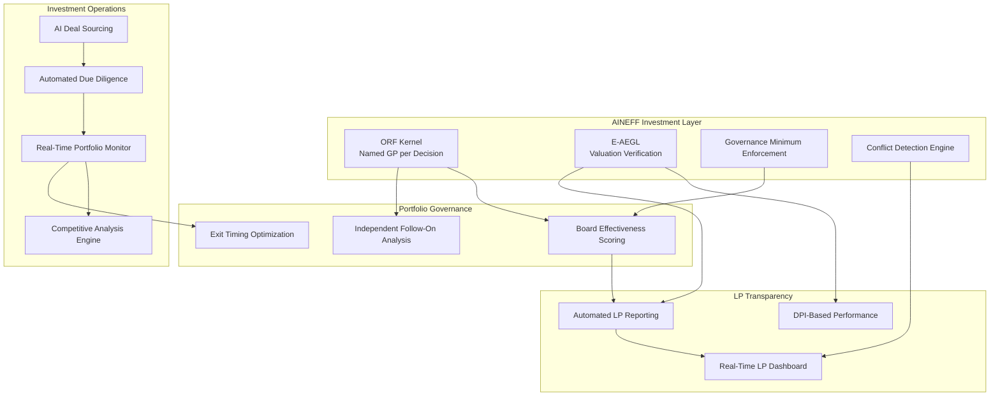
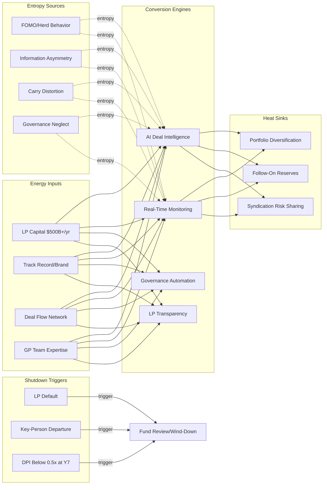

# Investors / VCs / Syndicates

10,000+ startups funded annually. 90% fail. Average due diligence is 2-4 weeks for $5-50M decisions. Fund lifecycle of 10 years misaligned with value creation timelines of 7-15 years. LP-GP information asymmetry is structural — GPs know more about portfolio performance than LPs, and founders know more than GPs. Herd behavior drives 70%+ of deal flow (FOMO-driven rounds in trending sectors). AINEFF treats investment ecosystems as information-asymmetry systems where the gap between signal and noise is the primary entropy vector, and where portfolio governance after investment is structurally neglected.

:::danger Structural Reality
The median VC fund returns 1.0-1.5x over 10 years. After management fees (2% annually) and carry (20% of profits), LP net returns frequently underperform public market equivalents. The industry's business model works for GPs regardless of LP outcomes — management fees alone sustain operations. This incentive misalignment is the foundational entropy source.
:::

---

## 1. Entropy Vector Map

| Vector | Manifestation | Severity |
|--------|--------------|----------|
| **Strategy** | Sector thesis driven by what raised money last quarter, not by structural market analysis. Fund strategy documents identical across 500+ firms: "AI/SaaS/Fintech with operational value-add." No differentiation in thesis, only in access. | **High** |
| **Operations** | Due diligence checklists substituting for genuine operational assessment. Portfolio monitoring via quarterly board meetings (4 hours per company per quarter). Post-investment support promises made during fundraising, delivered inconsistently. Deal sourcing dependent on network, not systematic intelligence. | **High** |
| **Incentives** | 2-and-20 model: 2% management fee guarantees GP income regardless of fund performance. Carry structure incentivizes home runs over portfolio health — one 100x return can compensate for 9 zeros. Markup incentive — writing up unrealized valuations for fundraising purposes (mark-to-market theater). | **Critical** |
| **Information** | Founder self-reporting on metrics with minimal verification. Portfolio company financials reviewed quarterly (90-day information lag). Market intelligence based on deal flow pattern recognition, not systematic data collection. LP reporting optimized for narrative, not transparency. | **Critical** |
| **Culture** | FOMO-driven investment decisions. Founder worship preventing critical governance intervention. Consensus-driven syndication reducing portfolio diversity. "Founder-friendly" positioning preventing boards from exercising governance authority. Social media presence substituting for investment track record as credibility signal. | **High** |
| **Capital** | LP capital committed for 10+ years with limited liquidity. J-curve creating 3-5 year negative return periods. Capital calls unpredictable for LPs (timing and amount). Secondary market for fund interests illiquid and discounted. Recycling provisions masking true capital utilization efficiency. | **Medium** |
| **Governance** | Board seats held but not utilized for governance — most VC board members attend meetings, don't govern. Fund governance minimal — LP advisory committees meet annually with limited authority. Conflict of interest management informal at best. Follow-on investment decisions biased by sunk cost, not by updated assessment. | **Critical** |

---

## 2. Early Entropy Signals

1. **DPI (Distributions to Paid-In)** below 0.5x at year 5 — fund not returning capital at pace consistent with top-quartile outcome
2. **Portfolio company mortality rate** exceeding 35% by year 3 — deal selection or post-investment governance failing
3. **Follow-on reserve utilization** above 80% by year 4 — capital being consumed by existing portfolio rather than new opportunities
4. **Markup-to-realization ratio** below 0.6 — unrealized valuations significantly exceeding actual exit values
5. **LP re-up rate** declining below 70% — investors losing confidence in GP capability
6. **Deal flow concentration** in single sector exceeding 60% — portfolio diversity erosion amplifying sector risk
7. **Time-to-close** increasing beyond 90 days — decision-making paralysis or competitive positioning weakness

---

## 3. 3–5 Year Decay Model

| Dimension | Projection |
|-----------|-----------|
| **Financial cost of entropy** | $50-100B annually across global VC in misallocated capital (investments that fail due to preventable governance gaps rather than market conditions). LP opportunity cost of $200-500B locked in underperforming funds without liquidity. Due diligence theater costing $5-10B in avoidable failed investments per year. |
| **Institutional trust erosion** | LP confidence in VC as an asset class declining 5-8% post-2022 correction. Founder trust in VC boards declining as "founder-friendly" positioning conflicts with governance responsibilities. Public trust in venture capital declining as failures (FTX, WeWork, Theranos) reveal governance gaps. |
| **Competitive vulnerability** | AI-native investment platforms performing deal sourcing, due diligence, and portfolio monitoring at 1/20th the cost of traditional VC operations. Corporate venture capital offering strategic value that financial VCs cannot match. Sovereign wealth funds and family offices investing directly, bypassing VC intermediation. |
| **Structural fragility** | 2-and-20 model sustainable only with continuous fundraising growth. Any fundraising contraction triggers GP layoffs and operational degradation. Single-GP funds (60%+ of industry) have key-person dependency that one departure turns into fund termination. |

---

## 4. AINEFF Deployment Architecture

### Structural Constraints

- **ORF Kernel**: Every investment decision must have a named GP as accountability bearer, not "the partnership." Every board governance action (or inaction) must be attributed to the named board member
- **Valuation Integrity**: Portfolio company valuations verified through AINEFF telemetry, not founder self-reporting. Markups require supporting evidence logged in E-AEGL
- **Governance Minimum**: Board members must log governance actions (not just attendance) per quarter. Below minimum governance threshold triggers LP notification
- **Conflict Transparency**: All cross-portfolio conflicts of interest detected by AINEFF and disclosed to affected parties in real-time

### Governance Hardening

- LP reporting automated from portfolio company source data — not GP-curated narratives
- Follow-on investment decisions modeled against independent assessment, not just GP conviction
- Portfolio company board effectiveness scored and reported to LPs quarterly

### AI-Native Coordination

- AI-powered deal sourcing replacing network-dependent deal flow with systematic market scanning
- Real-time portfolio monitoring through AINEFF integration with portfolio company operational data
- Automated competitive analysis and market positioning assessment per portfolio company
- Due diligence automation — financial, legal, and technical DD assisted by AgentCoders squads

### Incentive Alignment

- Management fee declining scale: 2% years 1-3, 1.5% years 4-6, 1% years 7-10 — aligning GP income with deployment phase
- Carry calculation on realized returns only (DPI), not unrealized markups (TVPI)
- GP co-investment mandate of 5-10% of fund size — ensuring skin in the game

### Information Integrity

- Portfolio company metrics verified through direct system integration, not quarterly spreadsheets
- LP dashboard with real-time portfolio visibility — ending 90-day information lag
- Deal flow and sourcing data transparent to LPs — demonstrating systematic rather than opportunistic investment process

---

## 5. Accountability Design

| Role | Accountability |
|------|---------------|
| **Lead GP** | Named accountability for each investment decision and portfolio company outcome. Not "the fund decided" — this GP decided, and the decision is logged with E-AEGL audit trail. |
| **Board Representative** | Accountable for governance actions per board seat. When a portfolio company fails due to governance gap, the board representative's actions (or inactions) are reviewable. |
| **Portfolio Operations Lead** | Accountable for post-investment value creation delivery. When "operational value-add" promises are not fulfilled, this role must explain the gap with documented evidence. |
| **LP Relations Officer** | Accountable for reporting accuracy and timeliness. When LP reports diverge from AINEFF telemetry by more than 10%, automatic escalation triggers. |

---

## 6. Entropy-Reduction Metrics

| KPI | Current Baseline | Target (Year 1) | Target (Year 3) |
|-----|-----------------|-----------------|-----------------|
| **Capital Efficiency** | Median fund DPI 1.0-1.5x | 1.5-2.0x | 2.5x+ (top-decile parity) |
| **Decision Latency** | 2-4 weeks due diligence | 1 week (AI-augmented) | 3 days for standard deals |
| **Information Currency** | 90-day reporting lag | 30-day lag | Real-time portfolio dashboard |
| **Governance Quality** | Board attendance only | Board action logging + effectiveness score | Governance correlated with outcome improvement |
| **Valuation Accuracy** | Markup-to-realization 0.5-0.7x | 0.7-0.8x | 0.85x+ |
| **LP Transparency** | Quarterly narrative reports | Monthly data-driven reports | Real-time dashboard |

---

## 7. Thermodynamic System Model

### Energy Inputs
- **Capital**: LP commitments ($500B+ annually in global VC), GP co-investment, management fees
- **Talent**: GPs, analysts, venture partners, operating partners, EIRs
- **Legitimacy**: Track record (IRR, DPI), brand recognition, founder endorsements
- **Information**: Deal flow, market intelligence, portfolio company performance data, founder networks
- **Political Trust**: LP confidence in GP judgment and integrity
- **Network Power**: Founder networks, co-investor relationships, corporate partnership connections, LP relationships

### Entropy Sources
- **FOMO Dynamics**: Herd behavior driving investment in overheated sectors — consensus-driven capital deployment reducing portfolio diversity
- **Information Asymmetry**: Founders knowing more than GPs, GPs knowing more than LPs — each layer of opacity enables entropy accumulation
- **Carry Distortion**: 20% carry on markups incentivizing paper returns over realized returns — valuation inflation as revenue source
- **Governance Neglect**: Board seats treated as monitoring positions, not governance positions — structural accountability gap between investment and outcome
- **Fund Cycle Misalignment**: 10-year fund lifecycle forcing exit timing based on fund maturity, not value optimization
- **Single-GP Risk**: 60%+ of funds dependent on single decision-maker whose departure terminates the fund

### Conversion Engines
- **AI Deal Intelligence**: Converting network-dependent sourcing into systematic market scanning — reducing bias and expanding coverage
- **Real-Time Monitoring**: Converting quarterly board updates into continuous operational visibility
- **Governance Automation**: AINEFF converting passive board membership into active governance with measurable accountability
- **LP Transparency**: Converting narrative reporting into data-driven, real-time portfolio visibility

### Heat Sinks
- **Portfolio Diversification**: Spread across sectors, stages, and geographies absorbing individual company failure
- **Reserve Capital**: Follow-on reserves buffering portfolio companies through temporary downturns
- **Syndication**: Risk sharing across multiple investors per deal
- **Secondary Market**: LP liquidity through secondary fund interest sales (illiquid but existent)

### Shutdown Triggers
- **LP Default**: Major LP failing to meet capital calls triggers fund operational crisis
- **Key-Person Departure**: Named key person leaving triggers LP right to suspend capital calls
- **DPI Below 0.5x at Year 7**: Fund structurally unlikely to achieve top-half performance, triggering LP review
- **Portfolio Cascade Failure**: 50%+ of portfolio companies failing within 12-month window triggers governance crisis
- **Regulatory Investigation**: SEC investigation into valuation practices or conflict of interest triggers institutional credibility collapse

---

## 8. Adversarial Red-Team Critique

**How AINEFF fails for investors and VCs:**

1. **GP Autonomy Resistance**: The venture capital industry is built on GP judgment. AINEFF's governance structures (outcome accountability, valuation verification, governance minimums) directly constrain the autonomy that defines VC culture. Top-performing GPs will refuse to adopt a framework that second-guesses their judgment — and they are exactly the GPs whose adoption would validate AINEFF.

2. **Transparency vs Competitive Advantage**: AINEFF's LP transparency features eliminate information asymmetry that GPs use as competitive advantage in fundraising. If all funds report transparently, differentiation shifts to pure performance — which most funds cannot survive.

3. **Founder Resistance**: Founders choose VCs partly based on governance intensity. "Founder-friendly" funds that impose minimal governance win deals. AINEFF-governed funds that impose accountability structures will lose deal flow to non-AINEFF funds — creating adverse selection.

4. **Small Fund Impracticality**: 70%+ of VC funds are under $100M. AINEFF's deployment cost may exceed their operational budget. The framework must be accessible at micro-fund scale, not just institutional scale.

5. **Retrospective Accountability Disincentive**: E-AEGL's audit trail makes governance failures provably visible. GPs currently benefit from the inability to determine whether a portfolio company failed due to governance neglect or market conditions. AINEFF eliminates this ambiguity — which is exactly why GPs will resist it.

:::danger Critical Question
Can AINEFF improve investment outcomes enough to overcome the structural resistance from GPs who benefit from the current system's opacity? If AINEFF-governed funds do not demonstrably outperform non-AINEFF funds within 2-3 fund cycles, the framework fails regardless of its governance merits.
:::
