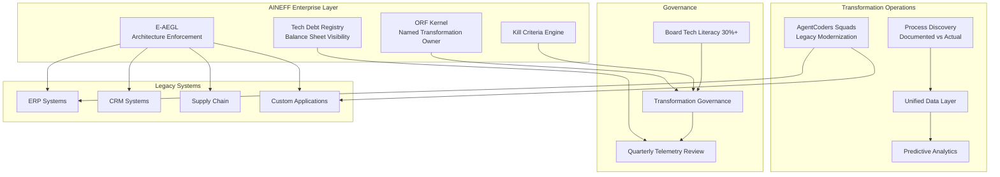
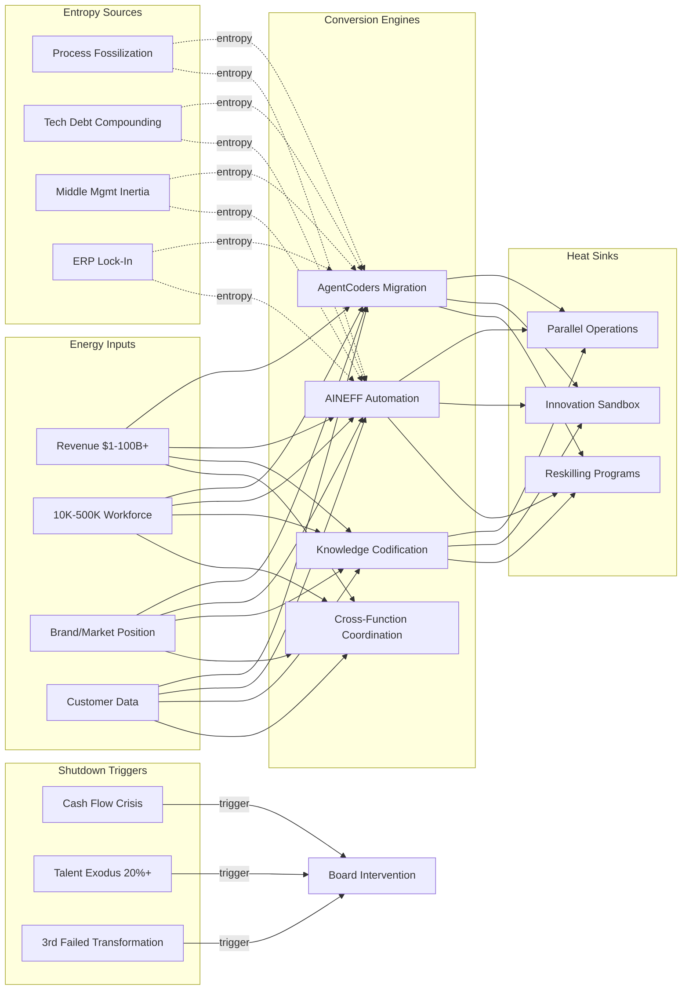

# Legacy Enterprises

70% of digital transformation initiatives fail. Not because the technology does not work — because the organization's immune system rejects the transplant. Legacy enterprises carry $1.5T+ in global technical debt. Average COBOL system age exceeds 30 years. Process fossilization means that documented procedures diverge from actual practice by 40-60%. Workforce reskilling cycles take 5-7 years while technology cycles are 18-36 months. AINEFF treats legacy enterprises as systems where organizational entropy has exceeded the institution's natural capacity for self-repair.

:::danger Structural Reality
The average Fortune 500 company's lifespan has decreased from 75 years (1950s) to 15 years (2020s). The acceleration is not caused by market competition alone — it is caused by internal entropy accumulation outpacing the organization's ability to metabolize change. Companies do not get disrupted from the outside. They decay from the inside, and external disruption is the catalyst that makes internal decay visible.
:::

---

## 1. Entropy Vector Map

| Vector | Manifestation | Severity |
|--------|--------------|----------|
| **Strategy** | Strategy documents produced annually, implemented partially, reviewed never. Strategic planning disconnected from operational reality — C-suite vision cannot penetrate middle management inertia. Strategy updates faster than execution, creating permanent gap between intent and capability. | **High** |
| **Operations** | ERP systems customized beyond upgrade paths. 200-500 business applications per enterprise with 15-20% redundancy. Process documentation 3-5 years behind actual practice. Shadow IT accounting for 30-40% of technology spend. Operational knowledge trapped in individual expertise, not institutional systems. | **Critical** |
| **Incentives** | Quarterly earnings pressure driving short-term optimization over long-term capability building. Middle management rewarded for stability, not transformation. Innovation budget allocated but not protected — first to be cut in downturn. Transformation leaders measured on timeline adherence, not outcome delivery. | **Critical** |
| **Information** | 80% of enterprise data is dark data — collected but never analyzed. Average enterprise has 400+ SaaS subscriptions with 30% overlap in functionality. Customer data fragmented across 10-30 systems. No single view of customer, product, or operational reality. Decision-making based on lagging indicators presented in monthly PowerPoint decks. | **Critical** |
| **Culture** | "The way we've always done it" as organizational immune response. Innovation theater — labs, hackathons, accelerators that produce demos but not products. Risk aversion embedded in promotion criteria. Organizational antibodies that detect and neutralize change agents within 6-18 months. | **High** |
| **Capital** | Technology debt service consuming 60-80% of IT budget (maintenance of existing systems). CAPEX approval cycles of 6-12 months for technology investments. ROI models requiring 18-24 month payback that discourage transformative investments. Stock buybacks consuming capital that could fund modernization. | **High** |
| **Governance** | Board technology literacy averaging 15-20% (directors who understand enterprise technology architecture). Audit committee focused on financial compliance, not operational resilience. Risk management treating technology as a cost center rather than a strategic capability. Transformation governance structures that add oversight without adding velocity. | **High** |

---

## 2. Early Entropy Signals

1. **IT maintenance spend ratio** exceeding 70% of total IT budget — operational ossification consuming all capacity for change
2. **Employee Net Promoter Score** declining quarter-over-quarter — cultural entropy materializing as disengagement
3. **Time-to-market** for new products/features increasing year-over-year — organizational friction accumulating
4. **Shadow IT growth rate** above 20% annually — formal systems failing to meet operational needs
5. **Customer satisfaction variance** between digital and traditional channels exceeding 20 points — capability gap between new and legacy operations
6. **Voluntary attrition** among top 20% performers exceeding 15% annually — talent exodus as leading indicator of organizational health
7. **Transformation initiative restart frequency** — same strategic initiative appearing under a new name for the third time indicates fundamental execution incapacity

---

## 3. 3–5 Year Decay Model

| Dimension | Projection |
|-----------|-----------|
| **Financial cost of entropy** | $200-500M annually per large enterprise in duplicated systems, manual workarounds, compliance remediation, and missed market opportunities. Technical debt compounds at 15-25% annually — a $500M debt load becomes $1.2B within 4 years without active remediation. Each failed transformation initiative wastes $50-200M and consumes 2-3 years of organizational change capacity. |
| **Institutional trust erosion** | Employee engagement drops 3-5% per failed transformation initiative. Customer trust erodes 2-4% per year when service quality stagnates. Board confidence in management declines after second failed strategic pivot — triggering CEO turnover that restarts the cycle. |
| **Competitive vulnerability** | Digital-native competitors operating at 3-5x the velocity with 40-60% lower cost structure. Market share erosion of 2-5% annually in digitally disrupted sectors. Talent market competition lost to technology companies offering 20-40% compensation premium plus cultural appeal. |
| **Structural fragility** | Regulatory compliance burden growing 12-15% annually while compliance budgets grow 5-8%. Cybersecurity attack surface expanding through legacy system vulnerabilities. Supply chain digitization requirements from partners/customers creating integration deadlines that legacy systems cannot meet. |

---

## 4. AINEFF Deployment Architecture

### Structural Constraints

- **ORF Kernel**: Every transformation decision must have a named executive (not a steering committee) as liability bearer. "Shared accountability" for transformation is prohibited — it is the mechanism by which accountability evaporates
- **Technical Debt Visibility**: All technical debt registered, valued, and tracked as a balance sheet liability — not hidden in IT budgets
- **Shadow IT Prohibition**: AINEFF governance prevents unauthorized technology adoption by enforcing architectural standards through E-AEGL policy engines
- **Transformation Kill Criteria**: Every initiative has predefined failure conditions that trigger automatic review/termination — preventing zombie projects

### Governance Hardening

- Board technology literacy requirements enforced: minimum 30% of directors must pass technology governance certification
- Transformation governance separated from operational governance — different metrics, different cadence, different authority structure
- Quarterly transformation reviews with AINEFF telemetry — no self-reported status updates

### AI-Native Coordination

- AgentCoders squads deployed for legacy system modernization — autonomous AI development teams handling code migration, test generation, and documentation
- AINEFF coordination layer connecting ERP, CRM, SCM, and custom systems into unified operational view
- Automated process discovery comparing documented procedures to actual system usage patterns
- Predictive attrition modeling identifying talent retention risks before resignations

### Incentive Alignment

- Executive compensation restructured: 40% base, 30% annual performance, 30% 3-year transformation metrics
- Middle management promotion criteria explicitly including change adoption metrics
- Innovation budget protected by governance constraint — cannot be reallocated to operational expense without board-level override

### Information Integrity

- Unified operational data layer replacing fragmented system-of-record approach
- Real-time operational dashboards replacing monthly reporting cycles
- Customer, product, and operational single source of truth accessible across all functions

---

## 5. Accountability Design

| Role | Accountability |
|------|---------------|
| **Chief Transformation Officer** | Single-point accountability for transformation portfolio outcomes. Not the CTO (who owns operations) — a dedicated role with board-level authority and protected budget. Measured on 3-year transformation metrics, not annual operational targets. |
| **Domain Transformation Lead** | Accountable for modernization within their business domain (finance, operations, customer, supply chain). Reports to CTO with dotted line to domain business leader. Cannot be overridden by operational priorities without CTO escalation. |
| **Technical Debt Owner** | Accountable for maintaining accurate technical debt registry and prioritizing remediation. When debt compounds beyond threshold, this role triggers mandatory board review. |
| **Change Adoption Manager** | Accountable for organizational adoption of transformed processes. When training completion exceeds 80% but usage adoption is below 50%, this role escalates the cultural resistance pattern. |

**Decision Rights:**
- Tactical modernization under $5M: Domain Lead (autonomous within architectural standards)
- Strategic transformation above $5M: CTO + CEO joint approval with AINEFF impact model
- Legacy system decommission: Board ratification (irreversible action)
- Transformation initiative termination: Kill Criteria Engine triggers automatic review; CTO decides within 30 days

---

## 6. Entropy-Reduction Metrics

| KPI | Current Baseline | Target (Year 1) | Target (Year 3) |
|-----|-----------------|-----------------|-----------------|
| **Capital Efficiency** | 60-80% IT budget on maintenance | 55% maintenance | 40% maintenance |
| **Decision Latency** | 6-12 months for technology investment decisions | 3 months | 1 month |
| **Complexity-to-Value** | 400+ applications, 30% redundant | 350 apps, 20% redundant | 200 apps, 5% redundant |
| **Information Distortion** | 80% dark data, no unified customer view | 60% dark data, 50% unified | 30% dark data, 90% unified |
| **Incentive Coherence** | 15% exec comp tied to transformation | 30% | 50% |
| **Time-to-Market** | 12-18 months for major features | 6-9 months | 3 months |
| **Technical Debt Ratio** | Unmeasured (estimated $200-500M) | Measured, growth capped at 5% | Net reduction 10% annually |

---

## 7. Thermodynamic System Model

### Energy Inputs
- **Capital**: Revenue ($1-100B+), retained earnings, debt capacity, equity issuance
- **Talent**: Existing workforce (10,000-500,000+), recruitment pipeline, contractor ecosystem
- **Legitimacy**: Brand equity, customer relationships, regulatory licenses, market position
- **Information**: Customer data, operational data, market intelligence, institutional knowledge
- **Political Trust**: Board confidence, shareholder patience, regulatory goodwill
- **Network Power**: Supplier relationships, distribution networks, partnership ecosystems

### Entropy Sources
- **Process Fossilization**: Documented procedures diverging 40-60% from actual practice — operational reality invisible to governance
- **Technical Debt Compounding**: Every year of deferred modernization adds 15-25% to eventual remediation cost
- **Middle Management Inertia**: 60-70% of organizational change capacity consumed by middle management resistance
- **ERP Lock-In**: Core systems customized beyond vendor upgrade path — trapped in obsolete technology
- **Regulatory Accumulation**: Compliance requirements growing 12-15% annually with no corresponding simplification
- **Data Fragmentation**: Each acquisition adds 5-15 new data systems without integration mandate

### Conversion Engines
- **AgentCoders Modernization**: AI development teams migrating legacy code at 5-10x human developer velocity
- **AINEFF Process Automation**: Converting manual workflows to AI-coordinated operations
- **Institutional Learning**: Codifying tacit knowledge into organizational systems before retirement wave
- **Cross-Function Coordination**: Breaking functional silos through unified data and governance layers

### Heat Sinks
- **Strategic Redundancy**: Maintaining legacy systems in parallel during transition (acceptable 30-50% cost overhead)
- **Controlled Experimentation**: Innovation sandboxes with protected budget and separate governance
- **Workforce Transition Programs**: Reskilling investments absorbing organizational anxiety about automation
- **Customer Migration Buffers**: Gradual channel migration rather than forced digital adoption

### Shutdown Triggers
- **Cash Flow Crisis**: Operating cash flow insufficient to fund both operations and transformation simultaneously
- **Talent Exodus**: Top-performer attrition exceeding 20% annually triggers capability collapse
- **Regulatory Breach**: Compliance failure resulting in operating license risk
- **Transformation Failure Cascade**: Third consecutive failed transformation initiative triggers board intervention
- **Cybersecurity Breach**: Major breach through legacy system vulnerability triggers mandatory emergency modernization

---

## 8. Adversarial Red-Team Critique

**How AINEFF fails for legacy enterprises:**

1. **Organizational Immune Response**: AINEFF is itself a transformation. Legacy enterprises that have rejected 3 previous transformations will reject AINEFF for the same reasons — regardless of its technical superiority. The framework must be deployable without appearing to be "yet another transformation initiative."

2. **Middle Management Sabotage**: AINEFF's transparency features (process discovery, technical debt visibility, performance telemetry) expose middle management inefficiencies that are currently invisible. This layer has the most to lose and the most operational power to resist. They will not attack AINEFF directly — they will ensure it receives incomplete data, inadequate resources, and impossible timelines.

3. **ERP Vendor Lock-In**: SAP, Oracle, and Microsoft control the operational backbone of legacy enterprises. AINEFF must integrate with or replace these systems. Integration means operating within their constraints. Replacement means taking on the largest and most politically powerful technology vendors in the enterprise market.

4. **Board Impatience**: AINEFF's value proposition is structural — it takes 2-3 years to demonstrate meaningful entropy reduction. Boards expecting quarterly improvement signals will defund the initiative before it can prove itself. The framework needs a "quick wins" strategy that is not theater but also delivers visible value within 90 days.

5. **Talent Competition**: Deploying AINEFF requires skilled operators. Those operators are the same talent pool that Google, Meta, and OpenAI are recruiting at 2-3x enterprise compensation. AINEFF must work with the talent legacy enterprises can actually attract, not the talent they wish they could.

:::danger Critical Question
Can AINEFF survive the organizational dynamics that killed the last 3 transformation initiatives? If the answer depends on "executive sponsorship" or "change management," it is not structurally resilient — it is politically dependent. Sovereign-grade infrastructure must survive leadership turnover.
:::
