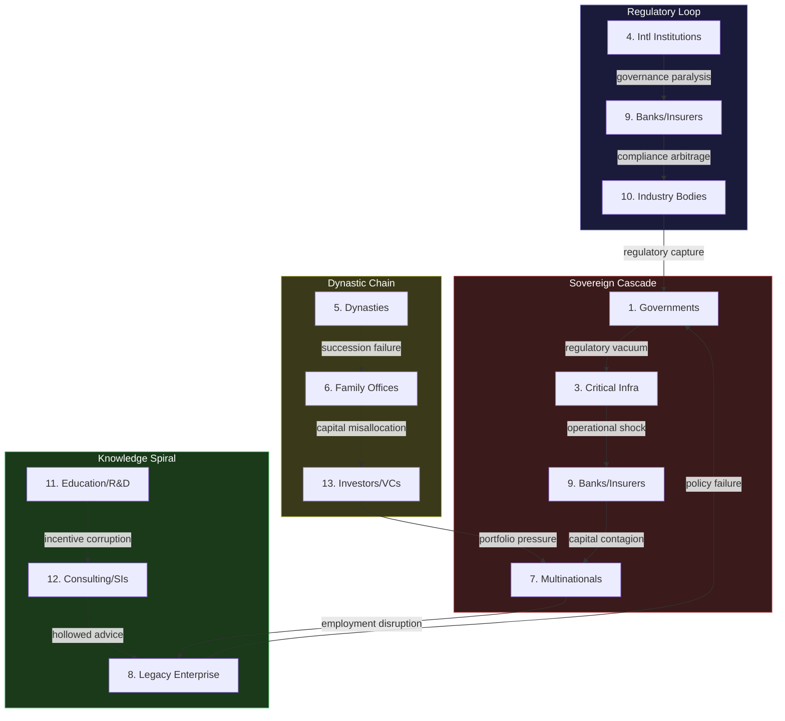
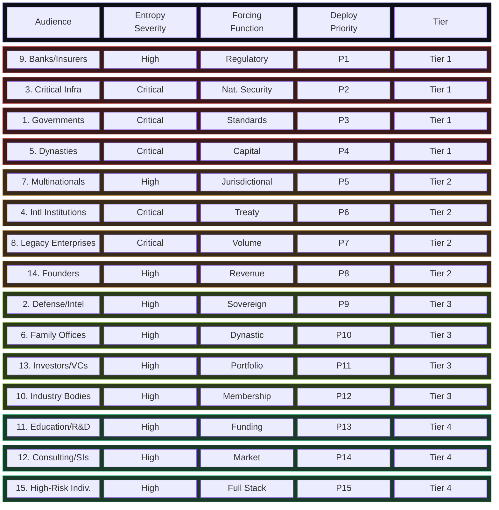
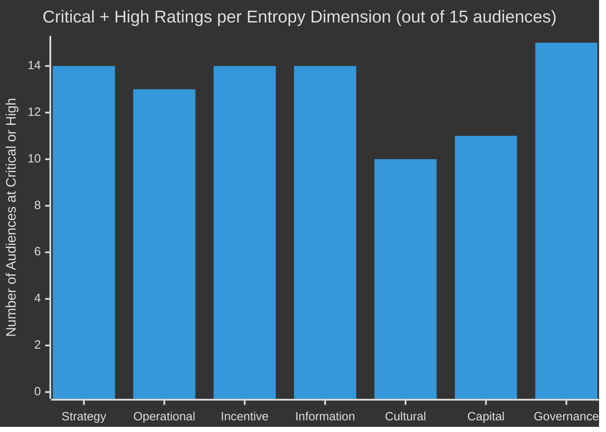

---

sidebar_position: 2
title: "Executive Sovereign Entropy Risk Scorecard"
description: "Comprehensive entropy risk matrix scoring all 15 sovereign-scale audiences across seven entropy dimensions — with deployment priority sequencing, cross-audience correlation patterns, and decision-grade risk assessments."
tags: [sovereign, entropy, risk, metrics]
custom_status: active
custom_owner: Andrew Leo
custom_last_review: 2026-03-01
custom_next_review: 2026-06-01
---

# Executive Sovereign Entropy Risk Scorecard

This is not a traffic-light dashboard. It is a thermodynamic assessment of institutional decay rates across 15 sovereign-scale audiences, scored against seven entropy dimensions that determine whether an institution adapts or collapses.

:::danger[Scoring Methodology -- Not Subjective]
Each rating reflects the structural difficulty of metabolizing entropy in that dimension for that audience type. "Critical" does not mean "bad" -- it means the institution lacks native structural capacity to process entropy in that dimension without external intervention. The scoring is derived from institutional failure pattern analysis, not opinion surveys.
:::

---

## Rating Definitions

| Rating | Meaning | Institutional Implication | Time Horizon |
|---|---|---|---|
| **Critical** | The institution has no native capacity to metabolize entropy in this dimension. Decay is active and accelerating. | Without intervention, irreversible structural damage within 2-5 years | Immediate deployment required |
| **High** | The institution has partial capacity, but it is degrading. Existing mechanisms are losing effectiveness. | Structural damage probable within 5-10 years; current mitigation is decelerating but not halting decay | Deploy within 12 months |
| **Medium** | The institution has functioning mechanisms, but they are not scaling with institutional complexity. | Manageable currently, but the gap between entropy generation and metabolism widens annually | Deploy within 24 months |
| **Low** | The institution has robust native capacity. AINEFF adds acceleration and evidence, not survival. | Stable; AINEFF deployment is an optimization, not a rescue | Deploy opportunistically |

---

## Complete Entropy Risk Matrix

### Statecraft Audiences (1-4)

| Dimension | 1. Governments | 2. Defense/Intel | 3. Critical Infra | 4. International Inst. |
|---|---|---|---|---|
| **Strategy Entropy** | Critical | High | High | Critical |
| **Operational Entropy** | High | High | Critical | High |
| **Incentive Entropy** | Critical | High | Medium | Critical |
| **Information Entropy** | Critical | Critical | High | Critical |
| **Cultural Entropy** | High | Medium | Medium | Critical |
| **Capital Entropy** | High | Medium | High | High |
| **Governance Entropy** | Critical | High | Critical | Critical |
| **Overall Risk** | **Critical** | **High** | **Critical** | **Critical** |

### Capital Audiences (5, 6, 9, 13)

| Dimension | 5. Dynasties | 6. Family Offices | 9. Banks/Insurers | 13. Investors/VCs |
|---|---|---|---|---|
| **Strategy Entropy** | High | High | Medium | High |
| **Operational Entropy** | Medium | Medium | High | Medium |
| **Incentive Entropy** | Critical | Critical | High | Critical |
| **Information Entropy** | Critical | Critical | Medium | High |
| **Cultural Entropy** | Critical | High | Medium | Medium |
| **Capital Entropy** | High | High | Medium | High |
| **Governance Entropy** | Critical | Critical | High | High |
| **Overall Risk** | **Critical** | **High** | **High** | **High** |

### Enterprise Audiences (7, 8, 10, 12)

| Dimension | 7. Multinationals | 8. Legacy Enterprises | 10. Industry Bodies | 12. Consulting/SIs |
|---|---|---|---|---|
| **Strategy Entropy** | High | Critical | High | Medium |
| **Operational Entropy** | High | Critical | Medium | High |
| **Incentive Entropy** | High | High | Critical | Critical |
| **Information Entropy** | High | High | High | Medium |
| **Cultural Entropy** | Medium | Critical | High | Medium |
| **Capital Entropy** | Medium | High | Medium | Medium |
| **Governance Entropy** | High | Critical | Critical | High |
| **Overall Risk** | **High** | **Critical** | **High** | **High** |

### Human-Centric Audiences (11, 14, 15)

| Dimension | 11. Education/R&D | 14. Founders/Operators | 15. High-Risk Individuals |
|---|---|---|---|
| **Strategy Entropy** | High | High | High |
| **Operational Entropy** | Medium | High | High |
| **Incentive Entropy** | Critical | Medium | Medium |
| **Information Entropy** | High | High | Critical |
| **Cultural Entropy** | High | Low | Medium |
| **Capital Entropy** | High | Medium | High |
| **Governance Entropy** | High | Critical | Critical |
| **Overall Risk** | **High** | **High** | **High** |

---

## Key Findings

:::warning[Five Audiences at Critical Overall Risk]
Five of 15 audiences carry Critical overall entropy risk: Governments (1), Critical Infrastructure (3), International Institutions (4), Dynasties (5), and Legacy Enterprises (8). These are not the most visible or the most commercially attractive. They are the most structurally fragile. Failure to deploy in these audiences is not a missed business opportunity -- it is a failure to intervene where institutional collapse is already in progress.
:::

### Finding 1: Governance Entropy Is the Universal Pathology

Governance entropy scores Critical or High in **14 of 15 audiences**. This is not coincidental. Governance entropy is the meta-entropy -- when governance degrades, the institution loses the capacity to detect and respond to entropy in all other dimensions. It is the immune system of institutional health, and it is failing systemically.

**Operational implication:** Every AINEFF deployment must begin with governance entropy metabolism, regardless of the audience's stated priorities. An institution that requests operational efficiency improvement but has Critical governance entropy will not be able to sustain any operational gains.

### Finding 2: Incentive Entropy Is the Most Underdiagnosed Threat

Incentive entropy scores Critical in **7 of 15 audiences** and High in another 5. Yet incentive misalignment is almost never identified as a root cause in institutional post-mortems. The reason: the people who would diagnose it are themselves subject to the misaligned incentives.

**Operational implication:** AINEFF's incentive entropy detection must be structurally independent of the institution's internal reward mechanisms. This is why the ORF protocol binds liability to individuals rather than to roles -- roles can be captured by incentive entropy, but personal liability remains aligned with institutional survival.

### Finding 3: Information Entropy Correlates with Institutional Scale

Every audience with more than 10,000 decision-relevant actors scores High or Critical on information entropy. There is no exception. Information entropy is not a technology problem -- it is a physics problem. As the number of information sources increases linearly, the number of possible signal interactions increases combinatorially.

**Operational implication:** AINEFF's information entropy metabolism cannot rely on better reporting dashboards. It requires structural compression of the decision-relevant information space through E-AEGL's sub-10ms policy enforcement gates, which act as information filters that reduce the decision-maker's input space to only the signals that exceed the action threshold.

### Finding 4: Cultural Entropy Is the Strongest Predictor of Deployment Resistance

Audiences with High or Critical cultural entropy scores are the most likely to reject AINEFF deployment, precisely because the cultural fragmentation that makes them vulnerable also makes collective adoption decisions impossible.

**Operational implication:** Deployment in high-cultural-entropy audiences must bypass consensus-based adoption. The entry point is the evidence chain, not the governance framework. Once the evidence chain is operational, the governance framework becomes a structural necessity rather than a political choice.

### Finding 5: Capital Entropy Is a Lagging Indicator

Capital entropy is never the first entropy dimension to reach Critical. It is always the last -- the downstream consequence of unmetabolized entropy in other dimensions. By the time capital entropy is visible (budget crises, funding shortfalls, asset erosion), the root causes have been compounding for years.

**Operational implication:** Institutions that approach Frankmax because of capital problems actually have governance, incentive, or information problems that have finally metastasized into financial symptoms. The deployment must address root entropy dimensions, not the capital manifestation.

---

## Cross-Audience Risk Correlation Patterns

Entropy does not respect institutional boundaries. When one audience experiences a Critical entropy event, it propagates to adjacent audiences through shared dependencies, regulatory contagion, and market transmission.

### Correlation Pattern 1: The Sovereign Cascade

```
Government governance failure → Regulatory uncertainty →
Critical infrastructure operational entropy →
Financial institution capital entropy →
Corporate governance entropy → Employment market disruption
```

**Audiences affected:** 1 → 3 → 9 → 7 → 8
**Propagation time:** 6-24 months per link
**Historical examples:** Every sovereign debt crisis follows this exact cascade sequence.

### Correlation Pattern 2: The Dynastic Fragmentation Chain

```
Dynasty succession failure → Family office incentive misalignment →
Capital allocation entropy → Portfolio company governance collapse →
Investor confidence entropy
```

**Audiences affected:** 5 → 6 → 9/13 → 7/8 → 13
**Propagation time:** 12-60 months per link
**Historical examples:** The fragmentation of every merchant dynasty from the Medicis to modern Gulf families follows this pattern when succession governance fails.

### Correlation Pattern 3: The Regulatory Contagion Loop

```
International institution governance paralysis →
Regulatory gap → Financial institution risk mispricing →
Corporate compliance arbitrage → National industry body capture →
Government regulatory overreaction
```

**Audiences affected:** 4 → 9 → 7 → 10 → 1
**Propagation time:** 12-36 months per link
**Historical examples:** The 2008 financial crisis, the EU sovereign debt crisis, and the post-2020 regulatory fragmentation all follow this pattern.

### Correlation Pattern 4: The Knowledge Decay Spiral

```
Education/R&D incentive corruption → Think tank capture →
Consulting firm knowledge hollowing → Legacy enterprise misguidance →
Government policy failure based on degraded advisory input
```

**Audiences affected:** 11 → 11 → 12 → 8 → 1
**Propagation time:** 3-10 years per link
**Historical examples:** The decline of industrial policy in Western democracies traces directly to this spiral.

---

## Cross-Audience Correlation Map



---

## Priority Deployment Sequencing

Based on the entropy risk matrix and cross-audience correlation analysis, the following deployment sequence maximizes entropy capture per unit of deployment effort while creating the strongest forcing functions for subsequent audience adoption.

### Priority Tier 1: Critical Entropy + High Forcing Function

Deploy immediately. These audiences have the highest entropy generation rates AND their deployment creates the strongest adoption pressure on adjacent audiences.

| Priority | Audience | Rationale |
|---|---|---|
| **P1** | **9. Banks, Insurers, Financial Foundations** | Critical operational entropy, High governance entropy. Financial institutions are the transmission mechanism for every cascade pattern. Deploying here creates a regulatory forcing function: once banks produce AINEFF-grade evidence, regulators begin expecting it from everyone. |
| **P2** | **3. National Critical Infrastructure** | Critical operational and governance entropy. Infrastructure failure is the fastest path to sovereign crisis. Deployment here creates national security forcing function that accelerates government adoption. |
| **P3** | **1. Governments and Ministries** | Critical across four entropy dimensions. Government adoption converts AINEFF from a vendor product to a governance standard. This is the single most consequential deployment for long-term protocol adoption. |
| **P4** | **5. Dynasties and Royal Houses** | Critical incentive, information, cultural, and governance entropy. Dynasties are the largest pools of uncommitted capital. Successful deployment generates the most valuable pattern library entries (governance of multi-generational, multi-jurisdictional entities under secrecy constraints). |

:::info[Why Banks Before Governments]
Governments are structurally more important but operationally harder to deploy into. Banks are faster to deploy (clearer decision authority, stronger regulatory pressure, more acute pain) and create the regulatory precedent that makes government deployment politically viable. The bank deploys first; the government deploys because the bank did.
:::

### Priority Tier 2: High Entropy + Network Effect Amplifiers

Deploy within 12 months of Tier 1. These audiences have high entropy rates and their adoption creates network effects that reduce deployment cost for all subsequent audiences.

| Priority | Audience | Rationale |
|---|---|---|
| **P5** | **7. Multinational Corporate Empires** | High entropy across five dimensions. Multinationals operate in every jurisdiction where AINEFF must eventually be present. Each multinational deployment seeds the protocol in 10-50 countries simultaneously. |
| **P6** | **4. International Institutions** | Critical across five dimensions. International institution adoption converts AINEFF governance standards into treaty-adjacent frameworks. This is the path from "product" to "infrastructure." |
| **P7** | **8. Legacy Enterprises** | Critical across four dimensions. Legacy enterprises are the largest population of institutions actively decaying. High deployment volume generates the deepest pattern library for governance entropy metabolism. |
| **P8** | **14. High-Power Founders and Operators** | Critical governance entropy with the fastest deployment cycle (single decision-maker). Founders generate revenue immediately and their companies become AINEFF-native from inception. |

### Priority Tier 3: High Entropy + Dependent on Tier 1-2 Network

Deploy once Tier 1-2 creates sufficient network density. These audiences adopt most efficiently when adjacent audiences are already on the protocol.

| Priority | Audience | Rationale |
|---|---|---|
| **P9** | **2. Defense, Security, Intelligence** | High overall entropy but requires government-layer deployment as a precondition. Cannot deploy into defense without sovereign mandate. |
| **P10** | **6. Family Offices** | High overall entropy but deployment is most effective when the dynasty layer (P4) is operational. Family offices adopt because the family governance substrate demands it. |
| **P11** | **13. Investors, VCs, Syndicates** | High overall entropy. Investor adoption is a function of portfolio company adoption. Once Tier 1-2 enterprises produce AINEFF evidence, investors demand it from all portfolio companies. |
| **P12** | **10. National Industry Bodies** | High incentive and governance entropy. Industry body adoption follows member adoption. Once a critical mass of members are on AINEFF, the industry body either adopts or becomes irrelevant. |

### Priority Tier 4: Network-Dependent Adoption

Deploy once protocol network density reaches institutional gravity. These audiences adopt because non-participation becomes more expensive than participation.

| Priority | Audience | Rationale |
|---|---|---|
| **P13** | **11. Education, R&D, Think Tanks** | High entropy across multiple dimensions, but adoption is driven by funding requirements. Once governments and foundations require AINEFF-grade evidence for grants, adoption follows funding. |
| **P14** | **12. Consulting Firms and System Integrators** | Critical incentive entropy but adoption is market-driven. Once clients demand AINEFF-compatible deliverables, consulting firms either adopt or lose contracts. |
| **P15** | **15. High-Risk Individuals** | High overall entropy but requires the full AINEFF stack to be operational. Personal governance requires enterprise-grade infrastructure at individual scale, which is only economically viable once the infrastructure exists for institutional clients. |

---

## Deployment Priority Heat Map



---

## Entropy Dimension Severity Distribution

The following diagram shows which entropy dimensions are most severe across all 15 audiences, revealing the systemic patterns that individual audience analysis cannot surface.



**Reading this chart:** Governance entropy hits Critical or High in all 15 audiences. Strategy, incentive, and information entropy each hit Critical or High in 14 of 15. Cultural entropy -- the least visible -- still hits Critical or High in 10 of 15. There is no entropy dimension where a majority of audiences are safe.

---

## Decision Framework: How to Use This Scorecard

:::tip[For Deployment Leads]
This scorecard is not a report to be read. It is a decision instrument to be applied. Use it as follows:

1. **Identify the audience** you are deploying into
2. **Read the entropy profile** across all seven dimensions
3. **Start with the Critical dimensions** -- these are where the institution is actively decaying and where AINEFF deployment produces the most immediate structural value
4. **Check the cross-audience correlation patterns** -- your deployment may be a downstream dependency of another audience's deployment, or it may create a forcing function for adjacent audiences
5. **Verify the deployment tier** -- deploying a Tier 3 audience before its Tier 1-2 dependencies are operational will produce suboptimal results because the network effects that reduce deployment friction are not yet available
:::

:::warning[For Executive Decision-Makers]
If your institution appears in Priority Tier 1, the entropy risk assessment indicates that structural decay is already underway in multiple dimensions simultaneously. The question is not whether to deploy entropy metabolism infrastructure, but whether the institution can survive the time it takes to deploy. Every month of delay compounds across all Critical-rated dimensions.
:::

---

## Related Documents

| Topic | Page |
|---|---|
| Sovereign Deployment Architecture Overview | [Sovereign Architecture Index](./) |
| The Atomic Constraint | [The ORF Kernel](/docs/vision/atomic-constraint) |
| Governance Enforcement Architecture | [Enforcement Systems](/docs/architecture/governance-enforcement) |
| Frankmax Governance System | [Frankmax Entity](/docs/entities/frankmax) |
| 15 Systems of Frankmax | [Frankmax Systems](/docs/systems/frankmax-15-systems) |
| The Centi-Trillion Thesis | [GDP-Scale Infrastructure](/docs/vision/centi-trillion-thesis) |
