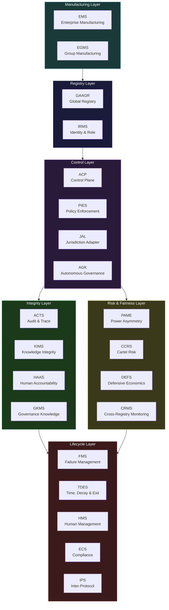
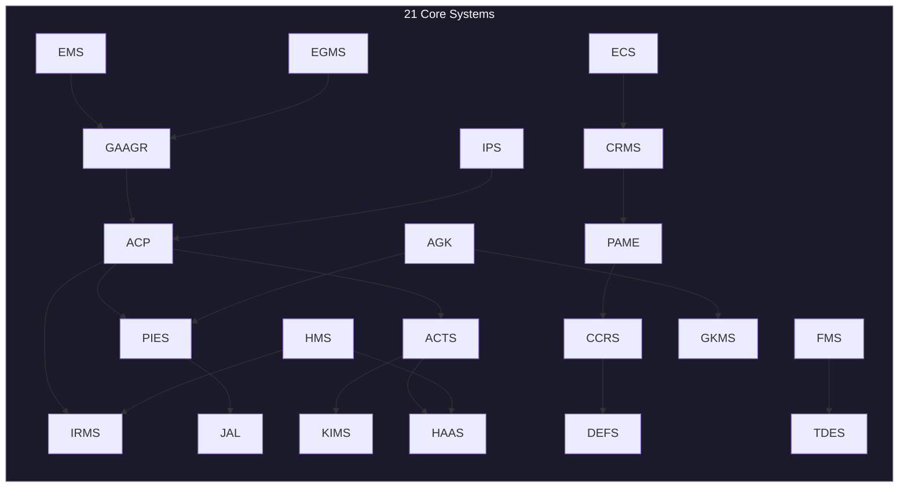

# 21 Core AINEFF Systems

The 21 core systems are the **structural backbone** of the AINEFF Ecosystem. They are not a convenience layer, not a feature set, and not optional modules. They are the minimum viable set of mechanisms required for the constitutional coordination protocol to function at all.

If any of these 21 systems is missing, the protocol degrades from infrastructure to application — from terrain to product. Each is described below with its purpose, explicit non-responsibilities, failure modes, and inter-system dependencies.

---

## Core Systems Architecture

---

## System 1: EMS — Enterprise Manufacturing System

### Purpose

The EMS is the **factory floor** for creating new AINE enterprises. It takes a validated enterprise genome — a complete specification of the enterprise's constitutional structure, capabilities, constraints, and governance bindings — and manufactures a functioning enterprise instance.

This is not deployment. It is not provisioning. It is **manufacturing** — the creation of a governed entity with constitutional properties that are structurally enforced, not culturally adopted.

### What EMS Does NOT Do

- Does not design genomes (that is Enterprise Genome Design, a factory system)
- Does not validate genomes (that is Genome Validation)
- Does not operate the manufactured enterprise (that is the AINE's own PEP Runtime)
- Does not decide what the enterprise should do (that is the enterprise's governance)
- Does not monitor the enterprise after manufacturing (that is CRMS and ECS)

### Failure Modes

| Failure Mode | Severity | Consequence | Mitigation |
|---|---|---|---|
| Incomplete genome accepted | Critical | Enterprise operates with missing constraints | Genome Validation must reject before EMS receives it |
| Duplicate enterprise manufactured | High | Two entities with same identity in the registry | GAAGR deduplication check at manufacturing time |
| Manufacturing process interrupted | Medium | Partial enterprise exists in registry | Atomic manufacturing: either fully created or fully rolled back |
| Constraint binding fails silently | Critical | Enterprise appears governed but is not | Post-manufacturing verification by ECS |

### Inter-System Dependencies

| Depends On | Relationship |
|---|---|
| Genome Validation | Receives only validated genomes |
| GAAGR | Registers manufactured enterprise |
| ACP | Manufacturing authorized by control plane |
| PIES | Policies compiled and bound during manufacturing |
| JAL | Jurisdiction bindings applied during manufacturing |
| IRMS | Identity provisioned during manufacturing |

---

## System 2: EGMS — Enterprise Group Manufacturing System

### Purpose

The EGMS manufactures **AINEG groups** — federations of AINE enterprises that share risk pools, governance coordination, and cross-enterprise obligations. While EMS manufactures individual enterprises, EGMS manufactures the group structure that contains and coordinates them.

A group is not a holding company. It is a **coordination boundary** — a structural container that defines how enterprises within it relate to each other, share risk, settle capital, and coordinate governance.

### What EGMS Does NOT Do

- Does not manufacture individual enterprises (that is EMS)
- Does not manage day-to-day group operations (that is the group's own systems)
- Does not decide group membership (that is Portfolio Lifecycle)
- Does not set risk policies (that is Cross-AINE Risk)

### Failure Modes

| Failure Mode | Severity | Consequence | Mitigation |
|---|---|---|---|
| Group created without contagion firewall | Critical | Failure in one enterprise can cascade to all | Mandatory firewall provisioning during manufacturing |
| Jurisdiction conflict in group membership | High | Enterprises in incompatible jurisdictions grouped together | JAL validation during group assembly |
| Insurance pool under-provisioned | Medium | Insufficient coverage for group-level risk events | Failure Insurance minimum threshold enforcement |

### Inter-System Dependencies

| Depends On | Relationship |
|---|---|
| EMS | Group contains enterprises manufactured by EMS |
| GAAGR | Group registered in global registry |
| Failure Contagion Firewall | Mandatory component of every group |
| Jurisdiction Partition | Ensures legal isolation within the group |

---

## System 3: GAAGR — Global AINE & AINEG Registry

### Purpose

GAAGR is the **canonical source of truth** for every AINE enterprise and AINEG group in the ecosystem. It is the equivalent of a domain name registry for the coordination protocol — the one place where identity, existence, and status are authoritatively recorded.

If it is not in GAAGR, it does not exist. There is no "unregistered" enterprise in the AINEFF Ecosystem, the same way there is no "unregistered" domain on the internet.

### What GAAGR Does NOT Do

- Does not manufacture entities (that is EMS/EGMS)
- Does not govern entities (that is ACP and AGK)
- Does not monitor entity health (that is CRMS)
- Does not store entity data (that is the entity's own data plane)
- Does not authenticate entity actions (that is IRMS)

### Failure Modes

| Failure Mode | Severity | Consequence | Mitigation |
|---|---|---|---|
| Registry becomes unavailable | Critical | No new entities can be manufactured; no lookups possible | Multi-region replication with consensus |
| Stale entry — entity dissolved but still registered | High | Obligations routed to non-existent entity | TDES triggers mandatory deregistration on dissolution |
| Duplicate registration | Critical | Identity collision — two entities appear as one | Cryptographic identity uniqueness enforcement |
| Registry fork — two versions diverge | Critical | Split-brain: different systems see different truth | Consensus protocol prevents divergence |

### Inter-System Dependencies

| Depends On | Relationship |
|---|---|
| EMS / EGMS | Entities registered at manufacturing time |
| IRMS | Identity credentials stored alongside registry entries |
| TDES | Dissolution events trigger deregistration |
| CRMS | Monitoring systems query registry for entity status |

---

## System 4: ACP — AINEF Control Plane

### Purpose

The ACP is the **central nervous system** of the ecosystem. It routes governance signals, enforces authority boundaries, and coordinates system-to-system communication. Every cross-system interaction passes through or is authorized by the control plane.

The ACP does not make decisions. It **routes, authorizes, and enforces**. It is the switchboard, not the operator.

### What ACP Does NOT Do

- Does not make governance decisions (that is AGK)
- Does not store policies (that is PIES)
- Does not audit actions (that is ACTS)
- Does not manage identity (that is IRMS)
- Does not execute business logic (that is PEP Runtime)

### Failure Modes

| Failure Mode | Severity | Consequence | Mitigation |
|---|---|---|---|
| Control plane outage | Critical | All cross-system coordination halts | Graceful degradation: systems operate in isolation with cached authorizations |
| Authorization bypass | Critical | Unauthorized actions execute | Defense in depth: systems independently verify authorization |
| Routing corruption | High | Governance signals reach wrong systems | Cryptographic message integrity and destination verification |
| Latency spike | Medium | Governance decisions delayed beyond SLA | Priority queuing for irreversible-action authorizations |

### Inter-System Dependencies

| Depends On | Relationship |
|---|---|
| GAAGR | Looks up entity identity and status |
| IRMS | Validates identity of requesting systems |
| PIES | Retrieves applicable policies for authorization decisions |
| ACTS | All routing decisions are audit-logged |

---

## System 5: PIES — Policy Ingestion & Enforcement System

### Purpose

PIES takes **human-readable governance policies** — constitutional constraints, regulatory requirements, organizational rules — and compiles them into **machine-enforceable rule sets** that can be evaluated at runtime. It is the compiler that translates intent into enforcement.

A policy that exists only as a document is a suggestion. A policy compiled by PIES is a structural constraint.

### What PIES Does NOT Do

- Does not create policies (policies come from governance processes)
- Does not execute business logic (that is PEP Runtime)
- Does not make judgment calls (it enforces, not decides)
- Does not handle policy conflicts (conflicts must be resolved before ingestion)

### Failure Modes

| Failure Mode | Severity | Consequence | Mitigation |
|---|---|---|---|
| Policy miscompilation | Critical | Enforcement differs from intent | Formal verification of compiled output against source |
| Stale policy in production | High | Outdated rules enforced | Temporal Validity ensures all policies have expiration |
| Conflicting policies accepted | High | Nondeterministic enforcement | Conflict detection at ingestion time |
| Policy compilation too slow | Medium | New regulations cannot be enforced promptly | Priority compilation queue for regulatory changes |

### Inter-System Dependencies

| Depends On | Relationship |
|---|---|
| Governance Axiom System | Axioms constrain what policies can express |
| JAL | Jurisdiction-specific policies require jurisdiction context |
| ACP | Compiled policies distributed via control plane |
| ECS | Compliance system consumes compiled policies |

---

## System 6: JAL — Jurisdiction Adapter Layer

### Purpose

JAL is the **legal translation layer** that maps the ecosystem's universal governance model to the specific requirements of individual legal jurisdictions. Tax law in Germany differs from tax law in Singapore. Employment law in California differs from employment law in Texas. JAL ensures that the protocol operates correctly in all of them without hard-coding any of them.

### What JAL Does NOT Do

- Does not provide legal advice (it maps requirements, not interprets law)
- Does not choose jurisdictions (that is a business decision)
- Does not override local law (it adapts to it)
- Does not replace legal counsel (it supplements operational compliance)

### Failure Modes

| Failure Mode | Severity | Consequence | Mitigation |
|---|---|---|---|
| Incorrect jurisdiction mapping | Critical | Enterprise violates local law while believing it complies | Regular external legal review of mappings |
| Missing jurisdiction adapter | High | Enterprise cannot operate in that jurisdiction | Graceful rejection: refuse to operate rather than operate incorrectly |
| Jurisdiction change not propagated | High | Enterprise operates under outdated rules | Temporal Validity forces periodic revalidation |
| Cross-jurisdiction conflict | Medium | Enterprise subject to conflicting requirements | Jurisdiction Partition ensures legal isolation |

### Inter-System Dependencies

| Depends On | Relationship |
|---|---|
| PIES | Provides jurisdiction context for policy compilation |
| GAAGR | Registry records jurisdiction bindings |
| Jurisdiction Binding (Factory) | Factory system that applies JAL mappings during manufacturing |
| Jurisdiction Partition (Group) | Group system that maintains legal isolation |

---

## System 7: ACTS — Audit & Causal Trace System

### Purpose

ACTS records the **complete causal history** of every significant action in the ecosystem. Not just what happened, but *why* it happened — the chain of decisions, authorizations, data inputs, and policy evaluations that led to each outcome.

ACTS is not a log. Logs record events. ACTS records **causal chains** — directed acyclic graphs of causation that can be traversed backward from any outcome to its root causes.

### What ACTS Does NOT Do

- Does not make decisions (it records them)
- Does not enforce policies (that is PIES)
- Does not generate audit reports (that is Audit Evidence Generator)
- Does not store business data (it stores causal metadata)
- Does not judge whether actions were correct (that is for auditors)

### Failure Modes

| Failure Mode | Severity | Consequence | Mitigation |
|---|---|---|---|
| Causal chain gap | Critical | Action cannot be traced to its root cause | Every action must write its trace before executing |
| Trace tampering | Critical | Audit integrity compromised | Append-only storage with cryptographic integrity proofs |
| Storage exhaustion | High | New traces cannot be recorded | Tiered storage with hot/warm/cold lifecycle |
| Trace latency | Medium | Real-time audit queries return stale results | Event-driven indexing with sub-second propagation |

### Inter-System Dependencies

| Depends On | Relationship |
|---|---|
| ACP | All control plane actions produce traces |
| KIMS | Trace integrity verified by knowledge integrity system |
| HAAS | Human accountability records linked to traces |
| Audit Evidence Standard | Traces conform to evidence standards |

---

## System 8: PAME — Power Asymmetry Metric Engine

### Purpose

PAME continuously measures **power asymmetry** across the ecosystem — detecting when any entity, agent, or participant accumulates disproportionate influence, control, or information advantage. Power asymmetry is the precursor to monopoly, cartel formation, and governance capture.

PAME does not prevent power from existing. It prevents power from becoming **invisible**. The first step toward abuse is always the invisibility of the asymmetry.

### What PAME Does NOT Do

- Does not redistribute power (it measures it)
- Does not set policy on acceptable asymmetry levels (that is governance)
- Does not enforce limits (that is DEFS)
- Does not detect coordination (that is CCRS)

### Failure Modes

| Failure Mode | Severity | Consequence | Mitigation |
|---|---|---|---|
| Metric blindness — asymmetry not detected | Critical | Power concentration grows unchecked | Multi-dimensional measurement: data, capital, authority, information |
| False positive — legitimate scale flagged | Medium | Unnecessary intervention in healthy growth | Calibrated thresholds with governance-reviewed baselines |
| Measurement gaming — entity restructures to hide asymmetry | High | Asymmetry exists but is not measured | Structural analysis that looks through corporate boundaries |

### Inter-System Dependencies

| Depends On | Relationship |
|---|---|
| GAAGR | Entity registry provides the population to measure |
| CCRS | Coordination risk feeds into power asymmetry calculation |
| DEFS | Fairness engine consumes asymmetry metrics |
| CRMS | Cross-registry data provides multi-entity view |

---

## System 9: CCRS — Cartel & Coordination Risk System

### Purpose

CCRS detects **coordinated behavior** among entities that should be operating independently. When multiple enterprises in the same industry begin making suspiciously similar decisions — pricing changes, supplier selections, market entries — CCRS flags the pattern for investigation.

This is not anti-competitive enforcement. It is **coordination risk detection**. The ecosystem is terrain — it must prevent itself from being used as a coordination mechanism for cartel behavior.

### What CCRS Does NOT Do

- Does not prosecute cartel behavior (that is external legal systems)
- Does not prevent cooperation (legitimate cooperation is explicitly supported)
- Does not define what constitutes a cartel (that is legal/regulatory)
- Does not measure individual entity power (that is PAME)

### Failure Modes

| Failure Mode | Severity | Consequence | Mitigation |
|---|---|---|---|
| False negative — cartel undetected | Critical | Ecosystem used to facilitate coordination | Multiple detection algorithms with diverse methodologies |
| False positive — legitimate pattern flagged | Medium | Unnecessary investigation disrupts operations | Human-in-the-loop review before escalation |
| Detection algorithm leaked | High | Bad actors learn to evade detection | Algorithm confidentiality with periodic rotation |

### Inter-System Dependencies

| Depends On | Relationship |
|---|---|
| GAAGR | Entity registry identifies which entities to monitor |
| PAME | Power asymmetry data feeds coordination risk models |
| ACTS | Audit traces reveal temporal coordination patterns |
| DEFS | Fairness engine provides economic context |

---

## System 10: FMS — Failure Management System

### Purpose

FMS is the **central failure authority** for the ecosystem. It classifies failures, routes them to appropriate handlers, tracks their resolution, and ensures that failure information propagates to all systems that need it. Failure is not an exception — it is an expected, managed state.

### What FMS Does NOT Do

- Does not classify failure types (that is Failure Classification System at the framework level)
- Does not allocate failure budgets (that is Failure Budget Allocation)
- Does not record failures immutably (that is Failure Ledger)
- Does not manage failure insurance (that is Failure Insurance)
- Does not fix failures (that is the responsibility of the failing system's operators)

### Failure Modes

| Failure Mode | Severity | Consequence | Mitigation |
|---|---|---|---|
| FMS itself fails | Critical | No failure routing — failures go unmanaged | Self-monitoring with independent watchdog |
| Failure misclassified | High | Wrong handler, wrong response, wrong escalation | Classification validation against Failure Classification System |
| Failure suppressed | Critical | Failure exists but is invisible to the ecosystem | Mandatory failure reporting with dead-man switches |
| Cascade failure overwhelms FMS | High | Too many simultaneous failures to process | Priority queuing: irreversible-action failures first |

### Inter-System Dependencies

| Depends On | Relationship |
|---|---|
| Failure Classification System | Canonical taxonomy for classifying failures |
| Failure Ledger | Immutable record of all failures |
| Kill-Switch & Suspension | FMS can trigger system suspension |
| ACTS | All failure events produce audit traces |
| Human Escalation | Critical failures escalate to humans |

---

## System 11: TDES — Time, Decay & Exit System

### Purpose

TDES enforces the fundamental principle that **nothing is permanent**. Every permission, every role binding, every governance assertion, every obligation — all have expiration dates. TDES manages the lifecycle clock for every temporal artifact in the ecosystem.

This is not housekeeping. It is a **structural defense against institutional ossification**. Organizations die slowly when permissions never expire, roles never rotate, and governance never refreshes. TDES prevents the slow death.

### What TDES Does NOT Do

- Does not decide lifetimes (governance sets durations, TDES enforces them)
- Does not extend expired artifacts (renewal requires explicit governance action)
- Does not manage enterprise-level exit (that is Exit Orchestration and Enterprise Exit Controller)
- Does not handle data retention/deletion (that is Right-to-Erasure and Knowledge Disposition)

### Failure Modes

| Failure Mode | Severity | Consequence | Mitigation |
|---|---|---|---|
| Expiration not enforced | Critical | Permissions persist beyond their valid period | Hard enforcement: expired artifacts are cryptographically invalidated |
| Clock drift between systems | High | Different systems disagree on what is expired | Centralized time authority with NTP-grade synchronization |
| Mass expiration storm | Medium | Too many artifacts expire simultaneously | Staggered expiration scheduling |

### Inter-System Dependencies

| Depends On | Relationship |
|---|---|
| Temporal Validity System | Framework-level rules for temporal validity |
| GAAGR | Deregistration triggered on entity dissolution |
| IRMS | Role bindings subject to temporal decay |
| ACTS | All expiration events produce audit traces |

---

## System 12: GKMS — Governance Knowledge Management System

### Purpose

GKMS manages the **knowledge artifacts** that governance requires — constitutional documents, policy histories, precedent databases, governance rationales, amendment records. It is the institutional memory of the governance layer.

### What GKMS Does NOT Do

- Does not create governance decisions (governance bodies do that)
- Does not enforce policies (that is PIES)
- Does not manage operational data (that is the enterprise's data plane)
- Does not handle knowledge decay (that is Knowledge Decay in the factory layer)

### Failure Modes

| Failure Mode | Severity | Consequence | Mitigation |
|---|---|---|---|
| Knowledge corruption | Critical | Governance operates on corrupted precedent | KIMS integrity verification |
| Version history lost | High | Cannot trace how governance evolved | Append-only versioning with integrity proofs |
| Knowledge inaccessible | Medium | Governance decisions made without full context | Multi-region replication and caching |

### Inter-System Dependencies

| Depends On | Relationship |
|---|---|
| KIMS | Knowledge integrity verified continuously |
| ACTS | Governance decisions linked to knowledge artifacts |
| Temporal Validity | Knowledge artifacts subject to expiration |
| AGK | Autonomous governance kernel queries knowledge base |

---

## System 13: HMS — Human Management System

### Purpose

HMS manages the **human participants** in the ecosystem — not as employees, but as governance actors, liability bearers, oversight authorities, and accountability subjects. Every human who interacts with the ecosystem in a governance capacity is managed by HMS.

### What HMS Does NOT Do

- Does not manage employment (that is an enterprise-level HR function)
- Does not track productivity (it tracks governance participation)
- Does not replace HR systems (it governs the governance role of humans)
- Does not manage AI agents (that is Agent Execution)

### Failure Modes

| Failure Mode | Severity | Consequence | Mitigation |
|---|---|---|---|
| Human unavailable for liability binding | Critical | Irreversible actions blocked (by design) | Succession protocols ensure backup liability bearers |
| Identity spoofing | Critical | Wrong human bound to obligation | Multi-factor identity verification via IRMS |
| Human overload | High | Governance fatigue leads to rubber-stamping | Override Quota system limits approval volume |

### Inter-System Dependencies

| Depends On | Relationship |
|---|---|
| IRMS | Human identity management |
| HAAS | Human accountability tracking |
| Human-in-the-Loop Governance | Mandatory human checkpoints |
| Override Quota | Limits on human override frequency |

---

## System 14: IRMS — Identity & Role Management System

### Purpose

IRMS is the **identity authority** for the ecosystem. Every entity — human, agent, enterprise, group — has an IRMS-managed identity. Every role binding, every capability grant, every authority delegation is tracked by IRMS.

### What IRMS Does NOT Do

- Does not make authorization decisions (that is ACP and Decision Authorization)
- Does not manage the lifecycle of entities (that is EMS/EGMS/TDES)
- Does not store personal data (it stores identity bindings and role assignments)
- Does not authenticate external users (it manages internal identity)

### Failure Modes

| Failure Mode | Severity | Consequence | Mitigation |
|---|---|---|---|
| Identity compromise | Critical | Attacker operates as legitimate entity | Cryptographic identity with hardware key binding |
| Role binding corruption | Critical | Entity has wrong permissions | Continuous role verification against IRMS |
| Identity service unavailable | Critical | No authentication possible | Cached credentials with short TTL for graceful degradation |

### Inter-System Dependencies

| Depends On | Relationship |
|---|---|
| GAAGR | Entity existence verified before identity provisioning |
| ACP | Control plane consults IRMS for all authorization |
| TDES | Role bindings subject to temporal decay |
| ACTS | All identity and role changes produce audit traces |

---

## System 15: HAAS — Human Accountability & Audit System

### Purpose

HAAS tracks the **accountability chain** for every human governance action. When a human approves an obligation, overrides a policy, or binds themselves as liability bearer, HAAS records the action, the context, and the causal chain that led to it.

### What HAAS Does NOT Do

- Does not enforce accountability (enforcement is structural via the Atomic Constraint)
- Does not judge human performance (it records, not evaluates)
- Does not manage human identity (that is IRMS)
- Does not manage non-human accountability (agents are tracked by Agent Execution)

### Failure Modes

| Failure Mode | Severity | Consequence | Mitigation |
|---|---|---|---|
| Accountability gap — action without recorded human | Critical | Violates the Atomic Constraint | Pre-execution verification: no trace, no execution |
| Accountability attributed to wrong human | Critical | Wrong person bears consequences | Multi-factor verification at binding time |
| Accountability records tampered | Critical | Audit integrity destroyed | Append-only storage with cryptographic integrity |

### Inter-System Dependencies

| Depends On | Relationship |
|---|---|
| IRMS | Human identity verified before accountability recording |
| ACTS | Accountability records are a subset of causal traces |
| HMS | Human management provides context for accountability |
| Audit Evidence Standard | Accountability records conform to evidence standards |

---

## System 16: AGK — Autonomous Governance Kernel

### Purpose

AGK is the **self-governing core** of the ecosystem. It manages the governance processes that cannot be delegated to any individual entity — constitutional amendments, framework evolution, cross-layer governance coordination. AGK ensures that governance itself is governed.

### What AGK Does NOT Do

- Does not make business decisions (governance is structural, not operational)
- Does not override the Atomic Constraint (nothing can)
- Does not manage individual entity governance (entities govern themselves within constraints)
- Does not execute policies (that is PIES)

### Failure Modes

| Failure Mode | Severity | Consequence | Mitigation |
|---|---|---|---|
| Governance capture | Critical | AGK serves a faction rather than the protocol | Structural checks: no single entity can control AGK |
| Governance paralysis | High | AGK cannot reach decisions | Default-to-constraint: inaction preserves existing constraints |
| Constitutional amendment error | Critical | Framework constraint violated | Multi-layer ratification with formal verification |

### Inter-System Dependencies

| Depends On | Relationship |
|---|---|
| GKMS | Governance knowledge base for decision context |
| PIES | Compiled policies distributed after governance decisions |
| Anti-ASI Constraint | AGK itself is subject to anti-ASI limits |
| ACTS | All governance decisions produce audit traces |
| HAAS | Human ratification required for constitutional changes |

---

## System 17: IPS — Inter-Protocol System

### Purpose

IPS manages the **boundary between PCP (Protocol Control Plane) and PEP (Protocol Execution Plane)**. This boundary is the most critical architectural division in the ecosystem: governance must never leak into execution, and execution must never contaminate governance.

### What IPS Does NOT Do

- Does not execute PCP logic (that is AGK and ACP)
- Does not execute PEP logic (that is PEP Runtime)
- Does not define what belongs in PCP vs PEP (that is Protocol Class System)
- Does not store data for either side (each has its own data plane)

### Failure Modes

| Failure Mode | Severity | Consequence | Mitigation |
|---|---|---|---|
| PCP/PEP boundary breach | Critical | Governance and execution states contaminate each other | Protocol Isolation system provides defense in depth |
| Message corruption at boundary | High | Governance intent distorted in execution | End-to-end message integrity verification |
| Boundary latency | Medium | Governance decisions not reflected in execution promptly | Priority routing for irreversible-action governance |

### Inter-System Dependencies

| Depends On | Relationship |
|---|---|
| Protocol Class System | Defines what crosses the boundary and how |
| Protocol Isolation (Factory) | Structural isolation at manufacturing time |
| ACP | Governance-side routing |
| PEP Runtime | Execution-side routing |

---

## System 18: KIMS — Knowledge Integrity Management System

### Purpose

KIMS ensures that **every knowledge artifact** in the ecosystem — policies, traces, records, configurations, models — maintains its integrity over time. Knowledge that has been tampered with, corrupted, or degraded is detected and flagged before it can influence decisions.

### What KIMS Does NOT Do

- Does not create knowledge (that is the responsibility of each system)
- Does not manage knowledge lifecycle (that is Knowledge Decay and GKMS)
- Does not interpret knowledge (it verifies integrity, not meaning)
- Does not store knowledge (it stores integrity proofs)

### Failure Modes

| Failure Mode | Severity | Consequence | Mitigation |
|---|---|---|---|
| Integrity check failure | Critical | Corrupted knowledge used for decisions | Halt-on-failure: no decision proceeds with unverified knowledge |
| Integrity proof corruption | Critical | Cannot verify whether knowledge is intact | Distributed integrity proofs across independent stores |
| Verification too slow | Medium | Knowledge access bottlenecked | Tiered verification: fast probabilistic checks, slow full verification |

### Inter-System Dependencies

| Depends On | Relationship |
|---|---|
| GKMS | Governance knowledge verified continuously |
| ACTS | Audit traces verified for integrity |
| Audit Evidence Standard | Integrity proofs conform to evidence standards |
| Knowledge Decay | Decay events verified before execution |

---

## System 19: ECS — Enterprise Compliance System

### Purpose

ECS is the **runtime compliance engine** that continuously verifies whether operating enterprises remain within their constitutional constraints. Post-manufacturing, enterprises can drift — ECS detects the drift before it becomes a violation.

### What ECS Does NOT Do

- Does not define compliance requirements (that is PIES and governance)
- Does not enforce compliance at runtime (that is Compliance Enforcement at the enterprise level)
- Does not remediate violations (it detects and escalates)
- Does not audit historical compliance (that is ACTS)

### Failure Modes

| Failure Mode | Severity | Consequence | Mitigation |
|---|---|---|---|
| Compliance drift undetected | Critical | Enterprise violates constraints without detection | Continuous monitoring with multiple detection vectors |
| False compliance — enterprise appears compliant but is not | Critical | Provides false assurance to stakeholders | Independent verification by CRMS |
| ECS monitoring gap | High | Some aspects of compliance not checked | Comprehensive compliance map derived from compiled policies |

### Inter-System Dependencies

| Depends On | Relationship |
|---|---|
| PIES | Compiled policies define compliance requirements |
| GAAGR | Enterprise registry provides monitoring targets |
| CRMS | Cross-registry monitoring provides independent verification |
| FMS | Compliance violations routed as failures |
| Regulatory Review | External oversight consumes compliance data |

---

## System 20: CRMS — Cross-Registry Monitoring System

### Purpose

CRMS provides **independent, cross-cutting monitoring** across the entire ecosystem. While ECS monitors individual enterprise compliance, CRMS monitors patterns that only become visible when you look across multiple enterprises, groups, and registries simultaneously.

### What CRMS Does NOT Do

- Does not monitor individual enterprise internals (that is ECS and Internal Failure Monitor)
- Does not make governance decisions (it informs them)
- Does not enforce corrective actions (it escalates to appropriate authorities)
- Does not replace entity-level monitoring (it supplements it)

### Failure Modes

| Failure Mode | Severity | Consequence | Mitigation |
|---|---|---|---|
| Cross-registry pattern missed | High | Systemic risk undetected | Multiple analysis algorithms with diverse methodologies |
| Data access restricted by entity | Medium | Incomplete view leads to blind spots | Mandatory monitoring data sharing as condition of registration |
| Monitoring itself becomes a power asymmetry | Medium | CRMS accumulates disproportionate information | PAME monitors CRMS itself; data retention limits enforced |

### Inter-System Dependencies

| Depends On | Relationship |
|---|---|
| GAAGR | Registry data provides monitoring population |
| ECS | Entity-level compliance data feeds cross-registry analysis |
| PAME | Power asymmetry metrics feed cross-registry risk models |
| CCRS | Cartel detection benefits from cross-registry view |
| ACTS | Cross-registry audit trace analysis |

---

## System 21: DEFS — Defensive Economics & Fairness System

### Purpose

DEFS ensures that the ecosystem's economic mechanisms do not create **unfair advantages, extractive dynamics, or structural exploitation**. It monitors pricing, value distribution, and economic power flows to detect and flag patterns that would undermine the ecosystem's legitimacy as neutral infrastructure.

The ecosystem is terrain. Terrain that systematically advantages some travelers over others is not terrain — it is a toll road owned by the powerful. DEFS prevents this.

### What DEFS Does NOT Do

- Does not set prices (that is market dynamics and governance)
- Does not redistribute wealth (it detects unfairness, not corrects it)
- Does not replace competition law (it supplements it)
- Does not optimize for any particular economic outcome (it ensures fairness of process, not equality of outcome)

### Failure Modes

| Failure Mode | Severity | Consequence | Mitigation |
|---|---|---|---|
| Extractive dynamic undetected | Critical | Ecosystem becomes a tool for exploitation | Multi-dimensional fairness metrics spanning price, access, information, authority |
| Fairness metric gaming | High | Entities appear fair while behaving extractively | Adversarial testing of fairness metrics |
| Over-correction — legitimate value creation flagged | Medium | Innovation punished | Clear distinction between value creation and value extraction |

### Inter-System Dependencies

| Depends On | Relationship |
|---|---|
| PAME | Power asymmetry data feeds fairness analysis |
| CCRS | Coordination risk data reveals economic collusion |
| CRMS | Cross-registry data provides ecosystem-wide economic view |
| Insurance Pricing | Economic fairness influences insurance pricing |
| Capital Settlement | Settlement data reveals value flow patterns |

---

## Summary: The 21-System Dependency Map

Every arrow represents a structural dependency — not a convenience integration, but a relationship where the downstream system cannot function without the upstream system's output. Remove any single system, and the dependency graph breaks.
