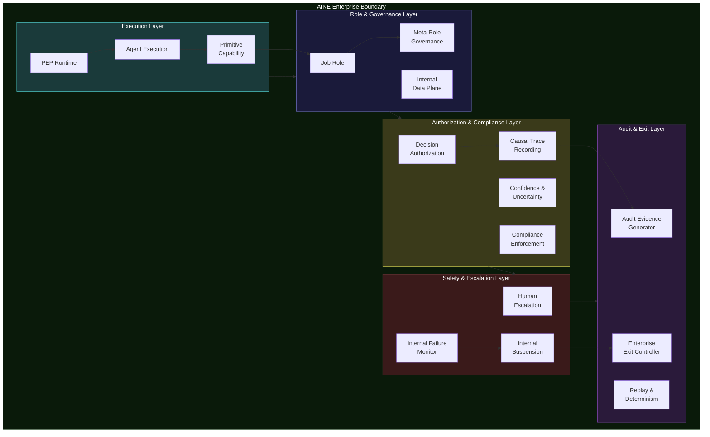
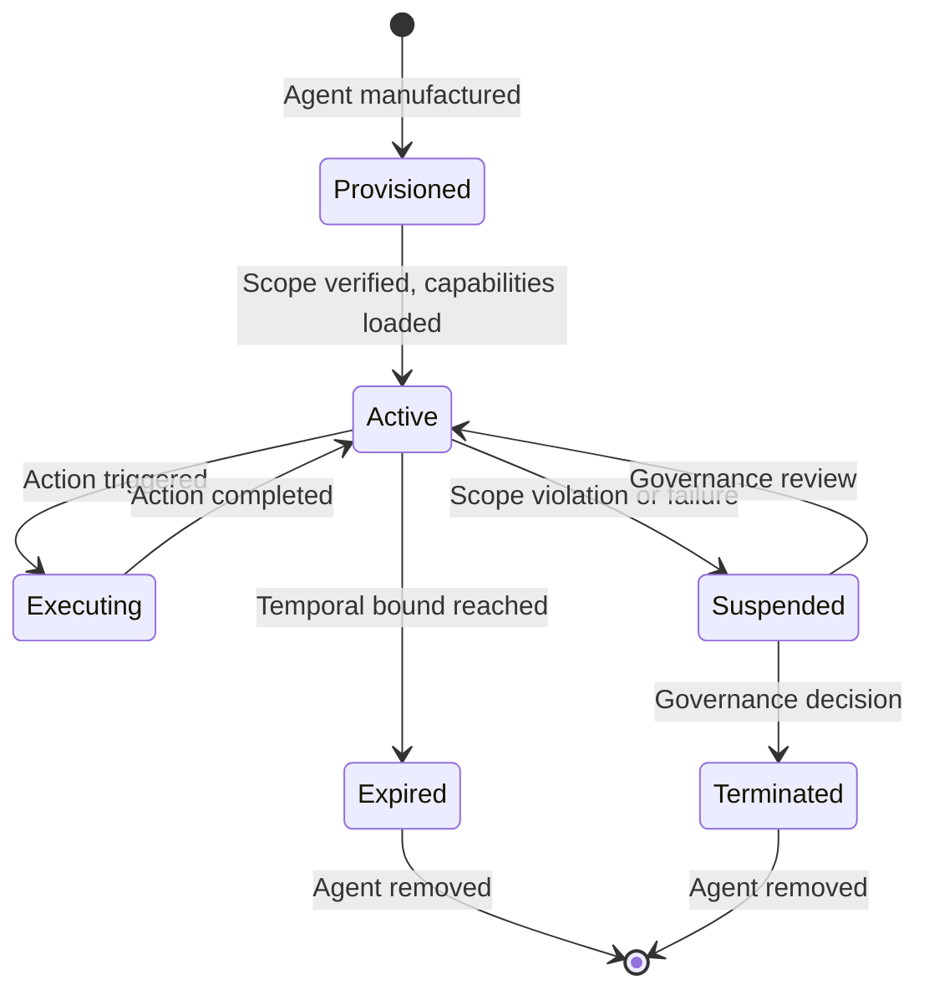
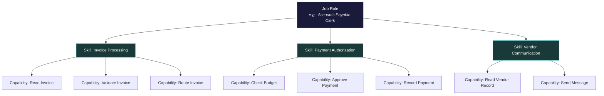
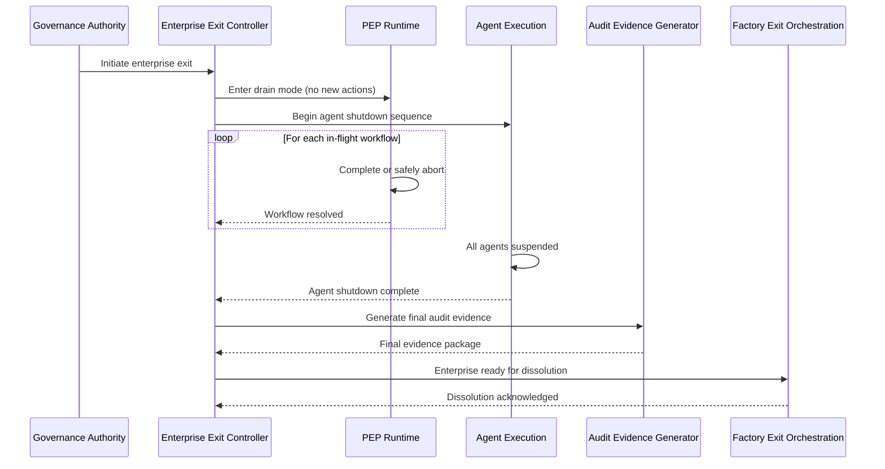

# 16 AINE Enterprise Systems

An AINE enterprise is the **atomic productive unit** of the AINEFF Ecosystem. It is where obligations are executed, value is created, and accountability is exercised. The 16 enterprise-level systems provide the runtime infrastructure that every AINE needs to operate within its constitutional constraints.

These systems are not optional features. They are the **minimum viable operating environment** for a governed enterprise. An AINE without any one of these systems is an ungoverned entity — and ungoverned entities do not exist in the ecosystem.

---

## Enterprise Runtime Architecture

---

## Execution Layer

### System 45: PEP Runtime

#### Purpose

The PEP Runtime is the **execution engine** for the enterprise. It takes the Protocol Execution Package (generated by PEP-GEN during manufacturing) and runs it — executing business logic, processing obligations, and enforcing governance constraints at runtime.

The PEP Runtime is the point where governance meets execution. Every action that the enterprise takes passes through this runtime, where it is checked against compiled policies, authorized by the appropriate authority, and recorded in the audit trail.

#### Runtime Properties

| Property | Specification |
|---|---|
| **Execution model** | Event-driven with synchronous policy checks for irreversible actions |
| **Isolation** | Each enterprise runs in its own isolated runtime instance |
| **State management** | Persistent state with transactional semantics |
| **Policy enforcement** | Every action checked against compiled policy set before execution |
| **Audit integration** | Every action produces a causal trace entry in ACTS |
| **Failure handling** | Graceful degradation for non-critical failures; halt for critical |
| **Kill-switch** | Infrastructure-level kill-switch operates below the runtime |

#### What It Does NOT Do

- Does not generate the PEP (that is PEP-GEN at the factory level)
- Does not modify the PEP at runtime (modifications require re-manufacturing)
- Does not manage agents (that is Agent Execution)
- Does not make governance decisions (it enforces them)
- Does not handle cross-enterprise communication (that is IPS)

#### Failure Modes

| Failure Mode | Severity | Consequence | Mitigation |
|---|---|---|---|
| Runtime crash | Critical | All enterprise operations halt | Automatic restart from last consistent state |
| Policy enforcement bypass | Critical | Actions execute without governance checks | Defense in depth: multiple enforcement points |
| State corruption | Critical | Enterprise state becomes inconsistent | Transactional state management with rollback |
| Performance degradation | Medium | Actions delayed beyond SLA | Auto-scaling with governance-approved capacity limits |

---

### System 46: Agent Execution

#### Purpose

Agent Execution manages the **runtime lifecycle of agents** within the enterprise. Each agent — human, AI, hybrid, or composite — operates within the Agent Execution environment, which enforces scope boundaries, manages capabilities, and monitors behavior.

#### Agent Lifecycle States

#### Agent Execution Guarantees

| Guarantee | Enforcement Mechanism |
|---|---|
| **Scope containment** | Every action checked against agent's scope boundary |
| **Capability enforcement** | Agent can only use capabilities in its manifest |
| **Temporal bound** | Agent automatically expires at its declared lifetime |
| **Audit trail** | Every agent action produces a causal trace entry |
| **Kill-switch** | Any agent can be terminated immediately by authorized human |
| **Isolation** | Agent state is isolated from other agents |

#### What It Does NOT Do

- Does not manufacture agents (that is Agent Foundry)
- Does not define agent scopes (that is the genome)
- Does not manage the PEP Runtime (it operates within it)
- Does not handle human management (that is HMS)

---

### System 47: Primitive Capability

#### Purpose

Primitive Capability is the **registry of atomic capabilities** available to agents within the enterprise. A capability is the smallest indivisible unit of action — "read invoice," "approve payment," "send notification." Capabilities compose into skills, which compose into roles.

#### Capability Hierarchy

#### Capability Properties

| Property | Description |
|---|---|
| **Atomic** | A capability cannot be decomposed further |
| **Deterministic** | Given the same inputs, a capability produces the same outputs |
| **Auditable** | Every capability invocation produces a trace record |
| **Scopeable** | A capability can be restricted by data boundary, jurisdiction, or time |
| **Revocable** | A capability can be revoked at any time by governance authority |

#### What It Does NOT Do

- Does not compose capabilities into skills (that is Skill Composition System)
- Does not grant capabilities to agents (that is the genome via Agent Foundry)
- Does not define what capabilities exist in the ecosystem (that is Canonical Skills Ontology)

---

## Role & Governance Layer

### System 48: Job Role

#### Purpose

Job Role defines and enforces **job roles as compositions of capabilities and skills**. A job role is a named bundle of capabilities that an agent needs to perform a specific function within the enterprise. Roles are not titles — they are structural authority containers.

#### Role Specification

| Property | Description | Source |
|---|---|---|
| **Role ID** | Unique identifier within the enterprise | Genome |
| **Capabilities** | List of capabilities included in this role | Primitive Capability |
| **Skills** | Composed skills required for this role | Skill Composition System |
| **Authority level** | Maximum authority this role can exercise | Governance binding |
| **Data scope** | What data this role can access | Internal Data Plane |
| **Temporal bound** | When this role binding expires | Temporal Governance |
| **Override authority** | Whether this role can override automated decisions | Override Quota |
| **Escalation path** | Where this role escalates when it exceeds authority | Human Escalation |

#### What It Does NOT Do

- Does not assign roles to agents (that is governance via IRMS)
- Does not create new capabilities (those exist in Primitive Capability)
- Does not evaluate role performance (it defines structure, not outcomes)

---

### System 49: Meta-Role Governance

#### Purpose

Meta-Role Governance governs **who can create, modify, or destroy roles**. This is governance of governance — the system that ensures role architecture itself is under constitutional control.

#### Authority Matrix

| Action | Required Authority | Audit Level | Reversible |
|---|---|---|---|
| **Create new role** | Enterprise governance authority | Full trace | Yes (role can be retired) |
| **Modify role capabilities** | Enterprise governance authority + ACP | Full trace | Yes (revert to prior version) |
| **Assign role to agent** | Role-granting authority | Full trace | Yes (revoke assignment) |
| **Retire role** | Enterprise governance authority | Full trace | No (retirement is permanent; can create new role) |
| **Expand role authority** | Enterprise governance + group governance | Full trace + escalation | Yes |
| **Create meta-role** | AGK | Full trace + constitutional review | Only via governance process |

#### What It Does NOT Do

- Does not manage individual role assignments (that is IRMS)
- Does not enforce capabilities at runtime (that is Agent Scope Enforcement)
- Does not manage human roles outside governance context (that is HMS)

---

### System 50: Internal Data Plane

#### Purpose

The Internal Data Plane manages **all data flow within the enterprise**, enforcing information boundaries between agents, roles, and subsystems. Data does not flow freely — it flows through governed channels with access controls, audit trails, and jurisdictional compliance.

#### Data Flow Rules

| Rule | What It Enforces |
|---|---|
| **Need-to-know** | Agents only access data required for their current action |
| **Data classification** | All data is classified (public, internal, confidential, restricted) |
| **Boundary enforcement** | Data cannot cross role boundaries without explicit authorization |
| **Jurisdiction compliance** | Data residency rules enforced at every access point |
| **Audit trail** | Every data access produces a trace record |
| **Decay compliance** | Decayed knowledge flagged at access time |

#### What It Does NOT Do

- Does not store data long-term (it manages flow, not storage)
- Does not classify data (classification is a governance function)
- Does not manage cross-enterprise data flow (that is IPS and group systems)

---

## Authorization & Compliance Layer

### System 51: Decision Authorization

#### Purpose

Decision Authorization enforces **multi-level authorization** for decisions that exceed defined thresholds. Not every decision requires explicit authorization — but decisions above threshold do, and the authorization requirements escalate with the decision's impact and irreversibility.

#### Authorization Tiers

| Tier | Threshold | Authorization Required | Response Time |
|---|---|---|---|
| **Tier 0 — Automated** | Below all thresholds | None (within agent scope) | Instant |
| **Tier 1 — Notify** | Low-impact, reversible | Post-hoc notification to authority | Seconds |
| **Tier 2 — Approve** | Medium-impact or partially reversible | Pre-execution approval by authority | Minutes |
| **Tier 3 — Ratify** | High-impact or irreversible | Multi-party ratification | Hours |
| **Tier 4 — Escalate** | Enterprise-level impact | Group governance involvement | Days |
| **Tier 5 — Constitutional** | Cross-entity or precedent-setting | AGK ratification | Weeks |

#### What It Does NOT Do

- Does not make the decisions (it authorizes them)
- Does not set the thresholds (governance sets, this system enforces)
- Does not execute authorized decisions (that is PEP Runtime)

---

### System 52: Causal Trace Recording

#### Purpose

Causal Trace Recording captures the **complete causal chain** for every significant action within the enterprise. This is the enterprise-level instantiation of ACTS — every decision, every data access, every authorization check, every capability invocation is recorded with its causal context.

#### Trace Record Structure

| Field | Description | Required |
|---|---|---|
| **Trace ID** | Unique identifier for this trace entry | Yes |
| **Parent Trace ID** | The trace entry that caused this action | Yes (root actions have null parent) |
| **Action** | What was done | Yes |
| **Actor** | Who or what did it (agent, role, system) | Yes |
| **Timestamp** | When it happened (time-authority verified) | Yes |
| **Policy evaluated** | Which policy rules were checked | Yes |
| **Authorization** | How the action was authorized | Yes |
| **Data inputs** | What data was used (references, not copies) | Yes |
| **Outcome** | What resulted | Yes |
| **Confidence** | Confidence score (for probabilistic actions) | When applicable |

#### What It Does NOT Do

- Does not analyze traces (that is auditors and oversight systems)
- Does not store business data (it stores causal metadata)
- Does not aggregate traces (that is Mass Audit Aggregation)

---

### System 53: Confidence & Uncertainty

#### Purpose

Confidence & Uncertainty tracks and propagates **confidence scores and uncertainty estimates** through decision chains. When an AI model produces an output with 85% confidence, and that output feeds into a decision that feeds into an action, the uncertainty propagates — and the system tracks it at every step.

#### Propagation Rules

| Scenario | Confidence Propagation | Consequence |
|---|---|---|
| **Single source, high confidence** | Pass through | No additional review required |
| **Single source, low confidence** | Flag for review | Human-in-the-loop checkpoint triggered |
| **Multiple sources, agreeing** | Increase (bounded) | Higher authorization tier may be unlocked |
| **Multiple sources, disagreeing** | Decrease | Lower authorization tier applied; human review required |
| **Chain of decisions** | Multiply (confidence degrades) | Long chains automatically trigger human review |
| **Unknown confidence** | Treated as zero confidence | Human authorization required |

#### What It Does NOT Do

- Does not determine confidence values (each system/model reports its own)
- Does not override authorization based on confidence (it informs, not decides)
- Does not apply to deterministic actions (only probabilistic or judgment-based actions)

---

### System 54: Compliance Enforcement

#### Purpose

Compliance Enforcement is the **runtime enforcement engine** for compliance rules within the enterprise. It takes the compiled policies from PIES and enforces them at every relevant execution point — checking that actions, data flows, and decisions comply before they execute.

#### Enforcement Points

| Point | What Is Checked | Enforcement Action |
|---|---|---|
| **Capability invocation** | Agent has capability and scope | Block if unauthorized |
| **Data access** | Agent has access and data is within scope | Block if out of scope |
| **Decision authorization** | Correct authorization tier obtained | Block if under-authorized |
| **Obligation execution** | Action complies with all applicable policies | Block if non-compliant |
| **Temporal validity** | All bindings and permissions are current | Block if expired |
| **Jurisdiction compliance** | Action complies with applicable jurisdiction rules | Block if jurisdiction violation |

#### What It Does NOT Do

- Does not define compliance rules (PIES defines, this system enforces)
- Does not monitor compliance trends (that is ECS)
- Does not remediate violations (it blocks them)

---

## Safety & Escalation Layer

### System 55: Human Escalation

#### Purpose

Human Escalation manages the **escalation paths** from automated systems to human decision-makers. When an automated process encounters a situation it cannot handle — uncertainty too high, authority insufficient, policy unclear — it escalates to a human through this system.

#### Escalation Triggers

| Trigger | Source | Escalation Target |
|---|---|---|
| **Confidence below threshold** | Confidence & Uncertainty | Designated reviewer for the action type |
| **Authority exceeded** | Decision Authorization | Next authority level in governance chain |
| **Policy ambiguity** | Compliance Enforcement | Governance authority for the policy domain |
| **Failure detected** | Internal Failure Monitor | System operator + governance if critical |
| **Scope boundary approached** | Agent Scope Enforcement | Agent's governance authority |
| **Override requested** | Any system | Override-authorized human per Override Quota |

#### Escalation Properties

| Property | Specification |
|---|---|
| **Mandatory response** | Every escalation must receive a response (no silent drops) |
| **Timeout handling** | Escalation auto-re-routes if not responded to within SLA |
| **Context preservation** | Full context (causal trace, data, policy state) provided to human |
| **Audit trail** | Escalation, response, and outcome all recorded |
| **No infinite loops** | Maximum escalation depth enforced; terminal escalation goes to kill-switch authority |

#### What It Does NOT Do

- Does not make decisions for humans (it routes decisions to humans)
- Does not replace human judgment (it ensures human judgment is available)
- Does not manage human workload (that is Override Quota)

---

### System 56: Internal Failure Monitor

#### Purpose

Internal Failure Monitor continuously watches for **failure conditions** within the enterprise — performance degradation, policy violations, agent scope breaches, data integrity issues, and any other anomaly that indicates the enterprise is operating outside its constitutional constraints.

#### Monitoring Categories

| Category | What Is Monitored | Detection Method |
|---|---|---|
| **Performance** | Latency, throughput, error rates | Threshold monitoring |
| **Compliance** | Policy adherence, authorization correctness | Continuous policy evaluation |
| **Integrity** | Data consistency, trace completeness, state validity | Integrity proof verification |
| **Scope** | Agent boundary compliance, data boundary compliance | Scope enforcement monitoring |
| **Budget** | Failure budget consumption, resource utilization | Budget tracking against allocation |
| **Temporal** | Expired bindings, overdue renewals, clock synchronization | Temporal validity checking |

#### What It Does NOT Do

- Does not fix failures (it detects and routes them)
- Does not classify failures (it applies the Failure Classification System taxonomy)
- Does not manage group-level failure (that is Cross-AINE Risk and FMS)

---

### System 57: Internal Suspension

#### Purpose

Internal Suspension provides the capability to **suspend specific agents, roles, or workflows** within the enterprise without shutting down the entire enterprise. It is a surgical tool — more precise than the kill-switch, less disruptive than full enterprise suspension.

#### Suspension Scope

| Scope | What Is Suspended | What Continues | Authorization |
|---|---|---|---|
| **Single agent** | One agent stops executing | All other agents and workflows | Agent's governance authority |
| **Role** | All agents in a role stop executing | Other roles and workflows | Enterprise governance authority |
| **Workflow** | Specific workflow halted | Other workflows | Workflow governance authority |
| **Subsystem** | Specific enterprise subsystem halted | Other subsystems | Enterprise governance authority |
| **Data scope** | Access to specific data blocked | All non-affected data flows | Data governance authority |

#### What It Does NOT Do

- Does not suspend the entire enterprise (that is Kill-Switch & Suspension)
- Does not determine what to suspend (governance and FMS decide)
- Does not resolve the underlying issue (that is the responsible operator)

---

## Audit & Exit Layer

### System 58: Audit Evidence Generator

#### Purpose

The Audit Evidence Generator takes raw runtime data — causal traces, decision records, compliance checks, failure logs — and packages them into **audit-ready evidence** that meets the standards defined by the Audit Evidence Standard System.

#### Evidence Package Contents

| Component | Description | Standard |
|---|---|---|
| **Executive summary** | Human-readable summary of the audited period | Plain language |
| **Causal trace extract** | Relevant portions of the causal trace graph | Audit Evidence Standard |
| **Policy compliance report** | Compliance status for all applicable policies | Compliance Standard |
| **Failure report** | All failures, their classification, and resolution | Failure Classification Standard |
| **Authorization audit** | All authorization decisions and their basis | Authorization Standard |
| **Temporal validity report** | All expired and renewed bindings | Temporal Validity Standard |
| **Integrity proof** | Cryptographic proof of evidence integrity | KIMS integrity standard |

#### What It Does NOT Do

- Does not interpret evidence (that is auditors)
- Does not store evidence long-term (that is audit storage systems)
- Does not aggregate across enterprises (that is Mass Audit Aggregation)

---

### System 59: Replay & Determinism

#### Purpose

Replay & Determinism enables the **deterministic replay** of any decision chain within the enterprise for audit purposes. Given the same inputs, the same state, and the same policies, the replay produces the same outputs — proving (or disproving) that the original execution was correct.

#### Replay Requirements

| Requirement | Purpose |
|---|---|
| **Input capture** | All inputs to every decision are recorded | Reproduce exact conditions |
| **State snapshot** | Enterprise state is periodically checkpointed | Restore to any point in time |
| **Policy versioning** | The exact policy version in effect at every moment is recorded | Apply correct rules |
| **Random seed recording** | All sources of non-determinism are captured | Eliminate randomness in replay |
| **Clock recording** | The exact timestamps of all events are recorded | Reproduce temporal ordering |

#### What It Does NOT Do

- Does not replace real-time monitoring (it is for post-hoc analysis)
- Does not guarantee replay of all actions (some external dependencies may not be replayable)
- Does not modify production state (replays execute in isolated sandboxes)

---

### System 60: Enterprise Exit Controller

#### Purpose

The Enterprise Exit Controller manages the **orderly shutdown of an individual enterprise**. It coordinates with the factory-level Exit Orchestration system but handles the enterprise-internal aspects — draining active workflows, completing in-flight obligations, settling internal accounts, and preparing for dissolution.

#### Exit Sequence

#### What It Does NOT Do

- Does not decide to exit (governance decides)
- Does not manage obligation transfer to successors (that is Exit Orchestration)
- Does not destroy keys (that is Key Destruction & Seal)
- Does not handle group-level exit coordination (that is Portfolio Lifecycle)
