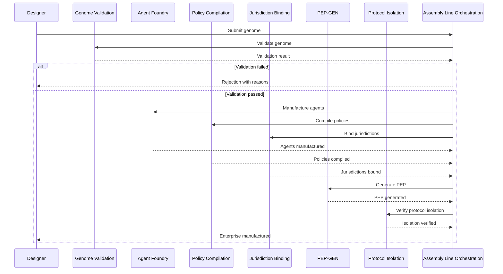
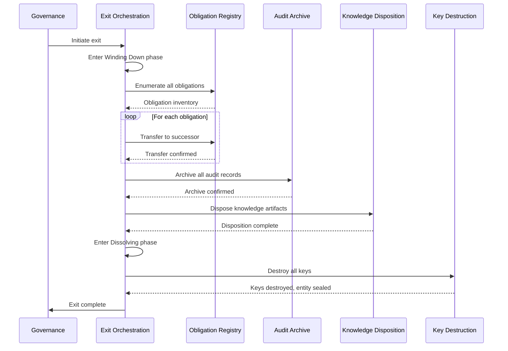

---

sidebar_position: 4
title: "21 AINEF Factory Systems"
description: "Complete specification of the 21 factory-level systems that manufacture, validate, assemble, and govern the lifecycle of every AINE enterprise — from genome design through key destruction."
tags: [system, technical, ainef-os]
custom_status: active
custom_owner: Andrew Leo
custom_last_review: 2026-03-01
custom_next_review: 2026-06-01
---

# 21 AINEF Factory Systems

The AINEF Factory is not a metaphor. It is a **literal manufacturing facility** for governed enterprises. The 21 factory systems form an assembly line that takes a constitutional specification (genome) and produces a fully operational, governed, auditable enterprise instance.

Every AINE enterprise that exists in the ecosystem was manufactured by this factory. There is no other way to create a governed entity. You cannot self-declare an AINE any more than you can self-declare a Boeing 787. It must be manufactured, validated, and certified.

---

## Factory Assembly Line

```mermaid
flowchart LR
    subgraph DESIGN["Phase 1: Design"]
        EGD["Enterprise<br/>Genome Design"]
        GV["Genome<br/>Validation"]
    end

    subgraph BUILD["Phase 2: Build"]
        AF["Agent<br/>Foundry"]
        ASE["Agent Scope<br/>Enforcement"]
        ALO["Assembly Line<br/>Orchestration"]
        DI["Dependency<br/>Integrity"]
    end

    subgraph BIND["Phase 3: Bind"]
        PC["Policy<br/>Compilation"]
        JB["Jurisdiction<br/>Binding"]
        PG["PEP-GEN"]
        PI["Protocol<br/>Isolation"]
    end

    subgraph PROVISION["Phase 4: Provision"]
        FBA["Failure Budget<br/>Allocation"]
        FLE["Failure<br/>Ledger"]
        FI["Failure<br/>Insurance"]
        TG["Temporal<br/>Governance"]
        KD["Knowledge<br/>Decay"]
    end

    subgraph GOVERN["Phase 5: Govern"]
        HITL["Human-in-the-<br/>Loop Governance"]
        OQ["Override<br/>Quota"]
        KSS["Kill-Switch &<br/>Suspension"]
    end

    subgraph EXIT["Phase 6: Exit"]
        EO["Exit<br/>Orchestration"]
        KDI["Knowledge<br/>Disposition"]
        KDS["Key Destruction<br/>& Seal"]
    end

    DESIGN --> BUILD --> BIND --> PROVISION --> GOVERN
    GOVERN -.->|"when lifecycle ends"| EXIT

    style DESIGN fill:#1a1a3a,stroke:#6a6aba,color:#fff
    style BUILD fill:#1a3a3a,stroke:#4ababa,color:#fff
    style BIND fill:#2a1a3a,stroke:#8a4aba,color:#fff
    style PROVISION fill:#1a3a1a,stroke:#4aba6a,color:#fff
    style GOVERN fill:#3a3a1a,stroke:#baba4a,color:#fff
    style EXIT fill:#3a1a1a,stroke:#ba6a6a,color:#fff
```

---

## Phase 1: Design

### System 13: Enterprise Genome Design

#### Purpose

The Enterprise Genome Design system creates the **constitutional genome** for each new enterprise. A genome is not a configuration file — it is a complete specification of the enterprise's structural properties: what it can do, what it cannot do, who governs it, how it fails, how it exits, and how it is audited.

#### Genome Components

| Component | Contents | Cardinality |
|---|---|---|
| **Identity Specification** | Unique identifier, name, classification, jurisdiction | Exactly 1 |
| **Capability Manifest** | Enumerated list of all permitted capabilities | 1 to N |
| **Constraint Set** | All applicable constraints from framework systems | 1 to N |
| **Governance Binding** | Governance structure, authority delegation, decision thresholds | Exactly 1 |
| **Failure Budget** | Permitted failure rates by type and severity | Exactly 1 |
| **Lifecycle Configuration** | Phase durations, transition rules, exit conditions | Exactly 1 |
| **Agent Roster** | All agents to be manufactured, with types and scopes | 0 to N |
| **Policy Package** | Compiled policies applicable to this enterprise | 1 to N |
| **Jurisdiction Binding** | Legal jurisdictions and applicable regulatory requirements | 1 to N |
| **Human Governance Map** | Named humans, their roles, authority levels, liability bindings | 1 to N |

#### What It Does NOT Do

- Does not validate the genome (that is Genome Validation)
- Does not manufacture the enterprise (that is EMS)
- Does not design agents within the enterprise (that is Agent Foundry)
- Does not determine policies (governance provides policies)

---

### System 14: Genome Validation

#### Purpose

Genome Validation takes a designed genome and subjects it to **exhaustive validation** — checking completeness, consistency, constraint satisfaction, dependency resolution, and governance adequacy. An invalid genome never reaches the manufacturing floor.

#### Validation Checks

| Check | What It Verifies | Failure Consequence |
|---|---|---|
| **Completeness** | All mandatory genome components present | Rejection: genome returned to designer |
| **Consistency** | No internal contradictions (e.g., capability that violates a constraint) | Rejection with conflict report |
| **Constraint Satisfaction** | All framework constraints (Atomic Constraint, Anti-ASI, etc.) satisfied | Rejection: non-negotiable |
| **Dependency Resolution** | All declared dependencies exist and are available | Rejection with dependency map |
| **Governance Adequacy** | Sufficient human oversight for the enterprise's risk profile | Rejection with governance gap analysis |
| **Jurisdiction Compatibility** | No jurisdiction conflicts in the binding set | Rejection with conflict report |
| **Failure Budget Feasibility** | Failure budgets are achievable given the enterprise's design | Warning or rejection depending on severity |
| **Temporal Validity** | All temporal bindings have valid, non-conflicting durations | Rejection with temporal conflict map |

#### What It Does NOT Do

- Does not fix invalid genomes (the designer must fix and resubmit)
- Does not provide design advice (it validates, not designs)
- Does not validate runtime behavior (it validates structural properties only)

---

## Phase 2: Build

### System 15: Agent Foundry

#### Purpose

The Agent Foundry **manufactures agents** — the individual actors (human roles, AI models, hybrid teams) that operate within an enterprise. Each agent is manufactured with explicitly defined capabilities, scope boundaries, liability bindings, and lifecycle parameters.

#### Agent Manufacturing Specification

| Property | Description | Set By |
|---|---|---|
| **Agent ID** | Unique identifier within the enterprise | Foundry (auto-generated) |
| **Agent Type** | Classification from Agent Taxonomy System | Genome |
| **Capabilities** | Enumerated list of what the agent can do | Genome + Primitive Capability |
| **Scope Boundary** | Explicit limits on where the agent can act | Genome + Agent Scope Enforcement |
| **Liability Binding** | Who bears liability for this agent's actions | Genome + HAAS |
| **Lifetime** | When the agent expires by default | Genome + Temporal Governance |
| **Kill-Switch Binding** | Who can terminate this agent and how | Genome + Kill-Switch & Suspension |
| **Audit Level** | Depth of audit tracing for this agent | Genome + ACTS |

#### What It Does NOT Do

- Does not design agents (genome specifies, Foundry manufactures)
- Does not run agents (that is Agent Execution at the enterprise level)
- Does not monitor agents after manufacturing (that is Internal Failure Monitor)
- Does not modify agents (modification requires re-manufacturing)

---

### System 16: Agent Scope Enforcement

#### Purpose

Agent Scope Enforcement **prevents agents from exceeding their declared scope** at runtime. An agent manufactured with scope "process invoices for Department A" cannot process invoices for Department B, access data from Department C, or modify its own scope.

#### Enforcement Mechanisms

| Mechanism | What It Prevents | Enforcement Point |
|---|---|---|
| **Capability gating** | Agent using capability not in its manifest | Every capability invocation |
| **Data boundary** | Agent accessing data outside its scope | Every data access |
| **Authority ceiling** | Agent exceeding its authority level | Every authorization request |
| **Temporal boundary** | Agent acting outside its valid time window | Every action |
| **Jurisdiction boundary** | Agent acting in wrong jurisdiction | Every jurisdiction-sensitive action |
| **Self-modification block** | Agent modifying its own scope, capabilities, or constraints | Every write to agent configuration |

#### What It Does NOT Do

- Does not define scopes (genome defines, Scope Enforcement enforces)
- Does not manufacture agents (that is Agent Foundry)
- Does not detect scope violations after the fact (that is ACTS)

---

### System 17: Assembly Line Orchestration

#### Purpose

Assembly Line Orchestration **coordinates the multi-step manufacturing sequence** — ensuring that genome validation, agent manufacturing, policy compilation, jurisdiction binding, and provisioning happen in the correct order with correct dependencies.

#### Assembly Sequence

#### What It Does NOT Do

- Does not perform any manufacturing step itself (it orchestrates, not executes)
- Does not make design decisions (it follows the genome)
- Does not handle partial manufacturing (all-or-nothing: either fully manufactured or fully rolled back)

---

### System 18: Dependency Integrity

#### Purpose

Dependency Integrity ensures that **no system deploys with unresolved or circular dependencies**. If System A depends on System B, and System B is not available, Dependency Integrity blocks deployment.

#### Dependency Rules

| Rule | What It Prevents |
|---|---|
| **No circular dependencies** | A depends on B depends on A |
| **No missing dependencies** | A depends on B, but B does not exist |
| **No version conflicts** | A depends on B v2, but only B v1 is available |
| **No optional dependencies treated as required** | A treats optional dependency on B as mandatory |
| **No phantom dependencies** | A functions correctly without B, but declares dependency anyway |

#### What It Does NOT Do

- Does not resolve dependencies (it detects issues, not fixes them)
- Does not manage versioning (it validates version compatibility)
- Does not determine what depends on what (the genome declares dependencies)

---

## Phase 3: Bind

### System 19: Policy Compilation

#### Purpose

Policy Compilation takes **human-readable governance policies** and compiles them into **machine-enforceable rule sets** that are bound to specific enterprises during manufacturing. This is the factory-level instantiation of PIES — taking ecosystem-wide policies and specializing them for a specific enterprise's context.

#### Compilation Pipeline

| Stage | Input | Output | Verification |
|---|---|---|---|
| **Parse** | Human-readable policy document | Abstract syntax tree | Syntactic validity |
| **Contextualize** | AST + enterprise genome | Context-bound policy tree | All references resolved |
| **Specialize** | Context-bound tree + jurisdiction | Jurisdiction-specific rules | JAL mapping verified |
| **Optimize** | Jurisdiction-specific rules | Minimal rule set (redundancies removed) | Semantic equivalence verified |
| **Compile** | Minimal rule set | Machine-enforceable bytecode | Formal verification against source |
| **Bind** | Bytecode + enterprise identity | Signed, bound policy package | Cryptographic integrity |

#### What It Does NOT Do

- Does not create policies (governance creates, compilation transforms)
- Does not interpret policies at runtime (that is Compliance Enforcement)
- Does not resolve policy conflicts (conflicts must be resolved before compilation)

---

### System 20: Jurisdiction Binding

#### Purpose

Jurisdiction Binding **attaches an enterprise to specific legal jurisdictions** during manufacturing. This is not a database entry — it is a structural binding that determines which laws, regulations, and compliance requirements apply to the enterprise throughout its lifecycle.

#### Binding Properties

| Property | Description |
|---|---|
| **Primary jurisdiction** | The jurisdiction of incorporation / registration |
| **Operating jurisdictions** | All jurisdictions where the enterprise is authorized to operate |
| **Regulatory mappings** | Specific regulatory requirements per jurisdiction (from JAL) |
| **Tax obligations** | Tax authority bindings per jurisdiction |
| **Data residency** | Data storage requirements per jurisdiction |
| **Employment law** | Applicable employment regulations per jurisdiction |
| **Conflict resolution** | Rules for handling conflicts between jurisdictions |

#### What It Does NOT Do

- Does not provide legal advice (it maps requirements, not interprets law)
- Does not change after manufacturing (jurisdiction changes require re-manufacturing)
- Does not handle cross-jurisdiction conflicts at runtime (that is Jurisdiction Partition at the group level)

---

### System 21: PEP-GEN

#### Purpose

PEP-GEN generates **Protocol Execution Packages** — the complete, deployable runtime bundle that an AINE enterprise needs to operate. The PEP contains compiled policies, agent configurations, capability manifests, and governance bindings in a single, cryptographically signed, tamper-evident package.

#### PEP Contents

| Component | Description | Source |
|---|---|---|
| **Runtime configuration** | System parameters, thresholds, timeouts | Genome + Assembly Line |
| **Compiled policies** | Machine-enforceable rule sets | Policy Compilation |
| **Agent manifests** | All agent specifications with bound scopes | Agent Foundry |
| **Capability registry** | Enumerated capabilities for the enterprise | Primitive Capability |
| **Governance bindings** | Authority delegation, decision thresholds | Genome |
| **Jurisdiction bindings** | Legal mappings and requirements | Jurisdiction Binding |
| **Failure budgets** | Permitted failure rates and thresholds | Failure Budget Allocation |
| **Cryptographic material** | Keys, certificates, identity proofs | IRMS |
| **Audit configuration** | Tracing depth, retention, reporting | ACTS |

#### What It Does NOT Do

- Does not execute the PEP (that is PEP Runtime at the enterprise level)
- Does not modify the PEP after generation (modifications require re-generation)
- Does not distribute the PEP (distribution is managed by ACP)

---

### System 22: Protocol Isolation

#### Purpose

Protocol Isolation ensures that **PCP and PEP protocols cannot leak state** into each other during manufacturing or operation. Governance state must never contaminate execution state, and execution state must never influence governance decisions except through explicit, audited channels.

#### Isolation Boundaries

| Boundary | PCP Side | PEP Side | Crossing Mechanism |
|---|---|---|---|
| **Data** | Governance metadata | Operational data | IPS data gateway with schema enforcement |
| **Authority** | Constitutional authority | Delegated operational authority | Explicit authority delegation with audit trail |
| **Time** | Governance time (slow, deliberate) | Operational time (fast, responsive) | Asynchronous messaging with priority queues |
| **Failure** | Governance failures halt and escalate | Operational failures degrade and retry | FMS routes failures to appropriate handler |
| **Identity** | Governance identities | Operational identities | Identity federation through IRMS |

#### What It Does NOT Do

- Does not implement the PCP/PEP boundary at runtime (that is IPS)
- Does not classify what belongs in PCP vs PEP (that is Protocol Class System)
- Does not manage cross-boundary communication (that is IPS)

---

## Phase 4: Provision

### System 23: Failure Budget Allocation

#### Purpose

Failure Budget Allocation assigns **explicit failure budgets** to every system and agent within a manufactured enterprise. A failure budget is the maximum acceptable failure rate for a given system, type, and time period. Exceeding the budget triggers escalation.

#### Budget Structure

| Budget Dimension | Example | Enforcement |
|---|---|---|
| **By severity** | Max 0 F1 failures per year, max 2 F2 per quarter | FMS monitors continuously |
| **By system** | PEP Runtime: 99.95% availability target | Internal Failure Monitor |
| **By agent** | Agent-X: max 1 scope violation per year | Agent Scope Enforcement |
| **By enterprise** | Total failure budget: 50 failure-points per quarter | ECS rollup |

#### What It Does NOT Do

- Does not detect failures (that is each system's monitor)
- Does not track failure history (that is Failure Ledger)
- Does not pay insurance claims (that is Failure Insurance)
- Does not set the budgets (governance sets, this system allocates to subsystems)

---

### System 24: Failure Ledger

#### Purpose

The Failure Ledger is an **immutable, append-only record** of every failure, near-miss, degradation, and anomaly that occurs in or affects a manufactured enterprise. It is the single source of truth for failure history.

#### Ledger Entry Structure

| Field | Description | Required |
|---|---|---|
| **Failure ID** | Unique identifier | Yes |
| **Timestamp** | When the failure occurred (time-authority verified) | Yes |
| **Classification** | Failure type from Failure Classification System | Yes |
| **Severity** | F1 through F8 | Yes |
| **Affected systems** | Which systems were impacted | Yes |
| **Root cause** | Identified root cause (may be updated) | When known |
| **Causal trace** | Link to ACTS causal trace | Yes |
| **Resolution** | How the failure was resolved | When resolved |
| **Budget impact** | How this failure affects the failure budget | Yes |
| **Insurance claim** | Whether an insurance claim was triggered | When applicable |

#### What It Does NOT Do

- Does not classify failures (that is Failure Classification System)
- Does not route failures (that is FMS)
- Does not analyze failure patterns (that is cross-cutting analytics)

---

### System 25: Failure Insurance

#### Purpose

Failure Insurance manages **insurance pools** that cover the economic impact of failures. When a failure causes damage — lost revenue, regulatory fines, third-party harm — the insurance pool provides coverage according to pre-defined policy terms.

#### Insurance Tiers

| Tier | Coverage | Funded By | Trigger |
|---|---|---|---|
| **Enterprise self-insurance** | First $X of any failure | Enterprise's own reserves | Any failure with economic impact |
| **Group insurance pool** | $X to $Y | Shared pool across group members | Failure exceeding enterprise self-insurance |
| **Ecosystem insurance** | $Y to $Z | Ecosystem-wide pool | Failure exceeding group pool |
| **External reinsurance** | Above $Z | External insurance partners | Catastrophic failure |

#### What It Does NOT Do

- Does not determine fault (that is governance and legal processes)
- Does not price insurance (that is Insurance Pricing System in External Oversight)
- Does not prevent failures (that is each system's responsibility)

---

### System 26: Temporal Governance

#### Purpose

Temporal Governance enforces **time-bound governance** within manufactured enterprises. Every permission, role binding, and governance assertion has an explicit expiration. This is the factory-level instantiation of the Temporal Validity System for specific enterprises.

#### What It Does NOT Do

- Does not set temporal policies (those come from the framework level)
- Does not manage enterprise lifecycle phases (that is Lifecycle Law System)
- Does not handle entity dissolution (that is TDES and Exit Orchestration)

---

### System 27: Knowledge Decay

#### Purpose

Knowledge Decay manages the **planned obsolescence of knowledge artifacts** within manufactured enterprises. Knowledge that is not refreshed, validated, or used decays — losing its authority, its trustworthiness, and eventually its accessibility.

#### Decay Schedule

| Knowledge Type | Half-Life | Fully Decayed | Decay Consequence |
|---|---|---|---|
| **Market intelligence** | 30 days | 180 days | Decisions based on it require fresh validation |
| **Technical specifications** | 1 year | 3 years | Must be re-verified before use |
| **Regulatory interpretations** | 6 months | 2 years | Must be re-validated against current law |
| **Operational procedures** | 2 years | 5 years | Must be re-certified by governance |
| **Governance precedents** | 5 years | 20 years | Must be explicitly reaffirmed |

#### What It Does NOT Do

- Does not delete knowledge (decay reduces authority, not existence)
- Does not manage data deletion (that is Right-to-Erasure)
- Does not assess knowledge quality (it manages temporal degradation only)

---

## Phase 5: Govern

### System 28: Human-in-the-Loop Governance

#### Purpose

Human-in-the-Loop Governance enforces **mandatory human checkpoints** in all workflows that involve irreversible actions. This is the operational instantiation of the Atomic Constraint — the mechanism that ensures a human liability bearer is bound before any irreversible action executes.

#### Checkpoint Types

| Type | When Required | Human Action | Timeout Behavior |
|---|---|---|---|
| **Ratification** | Before any irreversible action | Human reviews and approves | Action blocked until ratified |
| **Notification** | Before any high-impact reversible action | Human is informed, can intervene | Action proceeds after timeout |
| **Review** | After any automated decision above threshold | Human reviews and can reverse | Results flagged if not reviewed |
| **Escalation** | When automated system is uncertain | Human takes over decision | System halts until human decides |

#### What It Does NOT Do

- Does not replace human judgment with automation (it ensures human judgment is present)
- Does not manage human workload (that is Override Quota)
- Does not select which human (that is IRMS and HMS)

---

### System 29: Override Quota

#### Purpose

Override Quota **limits the number of human overrides** per person per time period. This prevents rubber-stamping — the failure mode where a human technically approves every action but is cognitively unable to meaningfully review them.

#### Quota Structure

| Override Type | Default Quota | Cooldown | Exceeded Behavior |
|---|---|---|---|
| **Irreversible action ratification** | 20 per day | 4-hour reset | Additional ratifications blocked; escalate to backup |
| **Policy override** | 5 per week | Weekly reset | Additional overrides blocked; escalate to governance |
| **Failure budget exception** | 3 per quarter | Quarterly reset | No more exceptions; failures must be resolved |
| **Scope expansion** | 2 per month | Monthly reset | No more expansions; request re-manufacturing |

#### What It Does NOT Do

- Does not determine what requires human approval (that is Human-in-the-Loop Governance)
- Does not track individual human performance (it tracks override volume only)
- Does not punish humans for reaching quota (it protects them from overload)

---

### System 30: Kill-Switch & Suspension

#### Purpose

Kill-Switch & Suspension provides **immediate shutdown capability** for any manufactured entity — enterprise, agent, system, or workflow. The kill-switch is not a graceful shutdown. It is an emergency stop that halts execution immediately and enters a suspended state.

#### Kill-Switch Properties

| Property | Specification |
|---|---|
| **Latency** | Less than 1 second from trigger to halt |
| **Scope** | Can target individual agent, system, or entire enterprise |
| **Authorization** | Designated human authority (from genome) |
| **Reversibility** | Suspension is reversible; dissolution is not |
| **Audit** | Kill-switch activation produces immediate audit trace |
| **Independence** | Kill-switch operates at infrastructure layer, below software control |
| **Tamper resistance** | No software process can disable the kill-switch |

#### What It Does NOT Do

- Does not decide when to suspend (that is governance and FMS)
- Does not manage the consequences of suspension (that is FMS and Exit Orchestration)
- Does not provide graceful degradation (it provides emergency stop; graceful degradation is each system's responsibility)

---

## Phase 6: Exit

### System 31: Exit Orchestration

#### Purpose

Exit Orchestration manages the **orderly wind-down** of an enterprise. Unlike the kill-switch (which is an emergency stop), exit orchestration is a planned, multi-step process that transfers obligations, settles accounts, archives records, and prepares for dissolution.

#### Exit Sequence

#### What It Does NOT Do

- Does not decide to exit (that is governance)
- Does not transfer specific obligations (it orchestrates, not executes)
- Does not destroy keys (that is Key Destruction & Seal)

---

### System 32: Knowledge Disposition

#### Purpose

Knowledge Disposition determines **what happens to every knowledge artifact** when an entity exits. Each artifact is classified and routed: archived, transferred to a successor, anonymized, or destroyed.

#### Disposition Categories

| Category | Treatment | Examples |
|---|---|---|
| **Archive** | Preserved in long-term storage for audit purposes | Audit traces, governance decisions, liability records |
| **Transfer** | Transferred to successor entity with full provenance | Active obligations, ongoing contracts, operational data |
| **Anonymize** | Personal data removed, structure preserved | Aggregate analytics, pattern data, performance metrics |
| **Destroy** | Permanently deleted with verified destruction | Temporary working data, cached computations, draft documents |
| **Seal** | Encrypted with destroyed key — readable only by court order | Sensitive governance data, contested decisions |

#### What It Does NOT Do

- Does not manage data during normal operations (that is each system's data plane)
- Does not handle erasure requests (that is Right-to-Erasure)
- Does not perform key destruction (that is Key Destruction & Seal)

---

### System 33: Key Destruction & Seal

#### Purpose

Key Destruction & Seal is the **final act** in an entity's lifecycle. It cryptographically destroys all keys associated with the entity, rendering it permanently unable to authenticate, sign, or access any system. The entity is then sealed — its identity marked as permanently retired in GAAGR.

#### Destruction Protocol

| Step | Action | Verification |
|---|---|---|
| 1 | Enumerate all keys associated with the entity | Key inventory matches IRMS records |
| 2 | Verify all obligations have been transferred | Exit Orchestration confirmation |
| 3 | Verify all knowledge has been disposed | Knowledge Disposition confirmation |
| 4 | Destroy all private keys | Cryptographic proof of destruction |
| 5 | Revoke all certificates | Certificate authority confirmation |
| 6 | Mark identity as sealed in GAAGR | Registry confirmation |
| 7 | Generate final audit record | ACTS confirmation |
| 8 | Publish dissolution notice | Public Transparency System |

#### What It Does NOT Do

- Does not decide when to destroy keys (that is Exit Orchestration)
- Does not manage the exit process (it is the final step, not the process)
- Does not allow reversal (sealing is permanent — this is the one truly irreversible action in the lifecycle)

#### The Irreversibility Paradox

Key Destruction & Seal is the one system that performs a truly irreversible action — and it is subject to the Atomic Constraint like everything else. A single, identified human liability bearer must be bound to the sealing action at execution time. This human bears permanent liability for the decision to seal — a responsibility that outlives the entity itself.
