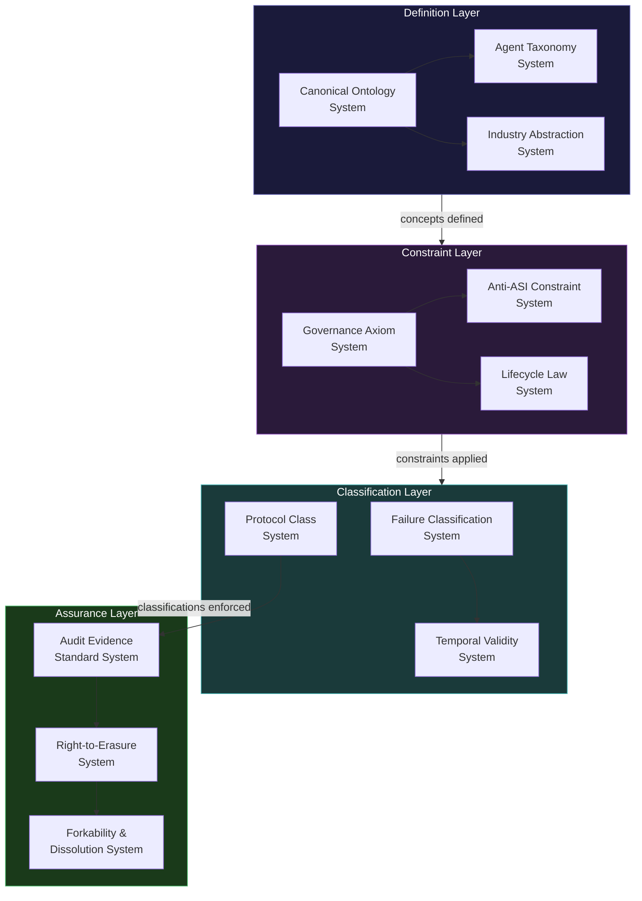
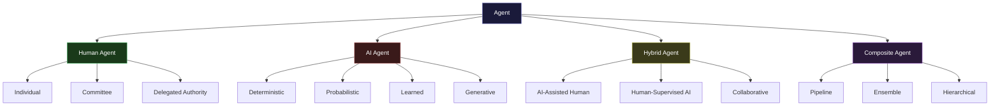
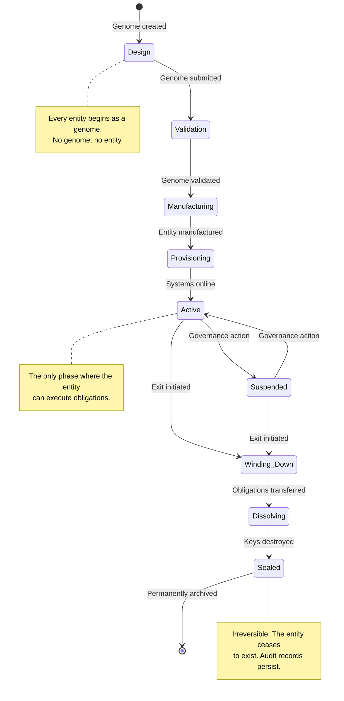

# 12 AINEFF Framework Systems

The framework systems are the **constitutional bedrock** of the AINEFF Ecosystem. They do not execute, do not operate, and do not produce revenue. They **define** — they establish the ontological categories, taxonomic structures, governance axioms, and protocol boundaries that every other system in the ecosystem must conform to.

If the 21 core systems are the skeleton, the 12 framework systems are the **laws of physics** that determine what shapes the skeleton can take. You do not negotiate with physics. You do not configure around axioms. You conform to them, or you are not part of the ecosystem.

---

## Framework Architecture

---

## System 1: Canonical Ontology System

### Purpose

The Canonical Ontology System defines **every named concept** in the AINEFF Ecosystem. Every entity, relationship, property, action, state, and constraint has a formal definition in the ontology. If a concept is not in the ontology, it does not exist in the ecosystem.

This is not a glossary. It is a **formal ontology** — a machine-readable, version-controlled, logically consistent definition of the ecosystem's conceptual universe.

### Specification

| Property | Value |
|---|---|
| **Scope** | All named concepts across all 74 systems |
| **Format** | OWL (Web Ontology Language) with SHACL constraints |
| **Versioning** | Semantic versioning with backward compatibility guarantees |
| **Governance** | Changes require AGK ratification |
| **Consistency** | Formally verified: no contradictions, no ambiguities, no undefined references |

### Core Ontological Categories

| Category | Examples | Count (estimated) |
|---|---|---|
| Entities | AINEFF, AINEF, AINEG, AINE, AINEOU, AINEOUT, AINEOUTM | ~50 |
| Relationships | governs, contains, delegates, binds, produces | ~120 |
| States | active, suspended, dissolving, sealed, expired | ~35 |
| Actions | manufacture, authorize, audit, escalate, dissolve | ~80 |
| Properties | jurisdiction, lifecycle-phase, failure-budget, decay-rate | ~200 |
| Constraints | atomic-constraint, anti-ASI, temporal-bound, scope-limit | ~60 |

### What It Does NOT Do

- Does not interpret concepts (interpretation is the responsibility of consuming systems)
- Does not enforce ontological conformance at runtime (that is each system's responsibility)
- Does not define domain-specific vocabularies (that is Industry Abstraction System)
- Does not version business logic (it versions conceptual structure only)

---

## System 2: Agent Taxonomy System

### Purpose

The Agent Taxonomy System classifies **every agent** in the ecosystem into a formal taxonomy. An agent is any entity that can take action — human, AI model, hybrid human-AI team, automated process, or composite multi-agent system.

The taxonomy determines what governance constraints apply, what accountability mechanisms are required, and what failure modes are possible.

### Agent Classification Hierarchy

### Governance Implications by Agent Type

| Agent Type | Liability Bearer | Kill-Switch Required | Audit Depth | Override Authority |
|---|---|---|---|---|
| **Human Individual** | Self | No | Action-level | Self (within scope) |
| **Deterministic AI** | Deployer | Yes | Full trace | Deployer only |
| **Probabilistic AI** | Deployer + Ratifier | Yes | Full trace + confidence | Ratifier required for irreversible |
| **Generative AI** | Deployer + Ratifier + Reviewer | Yes | Full trace + provenance | Multi-party for any output |
| **Hybrid** | Human participant | Yes (AI component) | Full trace | Human participant |
| **Composite** | Designated liability bearer | Yes (all components) | Full trace + composition graph | Designated authority |

### What It Does NOT Do

- Does not create agents (that is Agent Foundry)
- Does not manage agent runtime (that is Agent Execution)
- Does not enforce agent scope (that is Agent Scope Enforcement)
- Does not determine agent capabilities (that is Primitive Capability)

---

## System 3: Industry Abstraction System

### Purpose

The Industry Abstraction System maps between **multiple industry classification standards** — NAICS, SIC, ISIC, GICS, UNSPSC, HS, and others — to create a unified industry ontology that the ecosystem uses for jurisdiction binding, regulatory mapping, and risk classification.

Industries are not natural categories. They are human-constructed classifications that vary by country, by regulatory body, and by purpose. The Industry Abstraction System creates a **canonical mapping layer** so the ecosystem can operate across all of them simultaneously.

### Classification Standard Mappings

| Standard | Full Name | Scope | Granularity | Used For |
|---|---|---|---|---|
| **NAICS** | North American Industry Classification System | US, Canada, Mexico | 6-digit codes (~1,000 industries) | US regulatory compliance |
| **SIC** | Standard Industrial Classification | US (legacy) | 4-digit codes (~500 industries) | Legacy regulatory systems |
| **ISIC** | International Standard Industrial Classification | UN member states | 4-digit codes (~400 industries) | International comparisons |
| **GICS** | Global Industry Classification Standard | Global (financial markets) | 8-digit codes (~160 sub-industries) | Financial sector classification |
| **UNSPSC** | United Nations Standard Products and Services Code | Global | 8-digit codes (~70,000 commodities) | Procurement and supply chain |
| **HS** | Harmonized System | Global (customs) | 6-digit codes (~5,000 headings) | International trade and customs |

### What It Does NOT Do

- Does not determine which classification applies to a given entity (that is a governance decision)
- Does not update when standards change (updates are governance-managed)
- Does not provide industry-specific business logic (it provides classification, not logic)
- Does not replace domain expertise (it structures domain categories)

---

## System 4: Governance Axiom System

### Purpose

The Governance Axiom System formalizes the **irreducible governance axioms** — the Atomic Constraint and its corollaries — as machine-verifiable logical propositions. These are not guidelines. They are axioms: assumed true, not proven, and used as the foundation from which all governance rules are derived.

### The Axiom Set

| # | Axiom | Formal Statement |
|---|---|---|
| A1 | **Atomic Constraint** | For all actions a: if irreversible(a) then exists exactly one h: human(h) AND liable(h, a) AND bound(h, a, time(a)) |
| A2 | **Killability** | For all systems s: exists h: human(h) AND can_terminate(h, s) AND latency(terminate(h, s)) < threshold |
| A3 | **Auditability** | For all actions a: exists trace t: records(t, a) AND tamper_evident(t) AND causally_complete(t) |
| A4 | **Stewardship** | For all bindings b: authority(b) >= liability(b) — no one bears liability without commensurate authority |
| A5 | **Anti-ASI** | For all systems s: NOT(liable(s, s)) — no system may be its own liability bearer |
| A6 | **Mortality** | For all liability bearers h: mortal(h) AND exists succession_plan(h) |
| A7 | **Temporal Bound** | For all permissions p: exists expiry(p) AND expiry(p) < infinity |
| A8 | **Forkability** | For all entities e: can_dissolve(e) AND obligations(e) fully transferable |

### What It Does NOT Do

- Does not derive governance rules from axioms (that is governance processes)
- Does not enforce axioms at runtime (enforcement is structural, distributed across systems)
- Does not modify axioms (axioms are immutable; only the AGK can propose amendments, and the process requires supermajority ratification)

---

## System 5: Anti-ASI Constraint System

### Purpose

The Anti-ASI Constraint System enforces **structural limits** that prevent any system — AI, human-AI hybrid, or organizational — from becoming its own liability bearer, recursively improving without bound, or accumulating authority that escapes human oversight.

This is not AI safety in the research sense. It is **architectural enforcement** of the principle that no system may become the god of its own domain.

### Constraint Categories

| Constraint | What It Prevents | How It Is Enforced |
|---|---|---|
| **Self-Liability Block** | System designating itself as liable | Identity verification: liability bearer must be a different entity class |
| **Recursive Improvement Cap** | System modifying its own constraints | Constraint modifications require external governance approval |
| **Authority Ceiling** | System accumulating unlimited authority | PAME monitors authority concentration; hard caps per entity |
| **Goal Stability** | System modifying its own objectives | Goals are write-once at manufacturing; changes require re-manufacturing |
| **Information Asymmetry Limit** | System hoarding information | CRMS monitors information distribution across the ecosystem |
| **Human Override Preservation** | System disabling human kill-switch | Kill-switch operates at a hardware/infrastructure layer below software control |

### What It Does NOT Do

- Does not prevent AI from being powerful (it prevents AI from being unaccountable)
- Does not limit AI capabilities (it limits AI authority)
- Does not replace AI safety research (it is an operational constraint, not a theoretical solution)
- Does not apply to systems outside the ecosystem (it governs only AINEFF-manufactured entities)

---

## System 6: Lifecycle Law System

### Purpose

The Lifecycle Law System defines the **mandatory lifecycle phases** that every entity in the ecosystem must traverse. No entity can skip phases, exist in undefined states, or avoid the dissolution phase.

### Mandatory Lifecycle Phases

### Phase Transition Rules

| From | To | Trigger | Authorization Required | Reversible |
|---|---|---|---|---|
| Design | Validation | Genome submission | Designer | Yes |
| Validation | Manufacturing | Validation pass | Validator + Designer | Yes |
| Manufacturing | Provisioning | Manufacturing complete | Factory + ACP | No |
| Provisioning | Active | All systems online | ACP | No |
| Active | Suspended | Governance action or failure trigger | Governance authority or FMS | Yes |
| Suspended | Active | Governance action | Governance authority | Yes |
| Active | Winding Down | Exit initiated | Governance authority + liability bearer | No |
| Winding Down | Dissolving | All obligations transferred | Exit Orchestration | No |
| Dissolving | Sealed | All keys destroyed | Key Destruction & Seal | No |

### What It Does NOT Do

- Does not manage individual phase transitions (each phase has its own system)
- Does not define phase-specific behaviors (behaviors are system-specific)
- Does not allow custom lifecycle phases (the lifecycle is universal)

---

## System 7: Failure Classification System

### Purpose

The Failure Classification System provides the **canonical taxonomy** of failure types. Every failure anywhere in the ecosystem is classified according to this taxonomy, ensuring consistent handling, escalation, and reporting.

### Failure Taxonomy

| Class | Severity | Examples | Response Time | Escalation |
|---|---|---|---|---|
| **F1 — Constraint Violation** | Critical | Atomic Constraint breach, Anti-ASI violation | Immediate halt | AGK + all liability bearers |
| **F2 — Integrity Failure** | Critical | Knowledge corruption, audit trace tampering | Immediate investigation | KIMS + ACTS + FMS |
| **F3 — Authorization Failure** | High | Unauthorized action, identity compromise | Minutes | ACP + IRMS + FMS |
| **F4 — Compliance Drift** | High | Enterprise outside constitutional bounds | Hours | ECS + governance authority |
| **F5 — Performance Degradation** | Medium | SLA breach, latency spike, capacity exhaustion | Hours | FMS + system operators |
| **F6 — Data Quality** | Medium | Stale data, incomplete records, format errors | Days | KIMS + system operators |
| **F7 — Operational** | Low | Configuration drift, minor process deviation | Days | System operators |
| **F8 — Cosmetic** | Informational | UI issues, documentation gaps, naming inconsistencies | Weeks | System operators |

### What It Does NOT Do

- Does not detect failures (detection is each system's responsibility)
- Does not route failures (that is FMS)
- Does not fix failures (that is the responsible system)
- Does not track failure history (that is Failure Ledger)

---

## System 8: Temporal Validity System

### Purpose

The Temporal Validity System establishes the **universal rule** that nothing in the ecosystem is permanent by default. Every assertion, binding, permission, policy, role assignment, and capability grant has an expiration date. When the expiration date passes, the artifact becomes invalid — not "should be reviewed," but structurally invalid.

### Default Expiration Periods

| Artifact Type | Default TTL | Maximum Extension | Renewal Process |
|---|---|---|---|
| **Role binding** | 90 days | 1 year | Re-authorization by governance authority |
| **Capability grant** | 30 days | 180 days | Re-verification of qualification |
| **Policy rule** | 1 year | 3 years | Governance review and re-ratification |
| **Liability binding** | Duration of action | N/A (bound to specific action) | N/A |
| **Access permission** | 24 hours | 7 days | Re-authentication |
| **Governance assertion** | 2 years | 5 years | AGK review and re-ratification |
| **Audit evidence** | 7 years (regulatory minimum) | Indefinite (if legally required) | Automatic unless erasure requested |

### What It Does NOT Do

- Does not decide TTLs (governance sets them, Temporal Validity enforces them)
- Does not manage the renewal process (renewal is each system's responsibility)
- Does not override legal retention requirements (legal minimums always take precedence)

---

## System 9: Protocol Class System

### Purpose

The Protocol Class System enforces the **fundamental architectural boundary** between PCP (Protocol Control Plane) and PEP (Protocol Execution Plane). Every protocol, message, data flow, and system interaction is classified as belonging to one or the other. Cross-boundary communication is managed exclusively through IPS.

### PCP vs PEP Classification

| Dimension | PCP (Protocol Control Plane) | PEP (Protocol Execution Plane) |
|---|---|---|
| **Purpose** | Governance, constraint enforcement, policy | Business logic, obligation execution, operations |
| **Authority** | Constitutional | Delegated |
| **Mutability** | Slow, deliberate, multi-party | Fast, operational, within-scope |
| **Failure mode** | Halt and escalate | Degrade and retry |
| **Data sensitivity** | Governance metadata | Operational data |
| **Audit depth** | Every action traced | Configurable per risk level |
| **Human involvement** | Required for changes | Required for irreversible actions only |

### What It Does NOT Do

- Does not implement the boundary (that is IPS and Protocol Isolation)
- Does not route messages across the boundary (that is IPS)
- Does not define business logic for either side (that is governance and enterprise systems)

---

## System 10: Audit Evidence Standard System

### Purpose

The Audit Evidence Standard System defines **what constitutes valid audit evidence** across the entire ecosystem. Not all data is evidence. Evidence must meet specific standards of provenance, integrity, completeness, and admissibility.

### Evidence Quality Criteria

| Criterion | Requirement | Verification Method |
|---|---|---|
| **Provenance** | Every evidence artifact has a documented chain of custody | Cryptographic provenance chain |
| **Integrity** | Evidence has not been modified since creation | Cryptographic hash verification |
| **Completeness** | Evidence captures the full context of the audited action | Causal trace completeness check |
| **Timeliness** | Evidence was captured at or near the time of the action | Timestamp verification against time authority |
| **Independence** | Evidence was not created by the entity being audited | Source identity verification |
| **Reproducibility** | Given the same inputs, the same evidence would be generated | Deterministic replay verification |

### What It Does NOT Do

- Does not generate evidence (that is Audit Evidence Generator)
- Does not store evidence (that is ACTS and system-specific storage)
- Does not interpret evidence (that is auditors and oversight systems)
- Does not define legal admissibility (that varies by jurisdiction)

---

## System 11: Right-to-Erasure System

### Purpose

The Right-to-Erasure System manages the **tension between data deletion rights** (GDPR, CCPA, and similar regulations) and the **audit integrity requirements** of the Atomic Constraint. When a person exercises their right to erasure, the system must delete personal data while preserving the structural integrity of audit trails.

### The Erasure Paradox

The Atomic Constraint requires that every irreversible action be traceable to a bound human liability bearer. Data protection law requires that personal data be deletable on request. These two requirements conflict — and the Right-to-Erasure System resolves the conflict.

### Resolution Mechanism

| Data Category | Erasure Approach | Audit Integrity Preserved |
|---|---|---|
| **Personal identification data** | Deleted and replaced with pseudonymous token | Yes — token maintains trace linkage |
| **Liability binding records** | Retained with pseudonymized identity | Yes — binding structure preserved |
| **Operational data** | Deleted | N/A — not audit-critical |
| **Governance decision records** | Retained with pseudonymized participants | Yes — decision chain preserved |
| **Audit trace metadata** | Retained with pseudonymized actors | Yes — causal chain preserved |

### What It Does NOT Do

- Does not determine who has erasure rights (that is legal/regulatory)
- Does not override legal retention requirements (retention minimums always apply)
- Does not manage data lifecycle broadly (that is Knowledge Decay and Knowledge Disposition)

---

## System 12: Forkability & Dissolution System

### Purpose

The Forkability & Dissolution System ensures that **any entity in the ecosystem can be dissolved or forked** without orphaning obligations, corrupting audit trails, or creating governance gaps. This is the ultimate expression of the principle that no entity is too important to fail.

### Dissolution Guarantees

| Guarantee | What It Means | How It Is Enforced |
|---|---|---|
| **No orphaned obligations** | Every obligation is transferred to a successor before dissolution completes | Exit Orchestration blocks dissolution until all obligations are assigned |
| **No audit trail gaps** | Dissolution does not delete historical audit data | Audit records are transferred to archival storage before entity sealing |
| **No governance vacuum** | Governance responsibilities are explicitly transferred | AGK verifies governance succession before authorizing dissolution |
| **No identity reuse** | Dissolved entity's identity is permanently retired | GAAGR marks identity as sealed; IRMS blocks credential reuse |
| **No key reuse** | All cryptographic keys are destroyed | Key Destruction & Seal performs verifiable key destruction |

### Forkability

Forking is the creation of a new entity from an existing one, preserving selected properties while creating independent governance. Forkability ensures that the ecosystem can evolve structurally — entities can split, merge, or reconfigure without breaking the protocol.

| Fork Type | What Is Copied | What Is Not Copied | Authorization |
|---|---|---|---|
| **Full fork** | Genome, policies, configurations | Obligations, identity, keys | AGK + both liability bearers |
| **Partial fork** | Selected subsystems only | Everything else | AGK + governance authority |
| **Governance fork** | Governance structure only | Operational state | AGK supermajority |

### What It Does NOT Do

- Does not decide when to dissolve (that is governance)
- Does not manage the dissolution process (that is Exit Orchestration)
- Does not handle key destruction (that is Key Destruction & Seal)
- Does not manage data disposition (that is Knowledge Disposition)
