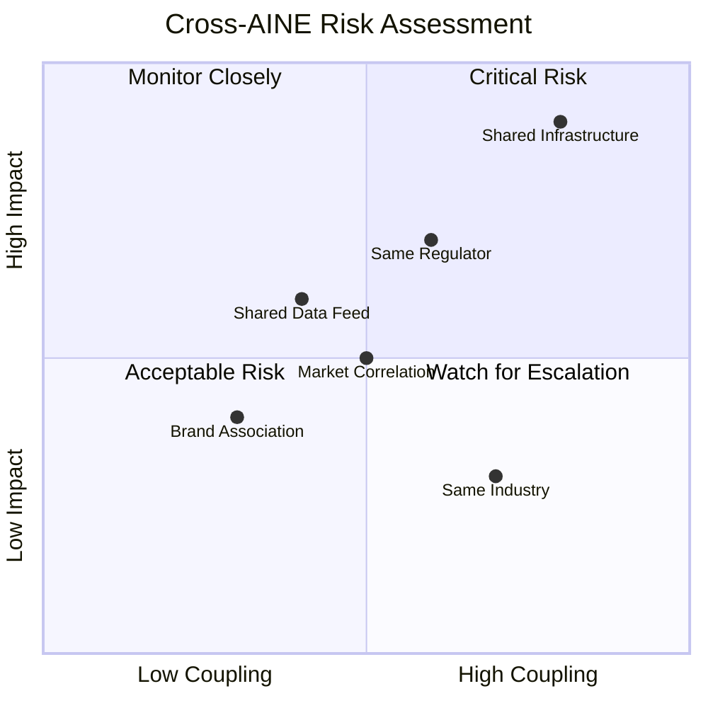

# 11 AINEG Group Systems

An AINEG group is not a holding company. It is not a conglomerate. It is a **coordination boundary** — a structural container that defines how multiple AINE enterprises relate to each other, share risk, settle obligations, and maintain legal isolation while operating under shared governance.

The 11 group-level systems manage this coordination boundary. They ensure that enterprises within a group can benefit from federation without being contaminated by each other's failures.

---

## Group Architecture

```mermaid
flowchart TB
    subgraph AINEG["AINEG Group Boundary"]
        subgraph REGISTRY_LAYER["Registry & Lifecycle"]
            AR["AINE Registry"]
            PL["Portfolio<br/>Lifecycle"]
        end

        subgraph RESOURCE_LAYER["Resource & Risk"]
            RA["Resource<br/>Allocation"]
            CAR["Cross-AINE<br/>Risk"]
            FCF["Failure Contagion<br/>Firewall"]
        end

        subgraph CONTRACT_LAYER["Contract & Coordination"]
            IP["Insurance Pool"]
            IAC["Inter-AINE<br/>Contract"]
            PCG["Public Coordination<br/>Gateway"]
        end

        subgraph SETTLEMENT_LAYER["Settlement & Compliance"]
            JP["Jurisdiction<br/>Partition"]
            CS["Capital<br/>Settlement"]
            MAA["Mass Audit<br/>Aggregation"]
        end

        subgraph ENTERPRISES["Member Enterprises"]
            E1["AINE-01"]
            E2["AINE-02"]
            E3["AINE-03"]
            EN["AINE-N"]
        end

        REGISTRY_LAYER --> RESOURCE_LAYER
        RESOURCE_LAYER --> CONTRACT_LAYER
        CONTRACT_LAYER --> SETTLEMENT_LAYER
        SETTLEMENT_LAYER --> ENTERPRISES
    end

    style AINEG fill:#0a1a0a,stroke:#2a4a2a,color:#fff
    style REGISTRY_LAYER fill:#1a1a3a,stroke:#6a6aba,color:#fff
    style RESOURCE_LAYER fill:#3a3a1a,stroke:#baba4a,color:#fff
    style CONTRACT_LAYER fill:#1a3a3a,stroke:#4ababa,color:#fff
    style SETTLEMENT_LAYER fill:#2a1a3a,stroke:#8a4aba,color:#fff
    style ENTERPRISES fill:#1a3a1a,stroke:#4aba6a,color:#fff
```

---

## System 34: AINE Registry

### Purpose

The AINE Registry is the **canonical list of all enterprises within a group**. It is the group-level equivalent of GAAGR — every AINE that belongs to this group is registered here, with its current status, jurisdiction, capabilities, and governance bindings.

### Registry Entry Structure

| Field | Description | Source |
|---|---|---|
| **Enterprise ID** | Unique identifier (also registered in GAAGR) | EMS manufacturing |
| **Status** | Current lifecycle phase | Lifecycle Law System |
| **Jurisdiction** | Primary and operating jurisdictions | Jurisdiction Binding |
| **Capability Summary** | High-level capability classification | Enterprise Genome |
| **Risk Profile** | Current risk assessment | Cross-AINE Risk |
| **Failure Budget Status** | Current failure budget consumption | Failure Budget Allocation |
| **Insurance Coverage** | Insurance tier and coverage level | Insurance Pool |
| **Governance Authority** | Named governance authority for this enterprise | HMS |
| **Registration Date** | When the enterprise joined the group | Automatic |
| **Last Audit** | When the enterprise was last audited | Mass Audit Aggregation |

### What It Does NOT Do

- Does not manufacture enterprises (that is EMS)
- Does not manage enterprise internals (each enterprise manages itself)
- Does not determine membership criteria (that is governance)
- Does not replace GAAGR (GAAGR is the ecosystem-wide registry; this is the group-level registry)

### Failure Modes

| Failure Mode | Severity | Consequence | Mitigation |
|---|---|---|---|
| Registry out of sync with GAAGR | High | Group and ecosystem disagree on enterprise status | Continuous synchronization with GAAGR as source of truth |
| Stale status | Medium | Decisions made based on outdated information | Event-driven status updates with mandatory freshness checks |
| Unauthorized registration | Critical | Non-manufactured entity appears in group | Registration requires EMS manufacturing certificate |

---

## System 35: Portfolio Lifecycle

### Purpose

Portfolio Lifecycle manages the **lifecycle of the enterprise collection** — onboarding new enterprises into the group, managing their ongoing participation, and handling their departure through transfer or dissolution.

### Lifecycle Events

| Event | Trigger | Process | Authorization |
|---|---|---|---|
| **Onboarding** | New AINE manufactured for this group | Registration, risk assessment, insurance binding, firewall configuration | Group governance + EMS certificate |
| **Status Change** | Enterprise enters new lifecycle phase | Registry update, risk reassessment, notification to dependents | Enterprise governance + group notification |
| **Risk Reassessment** | Periodic or event-triggered | Full risk profile recalculation | Automatic with human review for high-risk findings |
| **Transfer Out** | Enterprise moving to different group | Obligation transfer, insurance settlement, deregistration | Both groups' governance + GAAGR update |
| **Dissolution** | Enterprise exiting the ecosystem | Exit orchestration, obligation transfer, final audit | Enterprise governance + group governance + ACP |

### What It Does NOT Do

- Does not manage individual enterprise operations (each enterprise is autonomous within constraints)
- Does not make portfolio composition decisions (governance decides, this system executes)
- Does not manage financial performance (it manages lifecycle, not business outcomes)

---

## System 36: Resource Allocation

### Purpose

Resource Allocation manages **shared resources** across enterprises within a group — compute capacity, storage, network bandwidth, shared services, and human governance capacity. Resources are allocated based on priority, need, and governance policy.

### Allocation Principles

| Principle | Meaning |
|---|---|
| **Proportional to risk** | Higher-risk enterprises receive more oversight resources |
| **Proportional to obligation volume** | More active enterprises receive more operational resources |
| **Minimum guaranteed** | Every enterprise receives a minimum allocation regardless of activity |
| **Burst capacity** | Temporary increases available for peaks, drawn from group reserve |
| **No starvation** | No enterprise can monopolize shared resources indefinitely |

### What It Does NOT Do

- Does not manage enterprise-internal resource allocation (each enterprise manages its own)
- Does not procure resources (procurement is an operational function)
- Does not price resources (pricing is a governance decision)

---

## System 37: Cross-AINE Risk

### Purpose

Cross-AINE Risk assesses and monitors **risk contagion potential** between enterprises in a group. When enterprises share suppliers, markets, jurisdictions, or data, a failure in one can propagate to others. This system quantifies that risk.

### Risk Dimensions

| Dimension | What It Measures | Example |
|---|---|---|
| **Operational coupling** | Shared processes, suppliers, or infrastructure | Two enterprises using the same payment processor |
| **Market correlation** | Revenue sensitivity to the same market forces | Two enterprises in the same industry segment |
| **Jurisdiction overlap** | Shared regulatory exposure | Two enterprises subject to the same regulator |
| **Data dependency** | Shared data sources or knowledge bases | Two enterprises relying on the same market data feed |
| **Personnel overlap** | Shared human governance participants | Same person serving as liability bearer for multiple enterprises |
| **Reputational coupling** | Brand association or public perception linkage | Two enterprises with visible association |

### Risk Matrix

### What It Does NOT Do

- Does not prevent risk (it measures it)
- Does not enforce risk limits (that is governance via Failure Contagion Firewall)
- Does not manage individual enterprise risk (that is Internal Failure Monitor)

---

## System 38: Failure Contagion Firewall

### Purpose

The Failure Contagion Firewall **prevents failure in one enterprise from cascading** to others in the group. It is a structural isolation mechanism — not a monitoring system, but an active barrier that interrupts contagion paths.

### Firewall Mechanisms

| Mechanism | What It Isolates | Activation |
|---|---|---|
| **Financial isolation** | Prevents financial losses from propagating | Automatic when enterprise enters failure state |
| **Data isolation** | Severs shared data connections | Automatic when data integrity failure detected |
| **Operational isolation** | Disconnects shared processes | Triggered by FMS when operational failure exceeds threshold |
| **Reputational isolation** | Suppresses brand association | Triggered by governance when reputational risk is high |
| **Governance isolation** | Prevents shared governance from being compromised | Automatic when governance failure detected in any member |
| **Jurisdiction isolation** | Prevents regulatory action against one enterprise from affecting others | Always active (structural, not triggered) |

### What It Does NOT Do

- Does not detect failures (that is Cross-AINE Risk and Internal Failure Monitor)
- Does not resolve failures (that is FMS and the failing enterprise)
- Does not dissolve enterprises (that is Exit Orchestration)
- Does not prevent all risk transfer (some risk transfer is legitimate and governed by Inter-AINE Contract)

### Failure Modes

| Failure Mode | Severity | Consequence | Mitigation |
|---|---|---|---|
| Firewall fails to activate | Critical | Failure cascades to healthy enterprises | Independent activation mechanism per isolation type |
| Firewall activates prematurely | High | Healthy enterprise unnecessarily isolated | Multi-signal confirmation before activation |
| Firewall has gap | Critical | Unmonitored contagion path exists | Comprehensive contagion path mapping during manufacturing |

---

## System 39: Insurance Pool

### Purpose

The Insurance Pool manages **shared insurance reserves** for the group. Individual enterprises contribute to the pool based on their risk profile, and draw from it when failures cause economic damage that exceeds their self-insurance capacity.

### Pool Structure

| Layer | Funded By | Covers | Cap |
|---|---|---|---|
| **Enterprise self-insurance** | Individual enterprise reserves | First losses up to enterprise threshold | Set per enterprise |
| **Group mutual insurance** | Pro-rata contributions from all members | Losses above enterprise threshold | Group-wide cap |
| **Group reinsurance** | External reinsurance premiums | Catastrophic losses above group cap | Reinsurance policy limits |

### Contribution Formula

Contributions are proportional to risk-adjusted obligation volume:

| Factor | Weight | Description |
|---|---|---|
| **Obligation volume** | 40% | Total value of active obligations |
| **Risk profile score** | 30% | From Cross-AINE Risk assessment |
| **Failure history** | 20% | From Failure Ledger |
| **Governance quality** | 10% | From ECS compliance score |

### What It Does NOT Do

- Does not price insurance for external parties (that is Insurance Pricing System)
- Does not determine fault (that is governance and legal processes)
- Does not manage individual enterprise reserves (each enterprise manages its own)

---

## System 40: Inter-AINE Contract

### Purpose

Inter-AINE Contract manages **contracts and obligations between enterprises** in the same group. When Enterprise A purchases services from Enterprise B, or when enterprises share resources, the contract is registered, governed, and enforced through this system.

### Contract Properties

| Property | Description | Enforcement |
|---|---|---|
| **Parties** | Exactly two enterprises (multi-party contracts decompose into bilateral) | AINE Registry verification |
| **Obligations** | Enumerated obligations for each party | Compliance Enforcement per enterprise |
| **Duration** | Explicit start and end dates | Temporal Governance |
| **Jurisdiction** | Which jurisdiction governs the contract | Jurisdiction Partition |
| **Failure handling** | What happens if either party fails to perform | Failure Management System |
| **Dispute resolution** | Process for resolving disagreements | Governance + Civil Redress if needed |
| **Exit provisions** | What happens if either party exits the group | Exit Orchestration |

### What It Does NOT Do

- Does not negotiate contracts (that is the enterprises' governance)
- Does not enforce contracts at the business logic level (it enforces structural compliance)
- Does not replace legal contracts (it governs the protocol-level obligations)

---

## System 41: Public Coordination Gateway

### Purpose

The Public Coordination Gateway is the **group's interface with the public** — providing transparency, reporting, and accountability to external stakeholders. It publishes non-confidential governance data, group-level metrics, and compliance reports.

### Published Data Categories

| Category | Content | Audience | Frequency |
|---|---|---|---|
| **Group composition** | Number and classification of member enterprises | Public | Real-time |
| **Governance summary** | Governance structure and key authorities | Public | Quarterly |
| **Compliance status** | Aggregate compliance scores | Regulators, public | Quarterly |
| **Failure summary** | Aggregate failure statistics (anonymized) | Public | Quarterly |
| **Insurance adequacy** | Pool sufficiency metrics | Insurance partners, regulators | Annually |
| **Risk profile** | Aggregate risk assessment | Regulators | Annually |

### What It Does NOT Do

- Does not publish enterprise-specific confidential data (that requires enterprise consent)
- Does not manage public relations (it publishes data, not narratives)
- Does not replace regulatory reporting (it supplements it)

---

## System 42: Jurisdiction Partition

### Purpose

Jurisdiction Partition ensures that **enterprises in different jurisdictions remain legally isolated** within the group. A regulatory action in Jurisdiction A cannot legally reach Enterprise B in Jurisdiction B through the group structure.

### Partition Mechanisms

| Mechanism | What It Ensures |
|---|---|
| **Legal entity isolation** | Each enterprise is a separate legal entity in its jurisdiction |
| **Data residency enforcement** | Data stays within jurisdictional boundaries unless explicitly transferred |
| **Regulatory reporting isolation** | Each enterprise reports independently to its own regulators |
| **Tax isolation** | Tax obligations are computed and settled per jurisdiction |
| **Contractual isolation** | Contracts governed by the jurisdiction of the parties, not the group |
| **Governance isolation** | Jurisdiction-specific governance decisions cannot bind other jurisdictions |

### What It Does NOT Do

- Does not provide legal advice (it enforces structural isolation)
- Does not determine which jurisdiction applies (that is Jurisdiction Binding at manufacturing time)
- Does not prevent legitimate cross-jurisdiction cooperation (it prevents unintended legal exposure)

---

## System 43: Capital Settlement

### Purpose

Capital Settlement manages **financial flows** between enterprises within the group and between enterprises and the group entity. Contributions, distributions, inter-enterprise payments, insurance premiums, and dissolution settlements all flow through this system.

### Settlement Types

| Type | Direction | Trigger | Frequency |
|---|---|---|---|
| **Insurance contribution** | Enterprise to Pool | Policy terms | Monthly |
| **Insurance payout** | Pool to Enterprise | Verified failure claim | Event-driven |
| **Resource usage fee** | Enterprise to Group | Resource consumption | Monthly |
| **Inter-enterprise payment** | Enterprise to Enterprise | Contract terms | Per contract |
| **Dissolution settlement** | Enterprise to Group/Successors | Exit orchestration | One-time |
| **Governance fee** | Enterprise to Group | Group governance services | Quarterly |

### What It Does NOT Do

- Does not manage enterprise-internal finances (each enterprise manages its own)
- Does not set prices or fees (governance sets, settlement executes)
- Does not manage external banking relationships (it manages intra-group flows)

---

## System 44: Mass Audit Aggregation

### Purpose

Mass Audit Aggregation collects and aggregates **audit data from all enterprises** in the group to produce group-level audit views. While each enterprise generates its own audit evidence, the group needs a consolidated view for governance, compliance, and reporting.

### Aggregation Levels

| Level | Scope | Purpose | Consumers |
|---|---|---|---|
| **Enterprise summary** | Single enterprise audit rollup | Enterprise-level governance | Enterprise governance authority |
| **Risk cluster** | Enterprises sharing risk factors | Contagion assessment | Cross-AINE Risk |
| **Jurisdiction** | Enterprises in same jurisdiction | Regulatory reporting | Regulatory Review System |
| **Full group** | All enterprises | Group governance and public reporting | Group governance, Public Coordination Gateway |
| **Cross-group** | Multiple groups (via CRMS) | Ecosystem-wide patterns | CRMS, PAME |

### What It Does NOT Do

- Does not generate audit evidence (that is each enterprise's Audit Evidence Generator)
- Does not interpret audit data (that is auditors and oversight systems)
- Does not store raw audit data (it stores aggregations; raw data stays with each enterprise)
- Does not replace enterprise-level auditing (it supplements with group-level views)
