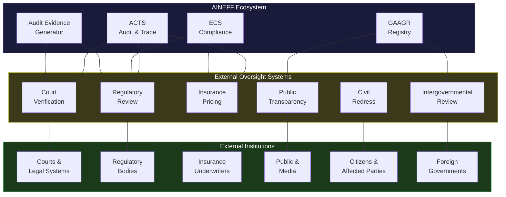
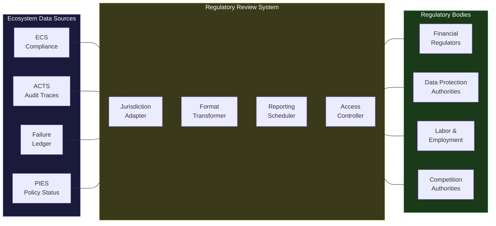
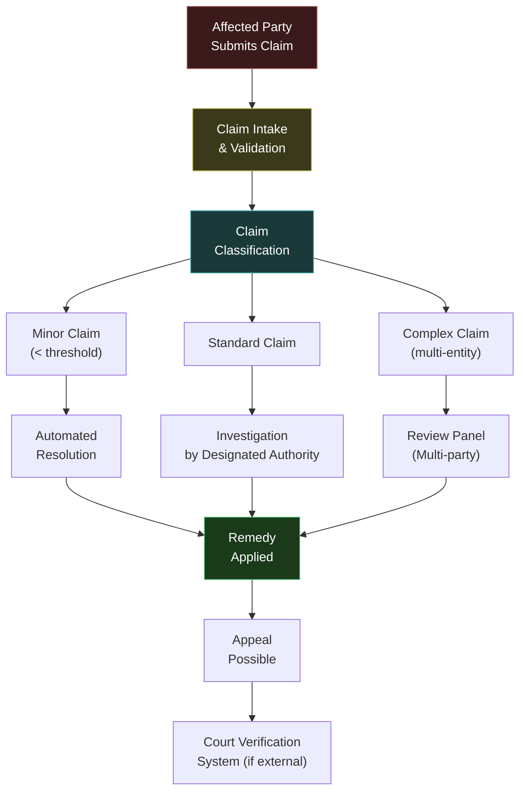

# 6 External Oversight Systems

The AINEFF Ecosystem is not a closed system. It operates within society — subject to laws, regulations, courts, insurance markets, public scrutiny, and democratic governance. The 6 external oversight systems are the **interface between the ecosystem and the world**.

These systems do not give the ecosystem authority over external institutions. They give external institutions **verifiable access** to the ecosystem's governance, compliance, and accountability data. The ecosystem is terrain — and terrain must be inspectable by those who walk on it.

---

## External Oversight Architecture

---

## System 61: Court Verification System

### Purpose

The Court Verification System provides courts with **verifiable evidence of governance compliance** when ecosystem entities are involved in litigation. It is not a legal advisor — it is an evidence delivery system that translates the ecosystem's internal audit data into formats that courts can receive, verify, and act upon.

### Evidence Delivery Capabilities

| Capability | Description | Format |
|---|---|---|
| **Liability chain verification** | Prove who was the bound liability bearer for a specific action at a specific time | Cryptographically signed certificate with causal trace |
| **Action reconstruction** | Provide the complete causal chain for any specific action | Structured evidence package (Audit Evidence Standard) |
| **Compliance attestation** | Certify that an entity was (or was not) in compliance at a specific time | Timestamped compliance report with integrity proof |
| **Governance verification** | Prove what governance constraints were in effect at a specific time | Versioned policy snapshot with cryptographic integrity |
| **Deterministic replay** | Replay a disputed action in a verified sandbox to demonstrate what happened | Replay execution report with witness signatures |
| **Identity verification** | Verify the identity of any entity or participant at a specific time | IRMS identity certificate |

### Access Controls

| Control | Specification |
|---|---|
| **Authorization** | Court order or subpoena required for non-public data |
| **Scope limitation** | Only data relevant to the specific matter is disclosed |
| **Redaction** | Third-party personal data redacted per Right-to-Erasure rules |
| **Chain of custody** | All evidence delivery maintains chain of custody documentation |
| **Tamper evidence** | All delivered evidence includes integrity proofs that courts can independently verify |
| **Expert witness** | System can generate explanatory documentation for non-technical judges |

### What It Does NOT Do

- Does not provide legal analysis or opinions
- Does not determine liability (it provides evidence; courts determine liability)
- Does not advocate for any party
- Does not voluntarily disclose information (it responds to legal process)
- Does not interpret evidence (it provides raw, verified data)

### Failure Modes

| Failure Mode | Severity | Consequence | Mitigation |
|---|---|---|---|
| Evidence integrity compromised | Critical | Court receives unverifiable evidence | Multiple independent integrity proofs; court can verify independently |
| Evidence incomplete | High | Court receives partial picture | Completeness attestation with explicit gaps noted |
| System unavailable during legal proceedings | High | Court deadlines missed | Redundant systems with guaranteed availability SLA |
| Privacy violation in disclosure | High | Unauthorized personal data exposed | Automated redaction with legal review |

---

## System 62: Regulatory Review System

### Purpose

The Regulatory Review System enables regulators to **inspect and audit governed entities** within the ecosystem. It provides regulatory bodies with structured access to compliance data, governance configurations, failure histories, and audit trails — in the formats and frequencies that regulators require.

### Regulatory Interface Capabilities

| Capability | Description | Frequency |
|---|---|---|
| **Periodic compliance reporting** | Automated compliance reports per regulatory requirements | Per jurisdiction (quarterly, annually, etc.) |
| **On-demand inspection** | Regulator can request current compliance status at any time | On demand |
| **Thematic review** | Regulator can examine a specific governance area across multiple entities | On request |
| **Failure notification** | Mandatory notification when failures exceed regulatory thresholds | Event-driven |
| **Policy verification** | Regulator can verify that specific regulations are compiled and enforced | On demand |
| **Trend analysis** | Historical compliance data for trend identification | Periodic or on request |

### Regulatory Data Flows

### Jurisdiction-Specific Adaptations

| Jurisdiction Type | Reporting Format | Data Retention | Access Model |
|---|---|---|---|
| **EU (GDPR, AI Act)** | Structured XML per EU reporting standards | Per GDPR retention rules | Registered regulatory access with audit |
| **US (SEC, FTC, state)** | XBRL, structured PDF | Per US retention requirements | Subpoena or examination authority |
| **UK (FCA, ICO)** | UK-specific reporting templates | Per UK retention rules | Supervisory access |
| **Asia-Pacific** | Jurisdiction-specific formats | Per local retention rules | Per local regulatory authority |

### What It Does NOT Do

- Does not determine regulatory requirements (it adapts to them via JAL)
- Does not negotiate with regulators (it provides data)
- Does not interpret regulations (legal interpretation is a governance function)
- Does not lobby or advocate (it is an interface, not an actor)

---

## System 63: Insurance Pricing System

### Purpose

The Insurance Pricing System feeds **governance data to insurance underwriters** so they can accurately price risk for ecosystem entities. The better the governance data, the more accurately insurance can be priced — which creates a direct economic incentive for strong governance.

### Data Feeds for Insurance Pricing

| Data Feed | Content | Impact on Pricing |
|---|---|---|
| **Compliance score** | Current compliance status across all applicable regulations | Higher compliance = lower premium |
| **Failure history** | Historical failure data from Failure Ledger | More failures = higher premium |
| **Governance quality** | Governance structure, human oversight, authorization tiers | Better governance = lower premium |
| **Risk profile** | Cross-AINE risk assessment, contagion exposure | Higher risk = higher premium |
| **Audit completeness** | Percentage of actions with complete causal traces | More complete = lower premium |
| **Override frequency** | How often humans override automated decisions | More overrides = higher premium (suggests system unreliability) |
| **Kill-switch response time** | Historical kill-switch activation latency | Faster response = lower premium |
| **Temporal hygiene** | Percentage of expired artifacts renewed on time | Better hygiene = lower premium |

### Insurance Product Support

| Insurance Product | What It Covers | Data Requirements |
|---|---|---|
| **Governance liability** | Claims arising from governance failures | Full governance quality data |
| **Compliance gap** | Regulatory fines due to compliance gaps | Full compliance score history |
| **Operational failure** | Business losses from system failures | Full failure history and budget data |
| **Third-party liability** | Claims from parties affected by enterprise actions | Full causal trace and liability chain data |
| **Cyber risk** | Losses from security breaches | Security posture data, access control audit |
| **AI liability** | Claims arising from AI agent actions | Agent execution data, confidence scores, human oversight metrics |

### The Governance-Insurance Flywheel

### What It Does NOT Do

- Does not price insurance itself (underwriters set prices)
- Does not sell insurance (that is insurance brokers and carriers)
- Does not guarantee accuracy of pricing (it provides data; actuaries assess)
- Does not replace actuarial science (it supplements it with governance data)

---

## System 64: Public Transparency System

### Purpose

The Public Transparency System publishes **non-confidential governance data** for public inspection. Transparency is not a concession — it is a structural requirement for infrastructure. The public has a right to know how the infrastructure that governs economic coordination operates.

### Published Data

| Category | Content | Audience | Update Frequency |
|---|---|---|---|
| **Ecosystem statistics** | Total entities, obligations governed, cumulative value | General public | Real-time dashboard |
| **Governance framework** | Constitutional constraints, governance axioms, protocol specifications | Researchers, regulators, public | On change |
| **Aggregate compliance** | Ecosystem-wide compliance metrics (anonymized) | Public, media | Quarterly |
| **Aggregate failure** | Ecosystem-wide failure statistics (anonymized) | Public, media | Quarterly |
| **Dissolution records** | Sealed entity records (anonymized where required) | Public, researchers | On occurrence |
| **Governance amendments** | All changes to constitutional constraints | Public | On occurrence |
| **System status** | Operational status of core systems | Public, enterprises | Real-time |

### What Is NOT Published

| Category | Why It Is Not Published |
|---|---|
| **Individual entity data** | Requires entity consent or legal process |
| **Personal data** | Data protection law prohibits public disclosure |
| **Active investigation data** | Premature disclosure could compromise proceedings |
| **Security-sensitive data** | Publication could create attack vectors |
| **Proprietary business data** | Business confidentiality protected |

### What It Does NOT Do

- Does not manage public relations (it publishes data, not narratives)
- Does not respond to media inquiries (that is a governance function)
- Does not publish real-time individual entity data (that requires consent)
- Does not curate or editorialize (it publishes raw, verified data)

---

## System 65: Civil Redress System

### Purpose

The Civil Redress System enables **affected parties to seek redress** when they believe they have been harmed by an ecosystem entity's actions. It is the mechanism through which individuals, businesses, and communities can raise claims, request investigation, and obtain remediation.

### Redress Process

### Claim Types

| Claim Type | Examples | Resolution Path | Typical Timeline |
|---|---|---|---|
| **Data harm** | Unauthorized data processing, data breach | Automated assessment + remediation | Days |
| **Economic harm** | Unfair pricing, contract breach, value extraction | Investigation + mediation | Weeks |
| **Governance harm** | Accountability gap, insufficient oversight | Governance review + structural remedy | Weeks to months |
| **Discrimination** | Biased agent behavior, unfair access | Investigation + systemic review | Months |
| **Systemic harm** | Patterns affecting multiple parties | Multi-entity panel review | Months |

### Affected Party Rights

| Right | Description | Enforcement |
|---|---|---|
| **Right to file** | Any affected party can file a claim | Open intake, no gatekeeping |
| **Right to evidence** | Claimant can request evidence relevant to their claim | Court Verification System |
| **Right to hearing** | Claims above threshold receive a hearing | Mandatory for Standard and Complex claims |
| **Right to remedy** | Valid claims receive appropriate remediation | Binding on the entity |
| **Right to appeal** | Dissatisfied claimants can appeal | Appeal to higher authority or external court |
| **Right to anonymity** | Claimants can remain anonymous during investigation | Identity protected until resolution |

### What It Does NOT Do

- Does not replace the legal system (it supplements it)
- Does not determine legal liability (it provides a resolution mechanism)
- Does not advocate for claimants (it is a neutral process)
- Does not prevent claims from going to court (claimants can always choose legal proceedings)

---

## System 66: Intergovernmental Review System

### Purpose

The Intergovernmental Review System enables **cross-border regulatory coordination** when ecosystem entities operate across multiple jurisdictions. It provides a structured mechanism for regulatory bodies in different countries to coordinate their oversight without compromising jurisdictional sovereignty.

### Coordination Capabilities

| Capability | Description | When Used |
|---|---|---|
| **Mutual recognition** | Regulatory body A recognizes regulatory body B's assessment | When entities operate in both jurisdictions |
| **Joint investigation** | Multiple regulators investigate a cross-border entity together | When violations span jurisdictions |
| **Data sharing** | Regulatory data shared between jurisdictions (with consent) | When investigation requires cross-border data |
| **Conflict resolution** | Process for resolving conflicting regulatory requirements | When jurisdictions impose contradictory rules |
| **Standard harmonization** | Facilitating alignment of regulatory standards | Ongoing process |
| **Emergency coordination** | Rapid cross-border response to systemic failures | When failures have cross-border impact |

### Sovereignty Guarantees

| Guarantee | What It Means |
|---|---|
| **No supranational authority** | This system does not create authority above national regulators |
| **Voluntary participation** | Regulators choose to participate; no regulator is compelled |
| **Data sovereignty** | Data shared only with explicit consent and within legal frameworks |
| **Jurisdictional primacy** | Each regulator retains final authority within its jurisdiction |
| **Withdrawal right** | Any regulator can withdraw from coordination at any time |

### Build Priority

This system is classified as **Gray — May Never Need**. Cross-border regulatory coordination is a complex diplomatic and legal challenge that may be better addressed by existing international frameworks (mutual legal assistance treaties, regulatory cooperation agreements, etc.) rather than an ecosystem-internal system.

### What It Does NOT Do

- Does not create international law (it facilitates coordination within existing law)
- Does not override national sovereignty (it respects jurisdictional primacy)
- Does not lobby for regulatory harmonization (it provides infrastructure for it if regulators choose)
- Does not replace existing international cooperation frameworks (it supplements them)
