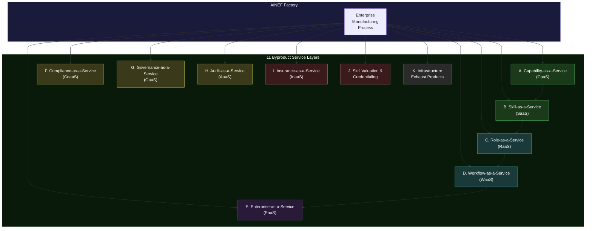
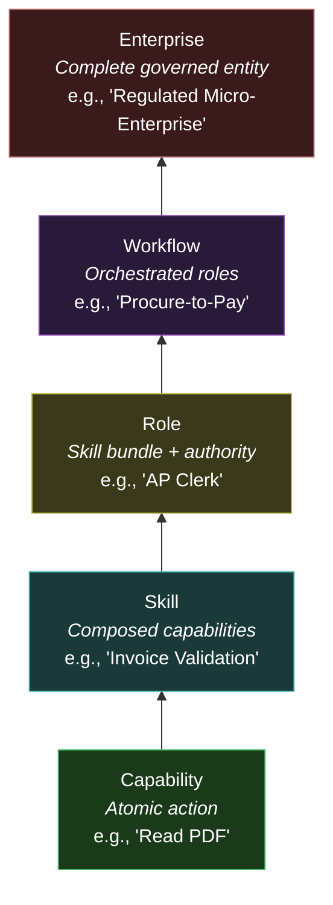
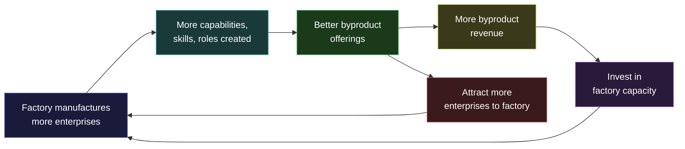

---

sidebar_position: 10
title: "Factory Byproduct Economy"
description: "The 11 service layers that emerge as natural byproducts of the AINEF Factory — from Capability-as-a-Service to Infrastructure Exhaust Products. Each is a revenue-generating business that costs almost nothing to create because the factory already produces the underlying capability."
tags: [system, technical, ainef-os]
custom_status: active
custom_owner: Andrew Leo
custom_last_review: 2026-03-01
custom_next_review: 2026-06-01
---

# Factory Byproduct Economy

The AINEF Factory exists to manufacture governed enterprises. But the act of manufacturing governed enterprises produces **byproducts** — capabilities, infrastructure, data, and expertise that have standalone value. These byproducts are not side projects. They are **natural emissions of the factory process** that can be captured, packaged, and sold.

This is the industrial equivalent of a steel mill selling slag for road construction, or a refinery selling chemical byproducts. The factory does not build these products intentionally — it builds them inevitably, because the manufacturing process cannot avoid producing them.

---

## The Byproduct Stack

---

## The Composition Ladder

The first five byproducts form a **composition ladder** — each layer is built from the one below it:

---

## A. Capability-as-a-Service (CaaS)

### What It Is

Individual atomic capabilities — the smallest units of action — offered as standalone, on-demand services. An enterprise that needs "extract text from PDF" does not need to build it. It invokes it from the CaaS layer.

### Why It Is a Byproduct

The Agent Foundry manufactures agents with capabilities. Those capabilities are defined, tested, and governed as part of the manufacturing process. Offering them as standalone services costs almost nothing additional.

### Specification

| Property | Value |
|---|---|
| **Unit of sale** | Single capability invocation |
| **Pricing model** | Per-invocation (metered), volume discounts |
| **Target buyer** | Developers, AI engineers, automation builders |
| **Margin** | 90%+ (capability already exists; incremental cost is compute only) |
| **Governance** | Full audit trail per invocation; governed by the same constraints as enterprise use |
| **SLA** | 99.9% availability, sub-second latency for most capabilities |

### Pricing Tiers

| Tier | Volume | Price per Invocation | Example |
|---|---|---|---|
| **Free** | 1,000/month | $0.00 | Evaluation and prototyping |
| **Standard** | Up to 100K/month | $0.001 - $0.01 | Small-scale production |
| **Professional** | Up to 10M/month | $0.0005 - $0.005 | Medium-scale production |
| **Enterprise** | Unlimited | Custom pricing | Large-scale production |

---

## B. Skill-as-a-Service (SaaS)

### What It Is

Composed skills — meaningful units of work built from multiple capabilities — offered as managed services. Not just "extract text" but "validate a three-way invoice match against purchase order and receipt."

### Why It Is a Byproduct

The Skill Composition System creates skills as part of enterprise manufacturing. Those composed skills, once validated and governed, can be offered to any enterprise — not just the one they were manufactured for.

### Specification

| Property | Value |
|---|---|
| **Unit of sale** | Skill invocation or skill subscription |
| **Pricing model** | Per-invocation, monthly subscription, or outcome-based |
| **Target buyer** | Operations managers, process owners, workflow designers |
| **Margin** | 85%+ (skills already composed; incremental cost is execution only) |
| **Governance** | Full audit trail; skill-level governance constraints enforced |
| **Differentiator** | Every skill comes with governance, audit, and compliance built in |

### Pricing Tiers

| Tier | Model | Price Range | Example Skill |
|---|---|---|---|
| **Per-invocation** | Metered | $0.10 - $10.00 per invocation | Document classification, data extraction |
| **Subscription** | Monthly flat rate | $100 - $5,000/month | Invoice processing, compliance checking |
| **Outcome-based** | Per successful outcome | $1 - $100 per outcome | Vendor onboarding, contract review |

---

## C. Role-as-a-Service (RaaS)

### What It Is

Complete job roles — bundles of skills with authority levels and governance bindings — offered as managed services. An enterprise that needs an "Accounts Payable Clerk" function does not hire one. It subscribes to the role.

### Why It Is a Byproduct

The Job Role system defines roles as part of enterprise manufacturing. Those role definitions, once validated and governed, represent a complete specification of what a role does, what authority it needs, and how it is governed.

### Specification

| Property | Value |
|---|---|
| **Unit of sale** | Role subscription (monthly or annual) |
| **Pricing model** | Per-role-month, scaled by authority level and skill complexity |
| **Target buyer** | HR directors, COOs, small business owners, startup founders |
| **Margin** | 80%+ (role definitions already exist; delivery is skill orchestration) |
| **Governance** | Role-level governance inherited from the enterprise manufacturing process |
| **Differentiator** | Roles come pre-governed — no need to build compliance and audit infrastructure |

### Example Roles and Pricing

| Role | Skills Included | Authority Level | Monthly Price |
|---|---|---|---|
| **AP Clerk** | Invoice validation, payment processing, vendor communication | Tier 1 (routine) | $500 - $2,000 |
| **Compliance Analyst** | Regulatory monitoring, policy enforcement, audit preparation | Tier 2 (judgment) | $2,000 - $8,000 |
| **Risk Manager** | Risk assessment, mitigation planning, escalation management | Tier 3 (strategic) | $5,000 - $20,000 |
| **Governance Officer** | Policy creation, governance oversight, constitutional compliance | Tier 4 (governance) | $10,000 - $50,000 |

---

## D. Workflow-as-a-Service (WaaS)

### What It Is

Complete orchestrated workflows — sequences of roles performing coordinated actions — offered as managed services. Not a single role, but an entire business process: "Procure-to-Pay," "Hire-to-Retire," "Record-to-Report."

### Why It Is a Byproduct

The Assembly Line Orchestration system coordinates multi-step manufacturing sequences. The same orchestration capability, applied to business workflows instead of manufacturing, produces governed, auditable, compliant business processes.

### Specification

| Property | Value |
|---|---|
| **Unit of sale** | Workflow subscription or per-execution |
| **Pricing model** | Monthly subscription or per-workflow-execution |
| **Target buyer** | CFOs, process owners, enterprise architects, BPO companies |
| **Margin** | 75%+ (orchestration engine already exists; incremental cost is coordination) |
| **Governance** | Workflow-level governance with full causal tracing |
| **Differentiator** | Complete workflow with governance, compliance, and audit built in — not bolted on |

### Example Workflows and Pricing

| Workflow | Roles Involved | Typical Volume | Monthly Price |
|---|---|---|---|
| **Procure-to-Pay** | Requisitioner, Buyer, AP Clerk, Approver | 100-10,000 transactions/month | $5,000 - $50,000 |
| **Hire-to-Retire** | Recruiter, Hiring Manager, HR Admin, Compliance | 10-500 hires/month | $3,000 - $30,000 |
| **Record-to-Report** | Accountant, Controller, Auditor, Compliance | 1,000-100,000 entries/month | $8,000 - $80,000 |
| **Incident Response** | Detector, Analyzer, Responder, Reporter | Event-driven | $2,000 - $20,000 base + per-incident |

---

## E. Enterprise-as-a-Service (EaaS)

### What It Is

The ultimate composition: a **complete, regulated, governed micro-enterprise** spun up in 48 hours. Not a company registration service — a fully manufactured AINE enterprise with governance, compliance, audit, jurisdiction bindings, and operational capability.

### Why It Is a Byproduct

The entire AINEF Factory exists to manufacture enterprises. Offering that manufacturing capability as a service is not a new product — it is the factory's primary function, repackaged for external consumption.

### The 48-Hour Enterprise

| Hour | Activity | System |
|---|---|---|
| 0-4 | Genome design from template | Enterprise Genome Design |
| 4-8 | Genome validation | Genome Validation |
| 8-16 | Agent manufacturing | Agent Foundry |
| 16-20 | Policy compilation | Policy Compilation |
| 20-24 | Jurisdiction binding | Jurisdiction Binding |
| 24-32 | PEP generation | PEP-GEN |
| 32-36 | Protocol isolation verification | Protocol Isolation |
| 36-40 | Failure budget allocation | Failure Budget Allocation |
| 40-44 | Integration testing | Assembly Line Orchestration |
| 44-48 | Activation | EMS + ACP |

### Specification

| Property | Value |
|---|---|
| **Unit of sale** | Enterprise instance (one-time manufacturing + ongoing operation) |
| **Pricing model** | Manufacturing fee ($10K-$100K) + monthly operational fee ($2K-$50K) |
| **Target buyer** | Founders, corporate spin-offs, regulated industry entrants, international expansion |
| **Margin** | 70%+ (factory already exists; each enterprise is an incremental manufacturing run) |
| **Governance** | Full constitutional governance from day one |
| **Differentiator** | A regulated enterprise in 48 hours vs. 6-18 months through traditional channels |

### Target Market Segments

| Segment | Use Case | Manufacturing Complexity | Price Range |
|---|---|---|---|
| **Startup** | First-time regulated enterprise | Low (template genome) | $10K + $2K/month |
| **Corporate spin-off** | New subsidiary with inherited governance | Medium (custom genome) | $25K + $5K/month |
| **International expansion** | Existing enterprise entering new jurisdiction | High (multi-jurisdiction) | $50K + $10K/month |
| **Regulated industry entry** | Non-regulated entity entering regulated market | Very high (full compliance) | $100K + $20K/month |

---

## F. Compliance-as-a-Service (CoaaS)

### What It Is

The compliance capabilities built into every manufactured enterprise — policy compilation, jurisdiction binding, compliance enforcement, regulatory reporting — offered as standalone services to enterprises outside the ecosystem.

### Why It Is a Byproduct

Every manufactured AINE includes compliance infrastructure. The compilation pipeline, jurisdiction adapters, and enforcement engines are generic — they work for any enterprise, not just AINE enterprises.

### Specification

| Property | Value |
|---|---|
| **Unit of sale** | Compliance subscription by domain and jurisdiction |
| **Pricing model** | Monthly subscription scaled by regulatory complexity |
| **Target buyer** | GRC teams, compliance officers, legal departments, RegTech buyers |
| **Margin** | 85%+ (compliance infrastructure already built; adaptation cost is minimal) |
| **Governance** | Self-documenting — the compliance service produces its own audit trail |

### Pricing by Regulatory Domain

| Domain | Jurisdictions Covered | Monthly Price | Includes |
|---|---|---|---|
| **Data Protection** | GDPR, CCPA, LGPD, POPIA | $2,000 - $10,000 | Policy compilation, enforcement monitoring, regulatory reporting |
| **Financial Regulation** | SOX, MiFID II, Basel III | $5,000 - $25,000 | Transaction monitoring, risk reporting, audit evidence |
| **Employment Law** | Multi-jurisdiction | $1,000 - $5,000 | Policy enforcement, reporting, jurisdiction mapping |
| **AI Governance** | EU AI Act, NIST AI RMF | $3,000 - $15,000 | AI system classification, risk management, documentation |
| **Full GRC Bundle** | All domains, all jurisdictions | $15,000 - $100,000 | Complete compliance infrastructure |

---

## G. Governance-as-a-Service (GaaS)

### What It Is

The governance framework — constitutional constraints, governance axioms, decision authorization, human-in-the-loop mechanisms — offered as a managed service. Enterprises that want governance without building it themselves.

### Why It Is a Byproduct

The AGK, GKMS, Meta-Role Governance, and Decision Authorization systems are built for the ecosystem. Offering them as services to external entities requires only an adapter layer.

### Specification

| Property | Value |
|---|---|
| **Unit of sale** | Governance subscription by scope and complexity |
| **Pricing model** | Monthly subscription + per-decision fee for high-tier authorizations |
| **Target buyer** | Boards, governance committees, non-profit foundations, DAOs |
| **Margin** | 80%+ (governance infrastructure already operational) |
| **Differentiator** | Constitutional-grade governance, not just policy templates |

### Pricing Tiers

| Tier | What Is Governed | Monthly Price | Decision Fee |
|---|---|---|---|
| **Foundation** | Basic decision authorization and audit trail | $1,000 - $3,000 | $10/decision |
| **Standard** | Full governance framework with role management | $3,000 - $10,000 | $25/decision |
| **Enterprise** | Multi-level governance with constitutional constraints | $10,000 - $50,000 | $50/decision |
| **Sovereign** | Full AGK-grade governance with kill-switch and succession | $50,000 - $200,000 | $100/decision |

---

## H. Audit-as-a-Service (AaaS)

### What It Is

The audit infrastructure — causal trace recording, evidence generation, integrity verification, deterministic replay — offered as a managed service. External entities that need audit-grade evidence without building the infrastructure.

### Why It Is a Byproduct

ACTS, KIMS, Audit Evidence Generator, and Replay & Determinism are built for internal ecosystem use. They work equally well for any system that produces actions needing audit trails.

### Specification

| Property | Value |
|---|---|
| **Unit of sale** | Audit subscription by volume and retention period |
| **Pricing model** | Per-trace storage + per-query access + per-report generation |
| **Target buyer** | Internal audit teams, external auditors, forensic investigators, regulators |
| **Margin** | 85%+ (audit infrastructure already built; incremental cost is storage and compute) |
| **Differentiator** | Causal trace (not just event log), deterministic replay, cryptographic integrity |

### Pricing Structure

| Component | Unit | Price |
|---|---|---|
| **Trace ingestion** | Per 1,000 trace entries | $0.10 - $1.00 |
| **Trace storage** | Per GB/month | $0.50 - $2.00 |
| **Trace query** | Per query | $0.01 - $0.10 |
| **Evidence report generation** | Per report | $10 - $100 |
| **Deterministic replay** | Per replay hour | $50 - $500 |
| **Integrity verification** | Per verification | $0.001 - $0.01 |

---

## I. Insurance-as-a-Service (InaaS)

### What It Is

The insurance infrastructure — risk assessment, failure history, governance quality metrics, insurance pool management — offered as a platform for insurance underwriters and InsurTech companies.

### Why It Is a Byproduct

The Insurance Pricing System, Insurance Pool, and Failure Insurance systems generate rich risk data. That data, along with the infrastructure to manage it, is valuable to the insurance industry independently.

### Specification

| Property | Value |
|---|---|
| **Unit of sale** | Data feed subscription + platform access |
| **Pricing model** | Monthly subscription + per-policy processing fee |
| **Target buyer** | Insurance underwriters, actuaries, InsurTech companies, reinsurers |
| **Margin** | 80%+ (data and infrastructure already exist) |
| **Differentiator** | Governance-based risk data — unprecedented insight into operational risk |

### Data Products

| Product | Content | Target Buyer | Monthly Price |
|---|---|---|---|
| **Risk data feed** | Anonymized governance quality metrics | Actuaries, underwriters | $5,000 - $25,000 |
| **Policy pricing engine** | Risk scoring based on governance data | InsurTech companies | $10,000 - $50,000 |
| **Claims processing** | Automated claims validation against failure records | Insurance carriers | $0.50 - $5.00 per claim |
| **Pool management** | Insurance pool administration infrastructure | Insurance cooperatives | $5,000 - $20,000 |
| **Reinsurance analytics** | Aggregate risk and contagion analysis | Reinsurers | $25,000 - $100,000 |

---

## J. Skill Valuation & Credentialing

### What It Is

The skill valuation and credentialing infrastructure — skill taxonomy, proficiency verification, market valuation, portable credentials — offered as a platform for education, HR, and talent management.

### Why It Is a Byproduct

The Canonical Skills Ontology, Skill Primitive Registry, Citizen-Skill-Wallet, and Skill Audit & Valuation systems create a complete skills infrastructure. That infrastructure has standalone value for any organization that needs to assess, value, or credential skills.

### Specification

| Property | Value |
|---|---|
| **Unit of sale** | Platform subscription + per-credential fee |
| **Pricing model** | Monthly subscription for organizations; free for individuals |
| **Target buyer** | Universities, HR departments, staffing agencies, governments (workforce planning) |
| **Margin** | 75%+ (skills infrastructure already built) |
| **Differentiator** | Skills are verified against actual execution data, not self-reported or exam-based |

### Product Components

| Component | Buyer | Pricing |
|---|---|---|
| **Skills ontology API** | EdTech platforms, curriculum designers | $500 - $5,000/month |
| **Skill verification** | Employers, staffing agencies | $5 - $50 per verification |
| **Market valuation** | Individuals (career planning), employers (compensation) | $1 - $10 per valuation |
| **Credential issuance** | Universities, certification bodies | $10 - $100 per credential |
| **Workforce analytics** | Governments, large employers | $5,000 - $50,000/month |
| **Citizen-Skill-Wallet** | Individuals | Free (funded by enterprise subscriptions) |

---

## K. Infrastructure Exhaust Products

### What It Is

The raw infrastructure exhaust — compute patterns, governance metadata, anonymized coordination patterns, protocol usage data — that accumulates as the factory operates. This is the "data exhaust" of a constitutional coordination protocol.

### Why It Is a Byproduct

Every system in the ecosystem generates operational data as a side effect of functioning. That data, properly anonymized and aggregated, provides unique insights into economic coordination, governance effectiveness, and operational patterns.

### Specification

| Property | Value |
|---|---|
| **Unit of sale** | Data product subscription |
| **Pricing model** | Monthly subscription by data product |
| **Target buyer** | Researchers, policy makers, think tanks, economists, management consultants |
| **Margin** | 90%+ (data already exists; cost is anonymization and packaging) |
| **Governance** | All data rigorously anonymized; no individual entity identifiable |

### Data Products

| Product | Content | Target Buyer | Monthly Price |
|---|---|---|---|
| **Governance Effectiveness Index** | Anonymized governance quality metrics across the ecosystem | Policy makers, researchers | $1,000 - $10,000 |
| **Coordination Pattern Atlas** | Anonymized patterns of multi-entity coordination | Economists, management researchers | $2,000 - $20,000 |
| **Failure Pattern Library** | Anonymized failure modes, frequencies, and resolution patterns | Risk managers, engineers | $1,000 - $10,000 |
| **Skills Market Intelligence** | Skill demand, supply, valuation trends | Workforce planners, educators | $500 - $5,000 |
| **Regulatory Impact Data** | How regulatory changes affect governance compliance | Regulators, policy analysts | $5,000 - $25,000 |
| **Economic Coordination Metrics** | Aggregate obligation volume, settlement patterns | Central banks, economists | $10,000 - $50,000 |

---

## Byproduct Revenue Model Summary

| Byproduct | Target Market Size | Year 1 Revenue Potential | Year 5 Revenue Potential | Margin |
|---|---|---|---|---|
| **A. CaaS** | Developer market | $100K - $500K | $5M - $20M | 90%+ |
| **B. SaaS (Skills)** | Process automation market | $200K - $1M | $10M - $50M | 85%+ |
| **C. RaaS** | BPO / shared services | $500K - $2M | $20M - $100M | 80%+ |
| **D. WaaS** | Enterprise process market | $1M - $5M | $50M - $200M | 75%+ |
| **E. EaaS** | Startup / expansion market | $500K - $2M | $25M - $100M | 70%+ |
| **F. CoaaS** | GRC market ($15B+) | $1M - $5M | $50M - $200M | 85%+ |
| **G. GaaS** | Corporate governance market | $500K - $2M | $20M - $80M | 80%+ |
| **H. AaaS** | Audit market ($250B+) | $200K - $1M | $10M - $50M | 85%+ |
| **I. InaaS** | Insurance infrastructure ($5T+) | $500K - $2M | $25M - $100M | 80%+ |
| **J. Credentialing** | HR / EdTech ($30B+) | $200K - $1M | $10M - $50M | 75%+ |
| **K. Exhaust** | Research / policy market | $100K - $500K | $5M - $20M | 90%+ |

### Total Byproduct Revenue Potential

| Timeframe | Conservative | Moderate | Aggressive |
|---|---|---|---|
| **Year 1** | $5M | $15M | $25M |
| **Year 3** | $50M | $150M | $300M |
| **Year 5** | $200M | $700M | $1B+ |

These revenues are **incremental** to the factory's primary revenue from enterprise manufacturing. The factory exists to manufacture enterprises. The byproducts exist because the factory exists. The marginal cost of capturing byproduct value is a fraction of the cost of building it from scratch — because the infrastructure already exists.

---

## The Byproduct Flywheel

Every enterprise the factory manufactures makes the byproduct offerings richer. Every byproduct customer becomes a potential enterprise manufacturing customer. The flywheel accelerates because the factory and the byproducts reinforce each other — each one makes the other more valuable.
