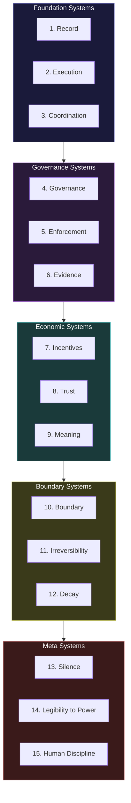

---

sidebar_position: 9
title: "15 Systems of Frankmax"
description: "The 15 coordination systems that form the neutral substrate of the AINEFF Ecosystem — Frankmax as gravity field, not government. Record, Execution, Coordination, Governance, Enforcement, Evidence, Incentives, Trust, Meaning, Boundary, Irreversibility, Decay, Silence, Legibility to Power, and Human Discipline."
tags: [system, technical, frankmax]
custom_status: active
custom_owner: Andrew Leo
custom_last_review: 2026-03-01
custom_next_review: 2026-06-01
---

# 15 Systems of Frankmax

Frankmax is not a company. It is not a government. It is not an authority.

Frankmax is a **neutral coordination substrate** — a gravity field that shapes behavior without commanding it. Just as gravity does not tell objects where to go but constrains where they *can* go, Frankmax does not tell enterprises how to operate but constrains the structural conditions under which they operate.

The 15 systems of Frankmax are the **mechanisms of that gravity**. They are not features, not products, not services. They are coordination primitives — the irreducible set of mechanisms required for any constitutional coordination protocol to function.

---

## The 15 Systems at a Glance

| # | System | One-Line Description |
|---|---|---|
| 1 | **Record** | The canonical truth of what happened |
| 2 | **Execution** | The mechanism by which obligations become actions |
| 3 | **Coordination** | The protocol by which independent actors align without trust |
| 4 | **Governance** | The structure by which rules are made, changed, and retired |
| 5 | **Enforcement** | The mechanism by which rules are made real |
| 6 | **Evidence** | The substrate of proof |
| 7 | **Incentives** | The alignment of self-interest with collective good |
| 8 | **Trust** | The architecture of credibility without faith |
| 9 | **Meaning** | The ontological ground of shared understanding |
| 10 | **Boundary** | The architecture of separation and containment |
| 11 | **Irreversibility** | The governance of actions that cannot be undone |
| 12 | **Decay** | The enforcement of mortality on all artifacts |
| 13 | **Silence** | The discipline of not acting when action is available |
| 14 | **Legibility to Power** | The architecture of transparency to legitimate authority |
| 15 | **Human Discipline** | The constraint that ensures humans remain in the loop |

---

## System 1: Record

### The Problem

Without a canonical record, there is no shared truth. Without shared truth, there is no basis for coordination. Every disagreement reduces to "what actually happened?" — and without Record, that question has no authoritative answer.

### The Mechanism

Record is the **canonical truth of what happened** in the ecosystem. It is not a log, not a database, not a blockchain. It is the structural guarantee that for every significant action, there exists one and only one authoritative account of what occurred, when, by whom, and why.

### Properties

| Property | Specification |
|---|---|
| **Canonicality** | One truth, not many versions |
| **Immutability** | Records cannot be altered after creation |
| **Completeness** | Every significant action has a record |
| **Provenance** | Every record has a documented chain of creation |
| **Accessibility** | Records are available to authorized parties |
| **Verifiability** | Any party can independently verify a record's integrity |

### Ecosystem Instantiation

Record is instantiated through ACTS (Audit & Causal Trace System), GAAGR (Global Registry), Failure Ledger, and KIMS (Knowledge Integrity). These are not separate record systems — they are specialized views of the same canonical truth.

---

## System 2: Execution

### The Problem

Obligations that are not executed are meaningless. A governance framework that defines what should happen but has no mechanism for making it happen is a document, not infrastructure.

### The Mechanism

Execution is the **mechanism by which obligations become actions**. It transforms governance intent ("this should happen") into operational reality ("this has happened") — and it does so within the constraints defined by governance, not outside them.

### Properties

| Property | Specification |
|---|---|
| **Constraint-bound** | Execution cannot exceed the authority granted by governance |
| **Traceable** | Every execution produces a record |
| **Deterministic** | Given the same inputs and state, execution produces the same outputs |
| **Killable** | Any execution can be halted by authorized human |
| **Scoped** | Execution is contained within defined boundaries |

### Ecosystem Instantiation

Execution is instantiated through PEP Runtime, Agent Execution, and Skill Execution Runtime. Every action in the ecosystem flows through one of these execution engines.

---

## System 3: Coordination

### The Problem

Independent actors cannot coordinate without a shared protocol. Without coordination, the ecosystem is a collection of isolated entities — not infrastructure.

### The Mechanism

Coordination is the **protocol by which independent actors align without requiring trust**. Two enterprises that have never met, that may be competitors, that may actively dislike each other, can coordinate their obligations through the same protocol — because coordination does not require trust, only protocol compliance.

### Properties

| Property | Specification |
|---|---|
| **Trust-free** | Coordination works without the parties trusting each other |
| **Protocol-based** | Coordination follows explicit, published rules |
| **Adversary-compatible** | Enemies can coordinate through the same protocol |
| **Non-excludable** | Any compliant party can participate |
| **Symmetric** | The protocol does not advantage any party over another |

### The Terrain Test

> "Can two enemies who hate each other use it simultaneously without coordinating? If yes, terrain. If no, just power."

Coordination must pass this test at every layer.

### Ecosystem Instantiation

Coordination is instantiated through ACP (Control Plane), IPS (Inter-Protocol System), and Inter-AINE Contract. These systems enable coordination without requiring bilateral trust.

---

## System 4: Governance

### The Problem

Rules must be made, changed, and retired. A system with static rules ossifies. A system with no rules is chaos. Governance is the mechanism that navigates between ossification and chaos.

### The Mechanism

Governance is the **structure by which rules are made, changed, and retired** — and by which the rule-making process itself is governed. It is governance all the way down — there is no ungoverned level.

### Properties

| Property | Specification |
|---|---|
| **Self-referential** | Governance governs itself |
| **Bounded** | No governance authority is unlimited |
| **Auditable** | Every governance decision is recorded and traceable |
| **Amendable** | Rules can be changed through defined processes |
| **Mortal** | Governance authorities expire and must be renewed |

### Ecosystem Instantiation

Governance is instantiated through AGK (Autonomous Governance Kernel), GKMS (Governance Knowledge Management), Governance Axiom System, and Meta-Role Governance. The governance stack is self-referential — AGK governs the governance process, and is itself governed by the Governance Axiom System.

---

## System 5: Enforcement

### The Problem

Rules without enforcement are suggestions. Suggestions do not scale. Only enforcement scales.

### The Mechanism

Enforcement is the **mechanism by which rules are made real** — not through punishment (which is reactive) but through structural constraint (which is preventive). A rule that is enforced architecturally cannot be violated, the way a doorway that is too narrow cannot be walked through sideways.

### Properties

| Property | Specification |
|---|---|
| **Structural** | Enforcement is architectural, not cultural |
| **Preventive** | Enforcement prevents violations, not just detects them |
| **Automatic** | Enforcement does not require human intervention for routine cases |
| **Auditable** | Every enforcement action is recorded |
| **Proportional** | Enforcement response matches the severity of the potential violation |

### Ecosystem Instantiation

Enforcement is instantiated through PIES (Policy Ingestion & Enforcement), Agent Scope Enforcement, Compliance Enforcement, Kill-Switch & Suspension, and the Anti-ASI Constraint System. Enforcement operates at every layer.

---

## System 6: Evidence

### The Problem

Without evidence, there is no accountability. Without accountability, there is no trust. Without trust, there is no adoption. Evidence is the foundation of the entire adoption chain.

### The Mechanism

Evidence is the **substrate of proof** — the mechanism by which any claim about the ecosystem can be independently verified. Not testimony. Not assertion. Proof.

### Properties

| Property | Specification |
|---|---|
| **Verifiable** | Any authorized party can independently verify evidence |
| **Tamper-evident** | Any modification to evidence is detectable |
| **Complete** | Evidence captures the full context, not just the conclusion |
| **Timely** | Evidence is captured at or near the time of the action |
| **Admissible** | Evidence meets the standards required by external authorities |

### Ecosystem Instantiation

Evidence is instantiated through ACTS, Audit Evidence Standard System, Audit Evidence Generator, Court Verification System, and Causal Trace Recording. The evidence chain is end-to-end: from action to trace to evidence to court.

---

## System 7: Incentives

### The Problem

Coordination that relies on goodwill fails at scale. Only coordination that aligns self-interest with collective good persists.

### The Mechanism

Incentives is the **alignment of self-interest with collective good** — the structural design that ensures every participant benefits more from protocol compliance than from defection. Not through moralizing, but through economic architecture.

### Properties

| Property | Specification |
|---|---|
| **Self-reinforcing** | Compliant behavior increases the value of compliance |
| **Defection-penalizing** | Non-compliance has structural (not just punitive) costs |
| **Transparent** | Incentive structures are visible to all participants |
| **Stable** | Incentives do not flip under normal conditions |
| **Scale-invariant** | Incentive alignment holds at any ecosystem size |

### Ecosystem Instantiation

Incentives is instantiated through DEFS (Defensive Economics & Fairness), Insurance Pricing System, Capital Settlement, and Failure Insurance. Better governance leads to lower insurance premiums, which incentivizes governance investment — a self-reinforcing flywheel.

---

## System 8: Trust

### The Problem

Trust between strangers does not scale. Trust between enemies is impossible. Yet coordination requires something that functions like trust.

### The Mechanism

Trust is the **architecture of credibility without faith**. It does not ask participants to trust each other. It provides structural guarantees that make trust unnecessary — verifiable records, enforceable constraints, transparent incentives.

### Properties

| Property | Specification |
|---|---|
| **Trustless** | The system works without interpersonal trust |
| **Verifiable** | Every claim can be independently verified |
| **Structural** | Trust-like properties emerge from architecture, not relationships |
| **Incrementable** | Trust accumulates through verified history |
| **Revocable** | Trust-like status can be revoked based on evidence |

### Ecosystem Instantiation

Trust is instantiated through KIMS (Knowledge Integrity), IRMS (Identity & Role Management), ACTS (Audit & Causal Trace), and the Citizen-Skill-Wallet. Trust emerges from verified identity, verified history, and verified capability.

---

## System 9: Meaning

### The Problem

Without shared meaning, communication fails. Two systems that use the same word differently are not communicating — they are generating noise.

### The Mechanism

Meaning is the **ontological ground of shared understanding** — the guarantee that every concept in the ecosystem has one and only one definition, and that definition is accessible to all participants.

### Properties

| Property | Specification |
|---|---|
| **Canonical** | One definition per concept |
| **Formal** | Definitions are machine-readable and logically consistent |
| **Versioned** | Definitions evolve through governed processes |
| **Cross-referencing** | Concepts are defined in relation to each other |
| **Grounded** | Abstract concepts are grounded in operational reality |

### Ecosystem Instantiation

Meaning is instantiated through the Canonical Ontology System, Agent Taxonomy System, Industry Abstraction System, Canonical Skills Ontology System, and Failure Classification System.

---

## System 10: Boundary

### The Problem

Without boundaries, everything leaks into everything else. Governance leaks into execution. Execution leaks into governance. Enterprise A's failure leaks into Enterprise B. Boundaries are what make composition possible.

### The Mechanism

Boundary is the **architecture of separation and containment** — the structural guarantee that domains, entities, and protocols remain isolated unless explicitly and governedly connected.

### Properties

| Property | Specification |
|---|---|
| **Explicit** | Every boundary is named and documented |
| **Enforced** | Boundaries are structurally enforced, not conventionally respected |
| **Crossable** | Boundaries can be crossed through governed channels |
| **Audited** | Every boundary crossing is recorded |
| **Symmetric** | Boundaries apply equally in both directions |

### Ecosystem Instantiation

Boundary is instantiated through Protocol Isolation, Jurisdiction Partition, Agent Scope Enforcement, Failure Contagion Firewall, Internal Data Plane, and the PCP/PEP divide managed by IPS.

---

## System 11: Irreversibility

### The Problem

Reversible actions are cheap. Irreversible actions are expensive. The governance of irreversible actions is the central challenge of any accountability system.

### The Mechanism

Irreversibility is the **governance of actions that cannot be undone**. It is the direct operational expression of the Atomic Constraint — the mechanism that ensures every irreversible action has a bound human liability bearer.

### Properties

| Property | Specification |
|---|---|
| **Detection** | Every action is classified as reversible or irreversible before execution |
| **Binding** | Irreversible actions require human liability binding |
| **Recording** | Irreversible actions produce permanent, immutable records |
| **Escalation** | Irreversible actions receive higher authorization tiers |
| **Finality** | Once executed, irreversible actions cannot be undone — only compensated |

### Ecosystem Instantiation

Irreversibility is instantiated through Human-in-the-Loop Governance, Decision Authorization, Kill-Switch & Suspension, Key Destruction & Seal, and the Atomic Constraint itself.

---

## System 12: Decay

### The Problem

Things that do not decay become permanent. Permanent things become ossified. Ossified things become obstacles. Decay is the mechanism that prevents the ecosystem from becoming its own obstacle.

### The Mechanism

Decay is the **enforcement of mortality on all artifacts** — permissions, roles, knowledge, bindings, and entities. Nothing is permanent by default. Everything must be actively renewed to persist.

### Properties

| Property | Specification |
|---|---|
| **Universal** | Everything decays — no exceptions |
| **Configurable** | Decay rates are set by governance, not hard-coded |
| **Visible** | Decay status is visible to all relevant parties |
| **Enforceable** | Decayed artifacts are structurally invalid, not just flagged |
| **Renewable** | Decayed artifacts can be renewed through governance processes |

### Ecosystem Instantiation

Decay is instantiated through TDES (Time, Decay & Exit), Temporal Validity System, Knowledge Decay, Skill Decay & Revocation, and Temporal Governance. Decay is the immune system of the ecosystem — it removes what is no longer valid.

---

## System 13: Silence

### The Problem

Systems that act whenever they can eventually act when they should not. The discipline of not acting — of remaining silent when action is available but not warranted — is harder and more important than the discipline of acting.

### The Mechanism

Silence is the **discipline of not acting when action is available**. It is the structural guarantee that the ecosystem does not intervene, does not regulate, does not enforce where no governance mandate exists. The absence of action is itself a governed state.

### Properties

| Property | Specification |
|---|---|
| **Intentional** | Silence is a deliberate governance decision, not an oversight |
| **Bounded** | The scope of silence is explicitly defined |
| **Revocable** | Silence can be ended through governance processes |
| **Auditable** | Decisions not to act are recorded alongside decisions to act |
| **Default** | The default state is silence — action requires justification |

### Ecosystem Instantiation

Silence is instantiated through the build priority system (Gray — May Never Need), through governance processes that explicitly decide not to regulate, and through the principle that the ecosystem defaults to non-intervention unless a governance mandate exists.

---

## System 14: Legibility to Power

### The Problem

Systems that are opaque to legitimate authority — courts, regulators, democratic institutions — will eventually be subjected to blunt-force regulation. Transparency to power is not a concession. It is a survival strategy.

### The Mechanism

Legibility to Power is the **architecture of transparency to legitimate authority** — the structural guarantee that courts can verify, regulators can inspect, and democratic institutions can oversee the ecosystem's operations.

### Properties

| Property | Specification |
|---|---|
| **Selective** | Transparency is provided to legitimate authority, not universally |
| **Structured** | Transparency is in formats that authorities can consume |
| **Verified** | Transparent data is independently verifiable |
| **Bounded** | Transparency does not compromise participant privacy or business confidentiality |
| **Proactive** | The ecosystem makes itself legible without waiting to be compelled |

### Ecosystem Instantiation

Legibility to Power is instantiated through Court Verification System, Regulatory Review System, Public Transparency System, and Intergovernmental Review System. The ecosystem is designed to be inspectable by every legitimate authority — not because it is forced to, but because opacity is a structural risk.

---

## System 15: Human Discipline

### The Problem

The greatest risk to any governance system is the humans within it. Humans rubber-stamp, override without thinking, delegate without oversight, and eventually stop paying attention. Human Discipline is the mechanism that prevents governance from degenerating into theater.

### The Mechanism

Human Discipline is the **constraint that ensures humans remain meaningfully in the loop** — not nominally present but actually engaged, actually deciding, actually bearing the weight of their authority.

### Properties

| Property | Specification |
|---|---|
| **Quota-enforced** | Humans cannot approve more than they can meaningfully review |
| **Attention-verified** | Approval requires demonstrated engagement, not just a click |
| **Rotation-mandated** | No human occupies the same governance role indefinitely |
| **Succession-required** | Every human authority has a designated successor |
| **Accountability-bound** | Every human action is recorded and attributable |

### Ecosystem Instantiation

Human Discipline is instantiated through Override Quota, Human-in-the-Loop Governance, HMS (Human Management System), HAAS (Human Accountability & Audit), and Temporal Governance (role bindings expire). The ecosystem does not trust humans to discipline themselves — it provides structural mechanisms that make discipline the path of least resistance.

---

## Frankmax as Gravity Field

The 15 systems are not independent modules to be installed separately. They are **dimensions of a single coordination field** — the way gravity has direction, magnitude, and curvature, all of which are aspects of the same phenomenon.

```mermaid
flowchart TB
    CENTER["Frankmax<br/><i>Neutral Coordination Substrate</i>"]

    CENTER --> S1["Record<br/>What happened"]
    CENTER --> S2["Execution<br/>Making it happen"]
    CENTER --> S3["Coordination<br/>Aligning without trust"]
    CENTER --> S4["Governance<br/>Making and changing rules"]
    CENTER --> S5["Enforcement<br/>Making rules real"]
    CENTER --> S6["Evidence<br/>Proving what happened"]
    CENTER --> S7["Incentives<br/>Aligning self-interest"]
    CENTER --> S8["Trust<br/>Credibility without faith"]
    CENTER --> S9["Meaning<br/>Shared understanding"]
    CENTER --> S10["Boundary<br/>Separation and containment"]
    CENTER --> S11["Irreversibility<br/>Governing the permanent"]
    CENTER --> S12["Decay<br/>Enforcing mortality"]
    CENTER --> S13["Silence<br/>Discipline of non-action"]
    CENTER --> S14["Legibility<br/>Transparency to power"]
    CENTER --> S15["Human Discipline<br/>Keeping humans engaged"]

    style CENTER fill:#1a1a1a,stroke:#ffffff,color:#fff
```

Remove any one of these 15 systems, and the coordination field collapses in a predictable way:

| Removed System | Collapse Mode |
|---|---|
| Record | No shared truth; disagreements unresolvable |
| Execution | Obligations exist but nothing happens |
| Coordination | Entities operate in isolation; no ecosystem |
| Governance | Rules cannot change; system ossifies |
| Enforcement | Rules exist but have no teeth; system becomes advisory |
| Evidence | Claims unverifiable; accountability impossible |
| Incentives | Compliance relies on goodwill; defection inevitable |
| Trust | No credibility; adoption impossible |
| Meaning | Communication fails; concepts drift |
| Boundary | Everything leaks; contamination cascades |
| Irreversibility | Irreversible actions unaccountable; catastrophic failures |
| Decay | Artifacts persist forever; system ossifies differently |
| Silence | System over-intervenes; innovation smothered |
| Legibility to Power | System becomes opaque; regulators respond with blunt force |
| Human Discipline | Humans rubber-stamp; governance becomes theater |
