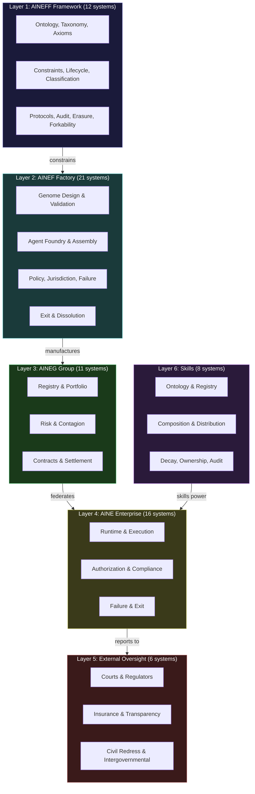
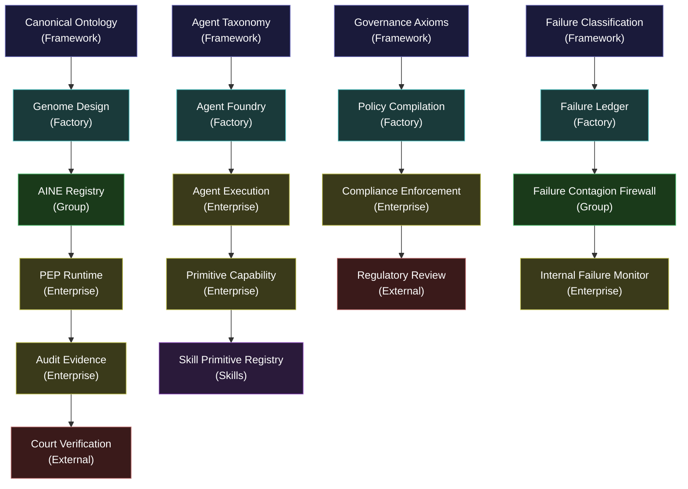

---

sidebar_position: 1
title: "Systems & Modules Overview"
description: "Complete overview of all 74 systems in the AINEFF Ecosystem — organized by layer, prioritized by build sequence, and mapped to the constitutional coordination protocol."
tags: [system, technical, index]
custom_status: active
custom_owner: Andrew Leo
custom_last_review: 2026-03-01
custom_next_review: 2026-06-01
---

# Systems & Modules Overview

The AINEFF Ecosystem comprises **74 named systems** distributed across six architectural layers. Each system has a defined purpose, explicit boundaries, declared failure modes, and a build priority that determines when it enters production.

This is not a feature list. It is a **structural decomposition** of every mechanism required to operate a constitutional coordination protocol at civilization scale.

---

## Build Sequence Philosophy

Not all 74 systems are built at once. The build sequence follows a disciplined prioritization framework with four tiers:

| Priority | Color | Meaning | Count | When to Build |
|---|---|---|---|---|
| **Green** | Build Now | Structurally required for the protocol to function at all. Without these, nothing works. | ~21 | Years 1-3 |
| **Yellow** | Build When Proven | Required once the protocol handles real obligations. Can be deferred until demand materializes. | ~18 | Years 2-5 |
| **Red** | Defer | Important but not urgent. Build when the ecosystem reaches sufficient scale to justify the cost. | ~20 | Years 4-8 |
| **Gray** | May Never Need | Theoretically complete but practically optional. Build only if a clear forcing function emerges. | ~15 | If ever |

The discipline is in what you **do not build**. Every system deferred is engineering capacity preserved for the systems that matter now.

---

## The Six Architectural Layers

All 74 systems are organized into six layers, each with a distinct scope and authority boundary:

---

## Complete System Registry

The following table lists all 74 systems with their layer assignment, purpose, and build priority.

### Layer 1: AINEFF Framework Systems (12)

| # | System | Purpose | Priority |
|---|---|---|---|
| 1 | Canonical Ontology System | Defines every named concept, entity, and relationship in the ecosystem | **Green** |
| 2 | Agent Taxonomy System | Classifies all agent types — human, AI, hybrid, composite | **Green** |
| 3 | Industry Abstraction System | Maps NAICS/SIC/ISIC/GICS/UNSPSC/HS codes to a unified industry ontology | **Yellow** |
| 4 | Governance Axiom System | Formalizes the irreducible governance axioms (Atomic Constraint and corollaries) | **Green** |
| 5 | Anti-ASI Constraint System | Enforces structural limits preventing any system from becoming its own liability bearer | **Green** |
| 6 | Lifecycle Law System | Defines mandatory lifecycle phases: creation, operation, suspension, exit, dissolution | **Green** |
| 7 | Failure Classification System | Canonical taxonomy of failure types, severities, and escalation paths | **Green** |
| 8 | Temporal Validity System | All assertions, bindings, and permissions expire by default — nothing is permanent | **Yellow** |
| 9 | Protocol Class System | Enforces the PCP (governance) vs PEP (execution) boundary | **Green** |
| 10 | Audit Evidence Standard System | Defines what constitutes valid audit evidence across all layers | **Yellow** |
| 11 | Right-to-Erasure System | Handles data deletion obligations while preserving audit integrity | **Red** |
| 12 | Forkability & Dissolution System | Ensures any entity can be dissolved or forked without orphaning obligations | **Red** |

### Layer 2: AINEF Factory Systems (21)

| # | System | Purpose | Priority |
|---|---|---|---|
| 13 | Enterprise Genome Design | Designs the constitutional genome for each new enterprise | **Green** |
| 14 | Genome Validation | Validates genome completeness, consistency, and constraint satisfaction | **Green** |
| 15 | Agent Foundry | Manufactures agents with bound capabilities, scopes, and lifetimes | **Green** |
| 16 | Agent Scope Enforcement | Prevents agents from exceeding their declared scope at runtime | **Green** |
| 17 | Assembly Line Orchestration | Coordinates the multi-step enterprise manufacturing sequence | **Yellow** |
| 18 | Dependency Integrity | Ensures no system deploys with unresolved or circular dependencies | **Yellow** |
| 19 | Policy Compilation | Compiles human-readable policies into machine-enforceable rules | **Green** |
| 20 | Jurisdiction Binding | Binds enterprises to specific legal jurisdictions with correct regulatory mappings | **Yellow** |
| 21 | PEP-GEN | Generates Protocol Execution Packages from validated genomes | **Green** |
| 22 | Protocol Isolation | Ensures PCP and PEP protocols cannot leak state into each other | **Green** |
| 23 | Failure Budget Allocation | Allocates failure budgets to systems proportional to their risk profile | **Yellow** |
| 24 | Failure Ledger | Immutable record of all failures, near-misses, and degradations | **Green** |
| 25 | Failure Insurance | Manages failure insurance pools and payout triggers | **Red** |
| 26 | Temporal Governance | Enforces time-bound governance: all permissions, roles, and bindings expire | **Yellow** |
| 27 | Knowledge Decay | Manages planned obsolescence of knowledge artifacts | **Red** |
| 28 | Human-in-the-Loop Governance | Enforces mandatory human checkpoints in all irreversible workflows | **Green** |
| 29 | Override Quota | Limits the number of human overrides per time period to prevent rubber-stamping | **Yellow** |
| 30 | Kill-Switch & Suspension | Provides immediate shutdown capability for any manufactured entity | **Green** |
| 31 | Exit Orchestration | Manages orderly wind-down of enterprises, transferring obligations cleanly | **Red** |
| 32 | Knowledge Disposition | Determines what happens to knowledge artifacts when an entity exits | **Red** |
| 33 | Key Destruction & Seal | Cryptographic key destruction and final sealing of dissolved entities | **Red** |

### Layer 3: AINEG Group Systems (11)

| # | System | Purpose | Priority |
|---|---|---|---|
| 34 | AINE Registry | Canonical registry of all AINE enterprises within a group | **Green** |
| 35 | Portfolio Lifecycle | Manages the lifecycle of enterprise portfolios — onboarding through dissolution | **Yellow** |
| 36 | Resource Allocation | Allocates shared resources across enterprises within a group | **Yellow** |
| 37 | Cross-AINE Risk | Assesses and monitors risk contagion between enterprises in a group | **Yellow** |
| 38 | Failure Contagion Firewall | Prevents failure in one enterprise from cascading to others | **Green** |
| 39 | Insurance Pool | Manages shared insurance pools for group-level risk | **Red** |
| 40 | Inter-AINE Contract | Manages contracts and obligations between enterprises in the same group | **Yellow** |
| 41 | Public Coordination Gateway | Interface for group-level public reporting and transparency | **Red** |
| 42 | Jurisdiction Partition | Ensures enterprises in different jurisdictions remain legally isolated | **Yellow** |
| 43 | Capital Settlement | Manages financial settlement between enterprises and the group | **Red** |
| 44 | Mass Audit Aggregation | Aggregates audit data across all enterprises for group-level reporting | **Red** |

### Layer 4: AINE Enterprise Systems (16)

| # | System | Purpose | Priority |
|---|---|---|---|
| 45 | PEP Runtime | Executes Protocol Execution Packages within a single enterprise | **Green** |
| 46 | Agent Execution | Manages the runtime lifecycle of agents within an enterprise | **Green** |
| 47 | Primitive Capability | Registry of atomic capabilities available to agents | **Green** |
| 48 | Job Role | Defines and enforces job roles as compositions of capabilities | **Yellow** |
| 49 | Meta-Role Governance | Governs who can create, modify, or destroy roles | **Yellow** |
| 50 | Internal Data Plane | Manages data flow within an enterprise, enforcing information boundaries | **Yellow** |
| 51 | Decision Authorization | Enforces multi-level authorization for decisions above threshold | **Green** |
| 52 | Causal Trace Recording | Records complete causal chains for all significant actions | **Green** |
| 53 | Confidence & Uncertainty | Tracks and propagates confidence and uncertainty scores through decision chains | **Red** |
| 54 | Compliance Enforcement | Runtime enforcement of compliance rules within the enterprise | **Yellow** |
| 55 | Human Escalation | Manages escalation paths from automated systems to human decision-makers | **Green** |
| 56 | Internal Failure Monitor | Monitors for failure conditions within the enterprise | **Green** |
| 57 | Internal Suspension | Suspends specific agents, roles, or workflows within an enterprise | **Yellow** |
| 58 | Audit Evidence Generator | Generates audit-ready evidence packages from runtime data | **Yellow** |
| 59 | Replay & Determinism | Enables deterministic replay of any decision chain for audit purposes | **Red** |
| 60 | Enterprise Exit Controller | Manages orderly shutdown of an individual enterprise | **Red** |

### Layer 5: External Oversight Systems (6)

| # | System | Purpose | Priority |
|---|---|---|---|
| 61 | Court Verification System | Provides courts with verifiable evidence of governance compliance | **Red** |
| 62 | Regulatory Review System | Enables regulators to inspect and audit governed entities | **Yellow** |
| 63 | Insurance Pricing System | Feeds governance data to insurance underwriters for risk pricing | **Yellow** |
| 64 | Public Transparency System | Publishes non-confidential governance data for public inspection | **Red** |
| 65 | Civil Redress System | Enables affected parties to seek redress through the protocol | **Red** |
| 66 | Intergovernmental Review System | Enables cross-border regulatory coordination | **Gray** |

### Layer 6: Skills Systems (8)

| # | System | Purpose | Priority |
|---|---|---|---|
| 67 | Canonical Skills Ontology System | Defines the universal taxonomy of skills | **Yellow** |
| 68 | Skill Primitive Registry System | Registry of atomic, indivisible skill primitives | **Yellow** |
| 69 | Skill Composition System | Composes skill primitives into compound skills | **Yellow** |
| 70 | Skill Packaging & Distribution System | Packages skills for deployment and marketplace distribution | **Red** |
| 71 | Skill Execution Runtime | Executes skills within agent and role contexts | **Red** |
| 72 | Skill Decay & Revocation System | Manages skill expiration and revocation | **Red** |
| 73 | Skill Ownership & Portability System | Citizen-Skill-Wallet: skills belong to the person, not the employer | **Red** |
| 74 | Skill Audit & Valuation System | Values and audits skills for credentialing and compensation | **Gray** |

---

## Cross-Layer Dependencies

No system operates in isolation. The following diagram shows the primary dependency flows between layers:

---

## Browse Systems

<Tabs>
<TabItem value="entity" label="By Owning Entity" default>

**AINEFF (Constitutional)**
- [12 Framework Systems](./aineff-framework-systems) — Ontology, taxonomy, axioms, constraints, protocols

**AINEF (Factory)**
- [21 Factory Systems](./ainef-factory-systems) — Genome design, agent foundry, policy compilation, exit
- [Factory Byproducts](./factory-byproducts) — 11 service layers as natural byproducts

**AINEG (Federation)**
- [11 Group Systems](./aineg-group-systems) — Registry, risk, contagion firewalls, settlement

**AINE (Enterprise)**
- [16 Enterprise Systems](./aine-enterprise-systems) — Runtime, execution, authorization, compliance

**FrankMax (Governance)**
- [15 FrankMax Systems](./frankmax-15-systems) — Record, execution, governance, trust, meaning

**External**
- [6 External Oversight](./external-oversight) — Courts, regulators, insurance, transparency
- [8 Skills Systems](./skills-systems) — Skill lifecycle: ontology → execution → decay

</TabItem>
<TabItem value="layer" label="By Architectural Layer">

**Governance Layer** (defines what is permissible)
- [12 AINEFF Framework Systems](./aineff-framework-systems)
- [15 FrankMax Systems](./frankmax-15-systems)

**Manufacturing Layer** (builds entities)
- [21 AINEF Factory Systems](./ainef-factory-systems)
- [Factory Byproducts](./factory-byproducts)

**Coordination Layer** (federates and monitors)
- [11 AINEG Group Systems](./aineg-group-systems)
- [6 External Oversight](./external-oversight)

**Execution Layer** (runs enterprises)
- [16 AINE Enterprise Systems](./aine-enterprise-systems)
- [8 Skills Systems](./skills-systems)

</TabItem>

</Tabs>

---

## Navigating This Section

| Page | What It Covers |
|---|---|
| [21 Core AINEFF Systems](./21-core-systems) | The foundational systems that span all layers — control plane, registries, audit, compliance, governance |
| [12 AINEFF Framework Systems](./aineff-framework-systems) | Constitutional-level systems: ontology, taxonomy, axioms, constraints, protocols |
| [21 AINEF Factory Systems](./ainef-factory-systems) | Manufacturing-level systems: genome design, agent foundry, policy compilation, exit orchestration |
| [11 AINEG Group Systems](./aineg-group-systems) | Federation-level systems: registry, risk, contagion firewalls, settlement |
| [16 AINE Enterprise Systems](./aine-enterprise-systems) | Enterprise-level systems: runtime, execution, authorization, compliance, failure |
| [6 External Oversight Systems](./external-oversight) | External-facing systems: courts, regulators, insurance, transparency, redress |
| [8 Skills Systems](./skills-systems) | Skill lifecycle: ontology, registry, composition, runtime, decay, portability, audit |
| [15 Systems of Frankmax](./frankmax-15-systems) | The coordination substrate: record, execution, governance, trust, meaning, silence |
| [Factory Byproduct Economy](./factory-byproducts) | 11 service layers that emerge as natural byproducts of the factory |
