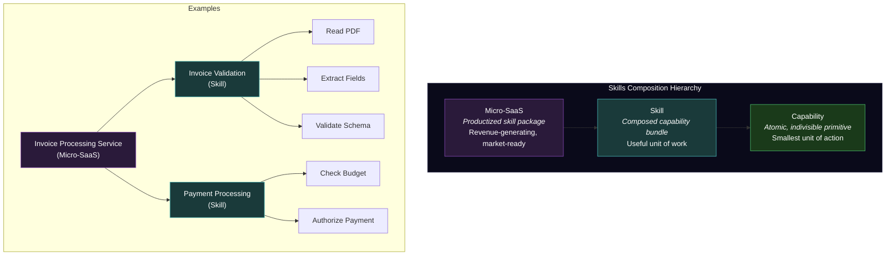
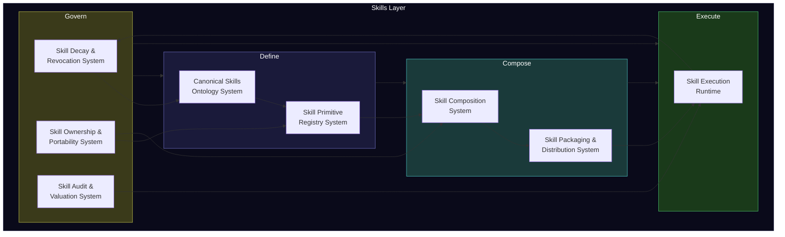
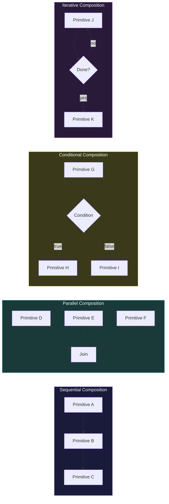
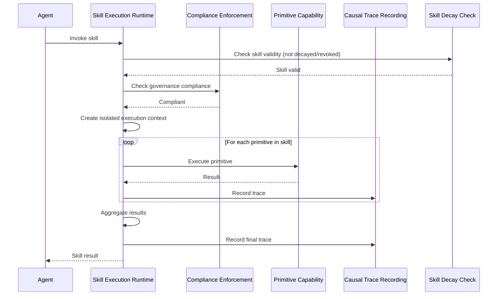
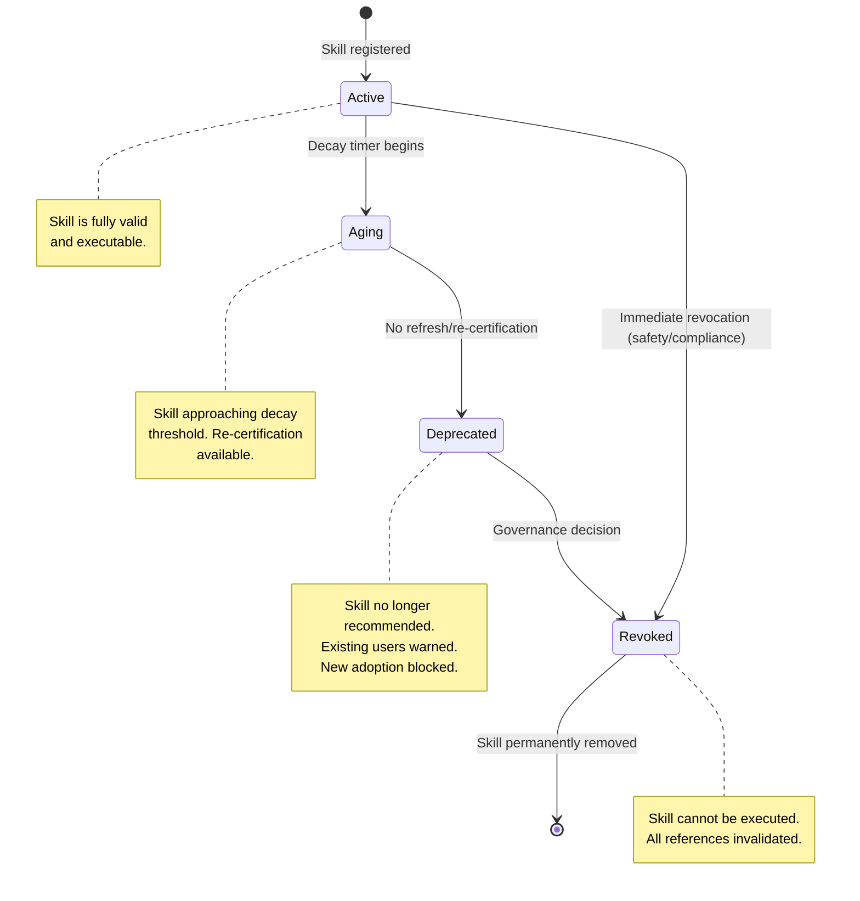

---

sidebar_position: 8
title: "8 Skills Systems"
description: "Complete specification of Systems 67-74 — the Skills Layer that defines, registers, composes, packages, executes, decays, owns, and audits every skill in the AINEFF Ecosystem."
tags: [system, technical, agent]
custom_status: active
custom_owner: Andrew Leo
custom_last_review: 2026-03-01
custom_next_review: 2026-06-01
---

# 8 Skills Systems

Skills are the **atomic units of economic value** in the AINEFF Ecosystem. Every action an agent takes, every capability an enterprise offers, every service that generates revenue traces back to skills — composed, governed, and valued through a dedicated layer of 8 systems.

The skills layer implements a radical principle: **skills belong to people, not to employers**. The Citizen-Skill-Wallet ensures that skills are portable, verifiable, and composable — creating a universal skills infrastructure that operates independently of any single employer, platform, or credential issuer.

---

## The Skills Hierarchy

The skills layer implements a three-level hierarchy from atomic capabilities to productized offerings:

| Level | Definition | Governance | Ownership |
|---|---|---|---|
| **Capability (Atomic)** | The smallest indivisible unit of action. Cannot be decomposed further. | Defined by Canonical Skills Ontology, registered in Skill Primitive Registry | Ecosystem-wide (public primitive) |
| **Skill (Composed)** | A composition of capabilities that performs a meaningful unit of work. | Composed via Skill Composition System, governed by enterprise or individual | Owned by the person (Citizen-Skill-Wallet) |
| **Micro-SaaS (Productized)** | A packaged, priced, distributable skill bundle ready for market consumption. | Packaged by Skill Packaging & Distribution, executed by Skill Execution Runtime | Licensed by the enterprise, revenue shared with skill owner |

---

## Skills Layer Architecture

---

## System 67: Canonical Skills Ontology System

### Purpose

The Canonical Skills Ontology System defines the **universal taxonomy of skills** — every skill that can exist in the ecosystem has a named, defined place in this ontology. It is the skills-layer equivalent of the Canonical Ontology System, but focused specifically on the skill domain.

### Ontology Structure

| Level | Description | Example | Estimated Count |
|---|---|---|---|
| **Domain** | Top-level skill domain | Finance, Engineering, Legal, Operations | ~20 |
| **Category** | Major skill category within a domain | Accounts Payable, Structural Engineering | ~200 |
| **Family** | Related skill group within a category | Invoice Processing, Bridge Design | ~2,000 |
| **Skill** | Named, composed skill | "3-Way Invoice Match," "Load-Bearing Calculation" | ~20,000 |
| **Capability** | Atomic primitive within a skill | "Extract PO Number," "Calculate Stress Factor" | ~100,000 |

### Cross-References

| Reference System | Mapping Purpose |
|---|---|
| **O*NET** | US Department of Labor skill taxonomy alignment |
| **ESCO** | European Skills, Competences, Qualifications and Occupations alignment |
| **ISCO** | International Standard Classification of Occupations alignment |
| **Industry Abstraction System** | Industry-specific skill contextualization |
| **Agent Taxonomy System** | Which agent types can perform which skills |

### What It Does NOT Do

- Does not register individual skill instances (that is Skill Primitive Registry)
- Does not compose skills (that is Skill Composition System)
- Does not assess skill quality (that is Skill Audit & Valuation)
- Does not determine skill ownership (that is Skill Ownership & Portability)

---

## System 68: Skill Primitive Registry System

### Purpose

The Skill Primitive Registry System is the **canonical registry of all atomic skill primitives** in the ecosystem. Every capability — the smallest indivisible unit of action — is registered here with its definition, interface specification, and governance metadata.

### Primitive Registration Entry

| Field | Description | Required |
|---|---|---|
| **Primitive ID** | Globally unique identifier | Yes |
| **Name** | Human-readable name | Yes |
| **Ontology position** | Location in the Canonical Skills Ontology | Yes |
| **Interface specification** | Inputs, outputs, preconditions, postconditions | Yes |
| **Determinism** | Whether this primitive is deterministic | Yes |
| **Reversibility** | Whether actions taken by this primitive are reversible | Yes |
| **Agent type compatibility** | Which agent types can execute this primitive | Yes |
| **Governance requirements** | What governance constraints apply (from framework systems) | Yes |
| **Dependencies** | Other primitives required for this one to function | If any |
| **Version** | Semantic version number | Yes |
| **Deprecation status** | Whether this primitive is deprecated and what replaces it | If applicable |

### Registry Metrics

| Metric | Description |
|---|---|
| **Total primitives registered** | Count of all active primitives |
| **Primitives per domain** | Distribution across skill domains |
| **Usage frequency** | How often each primitive is invoked across the ecosystem |
| **Composition count** | How many skills compose each primitive |
| **Decay rate** | How many primitives have been deprecated over time |

### What It Does NOT Do

- Does not define the ontology (that is Canonical Skills Ontology)
- Does not compose primitives into skills (that is Skill Composition System)
- Does not execute primitives (that is Skill Execution Runtime)
- Does not value primitives (that is Skill Audit & Valuation)

---

## System 69: Skill Composition System

### Purpose

The Skill Composition System **composes atomic primitives into compound skills**. A skill is a meaningful unit of work — not a single action, but a choreographed sequence or parallel set of actions that together produce a useful outcome.

### Composition Rules

| Rule | What It Enforces |
|---|---|
| **Type safety** | Output type of one primitive must match input type of the next |
| **Scope compatibility** | All primitives in a skill must be compatible with the same scope boundary |
| **Agent compatibility** | At least one agent type must be able to execute all primitives in the skill |
| **Governance accumulation** | The skill inherits the strictest governance requirement of any constituent primitive |
| **Determinism propagation** | A skill is deterministic only if all its primitives are deterministic |
| **Reversibility propagation** | A skill is reversible only if all its primitives are reversible |
| **Dependency closure** | All dependencies of all constituent primitives must be satisfied |

### Composition Patterns

### What It Does NOT Do

- Does not create new primitives (primitives are atomic and registered independently)
- Does not execute composed skills (that is Skill Execution Runtime)
- Does not package skills for distribution (that is Skill Packaging & Distribution)
- Does not validate business logic (it validates structural composition)

---

## System 70: Skill Packaging & Distribution System

### Purpose

The Skill Packaging & Distribution System takes composed skills and **packages them for deployment and marketplace distribution**. A package is a deployable, versionable, licensable unit that can be installed in any compatible AINE enterprise.

### Package Structure

| Component | Description | Required |
|---|---|---|
| **Skill manifest** | Complete specification of the skill and all its primitives | Yes |
| **Interface contract** | Inputs, outputs, SLA guarantees | Yes |
| **Governance metadata** | All applicable governance constraints | Yes |
| **Compatibility matrix** | Which enterprise configurations can run this skill | Yes |
| **License terms** | Usage rights, pricing, revenue sharing | Yes |
| **Version history** | All previous versions with changelog | Yes |
| **Test suite** | Automated tests that verify correct behavior | Yes |
| **Documentation** | Human-readable documentation | Yes |
| **Dependencies** | All required primitives, libraries, and infrastructure | Yes |
| **Integrity proof** | Cryptographic proof of package integrity | Yes |

### Distribution Channels

| Channel | Audience | Pricing Model |
|---|---|---|
| **Ecosystem marketplace** | All AINE enterprises | Per-invocation, subscription, or flat license |
| **Enterprise-internal** | Within a single enterprise | No charge (internal capability) |
| **Group-internal** | Within an AINEG group | Group-negotiated pricing |
| **Public API** | External systems | API call pricing |
| **Embedded** | Third-party products | OEM licensing |

### What It Does NOT Do

- Does not compose skills (that is Skill Composition System)
- Does not execute skills (that is Skill Execution Runtime)
- Does not price skills (pricing is a governance/market decision)
- Does not handle payment (that is Capital Settlement)

---

## System 71: Skill Execution Runtime

### Purpose

The Skill Execution Runtime **executes skills within agent and role contexts**. When an agent invokes a skill — whether a composed skill from the marketplace or an enterprise-internal skill — this runtime manages the execution, enforces governance constraints, tracks resource usage, and produces audit traces.

### Execution Environment

| Property | Specification |
|---|---|
| **Isolation** | Each skill invocation runs in an isolated execution context |
| **Resource limits** | CPU, memory, I/O, and time limits enforced per invocation |
| **Governance enforcement** | All governance constraints checked before and during execution |
| **Audit trail** | Every invocation produces a complete causal trace |
| **Determinism** | Deterministic skills produce identical results on replay |
| **Failure handling** | Failed invocations are recorded, compensating actions triggered if needed |
| **Metering** | Resource consumption metered for billing and capacity planning |

### Execution Flow

### What It Does NOT Do

- Does not compose skills (that is Skill Composition System)
- Does not manage agent lifecycle (that is Agent Execution)
- Does not define capabilities (that is Primitive Capability)
- Does not handle skill marketplace operations (that is Skill Packaging & Distribution)

---

## System 72: Skill Decay & Revocation System

### Purpose

The Skill Decay & Revocation System manages the **expiration, deprecation, and revocation of skills**. Skills do not last forever — technologies change, regulations evolve, best practices shift. This system ensures that outdated skills are identified, flagged, and eventually removed from circulation.

### Decay Lifecycle

### Decay Triggers

| Trigger | Description | Urgency |
|---|---|---|
| **Temporal expiration** | Skill has exceeded its defined TTL without renewal | Normal (gradual) |
| **Technology obsolescence** | Underlying technology has been superseded | Normal (gradual) |
| **Regulatory change** | Regulation makes the skill non-compliant | High (must revoke before enforcement date) |
| **Security vulnerability** | Skill contains a security flaw | Critical (immediate revocation) |
| **Accuracy degradation** | Skill produces increasingly inaccurate results | High (revocation after verification) |
| **Governance decision** | Governance authority decides to retire the skill | Per governance timeline |

### What It Does NOT Do

- Does not determine when skills should decay (governance and temporal validity set the rules)
- Does not create replacement skills (that is Skill Composition System)
- Does not manage human skill development (it manages system-level skill artifacts)

---

## System 73: Skill Ownership & Portability System (Citizen-Skill-Wallet)

### Purpose

The Citizen-Skill-Wallet is the system that ensures **skills belong to people, not to employers**. When a person develops or acquires a skill, it is recorded in their personal Citizen-Skill-Wallet — a portable, verifiable, sovereignty-preserving record of their capabilities.

This is a fundamental shift from the current model where skills are implicitly owned by the employer who trained the employee. In the AINEFF Ecosystem, skills are **first-class assets** owned by the individual who possesses them.

### Wallet Contents

| Content | Description | Ownership |
|---|---|---|
| **Skill records** | All skills the person has acquired, with provenance | Person |
| **Capability certifications** | Verified capabilities with evidence of proficiency | Person |
| **Skill history** | Timeline of skill acquisition, use, and decay | Person |
| **Composition history** | Skills the person has composed from primitives | Person (with enterprise co-ownership for employer-created compositions) |
| **Valuation history** | Historical valuations of the person's skill portfolio | Person |
| **Portability tokens** | Cryptographic tokens enabling skill verification without disclosing details | Person |

### Portability Guarantees

| Guarantee | What It Means |
|---|---|
| **Employer independence** | Skills remain in the wallet regardless of employment status |
| **Verification without disclosure** | A person can prove they have a skill without revealing where they learned it |
| **Cross-enterprise recognition** | Skills verified in one enterprise are recognized in all others |
| **No lock-in** | No employer, platform, or credential issuer can revoke ownership |
| **Export right** | The person can export their complete skill record at any time |
| **Privacy by default** | Skill data is only shared with the person's explicit consent |

### Economic Implications

| Implication | Current Model | Citizen-Skill-Wallet Model |
|---|---|---|
| **Job switching** | Skills not portable; must re-prove | Skills verified instantly |
| **Compensation negotiation** | Skills opaque; employer has information advantage | Skills valued objectively |
| **Skill investment** | Person bears cost, employer captures value | Person owns and benefits from investment |
| **Credential inflation** | Degrees proxy for skills | Skills measured directly |
| **Hiring efficiency** | Lengthy verification process | Instant cryptographic verification |

### What It Does NOT Do

- Does not train people (it records skills, not develops them)
- Does not set skill prices (that is market dynamics and Skill Audit & Valuation)
- Does not force skill disclosure (the person controls what is shared)
- Does not replace educational credentials (it supplements them with verified capabilities)

---

## System 74: Skill Audit & Valuation System

### Purpose

The Skill Audit & Valuation System **values and audits skills** for credentialing, compensation benchmarking, and economic analysis. It answers the question: "What is this skill worth?" — not as a subjective judgment, but as a data-driven valuation based on market demand, supply, complexity, and impact.

### Valuation Methodology

| Factor | Weight | Measurement |
|---|---|---|
| **Market demand** | 30% | Frequency of skill invocation across the ecosystem |
| **Supply scarcity** | 25% | Number of verified holders relative to demand |
| **Complexity** | 20% | Number of primitives, composition depth, governance requirements |
| **Impact** | 15% | Average value of obligations that use this skill |
| **Decay rate** | 10% | How quickly the skill depreciates (fast-depreciating skills are valued higher when current) |

### Valuation Outputs

| Output | Description | Consumers |
|---|---|---|
| **Skill market rate** | Current market price for this skill | Enterprises (compensation), individuals (negotiation) |
| **Skill trend** | Increasing, stable, or decreasing value | Individuals (career planning), enterprises (workforce planning) |
| **Skill rarity score** | How scarce the skill is in the ecosystem | Insurance Pricing (risk assessment), enterprises (talent strategy) |
| **Skill composition value** | Value of composed skills vs. sum of their primitives | Skill Composition System (composition optimization) |
| **Portfolio valuation** | Total value of a person's skill portfolio | Citizen-Skill-Wallet (personal financial planning) |

### Audit Capabilities

| Capability | What It Audits |
|---|---|
| **Skill authenticity** | Is this skill genuinely held, or fraudulently claimed? |
| **Skill currency** | Is this skill current, or has it decayed? |
| **Skill provenance** | Where and how was this skill acquired? |
| **Skill proficiency** | At what level is this skill held? |
| **Skill usage** | How often and how effectively is this skill used? |

### Build Priority

This system is classified as **Gray — May Never Need** in its full form. Basic skill valuation (market rate, demand) can be implemented early. Advanced features (portfolio valuation, trend analysis, audit) may never be needed if the skills marketplace does not reach sufficient scale.

### What It Does NOT Do

- Does not set compensation (it provides data; enterprises and individuals negotiate)
- Does not certify skills (certification is a governance function)
- Does not train skills (it values and audits existing skills)
- Does not replace human judgment in hiring (it supplements it with data)
