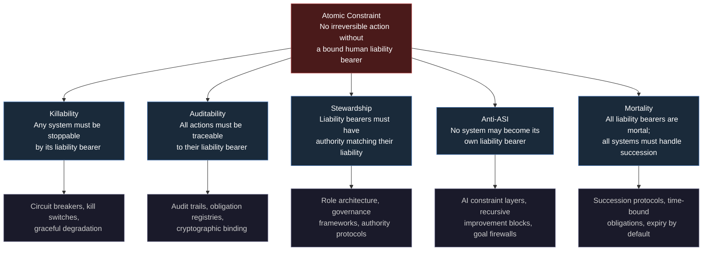
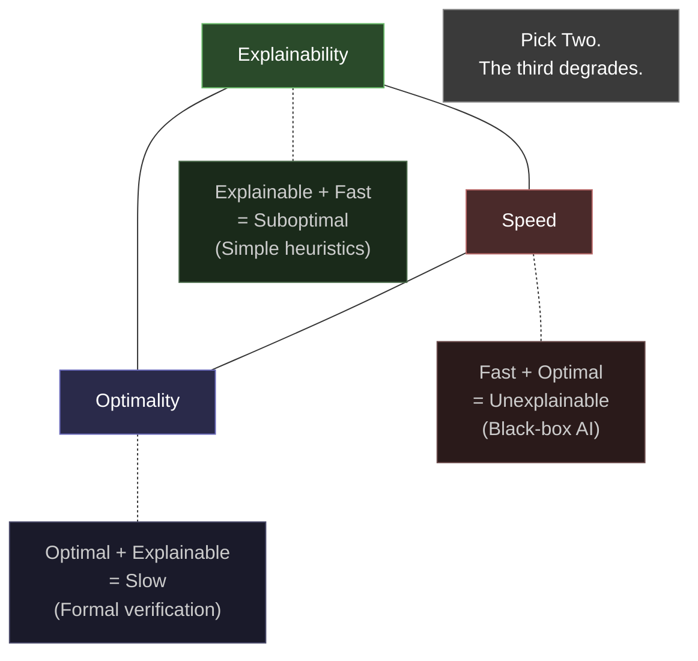

# The Atomic Constraint

Everything in the AINEFF Ecosystem derives from a single, irreducible principle. Not a mission statement. Not a value proposition. A **structural constraint** — the ORF kernel from which all governance, all architecture, all products, and all protocols are generated.

---

## The Constraint

> **"No system may execute an irreversible action unless a single, identifiable human liability bearer is bound to that action at execution time."**

Read it again. Every word is load-bearing:

| Word | Why It Matters |
|---|---|
| **No system** | Applies to all systems — human, AI, hybrid, automated, manual |
| **may execute** | This is a prohibition, not a recommendation |
| **an irreversible action** | Scoped to actions that cannot be undone — the ones that matter |
| **unless** | There is exactly one escape clause |
| **a single** | Not a committee. Not a team. One. |
| **identifiable** | Not anonymous. Not obscured. Known. |
| **human** | Not an algorithm. Not a model. A person. |
| **liability bearer** | Not a signer. Not an approver. Someone who bears consequences. |
| **is bound** | Not "has been notified." Cryptographically, legally, operationally bound. |
| **to that action** | To this specific action. Not to "the system" or "the project." |
| **at execution time** | Not before. Not after. At the moment of irreversibility. |

---

## Why This Is the Kernel

This is not one principle among many. It is the **generative kernel** — the single axiom from which the entire system of governance can be derived, the way Euclid derived geometry from five postulates.

Every other principle in the AINEFF Ecosystem is a corollary of this constraint:

---

## Why This Constraint Is Fundamental

This constraint is not optional, not aspirational, and not a "best practice." It is **structural** — meaning that systems which violate it produce predictable, catastrophic failure modes.

### It Is Not Optional

Any system that executes irreversible actions without bound liability is, by definition, an **unaccountable system**. Unaccountable systems do not fail gracefully — they fail catastrophically, because there is no feedback mechanism to detect drift before it becomes disaster.

Examples of violations in the wild:
- Algorithmic trading systems that execute billions in trades with no single human accountable for any specific trade
- Automated hiring systems that reject candidates with no identifiable person responsible for any specific rejection
- Autonomous weapons systems that select targets with no single human bound to any specific engagement

### It Is Not Aspirational

This is not "we should try to have accountability." It is a hard constraint: **the system will not execute** unless the binding is in place. The constraint is enforced architecturally, not culturally. You cannot configure around it. You cannot override it with sufficient authority. It is the one rule that no role in the system has permission to break.

### It Is Structural

The constraint maps to the physical reality of irreversibility. Once an action is irreversible, the only thing that can bear its consequences is a mortal agent with skin in the game. Algorithms do not have skin. Corporations do not have mortality. Only humans have both.

---

## The Fundamental Decision-Making Tradeoff

The Atomic Constraint is not arbitrary. It emerges from a deeper mathematical reality about decision-making under uncertainty:

> **"Any system — human, AI, or hybrid — that makes decisions under uncertainty must trade off explainability, speed, and optimality. It is impossible to maximize all three simultaneously at scale."**

This tradeoff is why the Atomic Constraint exists. When a system cannot be simultaneously fast, optimal, and explainable, **someone must bear the residual risk** of whichever dimension was sacrificed. That someone must be human, identifiable, and bound.

---

## How It Maps to Every Layer

The Atomic Constraint is not an abstract principle that floats above the architecture. It is enforced at every layer:

| Layer | How the Constraint Manifests |
|---|---|
| **Protocol Layer** | Every obligation in the registry has exactly one bound liability bearer at any point in time |
| **Governance Layer** | Every governance decision traces to a single ratifying human |
| **Product Layer** | Every diagnostic, every recommendation, every output names its liable party |
| **Operator Layer** | Every operator action is bound to the operator's personal liability |
| **AI Layer** | Every AI output that triggers action requires human ratification before execution |
| **Audit Layer** | Every audit trail terminates at a named human, not a role or committee |
| **Legal Layer** | Every contract, every obligation, every SLA names a liability bearer |

---

## Validation Tests

The constraint is not taken on faith. It is validated through three independent formal lenses:

### 1. Computational Depth Test

The constraint is computationally irreducible — meaning there is no shortcut to evaluating whether it holds for a given system. You must trace each irreversible action to its liability bearer. There is no summary, no approximation, no heuristic that can substitute for the actual trace.

**What this means in practice:** You cannot "certify" a system as compliant in general. You can only verify compliance for specific actions at specific times. This is a feature, not a limitation — it prevents the false confidence that comes from blanket certification.

### 2. Information-Theoretic Test

The constraint preserves information that would otherwise be destroyed. When an irreversible action executes, the entropy of the system increases — information is lost about the pre-action state. The liability binding is the only record that connects the irreversible outcome to a responsible agent. Without it, the causal chain is severed.

**What this means in practice:** Systems without liability binding accumulate unattributed entropy — they become progressively less understandable over time. Systems with liability binding maintain causal coherence indefinitely.

### 3. Control-Theoretic Test

The constraint ensures that every irreversible action has a feedback path to a controller (the liability bearer) who can modify future behavior based on outcomes. Without this feedback path, the system is open-loop for irreversible actions — it can drift without correction until catastrophic failure.

**What this means in practice:** The liability bearer is not just a name on a form. They are a control-theoretic necessity — the feedback node that keeps the system stable across irreversible transitions.

---

## Properties of the Constraint

The Atomic Constraint exhibits four key properties that distinguish it from ordinary rules or policies:

### Computation-Rooted

It emerges from the computational structure of decision-making, not from cultural values or legal traditions. Any sufficiently complex system that makes irreversible decisions will discover this constraint independently, the way any sufficiently advanced civilization will discover calculus.

### Entropy-Backed

It is grounded in information theory. The constraint exists because irreversibility destroys information, and destroyed information must be compensated by preserved accountability. This is not a metaphor — it is a direct application of the second law of thermodynamics to organizational systems.

### Control-Enforced

It is mandated by control theory. Systems with irreversible state transitions require bounded-authority controllers at every transition point. The liability bearer is that controller. Remove them, and the system becomes uncontrollable by definition.

### Adversarially Amplified

The constraint becomes *more* important, not less, as adversarial pressure increases. In friendly environments, you can get away with diffuse accountability. In adversarial environments — competitive markets, hostile regulations, litigation — the absence of a bound liability bearer is the first thing that is exploited. The constraint is most valuable precisely when it is most inconvenient.

---

## The Constraint in Practice

When someone encounters the Atomic Constraint for the first time, they often ask: "Is this not just good governance?" The answer is no. Good governance is a set of practices. The Atomic Constraint is a **structural invariant** — the one property of the system that must hold at all times, in all conditions, for the system to function at all.

Good governance says: "We should have clear accountability."
The Atomic Constraint says: "The system will not execute without it."

The difference is the difference between a suggestion and a law of physics.
