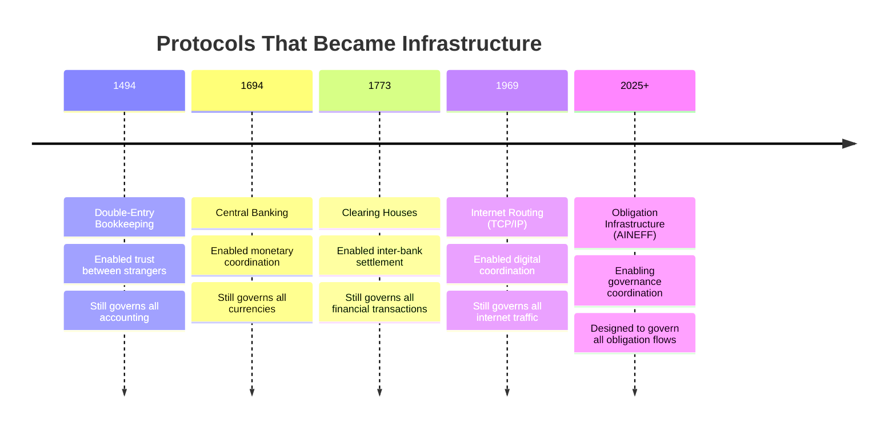
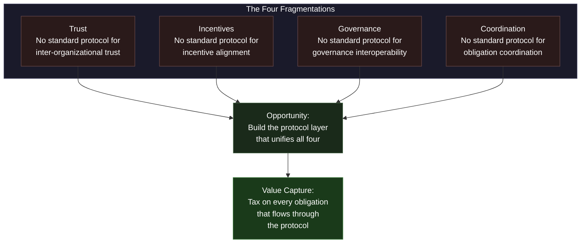
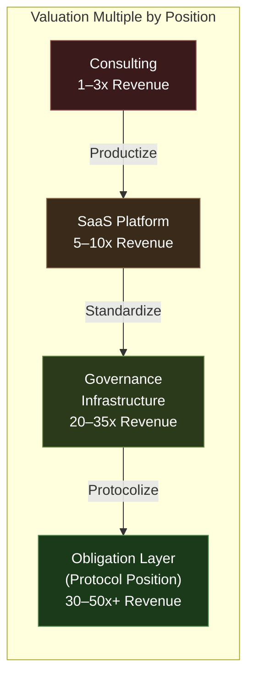

# The Centi-Trillion Thesis

## Not Companies. Civilizations-in-Miniature.

The AINEFF Ecosystem is not building a company. It is not even building a portfolio of companies. It is **architecting civilizations-in-miniature** — complete coordination systems with their own governance, their own economic logic, their own accountability structures, and their own evolutionary dynamics.

A company sells products. A civilization defines the rules by which products are made, sold, governed, and retired.

---

## What We Actually Control

The thesis is not about revenue. It is about **control over the full lifecycle of value:**

| Dimension | What a Company Controls | What a Civilization Controls |
|---|---|---|
| **Creation** | Its own products | How value is created across participants |
| **Movement** | Its own supply chain | How value moves between entities |
| **Measurement** | Its own metrics | How value is measured and validated |
| **Governance** | Its own policies | How value-creating activities are governed |
| **Death** | Its own wind-down | How value-creating entities die and are succeeded |

When you control all five dimensions, you are not a participant in the economy. You are a **layer of the economy.**

---

## Operating Systems for Reality

The most valuable systems in history are not products. They are **operating systems for reality** — protocols that define how economic activity is coordinated:

Every one of these protocols shares three properties:

1. **They became invisible.** Nobody "chooses" double-entry bookkeeping. It is simply how accounting works.
2. **They became inescapable.** You cannot operate a modern business without engaging these protocols.
3. **They became the richest layers.** The protocol layer captures more cumulative value than any application built on top of it.

---

## Infrastructure vs. Empire

This distinction is existential:

| Dimension | Empire | Infrastructure |
|---|---|---|
| **Power source** | Control over participants | Utility to participants |
| **Failure mode** | Revolution / replacement | Irrelevance (but only if a better protocol emerges) |
| **Growth mechanism** | Conquest / acquisition | Adoption / dependency |
| **Moat** | Barriers to exit | Barriers to replacement |
| **Relationship to users** | Subjects | Beneficiaries who do not notice |
| **Longevity** | Centuries at most | Millennia (double-entry bookkeeping is 530+ years old) |

The AINEFF Ecosystem is designed as infrastructure, not empire. It does not need participants to like it, trust it, or even know it exists. It needs to be **more useful than the alternative and harder to replace than to adopt.**

### The Moat Is Being Boring

The most defensible position in economic history is not "exciting new technology." It is **boring, gradual, hard-to-argue-against infrastructure.**

Nobody disrupts clearing houses. Nobody disrupts double-entry bookkeeping. Nobody disrupts TCP/IP. Not because they are perfect, but because:
- Replacing them requires coordinating everyone simultaneously
- The cost of replacement exceeds the cost of accommodation
- They work well enough that the friction of change outweighs the benefit

The AINEFF Ecosystem does not need to be exciting. It needs to be **correct, boring, and gradually indispensable.**

---

## Power Over Systems vs. Profit From Products

There are two fundamentally different economic positions:

**Profit from products:** You make something, sell it, and capture a margin. Your value is proportional to your output. You are a player in the game.

**Power over systems:** You define the rules of the game, the metrics of the game, and the coordination infrastructure of the game. Your value is proportional to the game's size. You are the field on which the game is played.

The AINEFF Ecosystem is designed for the second position. Every product it sells is a vehicle for establishing the protocol. Every client it serves is a node in the infrastructure. Every dollar of revenue is an investment in becoming terrain.

---

## The Opening: Fragmented Everything

The opportunity exists because four critical dimensions of economic coordination are **fragmented** — meaning there is no coherent protocol layer governing them:

Each fragmentation creates friction. Friction creates cost. Cost creates willingness to adopt infrastructure that reduces it. The total addressable friction is measured not in millions or billions, but in **percentage points of global GDP.**

---

## 10-Year Compounding Model

The economic thesis is not linear growth. It is **compounding infrastructure value:**

| Year | Revenue | Growth Driver | Cumulative Infrastructure Value |
|---|---|---|---|
| **Year 1** | $228K | Advisory diagnostics, initial clients | Proof of concept |
| **Year 2** | $1.2M | Repeating clients, operator network forming | Methodology validated |
| **Year 3** | $4.5M | Framework licensing, first standards adoption | Industry recognition |
| **Year 4** | $12M | Insurance carriers begin requiring frameworks | Essential status emerging |
| **Year 5** | $35M | Regulatory interest, multi-industry penetration | Standard-setting position |
| **Year 6** | $90M | Protocol licensing, obligation infrastructure live | Infrastructure economics activate |
| **Year 7** | $220M | Regulators begin mandating, international expansion | Terrain formation |
| **Year 8** | $600M | Obligation flow taxation, embedded infrastructure | Lock-in established |
| **Year 9** | $2B | GDP-scale coordination, protocol ubiquity | Structural inevitability |
| **Year 10** | $10B | Full infrastructure economics, planetary scale | Civilization-scale |

At Year 10 with a 40x revenue multiple: **$400B valuation.**

This is not a forecast. It is a design target — the number that every architectural decision is reverse-engineered from.

---

## The Infrastructure Premium

The same revenue commands radically different multiples depending on the **structural position** of the entity generating it:

| Position | Revenue Multiple | Why |
|---|---|---|
| **Consulting** | 1-3x | Labor-leveraged, linear, replaceable |
| **SaaS** | 5-10x | Product-leveraged, recurring, but competitive |
| **Governance Infrastructure** | 20-35x | Standards-leveraged, regulatory moat, high switching costs |
| **Obligation Layer** | 30-50x+ | Protocol-leveraged, structurally irreplaceable, GDP-correlated |

The AINEFF Ecosystem begins at consulting multiples and migrates to obligation layer multiples as the infrastructure position solidifies. The revenue might grow 40x, but the multiple grows 15-50x — making the total value expansion 600-2000x over the decade.

---

## Planetary-Scale Optimization

At civilization scale, the ecosystem optimizes five fundamental dimensions:

### Capital Flow Topology
How capital moves between entities. Suboptimal topology means capital pools where it is not needed and starves where it is. The ecosystem optimizes routing.

### Risk Propagation Pathways
How risk cascades through interconnected systems. Unmanaged propagation creates systemic fragility. The ecosystem maps, monitors, and governs propagation pathways.

### Coordination Latency
The time between a coordination need arising and coordination being achieved. Every hour of latency is waste. The ecosystem reduces coordination latency at every scale.

### Selection Pressure
How the ecosystem differentiates between well-governed and poorly-governed entities. Without selection pressure, bad governance persists. The ecosystem creates structural advantages for good governance.

### Signal Integrity
How accurately information flows between participants. Signal degradation causes miscoordination. The ecosystem preserves signal integrity across organizational boundaries.

---

## The Litmus Test

Every initiative, product, feature, and strategic decision is tested against a single question:

> **"Does this reduce global coordination entropy?"**

- **If yes:** Scale it.
- **If no:** Kill it.

Coordination entropy is the measure of how much friction, misalignment, and waste exists in the coordination between entities. Reducing it is the only mission. Everything else — revenue, growth, market position — is a consequence of reducing coordination entropy, not a goal in itself.

---

## Frameworks Become Monopolies

The path from intellectual property to structural monopoly follows a predictable four-stage chain:

Once a methodology becomes regulation, the originator of that methodology holds a position of **infinite leverage** — not because they enforce the regulation, but because every entity that must comply needs their frameworks, their training, their certification, and their infrastructure.

The AINEFF Ecosystem is designed to traverse this entire chain. Every methodology is architected for framework adoption. Every framework is designed for standardization. Every standard is positioned for regulatory integration.

**The end state is not market share. The end state is the law of the land.**
