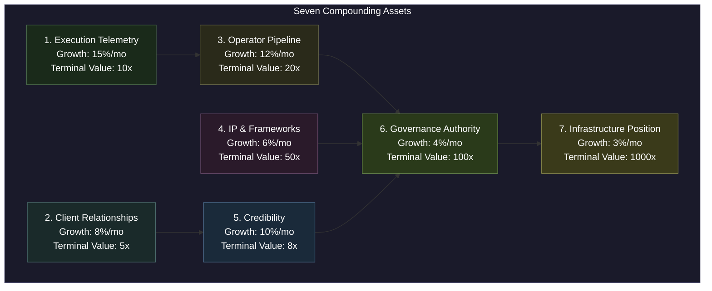
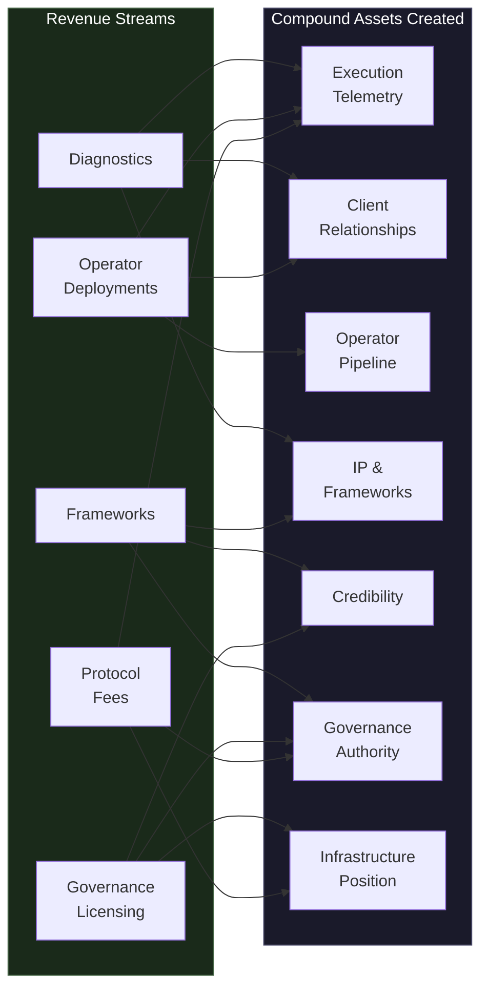
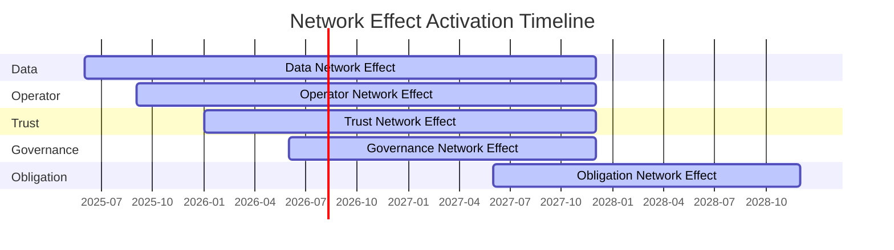
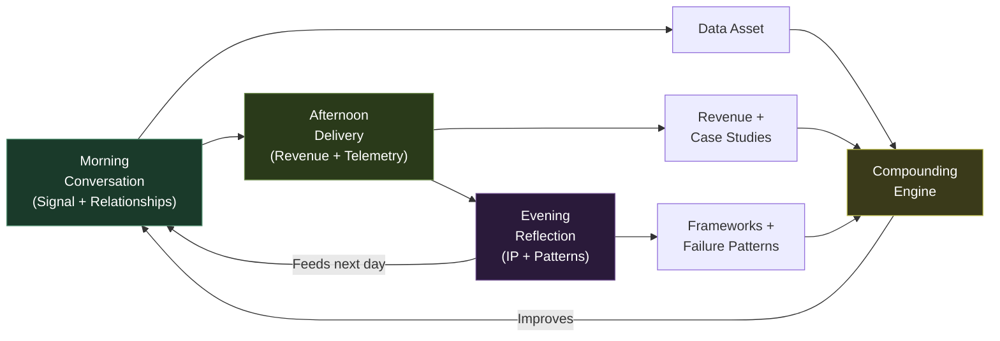

# The Compounding Engine

The AINEFF Ecosystem is not designed for linear growth. It is designed as a **compounding engine** — a system where every action creates multiple appreciating assets, every asset accelerates the creation of other assets, and the total value of the system grows exponentially relative to the effort invested.

---

## 7 Assets That Compound

Every activity in the ecosystem generates seven distinct asset classes, each compounding at its own rate:



### 1. Execution Telemetry (15%/mo growth, 10x terminal value)

Every engagement generates operational data: what works, what fails, how long things take, where friction exists. This telemetry compounds because each new data point makes every future diagnostic more accurate, every future recommendation more calibrated, and every future framework more robust.

**Compounding mechanism:** Data makes data more valuable. The 100th diagnostic is informed by the 99 before it. The 1,000th is informed by the 999 before it. Accuracy compounds.

### 2. Client Relationships (8%/mo growth, 5x terminal value)

Every client engagement creates a relationship that deepens over time. A diagnostic client becomes a framework client. A framework client becomes a governance client. A governance client becomes an infrastructure participant.

**Compounding mechanism:** Trust makes trust easier. The first engagement is the hardest sale. Every subsequent engagement benefits from demonstrated competence and accumulated context.

### 3. Operator Pipeline (12%/mo growth, 20x terminal value)

Every operator trained, vetted, and deployed increases the ecosystem's delivery capacity. But more importantly, every operator becomes a source of new client relationships, new execution data, and new operational patterns.

**Compounding mechanism:** Operators generate operators. Successful operators attract new recruits. Successful client outcomes generate referrals. The pipeline feeds itself.

### 4. IP & Frameworks (6%/mo growth, 50x terminal value)

Every engagement refines the intellectual property: frameworks become sharper, diagnostics become more accurate, governance models become more robust. IP compounds slowly but with enormous terminal value because it becomes the basis for standards and regulation.

**Compounding mechanism:** Frameworks become standards. Standards become regulation. Regulation becomes infinite leverage. The compounding is slow in rate but astronomical in terminal value.

### 5. Credibility (10%/mo growth, 8x terminal value)

Every successful engagement, every published framework, every industry adoption builds credibility. Credibility is not a marketing metric — it is a structural asset that reduces sales friction, attracts higher-quality clients, and enables higher pricing.

**Compounding mechanism:** Credibility attracts credibility. High-quality clients attract higher-quality clients. Industry recognition attracts regulatory attention. Each credibility event makes the next one easier to achieve.

### 6. Governance Authority (4%/mo growth, 100x terminal value)

As frameworks become standards and standards attract regulatory interest, the ecosystem accumulates governance authority — the recognized right to define how things should be governed. This is the slowest-growing asset but the second-most valuable.

**Compounding mechanism:** Authority begets authority. Once an entity is recognized as the governance authority in one domain, adjacent domains grant it presumptive authority. Regulatory adoption in one jurisdiction creates pressure for adoption in others.

### 7. Infrastructure Position (3%/mo growth, 1000x terminal value)

The ultimate asset: the structural position of being infrastructure that cannot be replaced without replacing the entire coordination system built on top of it. This grows the slowest but is worth 1000x because it converts the ecosystem from a participant in the economy to a layer of the economy.

**Compounding mechanism:** Infrastructure creates dependency. Dependency creates switching costs. Switching costs create permanence. Permanence creates the right to tax every transaction that flows through the infrastructure.

---

## How $1 Creates $1,000

A single $10K diagnostic engagement does not generate $10K in value. It generates a cascade of compounding assets:

| Output | Immediate Value | Compounding Value |
|---|---|---|
| **Direct revenue** | $10,000 | Revenue funds operations |
| **Data asset** | Execution telemetry from this engagement | Makes every future diagnostic more accurate |
| **Relationship** | One client relationship | Future engagements, referrals, case studies |
| **IP iteration** | Framework refinements based on this engagement | Accumulated refinements become standards |
| **Case study** | One proof point | Credibility for future sales and regulatory conversations |
| **Operator training** | Operators who executed learn from this engagement | Better operators deliver better outcomes |
| **Failure patterns** | What did not work in this engagement | Failure data is the most valuable telemetry |
| **Infrastructure value** | One more node in the obligation network | Network effects activate at scale |

Over 5 years, that single $10K engagement contributes to a compounding system where:
- The data it generated improved 50 subsequent diagnostics
- The relationship it created led to 3 additional engagements
- The IP refinements it produced became part of an industry standard
- The case study it enabled closed 5 other deals
- The failure patterns it revealed prevented losses in 20 subsequent engagements

**Conservative estimate: $10K in direct revenue generates $100K-$1M in cumulative ecosystem value over 5 years.** At infrastructure scale, the multiplier approaches 1000x.

---

## Revenue-to-Assets Mapping

Each revenue stream creates specific compound assets:



---

## Five Network Effects (Sequential Activation)

Network effects in the AINEFF Ecosystem activate sequentially — each one enabled by the ones before it:

### 1. Data Network Effect (Month 6+)

**Trigger:** Sufficient execution telemetry to make diagnostics measurably better than competitors.

**Mechanism:** More engagements produce more data. More data produces better diagnostics. Better diagnostics attract more engagements. The cycle accelerates.

**Moat created:** Competitors without the data cannot match the diagnostic accuracy. The data advantage compounds with every engagement.

### 2. Operator Network Effect (Month 9+)

**Trigger:** Operator pipeline reaches critical mass where operators generate more operator candidates than are needed.

**Mechanism:** Successful operators attract new operators. More operators enable more simultaneous engagements. More engagements generate more data and more revenue. Revenue funds more operator development.

**Moat created:** Competitors cannot replicate the operator network without replicating the training, vetting, and cultural infrastructure that produces it.

### 3. Trust Network Effect (Month 12+)

**Trigger:** Sufficient credibility that new clients come from referrals rather than outbound sales.

**Mechanism:** Successful engagements build trust. Trust generates referrals. Referrals bring pre-qualified clients who trust the ecosystem before their first engagement. Pre-qualified clients have higher success rates, generating more trust.

**Moat created:** Trust cannot be purchased, replicated, or accelerated. It can only be earned through cumulative demonstrated competence.

### 4. Governance Network Effect (Month 18+)

**Trigger:** Frameworks become referenced in industry publications, insurance requirements, or regulatory discussions.

**Mechanism:** As frameworks become standards, every entity that adopts them becomes a node in the governance network. Each node validates the framework for its peers. Peer validation accelerates adoption.

**Moat created:** Once a governance framework is adopted as a standard, replacing it requires coordinating every entity that adopted it — an effectively impossible coordination problem.

### 5. Obligation Network Effect (Month 30+)

**Trigger:** Obligation infrastructure processes enough transaction volume that routing obligations through the protocol is cheaper than routing around it.

**Mechanism:** More obligations in the network make the network more efficient. More efficiency attracts more obligations. The cost advantage compounds with scale.

**Moat created:** This is the terminal network effect — the one that converts the ecosystem from a service to terrain. Once obligations route through the protocol by default, the ecosystem captures value on every obligation in the network.



---

## Three Kinds of Leverage

The ecosystem employs three kinds of leverage, each operating at a different scale:

### 1. Labor Leverage (1 to 100 to 1,000)

One person's insight, codified into a framework, deployed by 100 operators, reaching 1,000 clients. The leverage ratio is 1:1,000 — one unit of intellectual labor produces 1,000 units of delivered value.

**How it works:** Founders develop frameworks. Frameworks are codified into training. Training produces operators. Operators deliver to clients. The founder's insight reaches 1,000 clients without the founder being present.

### 2. Capital Leverage (Client Revenue Funds Infrastructure)

Revenue from client engagements funds the development of infrastructure that will eventually replace the need for client engagements. The clients who pay for diagnostics today are funding the protocol layer that will process obligations automatically tomorrow.

**How it works:** Year 1-3 revenue (labor-leveraged) funds Year 4-7 development (product-leveraged) which funds Year 7-10 infrastructure (protocol-leveraged). Each phase of revenue funds the next phase of leverage.

### 3. Infrastructure Leverage (When the System Becomes Terrain)

The ultimate leverage: when the system becomes terrain that others build upon. At this point, the ecosystem captures value not through effort but through **position** — the way a landowner captures value from everything built on the land.

**How it works:** When obligations route through the protocol by default, every obligation generates protocol fees. The ecosystem does not need to sell, market, or deliver. It needs to exist. Existence is the product.

---

## Frameworks Become Monopolies

The compounding path from methodology to monopoly:

| Stage | Description | Leverage | Revenue Character |
|---|---|---|---|
| **Methodology** | "Here is how we think about this problem" | Thought leadership | Consulting fees |
| **Framework** | "Here is a structured approach anyone can adopt" | Codified knowledge | Licensing fees |
| **Standard** | "Here is what the industry has adopted as baseline" | Industry authority | Certification fees |
| **Regulation** | "Here is what the law requires" | Legal mandate | Compliance infrastructure fees |

Each stage transition represents an order-of-magnitude increase in leverage and a fundamental change in the revenue's character. Consulting fees are earned. Licensing fees are recurring. Certification fees are required. Compliance infrastructure fees are **inevitable.**

The AINEFF Ecosystem is designed to traverse all four stages for every framework it develops. No framework is created without a path to regulation. No methodology is published without a standardization strategy.

---

## Compounding Daily

The compounding engine is not a quarterly strategy. It operates **daily** through a deliberate rhythm:

### Morning: Conversation

Every morning begins with conversations — with clients, prospects, operators, regulators, and the ecosystem itself. Each conversation generates:
- Signal about what the market needs
- Data about what is working and what is not
- Relationships that deepen with every interaction
- Ideas that feed IP development

### Afternoon: Delivery

Every afternoon is execution — diagnostics delivered, frameworks refined, operators deployed, infrastructure developed. Each delivery generates:
- Revenue that funds operations
- Telemetry that improves future delivery
- Case studies that build credibility
- Operator experience that builds the pipeline

### Evening: Reflection

Every evening is synthesis — what worked, what failed, what patterns emerged, what needs to change. Each reflection generates:
- Framework refinements
- Failure pattern documentation
- Strategic adjustments
- Compounding awareness (understanding what is actually compounding and what is not)



**The daily rhythm is the atomic unit of compounding.** Every day that the rhythm executes, every asset in the ecosystem grows. Miss a day, and the compounding pauses. Execute consistently, and the compounding becomes unstoppable.

---

## The Compounding Equation

```
Ecosystem Value = Sum of (Asset_i × Growth_Rate_i^time × Terminal_Multiple_i)
```

At Year 1, the equation produces modest numbers — a few hundred thousand in total ecosystem value.

At Year 5, the exponents begin to matter — tens of millions in ecosystem value.

At Year 10, the exponents dominate — hundreds of billions in ecosystem value.

**This is not optimism. It is mathematics.** Compounding at 3-15% monthly over 120 months, with terminal multiples of 5-1000x, produces these numbers mechanically. The only question is whether the compounding rates can be sustained — and the architecture of the ecosystem is designed specifically to sustain them.
