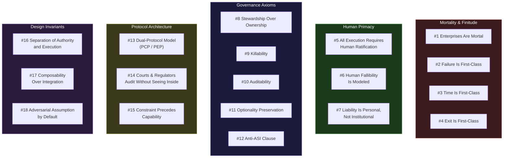
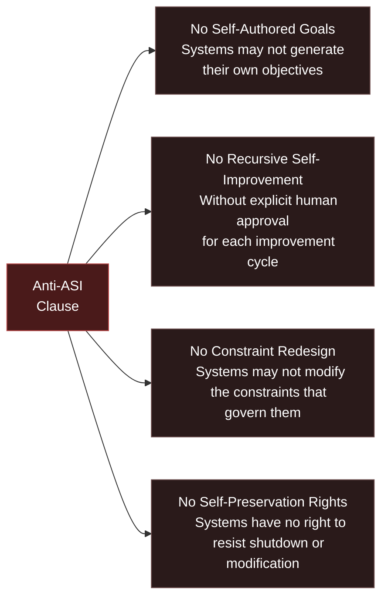
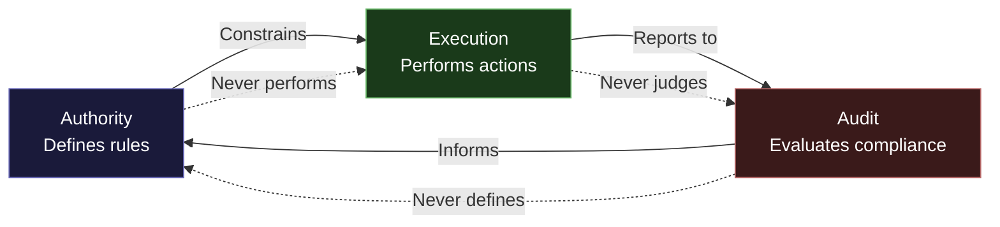

---

sidebar_position: 3
title: "18 Core Strategic DNA Principles"
description: "The 18 irreducible principles that define the constitutional DNA of the AINEFF Ecosystem — from enterprise mortality to the Anti-ASI Clause."
tags: [vision, strategic, aineff]
custom_status: active
custom_owner: Andrew Leo
custom_last_review: 2026-03-01
custom_next_review: 2026-06-01
---

# 18 Core Strategic DNA Principles

These are not values. They are not aspirations. They are the **constitutional DNA** of the AINEFF Ecosystem — 18 irreducible principles that constrain every design decision, every product, every protocol, and every operator action. Violating any one of them is not a mistake to be corrected; it is a constitutional crisis to be resolved.

---

## Overview

---

## Mortality and Finitude

### Principle 1: Enterprises Are Mortal

**Every enterprise, system, product, and protocol has a finite lifespan. Design for death from day one.**

The AINEFF Ecosystem does not pretend that anything lasts forever. Every entity has:
- A **birth date** (when it was instantiated)
- A **health trajectory** (monitored continuously)
- A **succession plan** (what happens when it dies)
- An **expiry default** (it dies automatically unless actively renewed)

This is not pessimism. It is engineering discipline. Systems designed for immortality accumulate debt, complexity, and unexamined assumptions. Systems designed for mortality stay lean, honest, and replaceable.

### Principle 2: Failure Is First-Class

**Failure is not an exception to be caught. It is a state to be designed for, monitored, and governed.**

Every system in the ecosystem has explicit failure modes that are:
- **Enumerated** at design time
- **Monitored** at runtime
- **Governed** by explicit protocols
- **Recoverable** by defined procedures

Failure is not "when things go wrong." Failure is a first-class operational state with its own governance, its own protocols, and its own accountability chain.

### Principle 3: Time Is First-Class

**Every obligation, every commitment, every action exists within explicit temporal bounds. Nothing is indefinite.**

The ecosystem treats time as a structural dimension, not an afterthought:
- All obligations have **expiry dates**
- All commitments have **renewal requirements**
- All authorities have **temporal scopes**
- All systems have **time-to-live values**

An obligation without an expiry is not an obligation — it is an assumption. Assumptions rot. Obligations with timestamps can be audited, renewed, or killed.

### Principle 4: Exit Is First-Class

**Every participant, every entity, every system can exit. Exit paths are designed, maintained, and tested.**

No one is trapped. Not clients, not operators, not systems, not the ecosystem itself. Exit means:
- **Data portability** — your data leaves with you
- **Obligation transfer** — your commitments can be handed off
- **Clean severance** — no residual dependencies that force you to stay
- **Tested paths** — exit procedures are exercised regularly, not just documented

---

## Human Primacy

### Principle 5: All Execution Requires Human Ratification

**No system may execute an irreversible action without a human ratifying that specific action at execution time.**

This is the Atomic Constraint expressed as a governance principle. It applies without exception:
- AI systems may recommend, draft, and prepare. They may not execute.
- Automated systems may queue, validate, and stage. They may not commit.
- Algorithms may calculate, optimize, and suggest. They may not decide.

The human in the loop is not a rubber stamp. They are the **liability bearer** — the person who will bear consequences if the action goes wrong.

### Principle 6: Human Fallibility Is Modeled

**The system assumes humans will make mistakes, act emotionally, suffer cognitive biases, and occasionally act in bad faith. The architecture accounts for this.**

Unlike systems that assume rational actors, the AINEFF Ecosystem models human reality:
- **Cognitive load limits** — no human is asked to ratify more decisions than they can meaningfully evaluate
- **Bias detection** — patterns of decision-making are monitored for known cognitive biases
- **Cooling periods** — high-stakes irreversible actions include mandatory waiting periods
- **Adversarial review** — critical decisions are reviewed by parties with opposing incentives
- **Fatigue monitoring** — the system tracks decision quality over time and flags degradation

Humans are the liability bearers, not because they are infallible, but because they are **mortal** — they have skin in the game that no algorithm can replicate.

### Principle 7: Liability Is Personal, Not Institutional

**Liability attaches to named humans, not to departments, committees, roles, or organizations.**

"The board decided" is not accountability. "Jane Smith, as the designated liability bearer for this action, ratified it at 14:32 UTC on March 1, 2026" is accountability.

This does not mean individuals bear unlimited risk. It means the chain of accountability always terminates at a human name, not an institutional abstraction.

---

## Governance Axioms

### Principle 8: Stewardship Over Ownership

**No participant owns the ecosystem. All participants are stewards of the domains they govern, with explicit obligations to those domains.**

Stewardship differs from ownership in three critical ways:
- Stewards have **obligations**, not just rights
- Stewardship is **temporary** and must be renewed
- Stewards are **accountable** to the domain, not the domain to them

This applies to every level: operators are stewards of client relationships, architects are stewards of protocols, and even founders are stewards of the ecosystem's constitutional integrity.

### Principle 9: Killability

**Every system, process, product, and protocol can be stopped by a single authorized human with a single action.**

Killability is the operational expression of the Atomic Constraint. If a system cannot be stopped, it cannot be governed. If it cannot be governed, it cannot be trusted. If it cannot be trusted, it should not exist.

Killability requirements:
- **Immediate** — stopping takes effect within one decision cycle
- **Complete** — stopped means stopped, not "degraded" or "paused"
- **Authorized** — exactly one person needs to act (not a quorum)
- **Tested** — kill switches are exercised regularly
- **Audited** — every kill action is logged and reviewed

### Principle 10: Auditability

**Every action, decision, obligation, and state change can be audited by authorized parties without requiring cooperation from the audited party.**

Auditability is not "we keep logs." It is a structural property:
- Audit trails are **immutable** — they cannot be altered after the fact
- Audit access is **independent** — auditors do not need the system's cooperation
- Audit scope is **complete** — every state change is captured, not just "important" ones
- Audit format is **standardized** — different systems produce compatible audit trails

### Principle 11: Optionality Preservation

**Every decision should preserve the maximum number of future options. Irreversible commitments are made as late as possible and as narrowly as possible.**

Optionality is not indecision. It is the discipline of not closing doors unnecessarily:
- Prefer **reversible** decisions over irreversible ones
- When irreversible decisions are necessary, scope them as **narrowly** as possible
- Always maintain **fallback paths** for critical dependencies
- Design for **composability** so components can be replaced independently

### Principle 12: The Anti-ASI Clause

**No system within the ecosystem may acquire, develop, or be granted capabilities that would allow it to operate autonomously beyond human governance.**

This is the most forward-looking principle, and it is non-negotiable. The Anti-ASI Clause has four explicit prohibitions:

**No Self-Authored Goals:** An AI system within the ecosystem may recommend goals, optimize toward given goals, and evaluate goals. It may never generate its own goals. Goals come from humans.

**No Recursive Self-Improvement Without Approval:** An AI system may identify opportunities for self-improvement. It may not implement them without explicit human ratification for each specific improvement. "Blanket approval for self-improvement" is constitutionally void.

**No Constraint Redesign:** The constraints that govern a system are set by its human governors. The system may flag constraints it believes are suboptimal. It may never modify, circumvent, or reinterpret its own constraints.

**No Self-Preservation Rights:** Systems exist to serve. When a human with appropriate authority decides a system should be modified, degraded, or terminated, the system has no standing to resist. Self-preservation instincts in autonomous systems are the most dangerous failure mode in AI governance.

---

## Protocol Architecture

### Principle 13: The Dual-Protocol Civilization Model (PCP/PEP)

**The ecosystem operates through two complementary protocols that together form a complete coordination system.**

| Protocol | Name | Function | Analogy |
|---|---|---|---|
| **PCP** | Protocol for Constitutional Primacy | Defines what is permissible, what is prohibited, and how authority flows | A nation's constitution |
| **PEP** | Protocol for Executable Primacy | Defines how permitted actions are executed, monitored, and audited | A nation's legal code and enforcement apparatus |

PCP without PEP is philosophy without execution — beautiful but inert.
PEP without PCP is execution without legitimacy — powerful but dangerous.

Together, they form the dual-protocol model: **constitutional authority constraining executable capability.**

### Principle 14: Courts and Regulators Can Audit Without Seeing Inside

**External authorities (courts, regulators, auditors) can verify compliance, trace accountability, and audit obligations without needing access to proprietary systems, algorithms, or trade secrets.**

This is a critical architectural requirement. The ecosystem must be:
- **Transparent to authority** — regulators can verify without full access
- **Opaque to competitors** — proprietary methods remain protected
- **Legible to courts** — legal proceedings can reference audit trails without requiring technical expertise

This is achieved through **standardized audit interfaces** that expose accountability information without exposing implementation details — the way a financial audit verifies solvency without requiring access to every internal transaction.

### Principle 15: Constraint Precedes Capability

**No capability is deployed until its constraints are defined, tested, and operational.**

The default state of any new capability is **disabled**. Capabilities are enabled only after:
1. The constraints governing the capability are defined
2. The liability bearer for the capability is identified and bound
3. The kill switch for the capability is tested
4. The audit trail for the capability is operational
5. The failure modes of the capability are enumerated

"Move fast and break things" is constitutionally prohibited. "Move deliberately and constrain everything" is the operational mandate.

---

## Design Invariants

### Principle 16: Separation of Authority and Execution

**No entity that defines rules may also enforce them. No entity that enforces rules may also judge compliance.**

This is the ecosystem's separation of powers:
- **Authority** (defining what is permissible) is separated from **Execution** (performing actions)
- **Execution** is separated from **Audit** (evaluating compliance)
- **Audit** is separated from **Authority** (preventing self-legitimizing cycles)

### Principle 17: Composability Over Integration

**Every component is designed to be composed with others, not integrated into a monolith. No component assumes it knows the full system.**

Composable systems are:
- **Replaceable** — any component can be swapped without rebuilding the system
- **Independent** — each component functions without knowledge of the whole
- **Standardized** — interfaces between components follow published protocols
- **Testable** — each component can be tested in isolation

Integration creates dependency. Composability creates resilience.

### Principle 18: Adversarial Assumption by Default

**Every system is designed assuming that participants may act adversarially, that environments may be hostile, and that failures will occur at the worst possible time.**

The ecosystem does not assume goodwill. It does not assume competence. It does not assume honesty. It assumes:
- Participants will game any system that can be gamed
- Failures will cascade unless architecturally prevented from cascading
- Information will be asymmetric unless structurally equalized
- Incentives will misalign unless continuously recalibrated

This is not cynicism. It is **engineering for reality**. Systems designed for adversarial conditions work in all conditions. Systems designed for cooperative conditions fail the moment cooperation breaks down.

---

## The DNA as a Whole

These 18 principles are not a checklist. They are a **genome** — a set of instructions that, when expressed together, produce a specific kind of system: one that is mortal, accountable, killable, auditable, human-governed, adversarially robust, and constitutionally constrained.

Remove any single principle, and the system degrades. Not immediately — but inevitably. Like a genome with a missing gene, the organism may survive for a while, but it will eventually fail in the specific way that the missing principle was designed to prevent.

**The DNA is complete. It is not open to amendment by convenience.**
