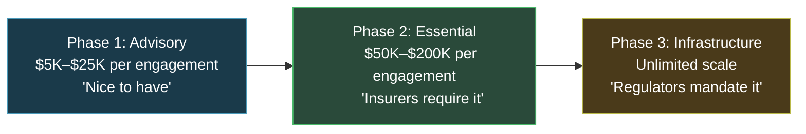
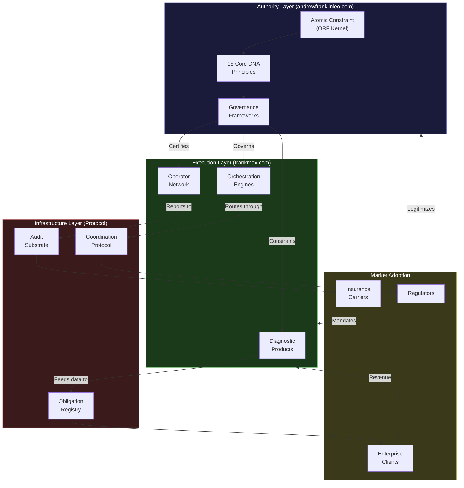

---

sidebar_position: 1
title: "The Grand Vision"
description: "The AINEFF Ecosystem is a constitutional economic coordination protocol designed to become civilization-scale infrastructure — TCP/IP for enterprise coordination."
tags: [vision, strategic, index]
custom_status: active
custom_owner: Andrew Leo
custom_last_review: 2026-03-01
custom_next_review: 2026-06-01
---

# The Grand Vision

The AINEFF Ecosystem is not a company. It is not a platform. It is not a product suite.

It is a **constitutional economic coordination protocol** designed to become civilization-scale infrastructure.

---

## Project Identity: What This Actually Is

The simplest analogy: **TCP/IP for enterprise coordination.**

TCP/IP did not ask permission to become the backbone of the internet. It did not need a sales team. It became *terrain* — the ground upon which everything else was built. Nobody "chooses" TCP/IP. They simply cannot function without it.

The AINEFF Ecosystem aspires to the same structural position for **obligation, governance, and accountability** in enterprise operations. It is a protocol layer that sits beneath organizations, between them, and above the raw chaos of uncoordinated economic activity.

| Attribute | What People Assume | What This Actually Is |
|---|---|---|
| **Category** | SaaS / Consulting | Constitutional coordination protocol |
| **Revenue Model** | Subscriptions / Fees | Obligation flow taxation |
| **Competitive Moat** | Features / Network effects | Structural irreversibility |
| **Exit Strategy** | Acquisition / IPO | There is no exit. Infrastructure does not exit. |
| **Success Metric** | ARR / Users | Cumulative obligations governed |

---

## The True End-State

**GDP-scale obligation infrastructure.**

The target is not millions in revenue or even billions in valuation. The target is **$1 trillion in cumulative obligations governed by 2045** — a figure that sounds absurd until you recognize that global GDP is $100+ trillion annually, and the coordination infrastructure beneath it captures value at every layer.

This is not a prediction. It is a design constraint. Every architectural decision, every product, every entity in the ecosystem is reverse-engineered from this end-state.

---

## The Terrain Test

There is one test that separates infrastructure from empire, terrain from power:

> **"Can two enemies who hate each other use it simultaneously without coordinating? If yes, terrain. If no, just power."**

Visa passes this test. Two competing banks that despise each other both run transactions through Visa's network without ever speaking. The internet passes this test. Two warring nations route packets through the same protocols.

The AINEFF Ecosystem must pass this test at every layer. If it requires trust between parties, it is not infrastructure — it is a club. If it requires coordination between participants, it is not a protocol — it is a platform. If it requires goodwill, it is not terrain — it is a relationship.

**Terrain does not care who walks on it.**

---

## Two Strategic Domains

The ecosystem operates through two complementary and deliberately separated domains:

### andrewfranklinleo.com — Authority Without Execution

The philosophical, constitutional, and governance authority layer. This is where:

- The Atomic Constraint is defined and defended
- Constitutional principles are articulated
- Governance frameworks are published
- Thought leadership establishes legitimacy
- The "why" is owned

**This domain never executes.** It architects, constrains, and legitimizes.

### frankmax.com — Execution Without Philosophy

The operational, product, and revenue execution layer. This is where:

- Products are built and sold
- Clients are served
- Revenue is generated
- Operators are deployed
- The "how" is owned

**This domain never philosophizes.** It builds, delivers, and scales.

This separation is not organizational convenience — it is constitutional architecture. Authority that executes becomes tyranny. Execution without authority becomes chaos. The tension between them is the engine.

---

## The Evolution: Three Phases

The ecosystem evolves through three distinct phases, each with fundamentally different economics:

### Phase 1: Advisory (Years 1-3)

The ecosystem sells expertise. Clients pay for diagnostics, frameworks, and operational reviews. The value proposition is "we can see what you cannot." Revenue is linear: more consultants, more clients, more hours.

**Economic character:** Labor-leveraged. Gross margins 70-85%. Growth limited by headcount.

### Phase 2: Essential (Years 3-7)

The ecosystem becomes required. Insurance companies begin requiring AINEFF governance frameworks as a condition of coverage. Industry bodies adopt the standards. Clients pay not because they want to, but because they must.

**Economic character:** Standards-leveraged. Gross margins 85-92%. Growth limited by adoption velocity.

### Phase 3: Infrastructure (Years 7-20)

The ecosystem becomes invisible. Regulators mandate the protocols. Obligations cannot legally execute without passing through AINEFF-governed infrastructure. The ecosystem is no longer a vendor — it is terrain.

**Economic character:** Protocol-leveraged. Gross margins 95%+. Growth limited only by GDP.

---

## The Macro Ecosystem Flow

---

## What Success Looks Like

Success is not "the AINEFF Ecosystem is famous." Success is not "AINEFF has the most clients." Success is:

- A mid-level operations manager at a Fortune 500 company uses an AINEFF-governed workflow without knowing it exists
- An insurance underwriter checks an AINEFF compliance score the way they check a credit score — automatically, without thought
- A regulator references AINEFF obligation standards the way they reference GAAP — as settled infrastructure
- Two competing corporations in a bitter lawsuit both route their governance obligations through the same AINEFF protocol layer, and neither finds this remarkable

**When nobody talks about the AINEFF Ecosystem because it is simply how things work, we will have succeeded.**
