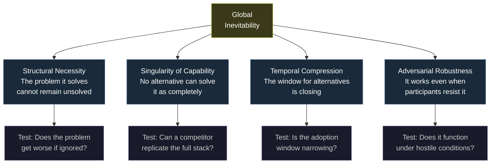
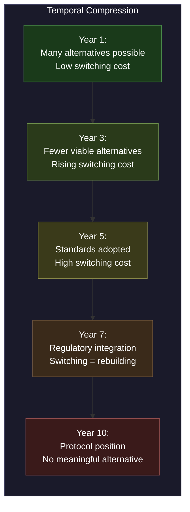

---

sidebar_position: 6
title: "Inevitability Framework"
description: "The four conditions for global inevitability, the three positions that produce cross-epoch dominance, and the Scarcity Migration Chain from memory to responsibility."
tags: [vision, strategic]
custom_status: active
custom_owner: Andrew Leo
custom_last_review: 2026-03-01
custom_next_review: 2026-06-01
---

# Inevitability Framework

Inevitability is not hope. It is not ambition. It is a **structural property** — a state where the conditions for adoption are so deeply embedded in the trajectory of civilization that the only question is timing, not whether.

The AINEFF Ecosystem is designed for inevitability. This document describes the framework for evaluating, achieving, and maintaining it.

---

## Four Conditions for Global Inevitability

For any system to become globally inevitable, four conditions must be simultaneously satisfied. Missing any one of them reduces the system from "inevitable" to "possible" or "desirable."



### 1. Structural Necessity

The problem the system solves must be one that **cannot remain unsolved.** Not "should not" — *cannot*. The cost of leaving it unsolved must compound over time until it becomes existential.

For the AINEFF Ecosystem, the structural necessity is: **autonomous systems are making irreversible decisions at increasing scale, and no coherent accountability infrastructure exists to govern them.** This problem does not get better with time. It gets worse. Every year, more AI systems make more decisions with more impact and less accountability. The structural necessity is not theoretical — it is compounding daily.

### 2. Singularity of Capability

The system must be the **only** viable solution that addresses the full scope of the problem. Partial solutions may exist, but no alternative can replicate the complete capability stack.

The AINEFF Ecosystem's singularity of capability rests on its **full-stack integration**: constitutional principles (the Atomic Constraint), governance protocols (PCP/PEP), execution infrastructure (obligation registries, audit substrates), and operator networks. Any competitor can replicate one layer. Replicating all layers in constitutional coherence requires originating the constraint — and the constraint has already been originated.

### 3. Temporal Compression

The window for alternatives must be **closing.** As the system gains adoption, the cost for competitors to catch up must increase faster than the cost for the system to extend its lead.



### 4. Adversarial Robustness

The system must function **even when participants actively resist it.** If the system requires cooperation, goodwill, or alignment to work, it is vulnerable to adversarial disruption.

The AINEFF Ecosystem is designed to work under adversarial conditions: competing participants, hostile regulators, resistant incumbents, and bad-faith actors. The terrain test ("Can two enemies use it simultaneously?") is the operational expression of adversarial robustness.

---

## Three Positions That Produce Cross-Epoch Inevitability

History shows that only three structural positions persist across civilizational epochs — surviving the rise and fall of empires, technologies, and economic systems:

### Position 1: Originator of a Constraint

The entity that first identifies and formalizes a fundamental constraint occupies a permanent position in the intellectual and operational infrastructure of civilization.

**Historical example:** Euclid did not invent geometry. He formalized its constraints (the five postulates). Two thousand years later, every geometric proof still begins with Euclid's constraints. He is not famous for what he built but for what he **constrained.**

**AINEFF parallel:** The Atomic Constraint ("No system may execute an irreversible action unless a single, identifiable human liability bearer is bound to that action at execution time") is a candidate fundamental constraint for the age of autonomous systems.

### Position 2: Architect of a Coordination Layer

The entity that designs a coordination layer that becomes infrastructure occupies a permanent position in the operational stack of civilization.

**Historical example:** The architects of TCP/IP did not build the internet. They designed the coordination protocol that made the internet possible. Every packet that has ever been routed, every website that has ever loaded, every email that has ever been sent flows through their coordination layer.

**AINEFF parallel:** The obligation coordination protocol (PCP/PEP) is designed to become the coordination layer for governance and accountability — the TCP/IP of obligation routing.

### Position 3: Discoverer of an Inescapable Truth

The entity that discovers and formalizes a truth that cannot be argued away occupies a permanent position in the knowledge infrastructure of civilization.

**Historical example:** Shannon's information theory did not create communication technology. It discovered the fundamental limits of communication. Every communication system ever built since then operates within Shannon's limits, whether the builders know it or not.

**AINEFF parallel:** The Fundamental Decision-Making Tradeoff (explainability, speed, and optimality cannot be simultaneously maximized) is a candidate inescapable truth about decision-making under uncertainty.

---

## The Scarcity Migration Chain

Throughout human history, the scarce resource — the resource that limits progress and commands premium value — has migrated along a predictable chain:


| Era | Scarce Resource | What Solved It | What Became Scarce Next |
|---|---|---|---|
| Pre-Writing | Memory | Writing, libraries | Computation |
| Pre-Computers | Computation | Calculators, computers | Information |
| Pre-Internet | Information | Internet, search engines | Attention |
| Current | Attention | Algorithms, AI filtering | Trust |
| Emerging | Trust | Governance protocols | Legitimacy |
| Next | Legitimacy | Constitutional frameworks | Responsibility |
| Terminal | Responsibility | **The Atomic Constraint** | Nothing — terminal scarcity |

**Responsibility is the terminal scarcity.** It cannot be automated, cannot be delegated to machines, and cannot be manufactured. It requires a mortal agent with consequences. The entity that builds infrastructure for managing, allocating, and governing responsibility controls the terminal scarce resource.

The AINEFF Ecosystem is positioned at the end of the scarcity migration chain — not where scarcity is today (attention), but where it is migrating (trust, legitimacy, responsibility).

---

## What Sits Upstream

To evaluate whether the AINEFF Ecosystem occupies a position of true inevitability, ask: **what sits upstream of the major governance challenges of the coming decades?**

### Upstream of AI Governance

Every AI governance framework must eventually answer: "Who is accountable when the AI makes an irreversible decision?" The Atomic Constraint sits upstream of this question. Any AI governance framework that does not solve the liability-binding problem is incomplete, and any framework that does solve it will converge on something structurally equivalent to the Atomic Constraint.

### Upstream of Legal Accountability

As autonomous systems proliferate, legal frameworks must evolve to handle accountability for non-human actors. The AINEFF obligation registry and liability-binding architecture sit upstream of this evolution — they provide the infrastructure that legal frameworks will need to reference.

### Upstream of Organizational Design

Every organization operating hybrid human-AI systems must redesign its governance to handle the decision-making tradeoff (explainability vs. speed vs. optimality). The AINEFF governance frameworks sit upstream of this redesign — they provide the constitutional architecture that organizational design must comply with.

### Upstream of Autonomous Systems

Every autonomous system — vehicles, trading algorithms, medical diagnostics, military systems — must eventually solve the same constraint: irreversible actions require bound liability. The AINEFF protocol layer sits upstream of all autonomous systems governance.

---

## The Candidate Fundamental Constraint and Its Validation

The Atomic Constraint is a **candidate** fundamental constraint. "Candidate" is deliberate — fundamental constraints are not declared, they are **validated** through exposure to reality.

Validation requires passing three tests:

### Test 1: Universality

Does the constraint apply to all systems that make irreversible decisions, regardless of domain, technology, or culture?

**Current assessment:** Yes. The constraint is domain-agnostic. It applies equally to financial systems, medical systems, military systems, and social systems. No domain has been identified where irreversible actions can be safely executed without bound liability.

### Test 2: Non-Derivability

Is the constraint irreducible — meaning it cannot be derived from a more fundamental principle?

**Current assessment:** Provisionally yes. The constraint appears to be the simplest possible statement that captures the accountability requirement for irreversible actions. Attempts to simplify it further either lose essential meaning or become tautological.

### Test 3: Adversarial Survival

Does the constraint survive deliberate attempts to disprove, circumvent, or obsolete it?

**Current assessment:** Ongoing. Every counterexample proposed so far has been either (a) a case of reversible actions (where the constraint does not apply) or (b) a case where the absence of bound liability led to exactly the kind of failure the constraint predicts. No genuine counterexample has been identified.

---

## The Inevitability Equation

Combining all elements:

```
Inevitability = Structural Necessity × Singularity of Capability × Temporal Compression × Adversarial Robustness
```

If any factor is zero, inevitability is zero. If all factors are positive and growing, inevitability compounds.

The AINEFF Ecosystem's strategic objective is to ensure that all four factors are positive and growing in every time period — not through hope or effort, but through **architectural choices that make each factor self-reinforcing.**
