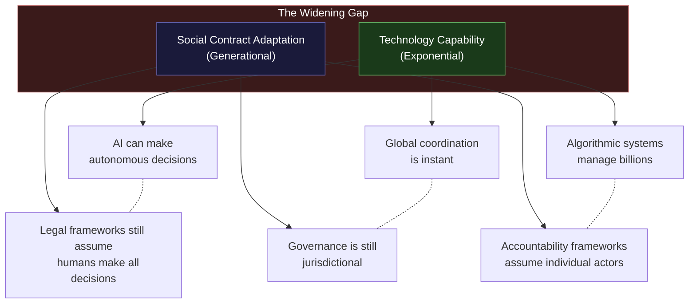
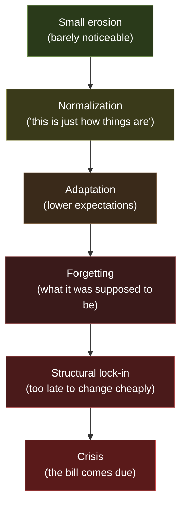

# Why This Exists

## Something Is Off

Most people sense it but cannot articulate it. There is a gap between the story they were handed and the reality they experience. The AINEFF Ecosystem exists because that gap is not a feeling — it is a **structural mismatch** that will only widen unless someone builds the infrastructure to address it.

---

## The Story People Were Handed

The narrative is familiar. Most people in developed economies absorbed some version of it by the time they were eighteen:

> **Effort leads to progress. Progress leads to stability. Stability leads to meaning.**

Work hard in school. Get a good job. Save money. Buy a house. Raise a family. Retire with dignity. The system rewards effort, punishes laziness, and generally trends upward.

This story was not a conspiracy. For a specific window of history — roughly 1945 to 2000, in specific geographies, for specific demographics — it was approximately true. But the conditions that made it true have eroded, and the story has not been updated.

---

## What Actually Happened

### Purchasing Power Erodes Faster Than Wages Rise

Nominal wages increase. Real purchasing power stagnates or declines. The gap is filled by debt, dual incomes, and the quiet acceptance that each generation may be the first in modern history to live worse than its parents.

This is not a political argument. It is an observable structural dynamic: the mechanisms that translated productivity into broadly distributed prosperity have weakened, and no replacement mechanisms have been built.

### Institutions Optimize for Self-Preservation

Institutions — governments, corporations, universities, religions — were built to serve their participants. Over time, they undergo a predictable inversion: they begin optimizing for their own survival rather than for the purpose they were created to fulfill.

A hospital optimizes for throughput rather than healing. A university optimizes for enrollment rather than education. A government agency optimizes for budget rather than service. This is not corruption. It is the natural thermodynamic tendency of all complex systems — they accumulate structure that serves the structure, not the mission.

### Technology Accelerates Change Faster Than Social Contracts Update

Technology moves on exponential curves. Social contracts move on generational timescales. The gap between what technology makes possible and what social structures can govern grows wider with every innovation cycle.

The result: technology creates new forms of power, risk, and obligation that existing governance frameworks cannot see, let alone manage.

### Meaning Becomes Optional While Productivity Becomes Mandatory

The modern economy demands ever-increasing productivity from participants while offering ever-decreasing connection between that productivity and personal meaning. You must produce more, but why you produce it is your problem.

This is not a spiritual crisis dressed up as economics. It is a structural failure: the feedback loop between contribution and meaning has been severed. People produce value they do not understand, for systems they do not trust, in exchange for compensation that does not keep pace.

---

## The Map Is Outdated

The story people were handed is a map. It described a territory that once existed. The territory has changed. The map has not been updated.

### Nobody Updated the Rules

The rules that govern economic coordination — how value is created, measured, distributed, and governed — were designed for a world that no longer exists:

- **Employment rules** assume stable, long-term employer-employee relationships in a gig economy
- **Accounting rules** assume tangible assets and clear ownership in an intangible, networked economy
- **Governance rules** assume human decision-makers at every node in a world of algorithmic automation
- **Liability rules** assume identifiable actors and clear causation in a world of distributed, opaque systems

The rules are not wrong in the sense of being malicious. They are wrong in the sense of being **stale** — they describe constraints and incentives for a world that has already passed.

### Systems Optimize for Themselves, Not Participants

Once the rules are stale, the systems built on those rules begin to drift. They optimize for metrics that no longer correlate with the outcomes they were designed to produce:

| What the System Measures | What Actually Matters |
|---|---|
| GDP growth | Broadly distributed prosperity |
| Employment rate | Meaningful, adequately compensated work |
| Corporate earnings | Sustainable value creation |
| Credit scores | Actual financial health |
| Compliance checkboxes | Genuine risk management |
| Test scores | Actual learning |

The metrics become the game. The purpose becomes a press release.

### The Gap Between Stated Values and Actual Incentives

Every institution claims to value long-term thinking, stakeholder welfare, and responsible governance. The actual incentive structures reward quarterly results, shareholder primacy, and plausible deniability.

This gap is not hypocrisy — it is **structural**. The incentive architectures were designed for one era and inherited by another. Nobody sat down and decided to make institutions misaligned. The misalignment accumulated, the way rust accumulates — slowly, invisibly, and then suddenly.

---

## The Hope

> **People who notice early adapt earlier. Awareness is directional advantage.**

The structural mismatch is real, but it is not hopeless. It is the kind of problem that yields to **better infrastructure** — not better intentions, not better leaders, not better technology in isolation, but better coordination protocols that realign incentives with outcomes.

The AINEFF Ecosystem exists because:

1. **The mismatch is structural, not cultural** — which means it can be addressed with better structures
2. **The coordination failures are identifiable** — which means they can be specifically targeted
3. **The technology to build better coordination exists** — which means the constraint is will, not capability
4. **The early movers will compound advantages** — which means there is a window for those who act now

The hope is not that people will suddenly become wiser, kinder, or more far-sighted. The hope is that **better coordination infrastructure** will make wisdom, kindness, and foresight more economically rational than their opposites.

---

## The Danger

> **Slow erosion nobody notices until it is too late.**

The danger is not dramatic. It is not a crash, a crisis, or a catastrophe. The danger is **gradual normalization**:

- Each year, purchasing power erodes a little more, and people adjust
- Each year, institutions drift a little further from their purpose, and people shrug
- Each year, technology creates a little more ungoverned power, and people accept it
- Each year, the gap between stated values and actual incentives widens a little more, and people stop noticing

By the time the erosion is obvious, the cost of correction is enormous. The time to build better infrastructure is before the crisis, not after.

---

## What This Means for the AINEFF Ecosystem

The ecosystem is not a reform movement. It is not a protest. It is not a manifesto. It is **infrastructure for a world where the old coordination protocols have failed and new ones have not yet been built.**

The specific bet:

1. The coordination failures described above will **worsen** before they improve
2. The organizations that survive will be those with **better governance infrastructure**, not just better products
3. The infrastructure that governs obligations, accountability, and coordination will become **the most valuable layer in the economy** — more valuable than the applications built on top of it
4. Whoever builds that infrastructure layer **first, correctly, and constitutionally** will occupy a position of structural inevitability

The AINEFF Ecosystem is not predicting this future. It is **building for it**.
